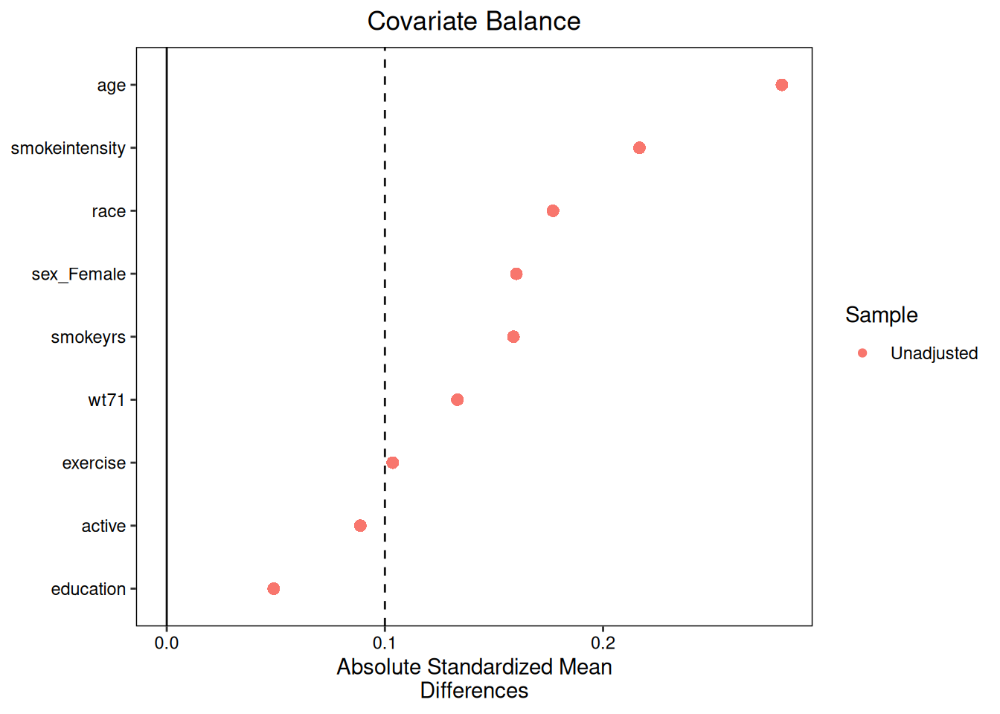

> **来源**：R 包 [causatr](https://github.com/etverse/causatr) 官方文档 [`diagnostics.qmd`](https://etverse.github.io/causatr/vignettes/diagnostics.html)，MIT 许可。
> 本页是中译，**代码与运行结果直接取自原站的渲染输出，未在本站重新执行**。
> Copyright (c) 2026 causatr authors；许可证全文见原仓库 `LICENSE.md`。

`diagnose()` 是 causatr 的诊断入口。它会根据估计量和处理类型，生成
相应的正值性汇总、协变量均衡表和权重分布统计量。本文逐一介绍所有
受支持的诊断场景。

## 准备工作

```r
library(causatr)

data("nhefs")

nhefs_complete <- nhefs[
  !is.na(nhefs$wt82_71) & !is.na(nhefs$education),
]
nhefs_complete$gained_weight <- as.integer(
  nhefs_complete$wt82_71 > 0
)
nhefs_complete$sex <- factor(
  nhefs_complete$sex,
  levels = 0:1,
  labels = c("Male", "Female")
)
```

## 基本用法：二值 IPW

最简单的调用接受一个 `causatr_fit`，返回带有正值性、均衡和权重分布
面板的 `causatr_diag` 对象。若使用了按组件指定的混杂因子（例如
`confounders_treatment`），诊断会自动使用处理模型的混杂因子来做均衡
和正值性检查：

```r
fit_ipw <- causat(
  nhefs_complete,
  outcome = "wt82_71",
  treatment = "qsmk",
  confounders = ~ sex + age + race + education +
    smokeintensity + smokeyrs + exercise + active + wt71,
  estimator = "ipw",
  model_fn = stats::glm,
  propensity_model_fn = stats::glm
)

diag <- diagnose(fit_ipw)
#> Note: `s.d.denom` not specified; assuming "pooled".
diag
#> <causatr_diag>
#>  Estimator:ipw
#>  Treatment: binary
#>  Estimand:  ATE
#> 
#> Positivity:
#>       statistic      value
#>          <char>      <num>
#>             min 0.04687428
#>             q25 0.18241855
#>          median 0.24500189
#>             q75 0.31830832
#>             max 0.74929776
#>   n_below_lower 0.00000000
#>   n_above_upper 0.00000000
#>    n_violations 0.00000000
#>  pct_violations 0.00000000
#> 
#> Covariate balance:
#> Balance Measures
#>                   Type Diff.Un     M.Threshold.Un V.Ratio.Un
#> sex_Female      Binary -0.1603 Not Balanced, >0.1          .
#> age            Contin.  0.2820 Not Balanced, >0.1     1.0731
#> race            Binary -0.1771 Not Balanced, >0.1          .
#> education      Contin.  0.0491     Balanced, <0.1     1.2310
#> smokeintensity Contin. -0.2167 Not Balanced, >0.1     1.1679
#> smokeyrs       Contin.  0.1589 Not Balanced, >0.1     1.1846
#> exercise       Contin.  0.1036 Not Balanced, >0.1     0.9078
#> active         Contin.  0.0887     Balanced, <0.1     1.0646
#> wt71           Contin.  0.1332 Not Balanced, >0.1     1.0606
#> 
#> Balance tally for mean differences
#>                    count
#> Balanced, <0.1         2
#> Not Balanced, >0.1     7
#> 
#> Variable with the greatest mean difference
#>  Variable Diff.Un     M.Threshold.Un
#>       age   0.282 Not Balanced, >0.1
#> 
#> Sample sizes
#>     Control Treated
#> All    1163     403
#> 
#> Weight distribution:
#>    group     n     mean        sd      min       max      ess
#>   <char> <int>    <num>     <num>    <num>     <num>    <num>
#>  treated   403 3.873832 1.6235669 1.334583 13.556391  342.915
#>  control  1163 1.345571 0.1962014 1.049180  2.619454 1138.808
#>  overall  1566 1.996203 1.3885629 1.049180 13.556391 1055.574
```

### 正值性

正值性表给出倾向评分的分位数，以及靠近边界的观测数（潜在的正值性
违背）：

```r
diag$positivity
#>         statistic      value
#>            <char>      <num>
#> 1:            min 0.04687428
#> 2:            q25 0.18241855
#> 3:         median 0.24500189
#> 4:            q75 0.31830832
#> 5:            max 0.74929776
#> 6:  n_below_lower 0.00000000
#> 7:  n_above_upper 0.00000000
#> 8:   n_violations 0.00000000
#> 9: pct_violations 0.00000000
```

### 协变量均衡

均衡对象来自 `cobalt::bal.tab()`，报告标准化均值差（SMD）和方差比：

```r
diag$balance
#> Balance Measures
#>                   Type Diff.Un     M.Threshold.Un V.Ratio.Un
#> sex_Female      Binary -0.1603 Not Balanced, >0.1          .
#> age            Contin.  0.2820 Not Balanced, >0.1     1.0731
#> race            Binary -0.1771 Not Balanced, >0.1          .
#> education      Contin.  0.0491     Balanced, <0.1     1.2310
#> smokeintensity Contin. -0.2167 Not Balanced, >0.1     1.1679
#> smokeyrs       Contin.  0.1589 Not Balanced, >0.1     1.1846
#> exercise       Contin.  0.1036 Not Balanced, >0.1     0.9078
#> active         Contin.  0.0887     Balanced, <0.1     1.0646
#> wt71           Contin.  0.1332 Not Balanced, >0.1     1.0606
#> 
#> Balance tally for mean differences
#>                    count
#> Balanced, <0.1         2
#> Not Balanced, >0.1     7
#> 
#> Variable with the greatest mean difference
#>  Variable Diff.Un     M.Threshold.Un
#>       age   0.282 Not Balanced, >0.1
#> 
#> Sample sizes
#>     Control Treated
#> All    1163     403
```

### 权重分布

权重表给出各处理组的汇总统计量和有效样本量（ESS）。若从名义 $n$ 到
ESS 下降很大，说明少数个体承担了过大的权重：

```r
diag$weights
#>      group     n     mean        sd      min       max      ess
#>     <char> <int>    <num>     <num>    <num>     <num>    <num>
#> 1: treated   403 3.873832 1.6235669 1.334583 13.556391  342.915
#> 2: control  1163 1.345571 0.1962014 1.049180  2.619454 1138.808
#> 3: overall  1566 1.996203 1.3885629 1.049180 13.556391 1055.574
```

检测到极端权重时，`contrast(trim = )` 可以在指定分位数处对密度比权重
做缩尾处理（例如 `trim = 0.999`）。详见 `vignette("ipw")`。

## 按干预分别诊断

默认情况下，`diagnose(fit)` 采用基于观测处理的 Horvitz--Thompson
视角，只生成一个 `obs` 面板。传入 `interventions =` 后，每个干预都会
有自己的面板，并使用该干预特定的密度比权重：

```r
diag_iv <- diagnose(
  fit_ipw,
  interventions = list(
    a1 = static(1),
    a0 = static(0)
  )
)
#> Note: `s.d.denom` not specified; assuming "pooled".
diag_iv
#> <causatr_diag>
#>  Estimator:ipw
#>  Treatment: binary
#>  Estimand:  ATE
#> 
#> Intervention: a1
#> Positivity:
#>       statistic      value
#>          <char>      <num>
#>             min 0.04687428
#>             q25 0.18241855
#>          median 0.24500189
#>             q75 0.31830832
#>             max 0.74929776
#>   n_below_lower 0.00000000
#>   n_above_upper 0.00000000
#>    n_violations 0.00000000
#>  pct_violations 0.00000000
#> 
#> Covariate balance:
#> Balance Measures
#>                   Type Diff.Un     M.Threshold.Un V.Ratio.Un
#> sex_Female      Binary -0.1603 Not Balanced, >0.1          .
#> age            Contin.  0.2820 Not Balanced, >0.1     1.0731
#> race            Binary -0.1771 Not Balanced, >0.1          .
#> education      Contin.  0.0491     Balanced, <0.1     1.2310
#> smokeintensity Contin. -0.2167 Not Balanced, >0.1     1.1679
#> smokeyrs       Contin.  0.1589 Not Balanced, >0.1     1.1846
#> exercise       Contin.  0.1036 Not Balanced, >0.1     0.9078
#> active         Contin.  0.0887     Balanced, <0.1     1.0646
#> wt71           Contin.  0.1332 Not Balanced, >0.1     1.0606
#> 
#> Balance tally for mean differences
#>                    count
#> Balanced, <0.1         2
#> Not Balanced, >0.1     7
#> 
#> Variable with the greatest mean difference
#>  Variable Diff.Un     M.Threshold.Un
#>       age   0.282 Not Balanced, >0.1
#> 
#> Sample sizes
#>     Control Treated
#> All    1163     403
#> 
#> Weight distribution:
#>    group     n      mean       sd      min      max     ess
#>   <char> <int>     <num>    <num>    <num>    <num>   <num>
#>  treated   403 3.8738325 1.623567 1.334583 13.55639 342.915
#>  control  1163 0.0000000 0.000000 0.000000  0.00000   0.000
#>  overall  1566 0.9969058 1.883337 0.000000 13.55639 342.915
#> 
#> Feasibility:
#>  n_total n_changed pct_changed
#>    <int>     <int>       <num>
#>     1566      1163        74.3
#> 
#> 
#> Intervention: a0
#> Positivity:
#>       statistic      value
#>          <char>      <num>
#>             min 0.04687428
#>             q25 0.18241855
#>          median 0.24500189
#>             q75 0.31830832
#>             max 0.74929776
#>   n_below_lower 0.00000000
#>   n_above_upper 0.00000000
#>    n_violations 0.00000000
#>  pct_violations 0.00000000
#> 
#> Covariate balance:
#> Balance Measures
#>                   Type Diff.Un     M.Threshold.Un V.Ratio.Un
#> sex_Female      Binary -0.1603 Not Balanced, >0.1          .
#> age            Contin.  0.2820 Not Balanced, >0.1     1.0731
#> race            Binary -0.1771 Not Balanced, >0.1          .
#> education      Contin.  0.0491     Balanced, <0.1     1.2310
#> smokeintensity Contin. -0.2167 Not Balanced, >0.1     1.1679
#> smokeyrs       Contin.  0.1589 Not Balanced, >0.1     1.1846
#> exercise       Contin.  0.1036 Not Balanced, >0.1     0.9078
#> active         Contin.  0.0887     Balanced, <0.1     1.0646
#> wt71           Contin.  0.1332 Not Balanced, >0.1     1.0606
#> 
#> Balance tally for mean differences
#>                    count
#> Balanced, <0.1         2
#> Not Balanced, >0.1     7
#> 
#> Variable with the greatest mean difference
#>  Variable Diff.Un     M.Threshold.Un
#>       age   0.282 Not Balanced, >0.1
#> 
#> Sample sizes
#>     Control Treated
#> All    1163     403
#> 
#> Weight distribution:
#>    group     n      mean        sd     min      max      ess
#>   <char> <int>     <num>     <num>   <num>    <num>    <num>
#>  treated   403 0.0000000 0.0000000 0.00000 0.000000    0.000
#>  control  1163 1.3455714 0.1962014 1.04918 2.619454 1138.808
#>  overall  1566 0.9992973 0.6122370 0.00000 2.619454 1138.808
#> 
#> Feasibility:
#>  n_total n_changed pct_changed
#>    <int>     <int>       <num>
#>     1566       403        25.7
```

各干预的面板共享同样的正值性和均衡（二者都是已拟合处理模型的性质，
而非干预的性质），但权重分布不同，因为密度比权重
$f(d(A)|L) / f(A|L)$ 依赖于 $d$。

## 绘图方法

### Love 图（均衡）

默认的 `plot(diag)` 通过 `cobalt::love.plot()` 绘制 Love 图。SMD
绝对值低于阈值（0.1 处的虚线）的协变量均衡良好：

```r
plot(diag)
#> Note: `s.d.denom` not specified; assuming "pooled".
```



### 权重分布

```r
plot(diag, which = "weights")
```


当权重有很长的右尾时，对数刻度会更有帮助：

```r
plot(diag, which = "weights", log_scale = TRUE)
```


### 倾向评分分布

```r
plot(diag, which = "positivity")
```


## 特定估计目标的诊断：ATT / ATC

在 ATT 下，处理组获得单位权重（全部恰好为 1），对照组按 $p/(1-p)$
重新加权，以匹配处理组的协变量分布：

```r
fit_att <- causat(
  nhefs_complete,
  outcome = "wt82_71",
  treatment = "qsmk",
  confounders = ~ sex + age + race + education +
    smokeintensity + smokeyrs + exercise + active + wt71,
  estimator = "ipw",
  estimand = "ATT",
  model_fn = stats::glm,
  propensity_model_fn = stats::glm
)

diag_att <- diagnose(fit_att)
#> Note: `s.d.denom` not specified; assuming "pooled".
diag_att$weights
#>      group     n      mean        sd        min      max       ess
#>     <char> <int>     <num>     <num>      <num>    <num>     <num>
#> 1: treated   403 1.0000000 0.0000000 1.00000000 1.000000  403.0000
#> 2: control  1163 0.3455714 0.1962014 0.04917953 1.619454  879.6789
#> 3: overall  1566 0.5139844 0.3323941 0.04917953 1.619454 1104.4075
```

在 ATC 下，两者角色互换：对照组获得单位权重，处理组按 $(1-p)/p$
重新加权：

```r
fit_atc <- causat(
  nhefs_complete,
  outcome = "wt82_71",
  treatment = "qsmk",
  confounders = ~ sex + age + race + education +
    smokeintensity + smokeyrs + exercise + active + wt71,
  estimator = "ipw",
  estimand = "ATC",
  model_fn = stats::glm,
  propensity_model_fn = stats::glm
)

diag_atc <- diagnose(fit_atc)
#> Note: `s.d.denom` not specified; assuming "pooled".
diag_atc$weights
#>      group     n     mean       sd       min      max       ess
#>     <char> <int>    <num>    <num>     <num>    <num>     <num>
#> 1: treated   403 2.873832 1.623567 0.3345829 12.55639  305.6794
#> 2: control  1163 1.000000 0.000000 1.0000000  1.00000 1163.0000
#> 3: overall  1566 1.482219 1.161288 0.3345829 12.55639  970.5920
```

## 用 `by =` 做分层均衡

存在效应修饰时，`by =` 会在修饰变量的每一层内分别报告协变量均衡：

```r
diag_by <- diagnose(fit_ipw, by = "sex")
#> Note: `s.d.denom` not specified; assuming "pooled".
diag_by$balance
#> Balance by cluster
#> 
#>  - - - Cluster: Male - - - 
#> Balance Measures
#>                   Type Diff.Un     M.Threshold.Un V.Ratio.Un
#> age            Contin.  0.2898 Not Balanced, >0.1     0.9852
#> race            Binary -0.1873 Not Balanced, >0.1          .
#> education      Contin.  0.0882     Balanced, <0.1     1.0232
#> smokeintensity Contin. -0.1189 Not Balanced, >0.1     1.1681
#> smokeyrs       Contin.  0.2190 Not Balanced, >0.1     1.0740
#> exercise       Contin.  0.1871 Not Balanced, >0.1     0.8648
#> active         Contin.  0.1653 Not Balanced, >0.1     1.2138
#> wt71           Contin.  0.0560     Balanced, <0.1     1.1746
#> 
#> Balance tally for mean differences
#>                    count
#> Balanced, <0.1         2
#> Not Balanced, >0.1     6
#> 
#> Variable with the greatest mean difference
#>  Variable Diff.Un     M.Threshold.Un
#>       age  0.2898 Not Balanced, >0.1
#> 
#> Sample sizes
#>       0   1
#> All 542 220
#> 
#>  - - - Cluster: Female - - - 
#> Balance Measures
#>                   Type Diff.Un     M.Threshold.Un V.Ratio.Un
#> age            Contin.  0.2560 Not Balanced, >0.1     1.1691
#> race            Binary -0.1562 Not Balanced, >0.1          .
#> education      Contin.  0.0090     Balanced, <0.1     1.5277
#> smokeintensity Contin. -0.4582 Not Balanced, >0.1     0.9272
#> smokeyrs       Contin.  0.0218     Balanced, <0.1     1.1833
#> exercise       Contin.  0.0603     Balanced, <0.1     0.9768
#> active         Contin.  0.0350     Balanced, <0.1     0.9439
#> wt71           Contin.  0.0943     Balanced, <0.1     1.0319
#> 
#> Balance tally for mean differences
#>                    count
#> Balanced, <0.1         5
#> Not Balanced, >0.1     3
#> 
#> Variable with the greatest mean difference
#>        Variable Diff.Un     M.Threshold.Un
#>  smokeintensity -0.4582 Not Balanced, >0.1
#> 
#> Sample sizes
#>       0   1
#> All 621 183
#>  - - - - - - - - - - - - - - -
```

## G-computation 诊断

G-computation 没有权重，也没有处理模型，因此 `diagnose()`
只报告未调整的协变量均衡——这有助于评估观察性研究在多大程度上依赖模型外推：

```r
fit_gcomp <- causat(
  nhefs_complete,
  outcome = "wt82_71",
  treatment = "qsmk",
  confounders = ~ sex + age + race + education +
    smokeintensity + smokeyrs + exercise + active + wt71,
  estimator = "gcomp",
  model_fn = stats::glm
)

diag_gcomp <- diagnose(fit_gcomp)
#> Note: `s.d.denom` not specified; assuming "pooled".
diag_gcomp
#> <causatr_diag>
#>  Estimator:gcomp
#>  Treatment: binary
#>  Estimand:  ATE
#> 
#> Positivity:
#>       statistic      value
#>          <char>      <num>
#>             min 0.04687428
#>             q25 0.18241855
#>          median 0.24500189
#>             q75 0.31830832
#>             max 0.74929776
#>   n_below_lower 0.00000000
#>   n_above_upper 0.00000000
#>    n_violations 0.00000000
#>  pct_violations 0.00000000
#> 
#> Covariate balance:
#> Balance Measures
#>                   Type Diff.Un     M.Threshold.Un V.Ratio.Un
#> sex_Female      Binary -0.1603 Not Balanced, >0.1          .
#> age            Contin.  0.2820 Not Balanced, >0.1     1.0731
#> race            Binary -0.1771 Not Balanced, >0.1          .
#> education      Contin.  0.0491     Balanced, <0.1     1.2310
#> smokeintensity Contin. -0.2167 Not Balanced, >0.1     1.1679
#> smokeyrs       Contin.  0.1589 Not Balanced, >0.1     1.1846
#> exercise       Contin.  0.1036 Not Balanced, >0.1     0.9078
#> active         Contin.  0.0887     Balanced, <0.1     1.0646
#> wt71           Contin.  0.1332 Not Balanced, >0.1     1.0606
#> 
#> Balance tally for mean differences
#>                    count
#> Balanced, <0.1         2
#> Not Balanced, >0.1     7
#> 
#> Variable with the greatest mean difference
#>  Variable Diff.Un     M.Threshold.Un
#>       age   0.282 Not Balanced, >0.1
#> 
#> Sample sizes
#>     Control Treated
#> All    1163     403
```

## 匹配诊断

匹配诊断包括匹配质量摘要（匹配数 / 丢弃数），以及匹配前后的协变量均衡：

```r
fit_m <- causat(
  nhefs_complete,
  outcome = "wt82_71",
  treatment = "qsmk",
  confounders = ~ sex + age + race + education +
    smokeintensity + smokeyrs + exercise + active + wt71,
  estimator = "matching"
)

diag_m <- diagnose(fit_m)
diag_m
#> <causatr_diag>
#>  Estimator:matching
#>  Treatment: binary
#>  Estimand:  ATE
#> 
#> Positivity:
#>       statistic      value
#>          <char>      <num>
#>             min 0.04687428
#>             q25 0.18241855
#>          median 0.24500189
#>             q75 0.31830832
#>             max 0.74929776
#>   n_below_lower 0.00000000
#>   n_above_upper 0.00000000
#>    n_violations 0.00000000
#>  pct_violations 0.00000000
#> 
#> Covariate balance:
#> Balance Measures
#>                    Type Diff.Un V.Ratio.Un Diff.Adj    M.Threshold V.Ratio.Adj
#> distance       Distance  0.5291     1.3530   0.0012 Balanced, <0.1      1.0099
#> sex_Female       Binary -0.1603          .  -0.0226 Balanced, <0.1           .
#> age             Contin.  0.2820     1.0731   0.0352 Balanced, <0.1      1.0009
#> race             Binary -0.1771          .   0.0298 Balanced, <0.1           .
#> education       Contin.  0.0491     1.2310   0.0446 Balanced, <0.1      1.1823
#> smokeintensity  Contin. -0.2167     1.1679   0.0515 Balanced, <0.1      1.5705
#> smokeyrs        Contin.  0.1589     1.1846   0.0270 Balanced, <0.1      1.1145
#> exercise        Contin.  0.1036     0.9078   0.0165 Balanced, <0.1      0.9468
#> active          Contin.  0.0887     1.0646  -0.0130 Balanced, <0.1      0.9583
#> wt71            Contin.  0.1332     1.0606   0.0318 Balanced, <0.1      1.2224
#> 
#> Balance tally for mean differences
#>                    count
#> Balanced, <0.1        10
#> Not Balanced, >0.1     0
#> 
#> Variable with the greatest mean difference
#>        Variable Diff.Adj    M.Threshold
#>  smokeintensity   0.0515 Balanced, <0.1
#> 
#> Sample sizes
#>                      Control Treated
#> All                  1163.    403.  
#> Matched (ESS)        1061.99  250.49
#> Matched (Unweighted) 1163.    403.  
#> 
#> Match quality:
#>     statistic value
#>        <char> <num>
#>       n_total  1566
#>     n_matched  1566
#>   n_discarded     0
#>  pct_retained   100
```

## 连续处理

对连续处理，正值性通过条件密度 $f(A_i \mid L_i)$ 而非倾向评分来评估。密度极低的观测会被标记为潜在的正值性违背：

```r
fit_cont <- causat(
  nhefs_complete,
  outcome = "wt82_71",
  treatment = "smokeintensity",
  confounders = ~ sex + age + race + education +
    smokeyrs + exercise + active + wt71,
  estimator = "ipw",
  model_fn = stats::glm,
  propensity_model_fn = stats::glm
)

diag_cont <- diagnose(fit_cont)
diag_cont$positivity
#>          statistic        value
#>             <char>        <num>
#> 1:             min 8.529872e-08
#> 2:             q25 1.833749e-02
#> 3:          median 3.062980e-02
#> 4:             q75 3.436058e-02
#> 5:             max 3.589112e-02
#> 6:   n_low_density 1.600000e+01
#> 7: pct_low_density 1.020000e+00
```

使用平移干预时，权重分布展示的是平移后处理下的密度比：

```r
diag_cont_shift <- diagnose(
  fit_cont,
  interventions = list(
    shift_down = shift(-5)
  )
)
diag_cont_shift$per_intervention$shift_down$weights
#>      group     n     mean        sd        min      max      ess
#>     <char> <int>    <num>     <num>      <num>    <num>    <num>
#> 1: overall  1566 0.990351 0.4058262 0.09159048 2.501243 1340.969
```

## 分类处理

分类处理（水平数 >2）会报告各水平的概率摘要：每个处理水平的
$P(A = k \mid L)$ 分位数：

```r
nhefs_complete$exercise_cat <- factor(
  nhefs_complete$exercise,
  levels = 0:2,
  labels = c("low", "moderate", "high")
)

fit_cat <- causat(
  nhefs_complete,
  outcome = "wt82_71",
  treatment = "exercise_cat",
  confounders = ~ sex + age + race + smokeintensity + wt71,
  estimator = "ipw",
  model_fn = stats::glm,
  propensity_model_fn = nnet::multinom
)

diag_cat <- diagnose(fit_cat)
#> Note: `s.d.denom` not specified; assuming "pooled".
diag_cat$positivity
#>       level        min       q25    median       q75       max n_low_prob
#>      <char>      <num>     <num>     <num>     <num>     <num>      <int>
#> 1:      low 0.01552686 0.1188417 0.1821774 0.2498417 0.4617802          0
#> 2: moderate 0.18512770 0.4097695 0.4322722 0.4439010 0.4872213          0
#> 3:     high 0.14058776 0.2978530 0.3724017 0.4661568 0.7993454          0
#>    pct_low_prob
#>           <num>
#> 1:            0
#> 2:            0
#> 3:            0
```

## 纵向诊断

纵向拟合（ICE 或纵向 IPW）会生成分期的诊断面板。每个时间点都有各自的正值性、均衡和权重摘要：

```r
set.seed(42)
n <- 200
dt_long <- data.table::data.table(
  id = rep(1:n, each = 3),
  time = rep(0:2, n),
  L = rnorm(n * 3),
  A = rbinom(n * 3, 1, 0.5),
  Y = rnorm(n * 3)
)
dt_long[, A := rbinom(.N, 1, plogis(0.5 * L))]
dt_long[, Y := 1 + 0.5 * A + 0.3 * L + rnorm(.N)]

fit_long <- causat(
  dt_long,
  outcome = "Y",
  treatment = "A",
  confounders = ~ L,
  id = "id",
  time = "time",
  estimator = "ipw",
  model_fn = stats::glm,
  propensity_model_fn = stats::glm
)
#> Warning: Baseline confounder 'L' varies within some individuals. Consider
#> moving it to `confounders_tv` (time-varying).

diag_long <- diagnose(fit_long)
#> Note: `s.d.denom` not specified; assuming "pooled".
#> Note: `s.d.denom` not specified; assuming "pooled".
#> Note: `s.d.denom` not specified; assuming "pooled".
diag_long
#> <causatr_diag>
#>  Estimator:ipw
#>  Treatment: binary
#>  Estimand:  ATE
#>  Type:      longitudinal
#> 
#> Positivity (0):
#>       statistic     value
#>          <char>     <num>
#>             min 0.3622457
#>             q25 0.4884776
#>          median 0.5370649
#>             q75 0.5823783
#>             max 0.7208470
#>   n_below_lower 0.0000000
#>   n_above_upper 0.0000000
#>    n_violations 0.0000000
#>  pct_violations 0.0000000
#> 
#> Positivity (1):
#>       statistic     value
#>          <char>     <num>
#>             min 0.3288693
#>             q25 0.4191753
#>          median 0.4496379
#>             q75 0.4799725
#>             max 0.5509497
#>   n_below_lower 0.0000000
#>   n_above_upper 0.0000000
#>    n_violations 0.0000000
#>  pct_violations 0.0000000
#> 
#> Positivity (2):
#>       statistic     value
#>          <char>     <num>
#>             min 0.2335838
#>             q25 0.4640667
#>          median 0.5554457
#>             q75 0.6402517
#>             max 0.9030428
#>   n_below_lower 0.0000000
#>   n_above_upper 0.0000000
#>    n_violations 0.0000000
#>  pct_violations 0.0000000
#> 
#> Covariate balance (0):
#> Balance Measures
#>      Type Diff.Un     M.Threshold.Un V.Ratio.Un
#> L Contin.  0.2702 Not Balanced, >0.1     1.2189
#> 
#> Balance tally for mean differences
#>                    count
#> Balanced, <0.1         0
#> Not Balanced, >0.1     1
#> 
#> Variable with the greatest mean difference
#>  Variable Diff.Un     M.Threshold.Un
#>         L  0.2702 Not Balanced, >0.1
#> 
#> Sample sizes
#>     Control Treated
#> All      93     107
#> 
#> Covariate balance (1):
#> Balance Measures
#>      Type Diff.Un     M.Threshold.Un V.Ratio.Un
#> L Contin.  0.1621 Not Balanced, >0.1     0.6763
#> 
#> Balance tally for mean differences
#>                    count
#> Balanced, <0.1         0
#> Not Balanced, >0.1     1
#> 
#> Variable with the greatest mean difference
#>  Variable Diff.Un     M.Threshold.Un
#>         L  0.1621 Not Balanced, >0.1
#> 
#> Sample sizes
#>     Control Treated
#> All     110      90
#> 
#> Covariate balance (2):
#> Balance Measures
#>      Type Diff.Un     M.Threshold.Un V.Ratio.Un
#> L Contin.  0.4744 Not Balanced, >0.1     1.1118
#> 
#> Balance tally for mean differences
#>                    count
#> Balanced, <0.1         0
#> Not Balanced, >0.1     1
#> 
#> Variable with the greatest mean difference
#>  Variable Diff.Un     M.Threshold.Un
#>         L  0.4744 Not Balanced, >0.1
#> 
#> Sample sizes
#>     Control Treated
#> All      89     111
#> 
#> Weight distribution (0):
#>    group     n     mean        sd      min      max       ess
#>   <char> <int>    <num>     <num>    <num>    <num>     <num>
#>  treated   107 1.871781 0.2478263 1.387257 2.598808 105.17353
#>  control    93 2.145457 0.2916289 1.568002 2.985449  91.33067
#>  overall   200 1.999040 0.3012640 1.387257 2.985449 195.58023
#> 
#> Weight distribution (1):
#>    group     n     mean        sd      min      max      ess
#>   <char> <int>    <num>     <num>    <num>    <num>    <num>
#>  treated    90 2.219285 0.1860843 1.815048 2.946556  89.3786
#>  control   110 1.819794 0.1463294 1.490023 2.183803 109.2997
#>  overall   200 1.999565 0.2586751 1.490023 2.946556 196.7242
#> 
#> Weight distribution (2):
#>    group     n     mean        sd      min      max       ess
#>   <char> <int>    <num>     <num>    <num>    <num>     <num>
#>  treated   111 1.812404 0.5241539 1.107367 4.136804 102.50393
#>  control    89 2.236658 0.7141150 1.304774 5.275443  80.85081
#>  overall   200 2.001197 0.6496551 1.107367 5.275443 181.01843
#> 
#> Weight distribution (cumulative):
#>    group     n     mean       sd     min      max      ess
#>   <char> <int>    <num>    <num>   <num>    <num>    <num>
#>  overall   200 8.039723 3.213668 3.21157 24.02197 172.5655
```

正值性和权重以命名列表存储，键为时间点字符串。跨所有时期的累积乘积权重存储在
`"cumulative"` 键下：

```r
names(diag_long$weights)
#> [1] "0"          "1"          "2"          "cumulative"
diag_long$weights[["cumulative"]]
#>      group     n     mean       sd     min      max      ess
#>     <char> <int>    <num>    <num>   <num>    <num>    <num>
#> 1: overall   200 8.039723 3.213668 3.21157 24.02197 172.5655
```

## 小结

| Estimator | Positivity | Balance | Weights |
|---|---|---|---|
| IPW（二值） | PS 分位数 + 违反计数 | cobalt SMD | 各组 HT 权重 + ESS |
| IPW（连续） | 密度分位数 + 低密度计数 | 相关系数 | 整体密度比权重 |
| IPW（分类） | 各水平 P(A=k\|L) 分位数 | cobalt 两两 SMD | 整体权重 |
| IPW（计数） | 密度分位数 | 相关系数 | 整体权重 |
| IPW（多元） | 各分量正值性 | 第一分量 SMD | 合并乘积权重 |
| 匹配 | PS 分位数 | cobalt 前后对比 | 匹配质量 |
| G-computation | PS 分位数 | 未调整 SMD | --- |
| 纵向 IPW | 各时期正值性 | 各时期均衡 | 各时期 + 累积 |
| 纵向 ICE | --- | 各时期均衡 | --- |

