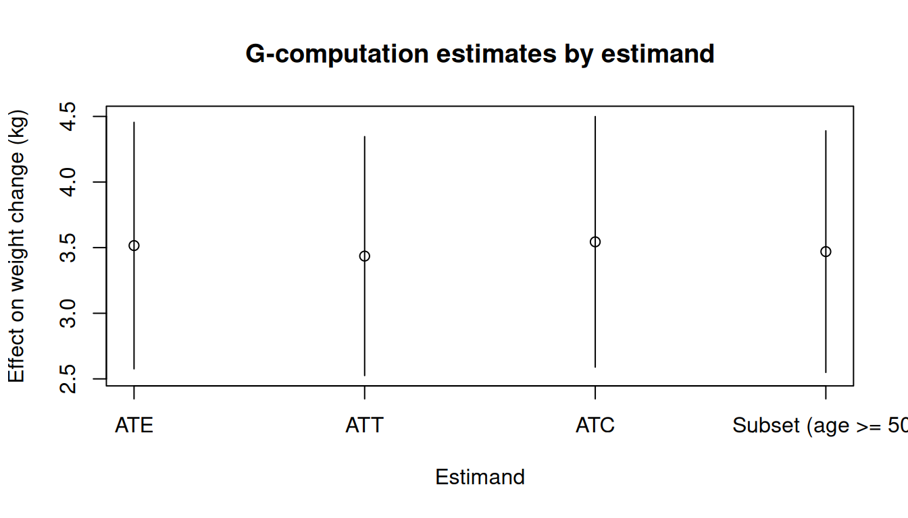
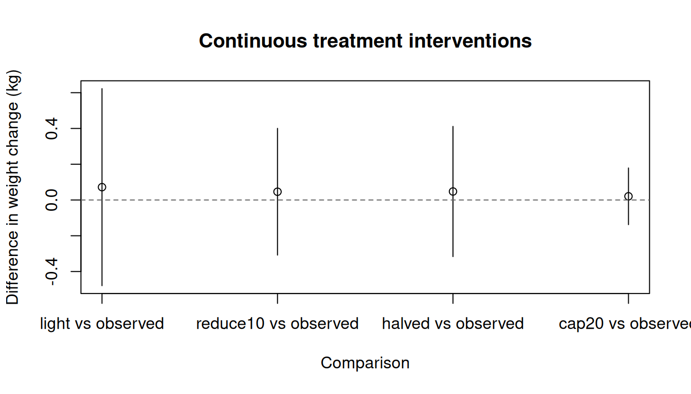
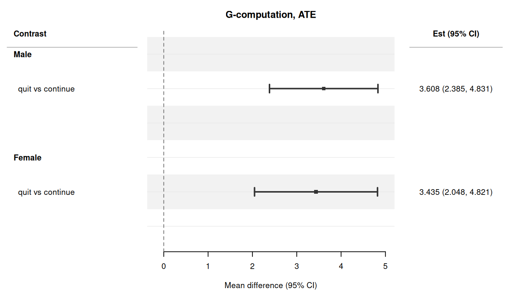
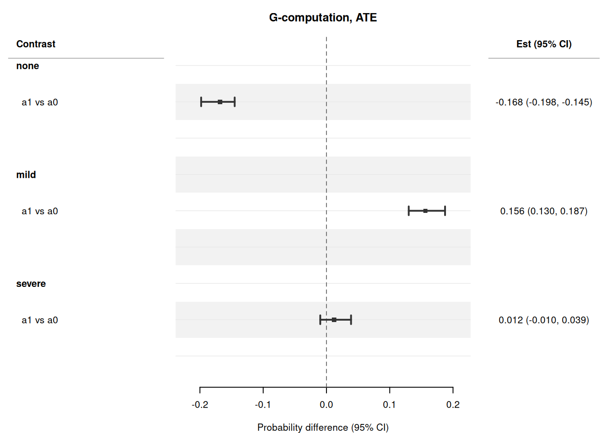
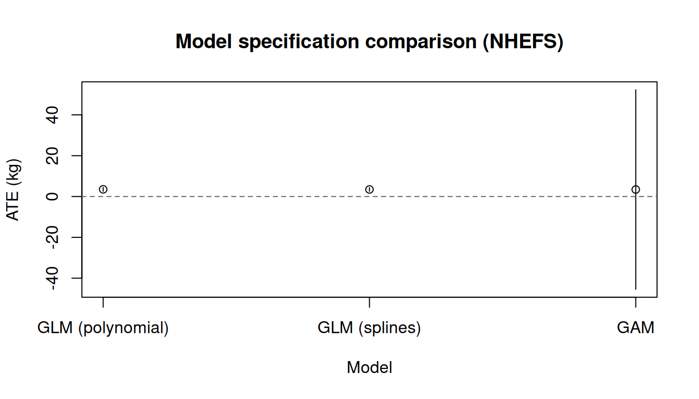

> **来源**：R 包 [causatr](https://github.com/etverse/causatr) 官方文档 [`gcomp.qmd`](https://etverse.github.io/causatr/vignettes/gcomp.html)，MIT 许可。
> 本页是中译，**代码与运行结果直接取自原站的渲染输出，未在本站重新执行**。
> Copyright (c) 2026 causatr authors；许可证全文见原仓库 `LICENSE.md`。

G-computation（参数化 g-formula）先拟合一个以处理和混杂因子为条件的结局模型，
再把每种假设干预下的预测值在目标人群上做标准化，由此估计因果效应。本文用
@hernan_whatif 中的 NHEFS 数据集演示 causatr 里的 G-computation，覆盖时间固定
处理下处理类型、结局类型、对比尺度和推断方法的每一种受支持组合。

## 数据：NHEFS

本文的例子使用 **NHEFS**（National Health and Nutrition Examination Survey —
Epidemiologic Follow-up Study）数据集，它是 @hernan_whatif 全书贯穿的示例。
假定的因果结构是：

- **处理（$A$）：** `qsmk` —— 1971 至 1982 年间是否戒烟（二值：0/1）。
- **结局（$Y$）：** `wt82_71` —— 同一时期的体重变化，单位 kg
  （连续型）。二值结局部分使用由它派生的二值版本 `gained_weight`
  （$\mathbf{1}\{Y > 0\}$）。
- **混杂因子（$L$）：** 性别、年龄、种族、受教育程度、吸烟强度
  （支/天）、吸烟年数、锻炼、体力活动和基线体重。它们同时影响戒烟概率和
  随后的体重变化。
- **删失：** `censored` 列标记失访个体。删失行不参与模型拟合；预测值在
  完整目标人群上做标准化。

结构因果模型（假定）：

$$
\begin{aligned}
  L &\sim F_L \\
  A &\sim \text{Bernoulli}\!\bigl(\text{logit}^{-1}(\alpha_0 + \alpha_L^\top L)\bigr) \\
  Y &= \beta_0 + \beta_A A + \beta_L^\top L + \beta_{AL}^\top (A \cdot L) + \varepsilon,
      \quad \varepsilon \sim N(0, \sigma^2)
\end{aligned}
$$

混杂因子 $L$ 是 $A$ 和 $Y$ 的共同原因；对 $L$ 做调整可阻断所有后门路径，
从而通过 g-formula 识别 $\mathbb{E}[Y^a]$。

```r
library(causatr)
library(tinytable)
library(tinyplot)

data("nhefs")

nhefs_complete <- nhefs[!is.na(nhefs$wt82_71), ]

nhefs_complete$gained_weight <- as.integer(nhefs_complete$wt82_71 > 0)

nhefs$sex <- factor(nhefs$sex, levels = 0:1, labels = c("Male", "Female"))
nhefs_complete$sex <- factor(
  nhefs_complete$sex,
  levels = 0:1,
  labels = c("Male", "Female")
)
```

我们创建一个二值结局 `gained_weight`（体重增加为 1，否则为 0），供下面的
二值结局例子使用。

## 二值处理、连续结局

这是 @hernan_whatif 第 13 章的核心例子：戒烟（`qsmk`）对体重变化
（`wt82_71`）的平均因果效应。默认情况下，`confounders` 为所有模型组件
指定同一套协变量。需要时可用 `confounders_outcome` 为结局模型单独指定
另一套（例如为了 AIPW 的双稳健性）。

### ATE 与三明治 SE

```r
fit_gc <- causat(
  nhefs,
  outcome = "wt82_71",
  treatment = "qsmk",
  confounders = ~ sex + age + I(age^2) + race + factor(education) +
    smokeintensity + I(smokeintensity^2) + smokeyrs + I(smokeyrs^2) +
    factor(exercise) + factor(active) + wt71 + I(wt71^2) +
    qsmk:smokeintensity,
  censoring = "censored",
  model_fn = stats::glm
)

res_ate_sw <- contrast(
  fit_gc,
  interventions = list(quit = static(1), continue = static(0)),
  reference = "continue",
  type = "difference",
  ci_method = "sandwich"
)
#> 117 row(s) with NA predictions excluded from the target population.
res_ate_sw
```

| intervention | estimate | se | ci_lower | ci_upper |
|---|---|---|---|---|
| quit | 5.176 | 0.437 | 4.32 | 6.032 |
| continue | 1.66 | 0.219 | 1.23 | 2.09 |

| comparison | estimate | se | ci_lower | ci_upper |
|---|---|---|---|---|
| quit vs continue | 3.516 | 0.479 | 2.577 | 4.455 |

书中报告的 ATE $\approx$ 3.5 kg（95% CI：2.6, 4.5）。

### ATE 与 bootstrap SE

```r
res_ate_bs <- contrast(
  fit_gc,
  interventions = list(quit = static(1), continue = static(0)),
  reference = "continue",
  type = "difference",
  ci_method = "bootstrap",
  n_boot = 50L
)
#> 117 row(s) with NA predictions excluded from the target population.
res_ate_bs
```

| intervention | estimate | se | ci_lower | ci_upper |
|---|---|---|---|---|
| quit | 5.176 | 0.389 | 4.272 | 5.87 |
| continue | 1.66 | 0.221 | 1.367 | 2.052 |

| comparison | estimate | se | ci_lower | ci_upper |
|---|---|---|---|---|
| quit vs continue | 3.516 | 0.423 | 2.612 | 4.101 |

对于设定正确的 GLM，三明治 SE 和 bootstrap SE 应当高度一致。

### ATT 估计目标

处理组平均处理效应（ATT）只对实际戒烟的个体取平均。在 G-computation 中，
估计目标可以在 `contrast()` 里更改，无需重新拟合。

```r
res_att <- contrast(
  fit_gc,
  interventions = list(quit = static(1), continue = static(0)),
  reference = "continue",
  estimand = "ATT",
  ci_method = "sandwich"
)
#> 36 row(s) with NA predictions excluded from the target population.
res_att
```

| intervention | estimate | se | ci_lower | ci_upper |
|---|---|---|---|---|
| quit | 4.366 | 0.438 | 3.508 | 5.225 |
| continue | 0.931 | 0.286 | 0.369 | 1.492 |

| comparison | estimate | se | ci_lower | ci_upper |
|---|---|---|---|---|
| quit vs continue | 3.436 | 0.464 | 2.525 | 4.346 |

### ATC 估计目标

对照组平均处理效应（ATC）对继续吸烟的个体取平均。

```r
res_atc <- contrast(
  fit_gc,
  interventions = list(quit = static(1), continue = static(0)),
  reference = "continue",
  estimand = "ATC",
  ci_method = "sandwich"
)
#> 81 row(s) with NA predictions excluded from the target population.
res_atc
```

| intervention | estimate | se | ci_lower | ci_upper |
|---|---|---|---|---|
| quit | 5.465 | 0.452 | 4.579 | 6.35 |
| continue | 1.92 | 0.22 | 1.49 | 2.351 |

| comparison | estimate | se | ci_lower | ci_upper |
|---|---|---|---|---|
| quit vs continue | 3.544 | 0.487 | 2.59 | 4.499 |

### 子集估计目标

一个自定义子组：50 岁及以上个体中的效应。

```r
res_sub <- contrast(
  fit_gc,
  interventions = list(quit = static(1), continue = static(0)),
  reference = "continue",
  subset = quote(age >= 50),
  ci_method = "sandwich"
)
#> 20 row(s) with NA predictions excluded from the target population.
res_sub
```

| intervention | estimate | se | ci_lower | ci_upper |
|---|---|---|---|---|
| quit | 2.596 | 0.476 | 1.662 | 3.53 |
| continue | -0.874 | 0.329 | -1.518 | -0.23 |

| comparison | estimate | se | ci_lower | ci_upper |
|---|---|---|---|---|
| quit vs continue | 3.47 | 0.47 | 2.549 | 4.39 |

### 以编程方式提取结果

```r
coef(res_ate_sw)
#>     quit continue 
#> 5.175939 1.660268
confint(res_ate_sw)
#>             lower    upper
#> quit     4.319957 6.031921
#> continue 1.230070 2.090465
```

## 比较各估计目标

```r
est_df <- data.frame(
  estimand = c("ATE", "ATT", "ATC", "Subset (age >= 50)"),
  estimate = c(
    res_ate_sw$contrasts$estimate[1],
    res_att$contrasts$estimate[1],
    res_atc$contrasts$estimate[1],
    res_sub$contrasts$estimate[1]
  ),
  ci_lower = c(
    res_ate_sw$contrasts$ci_lower[1],
    res_att$contrasts$ci_lower[1],
    res_atc$contrasts$ci_lower[1],
    res_sub$contrasts$ci_lower[1]
  ),
  ci_upper = c(
    res_ate_sw$contrasts$ci_upper[1],
    res_att$contrasts$ci_upper[1],
    res_atc$contrasts$ci_upper[1],
    res_sub$contrasts$ci_upper[1]
  )
)

tinyplot(
  estimate ~ estimand,
  data = est_df,
  type = "pointrange",
  ymin = est_df$ci_lower,
  ymax = est_df$ci_upper,
  xlab = "Estimand",
  ylab = "Effect on weight change (kg)",
  main = "G-computation estimates by estimand"
)
abline(h = 0, lty = 2, col = "grey40")
```



## 二值处理、二值结局

以 `gained_weight` 指示变量作为二值结局，我们估计戒烟对体重增加的风险差、
风险比和比值比。

### 风险差（三明治）

```r
fit_bin <- causat(
  nhefs_complete,
  outcome = "gained_weight",
  treatment = "qsmk",
  confounders = ~ sex + age + I(age^2) + race + factor(education) +
    smokeintensity + I(smokeintensity^2) + smokeyrs + I(smokeyrs^2) +
    factor(exercise) + factor(active) + wt71 + I(wt71^2) +
    qsmk:smokeintensity,
  family = "binomial",
  model_fn = stats::glm
)

res_rd <- contrast(
  fit_bin,
  interventions = list(quit = static(1), continue = static(0)),
  reference = "continue",
  type = "difference",
  ci_method = "sandwich"
)
#> 113 row(s) with NA predictions excluded from the target population.
res_rd
```

| intervention | estimate | se | ci_lower | ci_upper |
|---|---|---|---|---|
| quit | 0.77 | 0.02 | 0.73 | 0.809 |
| continue | 0.638 | 0.014 | 0.611 | 0.666 |

| comparison | estimate | se | ci_lower | ci_upper |
|---|---|---|---|---|
| quit vs continue | 0.131 | 0.024 | 0.084 | 0.178 |

### 风险差（bootstrap）

```r
res_rd_bs <- contrast(
  fit_bin,
  interventions = list(quit = static(1), continue = static(0)),
  reference = "continue",
  type = "difference",
  ci_method = "bootstrap",
  n_boot = 50L
)
#> 113 row(s) with NA predictions excluded from the target population.
res_rd_bs
```

| intervention | estimate | se | ci_lower | ci_upper |
|---|---|---|---|---|
| quit | 0.77 | 0.02 | 0.738 | 0.806 |
| continue | 0.638 | 0.013 | 0.608 | 0.659 |

| comparison | estimate | se | ci_lower | ci_upper |
|---|---|---|---|---|
| quit vs continue | 0.131 | 0.021 | 0.101 | 0.173 |

### 风险比

```r
res_rr <- contrast(
  fit_bin,
  interventions = list(quit = static(1), continue = static(0)),
  reference = "continue",
  type = "ratio",
  ci_method = "sandwich"
)
#> 113 row(s) with NA predictions excluded from the target population.
res_rr
```

| intervention | estimate | se | ci_lower | ci_upper |
|---|---|---|---|---|
| quit | 0.77 | 0.02 | 0.73 | 0.809 |
| continue | 0.638 | 0.014 | 0.611 | 0.666 |

| comparison | estimate | se | ci_lower | ci_upper |
|---|---|---|---|---|
| quit vs continue | 1.206 | 0.04 | 1.13 | 1.287 |

### 比值比

```r
res_or <- contrast(
  fit_bin,
  interventions = list(quit = static(1), continue = static(0)),
  reference = "continue",
  type = "or",
  ci_method = "sandwich"
)
#> 113 row(s) with NA predictions excluded from the target population.
res_or
```

| intervention | estimate | se | ci_lower | ci_upper |
|---|---|---|---|---|
| quit | 0.77 | 0.02 | 0.73 | 0.809 |
| continue | 0.638 | 0.014 | 0.611 | 0.666 |

| comparison | estimate | se | ci_lower | ci_upper |
|---|---|---|---|---|
| quit vs continue | 1.893 | 0.238 | 1.479 | 2.422 |

## 连续处理

G-computation 支持连续处理，并支持全部干预类型：`static()`（设为固定值）、
`shift()`、`scale_by()`、`threshold()`、`dynamic()`，以及 `NULL`（自然进程）。
这里用 `smokeintensity`（每天吸烟支数）作为处理，`wt82_71` 作为结局。

```r
fit_cont <- causat(
  nhefs,
  outcome = "wt82_71",
  treatment = "smokeintensity",
  confounders = ~ sex + age + I(age^2) + race + factor(education) +
    smokeyrs + I(smokeyrs^2) + factor(exercise) + factor(active) +
    wt71 + I(wt71^2),
  censoring = "censored",
  model_fn = stats::glm
)
```

### 静态干预

把吸烟强度设为固定值再作比较。这回答的问题是：如果所有人每天抽 5 支和每天抽
40 支，分别会发生什么？

```r
res_static <- contrast(
  fit_cont,
  interventions = list(light = static(5), heavy = static(40)),
  reference = "light",
  type = "difference",
  ci_method = "sandwich"
)
#> 117 row(s) with NA predictions excluded from the target population.
res_static
```

| intervention | estimate | se | ci_lower | ci_upper |
|---|---|---|---|---|
| light | 2.62 | 0.33 | 1.972 | 3.267 |
| heavy | 2.458 | 0.421 | 1.634 | 3.283 |

| comparison | estimate | se | ci_lower | ci_upper |
|---|---|---|---|---|
| heavy vs light | -0.162 | 0.632 | -1.401 | 1.078 |

### 平移干预

让所有人的吸烟强度每天减少 10 支。

```r
res_shift <- contrast(
  fit_cont,
  interventions = list(reduce10 = shift(-10), observed = NULL),
  reference = "observed",
  type = "difference",
  ci_method = "sandwich"
)
#> 117 row(s) with NA predictions excluded from the target population.
res_shift
```

| intervention | estimate | se | ci_lower | ci_upper |
|---|---|---|---|---|
| reduce10 | 2.594 | 0.258 | 2.089 | 3.099 |
| observed | 2.548 | 0.201 | 2.154 | 2.942 |

| comparison | estimate | se | ci_lower | ci_upper |
|---|---|---|---|---|
| reduce10 vs observed | 0.046 | 0.181 | -0.308 | 0.4 |

### 缩放干预

把每个个体的吸烟强度减半。

```r
res_scale <- contrast(
  fit_cont,
  interventions = list(halved = scale_by(0.5), observed = NULL),
  reference = "observed",
  type = "difference",
  ci_method = "sandwich"
)
#> 117 row(s) with NA predictions excluded from the target population.
res_scale
```

| intervention | estimate | se | ci_lower | ci_upper |
|---|---|---|---|---|
| halved | 2.595 | 0.261 | 2.084 | 3.107 |
| observed | 2.548 | 0.201 | 2.154 | 2.942 |

| comparison | estimate | se | ci_lower | ci_upper |
|---|---|---|---|---|
| halved vs observed | 0.047 | 0.186 | -0.317 | 0.411 |

### 阈值干预

把所有人的吸烟强度上限设为每天 20 支。

```r
res_thresh <- contrast(
  fit_cont,
  interventions = list(cap20 = threshold(0, 20), observed = NULL),
  reference = "observed",
  type = "difference",
  ci_method = "sandwich"
)
#> 117 row(s) with NA predictions excluded from the target population.
res_thresh
```

| intervention | estimate | se | ci_lower | ci_upper |
|---|---|---|---|---|
| cap20 | 2.568 | 0.21 | 2.157 | 2.979 |
| observed | 2.548 | 0.201 | 2.154 | 2.942 |

| comparison | estimate | se | ci_lower | ci_upper |
|---|---|---|---|---|
| cap20 vs observed | 0.021 | 0.081 | -0.138 | 0.179 |

### 比较多种干预

```r
res_multi <- contrast(
  fit_cont,
  interventions = list(
    light    = static(5),
    reduce10 = shift(-10),
    halved   = scale_by(0.5),
    cap20    = threshold(0, 20),
    observed = NULL
  ),
  reference = "observed",
  type = "difference",
  ci_method = "sandwich"
)
#> 117 row(s) with NA predictions excluded from the target population.
res_multi
```

| intervention | estimate | se | ci_lower | ci_upper |
|---|---|---|---|---|
| light | 2.62 | 0.33 | 1.972 | 3.267 |
| reduce10 | 2.594 | 0.258 | 2.089 | 3.099 |
| halved | 2.595 | 0.261 | 2.084 | 3.107 |
| cap20 | 2.568 | 0.21 | 2.157 | 2.979 |
| observed | 2.548 | 0.201 | 2.154 | 2.942 |

| comparison | estimate | se | ci_lower | ci_upper |
|---|---|---|---|---|
| light vs observed | 0.072 | 0.281 | -0.479 | 0.623 |
| reduce10 vs observed | 0.046 | 0.181 | -0.308 | 0.4 |
| halved vs observed | 0.047 | 0.186 | -0.317 | 0.411 |
| cap20 vs observed | 0.021 | 0.081 | -0.138 | 0.179 |

### 干预效应可视化

```r
est <- res_multi$contrasts
tinyplot(
  estimate ~ comparison,
  data = est,
  type = "pointrange",
  ymin = est$ci_lower,
  ymax = est$ci_upper,
  xlab = "Comparison",
  ylab = "Difference in weight change (kg)",
  main = "Continuous treatment interventions"
)
abline(h = 0, lty = 2, col = "grey40")
```



### 连续处理上的动态干预

一条依赖个体特征的动态规则。这里把重度吸烟者（每天 > 20 支）降到 20 支，其他人
保持其观测到的水平。

```r
res_dyn_cont <- contrast(
  fit_cont,
  interventions = list(
    capped = dynamic(\(data, trt) pmin(trt, 20)),
    observed = NULL
  ),
  reference = "observed",
  type = "difference",
  ci_method = "sandwich"
)
#> 117 row(s) with NA predictions excluded from the target population.
res_dyn_cont
```

| intervention | estimate | se | ci_lower | ci_upper |
|---|---|---|---|---|
| capped | 2.568 | 0.21 | 2.157 | 2.979 |
| observed | 2.548 | 0.201 | 2.154 | 2.942 |

| comparison | estimate | se | ci_lower | ci_upper |
|---|---|---|---|---|
| capped vs observed | 0.021 | 0.081 | -0.138 | 0.179 |

### 连续处理配合 bootstrap

```r
res_shift_bs <- contrast(
  fit_cont,
  interventions = list(reduce10 = shift(-10), observed = NULL),
  reference = "observed",
  type = "difference",
  ci_method = "bootstrap",
  n_boot = 50L
)
#> 117 row(s) with NA predictions excluded from the target population.
res_shift_bs
```

| intervention | estimate | se | ci_lower | ci_upper |
|---|---|---|---|---|
| reduce10 | 2.594 | 0.228 | 2.256 | 3.085 |
| observed | 2.548 | 0.204 | 2.206 | 2.89 |

| comparison | estimate | se | ci_lower | ci_upper |
|---|---|---|---|---|
| reduce10 vs observed | 0.046 | 0.183 | -0.255 | 0.371 |

## 动态干预

动态干预根据个体特征来分配处理。这里我们只对基线时每天吸烟超过 20 支的个体
分配戒烟。

```r
res_dyn <- contrast(
  fit_gc,
  interventions = list(
    rule = dynamic(\(data, trt) ifelse(data$smokeintensity > 20, 1, 0)),
    all_quit = static(1)
  ),
  reference = "all_quit",
  type = "difference",
  ci_method = "sandwich"
)
#> 117 row(s) with NA predictions excluded from the target population.
res_dyn
```

| intervention | estimate | se | ci_lower | ci_upper |
|---|---|---|---|---|
| rule | 2.852 | 0.303 | 2.259 | 3.445 |
| all_quit | 5.176 | 0.437 | 4.32 | 6.032 |

| comparison | estimate | se | ci_lower | ci_upper |
|---|---|---|---|---|
| rule vs all_quit | -2.324 | 0.341 | -2.992 | -1.656 |

## 用 `by` 分析效应修饰

`by` 参数按某个变量的水平对因果效应估计值分层。它在每个子集上对拟合模型的
反事实预测取平均——因此只有当结局模型本身包含处理与修饰变量的交互项时，
才会给出*真正的*效应修饰估计值。这里我们加入 `qsmk:sex` 项重新拟合模型，
再考察戒烟的效应如何随性别而不同。

```r
fit_gc_hte <- causat(
  nhefs,
  outcome = "wt82_71",
  treatment = "qsmk",
  confounders = ~ sex + age + I(age^2) + race + factor(education) +
    smokeintensity + I(smokeintensity^2) + smokeyrs + I(smokeyrs^2) +
    factor(exercise) + factor(active) + wt71 + I(wt71^2) +
    qsmk:smokeintensity + qsmk:sex,
  censoring = "censored",
  model_fn = stats::glm
)

res_by_sex <- contrast(
  fit_gc_hte,
  interventions = list(quit = static(1), continue = static(0)),
  reference = "continue",
  type = "difference",
  ci_method = "sandwich",
  by = "sex"
)
#> 65 row(s) with NA predictions excluded from the target population.
#> 52 row(s) with NA predictions excluded from the target population.
res_by_sex
```

| intervention | estimate | se | ci_lower | ci_upper | by | n_by |
|---|---|---|---|---|---|---|
| quit | 5.276 | 0.561 | 4.177 | 6.375 | Male | 799 |
| continue | 1.668 | 0.297 | 1.087 | 2.249 | Male | 799 |
| quit | 5.088 | 0.651 | 3.813 | 6.363 | Female | 830 |
| continue | 1.654 | 0.318 | 1.029 | 2.278 | Female | 830 |

| comparison | estimate | se | ci_lower | ci_upper | by | n_by |
|---|---|---|---|---|---|---|
| quit vs continue | 3.608 | 0.624 | 2.385 | 4.831 | Male | 799 |
| quit vs continue | 3.435 | 0.708 | 2.048 | 4.821 | Female | 830 |

::: {.callout-note}
如果结局模型里没有 `qsmk:sex` 项，`by = "sex"` 仍然能运行，但两个层会返回
几乎相同的估计值（剩下的那点差异只来自 `qsmk:smokeintensity` 这类间接交互项
与不同协变量分布的组合）。四种估计方法都支持 `A:modifier` 项：G-computation
直接把它们交给结局模型，IPW 把 MSM 扩展为 `Y ~ 1 + modifier`，匹配扩展为
`Y ~ A + modifier + A:modifier`，ICE 则跨处理滞后自动展开该交互项
（`lag1_A:modifier` 等）。
:::

## Tidy 与 glance

causatr 的结果可以通过 `tidy()` 和 `glance()` 接入 broom 生态：

```r
tidy(res_ate_sw)
#>               term estimate std.error     type conf.low conf.high
#> 1 quit vs continue 3.515671 0.4791306 contrast 2.576593   4.45475
glance(res_ate_sw)
#>   estimator estimand contrast_type ci_method    n n_interventions
#> 1     gcomp      ATE    difference  sandwich 1629               2
```

## 森林图

`plot()` 方法借助 `forrest` 包生成森林图。森林图在展示多个估计值时最有用，例如效应
修饰的结果：

```r
plot(res_by_sex)
```



## 分类处理（k > 2 个水平）

G-computation 原生支持分类处理：只需拟合单个结局模型，并把处理作为因子型协变量
放入模型。随后 `contrast()` 会把每个具名 `static()` 水平下的预测标准化，两两之间
的差值则相对于参照类别读出。

**DGM.** 一个含单个混杂因子的三臂试验。处理按固定概率分配（在这个简单例子中，
处理分配不存在混杂；$L$ 是纯粹的精度变量）。

$$
\begin{aligned}
  L &\sim N(0,1) \\
  A &\sim \text{Categorical}(0.40,\; 0.35,\; 0.25) \quad\text{levels } \{A, B, C\} \\
  Y &= 2 + 1.5 \cdot \mathbf{1}(A{=}B) - 0.8 \cdot \mathbf{1}(A{=}C) + 0.5\,L + \varepsilon,
      \quad \varepsilon \sim N(0,1)
\end{aligned}
$$

真实对比：$\mathbb{E}[Y^B] - \mathbb{E}[Y^A] = 1.5$；
$\mathbb{E}[Y^C] - \mathbb{E}[Y^A] = -0.8$。

```r
set.seed(42)
n <- 2000
L <- rnorm(n)
A <- sample(c("A", "B", "C"), n, replace = TRUE, prob = c(0.4, 0.35, 0.25))
Y <- 2 + (A == "B") * 1.5 + (A == "C") * -0.8 + 0.5 * L + rnorm(n)
cat_df <- data.frame(Y = Y, A = factor(A, levels = c("A", "B", "C")), L = L)

fit_cat <- causat(
  cat_df,
  outcome = "Y",
  treatment = "A",
  confounders = ~ L,
  model_fn = stats::glm
)

res_cat <- contrast(
  fit_cat,
  interventions = list(
    arm_a = static("A"),
    arm_b = static("B"),
    arm_c = static("C")
  ),
  reference = "arm_a",
  type = "difference",
  ci_method = "sandwich"
)
res_cat
```

| intervention | estimate | se | ci_lower | ci_upper |
|---|---|---|---|---|
| arm_a | 1.959 | 0.038 | 1.884 | 2.034 |
| arm_b | 3.481 | 0.039 | 3.404 | 3.557 |
| arm_c | 1.185 | 0.045 | 1.096 | 1.274 |

| comparison | estimate | se | ci_lower | ci_upper |
|---|---|---|---|---|
| arm_b vs arm_a | 1.521 | 0.052 | 1.419 | 1.624 |
| arm_c vs arm_a | -0.775 | 0.057 | -0.886 | -0.663 |

结构真值：`B − A = 1.5`、`C − A = −0.8`。三明治 CI 应当同时覆盖这两个值。

## 多元（联合）处理

传入 `treatment = c("A1", "A2")` 即可对两个或更多处理变量做联合干预。干预以
**具名子列表**的形式给出，每个处理列对应一项，且各个子干预相互独立（规则可以是
不同类型——例如一个用 `static()`，另一个用 `shift()`）。

**DGM.** 两个处理，各自带有独立的混杂因子。$A_1$ 是二值的（受 $L_1$ 混杂）；
$A_2$ 是连续的（受 $L_2$ 混杂）。结局以可加的方式同时依赖于这两个处理。

$$
\begin{aligned}
  L_1,\; L_2 &\sim N(0,1) \\
  A_1 &\sim \text{Bernoulli}\!\bigl(\text{logit}^{-1}(0.3\,L_1)\bigr) \\
  A_2 &= 1 + 0.4\,L_2 + \eta, \quad \eta \sim N(0,1) \\
  Y &= 1 + 2\,A_1 + 0.5\,A_2 + L_1 + L_2 + \varepsilon,
      \quad \varepsilon \sim N(0,1)
\end{aligned}
$$

真实对比：$\mathbb{E}[Y^{A_1=1,\,A_2=2}] - \mathbb{E}[Y^{A_1=0,\,A_2=0}] = 2 \times 1 + 0.5 \times 2 = 3.0$。

```r
set.seed(1)
n <- 2000
L1 <- rnorm(n)
L2 <- rnorm(n)
A1 <- rbinom(n, 1, plogis(0.3 * L1))
A2 <- 1 + 0.4 * L2 + rnorm(n)
Y <- 1 + 2 * A1 + 0.5 * A2 + L1 + L2 + rnorm(n)
mv_df <- data.frame(Y = Y, A1 = A1, A2 = A2, L1 = L1, L2 = L2)

fit_mv <- causat(
  mv_df,
  outcome = "Y",
  treatment = c("A1", "A2"),
  confounders = ~ L1 + L2,
  model_fn = stats::glm
)

res_mv <- contrast(
  fit_mv,
  interventions = list(
    both_on  = list(A1 = static(1), A2 = static(2)),
    both_off = list(A1 = static(0), A2 = static(0))
  ),
  reference = "both_off",
  type = "difference"
)
res_mv
```

| intervention | estimate | se | ci_lower | ci_upper |
|---|---|---|---|---|
| both_on | 3.975 | 0.05 | 3.876 | 4.073 |
| both_off | 1.004 | 0.05 | 0.906 | 1.102 |

| comparison | estimate | se | ci_lower | ci_upper |
|---|---|---|---|---|
| both_on vs both_off | 2.971 | 0.061 | 2.852 | 3.09 |

结构真值：`both_on − both_off = 2*1 + 0.5*2 = 3.0`。

## 外部（调查）权重

预先算好的权重（调查权重、校准权重、外部拟合的 IPCW）通过 `weights =` 传入，
并由 `check_weights()` 在一开始就做校验（含 NA / Inf / 负值 / 长度不符的向量
会被拒绝，并给出具体报错）。三明治引擎会把权重同时传播到通道 1
（目标人群加权）和通道 2（IWLS 加权得分函数）。

**DGM.** 一个简单的、存在混杂的二值处理，$\text{ATE} = 3$。调查权重
$w_i \sim \text{Uniform}(0.5, 2)$ 被刻意设成无信息量的——它们不携带任何
关于结局的信息——以验证 IF 能正确传播权重而不引入偏倚。

$$
\begin{aligned}
  L &\sim N(0,1) \\
  A &\sim \text{Bernoulli}\!\bigl(\text{logit}^{-1}(0.5\,L)\bigr) \\
  Y &= 2 + 3\,A + 1.5\,L + \varepsilon, \quad \varepsilon \sim N(0,1) \\
  w &\sim \text{Uniform}(0.5,\; 2.0)
\end{aligned}
$$

```r
set.seed(2)
n <- 2000
L <- rnorm(n)
A <- rbinom(n, 1, plogis(0.5 * L))
Y <- 2 + 3 * A + 1.5 * L + rnorm(n)
# A random survey weight unrelated to outcome: verifies the IF correctly
# propagates weights without introducing bias when the weights carry no
# real information.
w <- runif(n, 0.5, 2.0)
sv_df <- data.frame(Y = Y, A = A, L = L)

fit_sv <- causat(
  sv_df,
  outcome = "Y",
  treatment = "A",
  confounders = ~ L,
  weights = w,
  model_fn = stats::glm
)

res_sv <- contrast(
  fit_sv,
  interventions = list(a1 = static(1), a0 = static(0)),
  reference = "a0",
  type = "difference"
)
res_sv
```

| intervention | estimate | se | ci_lower | ci_upper |
|---|---|---|---|---|
| a1 | 5.071 | 0.048 | 4.977 | 5.164 |
| a0 | 2.118 | 0.048 | 2.025 | 2.211 |

| comparison | estimate | se | ci_lower | ci_upper |
|---|---|---|---|---|
| a1 vs a0 | 2.953 | 0.047 | 2.861 | 3.045 |

加权后的 ATE 估计值仍然 $\approx$ 3（结构真值），三明治 SE 同时反映了结局模型
的不确定性和加权目标人群的抽样不确定性。

### 直接集成 `survey::svydesign`

`causat(weights = ...)` 也可以直接接受 `survey::svydesign` 对象。抽样权重通过
`stats::weights()` 提取，该设计的第一阶段 PSU 会被自动采用为对比时的聚类
（这对三明治意味着什么，见下一节）。在 `causat()` 或 `contrast()` 中显式给出
`cluster =` 会覆盖这种自动采用；单 PSU 设计（`svydesign(ids = ~1, ...)`）
只传播权重。

```r
library(survey)
des <- svydesign(ids = ~psu, weights = ~pw, data = d)
fit <- causat(d, outcome = "Y", treatment = "A",
              confounders = ~ L, weights = des,
              model_fn = stats::glm)
# weights + cluster both applied automatically
contrast(fit, list(a1 = static(1), a0 = static(0)))
```

## 聚类稳健三明治

对于设计上的聚类（中心、家庭、PSU、重复测量），三明治方差应当考虑个体影响函数
在聚类内部的共同变动。`causat(cluster = "col")` 会让聚类列经过 `prepare_data()`
保留下来，并把列名存放在拟合对象上；此后 `contrast()` 默认使用该聚类，并执行
先在聚类内求和再平方的聚合（`vcov_from_if(cluster = ...)`，
[@liang1986longitudinal]）。它等价于把 `sandwich::vcovCL(type = "HC0")` 用在
最后的先预测再平均这一步上，只相差一个很小的 $G/(G-1)$ 聚类数因子。在
`contrast()` 时传入 `cluster = ...` 可以覆盖默认设置，或者关闭聚类
（`cluster = NULL`）。

```r
# cluster at fit time -- auto-propagates to contrast
fit_cl <- causat(d, outcome = "Y", treatment = "A",
                 confounders = ~ L, cluster = "site",
                 model_fn = stats::glm)
contrast(fit_cl, list(a1 = static(1), a0 = static(0)))

# or at contrast time, column name or direct vector
contrast(fit, list(a1 = static(1), a0 = static(0)),
         cluster = "site")
contrast(fit, list(a1 = static(1), a0 = static(0)),
         cluster = d$site)
```

## Poisson 计数结局

对于率/计数结局，传入 `family = "poisson"`。此时结局模型变成使用对数联系函数的
GLM，`contrast(..., type = "ratio")` 返回边际率比。

**DGM.** 二值处理搭配 Poisson 计数结局。结局的条件均值对 $A$ 和 $L$ 是对数线性的，
因此条件率比为 $\exp(0.7) \approx 2.01$。

$$
\begin{aligned}
  L &\sim N(0,1) \\
  A &\sim \text{Bernoulli}\!\bigl(\text{logit}^{-1}(0.5\,L)\bigr) \\
  Y &\sim \text{Poisson}\!\bigl(\exp(0.5 + 0.7\,A + 0.3\,L)\bigr)
\end{aligned}
$$

真实的边际率比：$\approx \exp(0.7) \approx 2.01$。

```r
set.seed(3)
n <- 2000
L <- rnorm(n)
A <- rbinom(n, 1, plogis(0.5 * L))
Y <- rpois(n, lambda = exp(0.5 + 0.7 * A + 0.3 * L))
pois_df <- data.frame(Y = Y, A = A, L = L)

fit_pois <- causat(
  pois_df,
  outcome = "Y",
  treatment = "A",
  confounders = ~ L,
  family = "poisson",
  model_fn = stats::glm
)

res_rr_pois <- contrast(
  fit_pois,
  interventions = list(a1 = static(1), a0 = static(0)),
  reference = "a0",
  type = "ratio",
  ci_method = "sandwich"
)
res_rr_pois
```

| intervention | estimate | se | ci_lower | ci_upper |
|---|---|---|---|---|
| a1 | 3.428 | 0.061 | 3.309 | 3.547 |
| a0 | 1.712 | 0.047 | 1.62 | 1.804 |

| comparison | estimate | se | ci_lower | ci_upper |
|---|---|---|---|---|
| a1 vs a0 | 2.002 | 0.063 | 1.882 | 2.13 |

结构性真值：边际 RR $\approx$ `exp(0.7)` $\approx$ 2.01。

## Gamma 结局

对于严格为正的连续结局（例如费用、持续时间），使用对数联系函数的 Gamma 族可以
避免预测出负值。边际率比是一个自然的汇总量。

**DGM.** 二值处理搭配服从 Gamma 分布的正值结局。条件均值是对数线性的：
$E[Y \mid A, L] = \exp(1 + 0.5\,A + 0.3\,L)$，因此条件率比为 $\exp(0.5) \approx 1.65$。

$$
\begin{aligned}
  L &\sim N(0,1) \\
  A &\sim \text{Bernoulli}\!\bigl(\text{logit}^{-1}(0.5\,L)\bigr) \\
  Y &\sim \text{Gamma}\!\bigl(\text{shape}=4,\; \text{rate}=4\,/\,\exp(1 + 0.5\,A + 0.3\,L)\bigr)
\end{aligned}
$$

真实的边际率比：$\approx \exp(0.5) \approx 1.65$。

```r
set.seed(4)
n <- 2000
L <- rnorm(n)
A <- rbinom(n, 1, plogis(0.5 * L))
Y <- rgamma(n, shape = 4, rate = 4 / exp(1 + 0.5 * A + 0.3 * L))
gamma_df <- data.frame(Y = Y, A = A, L = L)

fit_gamma <- causat(
  gamma_df,
  outcome = "Y",
  treatment = "A",
  confounders = ~ L,
  family = "Gamma",
  model_fn = stats::glm
)

res_gamma <- contrast(
  fit_gamma,
  interventions = list(a1 = static(1), a0 = static(0)),
  reference = "a0",
  type = "ratio",
  ci_method = "sandwich"
)
res_gamma
```

| intervention | estimate | se | ci_lower | ci_upper |
|---|---|---|---|---|
| a1 | 4.428 | 0.075 | 4.281 | 4.575 |
| a0 | 2.785 | 0.053 | 2.682 | 2.889 |

| comparison | estimate | se | ci_lower | ci_upper |
|---|---|---|---|---|
| a1 vs a0 | 1.59 | 0.039 | 1.516 | 1.668 |

结构性真值：边际 RR $\approx$ `exp(0.5)` $\approx$ 1.65。

```r
tt(tidy(res_gamma), digits = 3)
```

| term | estimate | std.error | type | conf.low | conf.high |
|---|---|---|---|---|---|
| a1 vs a0 | 1.59 | 0.0388 | contrast | 1.52 | 1.67 |

## Quasibinomial 结局

当结局是 (0, 1) 区间内的比例——例如有界的连续评分——或者是过度离散的二值反应时，
`family = "quasibinomial"` 会使用 logit 联系函数，而不假定二项方差。三明治 SE 能
正确处理拟似然。

**DGM.** 受混杂的二值处理，结局为二值，由 logistic 模型生成。用 `quasibinomial`
代替 `binomial` 可以放松严格的方差假定。

$$
\begin{aligned}
  L &\sim N(0,1) \\
  A &\sim \text{Bernoulli}\!\bigl(\text{logit}^{-1}(0.3\,L)\bigr) \\
  Y &\sim \text{Bernoulli}\!\bigl(\text{logit}^{-1}(-0.5 + 0.6\,A + 0.4\,L)\bigr)
\end{aligned}
$$

```r
set.seed(5)
n <- 2000
L <- rnorm(n)
A <- rbinom(n, 1, plogis(0.3 * L))
Y <- rbinom(n, 1, plogis(-0.5 + 0.6 * A + 0.4 * L))
quasi_df <- data.frame(Y = Y, A = A, L = L)

fit_quasi <- causat(
  quasi_df,
  outcome = "Y",
  treatment = "A",
  confounders = ~ L,
  family = "quasibinomial",
  model_fn = stats::glm
)

res_quasi <- contrast(
  fit_quasi,
  interventions = list(a1 = static(1), a0 = static(0)),
  reference = "a0",
  type = "difference",
  ci_method = "sandwich"
)
res_quasi
```

| intervention | estimate | se | ci_lower | ci_upper |
|---|---|---|---|---|
| a1 | 0.533 | 0.016 | 0.502 | 0.564 |
| a0 | 0.369 | 0.016 | 0.338 | 0.399 |

| comparison | estimate | se | ci_lower | ci_upper |
|---|---|---|---|---|
| a1 vs a0 | 0.164 | 0.022 | 0.121 | 0.207 |

```r
tt(tidy(res_quasi), digits = 3)
```

| term | estimate | std.error | type | conf.low | conf.high |
|---|---|---|---|---|---|
| a1 vs a0 | 0.164 | 0.0221 | contrast | 0.121 | 0.207 |

## 负二项结局

对于存在过度离散（方差超过均值）的计数结局，负二项模型比 Poisson 更合适。传入 `model_fn = MASS::glm.nb`——注意这里不需要 `family`，因为 `glm.nb` 会在内部估计自身的离散参数。

**DGM.** 受混杂的二值处理，结局是来自负二项分布的计数结局。

$$
\begin{aligned}
  L &\sim N(2,1) \\
  A &\sim \text{Bernoulli}\!\bigl(\text{logit}^{-1}(-1 + 0.5\,L)\bigr) \\
  Y &\sim \text{NB}\!\bigl(\mu = \exp(0.5 + 0.3\,A + 0.4\,L),\; \theta = 2\bigr)
\end{aligned}
$$

边际率比为 $\exp(0.3) \approx 1.35$（$L$ 项在比值中相互抵消）。

```r
set.seed(77)
n <- 2000
L <- rnorm(n, 2, 1)
A <- rbinom(n, 1, plogis(-1 + 0.5 * L))
Y <- rnbinom(n, mu = exp(0.5 + 0.3 * A + 0.4 * L), size = 2)
nb_df <- data.frame(Y = Y, A = A, L = L)

fit_nb <- causat(
  nb_df,
  outcome = "Y",
  treatment = "A",
  confounders = ~ L,
  model_fn = MASS::glm.nb
)

res_nb <- contrast(
  fit_nb,
  interventions = list(a1 = static(1), a0 = static(0)),
  reference = "a0",
  type = "ratio",
  ci_method = "sandwich"
)
res_nb
```

| intervention | estimate | se | ci_lower | ci_upper |
|---|---|---|---|---|
| a1 | 5.39 | 0.151 | 5.095 | 5.686 |
| a0 | 4.133 | 0.131 | 3.877 | 4.389 |

| comparison | estimate | se | ci_lower | ci_upper |
|---|---|---|---|---|
| a1 vs a0 | 1.304 | 0.051 | 1.208 | 1.408 |

```r
tt(tidy(res_nb), digits = 3)
```

| term | estimate | std.error | type | conf.low | conf.high |
|---|---|---|---|---|---|
| a1 vs a0 | 1.3 | 0.0511 | contrast | 1.21 | 1.41 |

## Beta 回归结局

对于取值限定在 (0, 1) 内的结局——比例、率、指数——Beta 回归在 logit 尺度上对条件均值建模，并假定误差服从 Beta 分布。传入 `model_fn = betareg::betareg` 和 `family = "beta"`。

**DGM.** 受混杂的二值处理，结局服从 Beta 分布。

$$
\begin{aligned}
  L &\sim N(0,1) \\
  A &\sim \text{Bernoulli}\!\bigl(\text{logit}^{-1}(-0.5 + 0.3\,L)\bigr) \\
  \mu &= \text{logit}^{-1}(0.2 + 0.5\,A + 0.3\,L) \\
  Y &\sim \text{Beta}(\mu\,\phi,\; (1-\mu)\,\phi), \quad \phi = 10
\end{aligned}
$$

```r
set.seed(78)
n <- 2000
L <- rnorm(n)
A <- rbinom(n, 1, plogis(-0.5 + 0.3 * L))
mu <- plogis(0.2 + 0.5 * A + 0.3 * L)
Y <- rbeta(n, mu * 10, (1 - mu) * 10)
beta_df <- data.frame(Y = Y, A = A, L = L)

fit_beta <- causat(
  beta_df,
  outcome = "Y",
  treatment = "A",
  confounders = ~ L,
  model_fn = betareg::betareg,
  family = "beta"
)

res_beta <- contrast(
  fit_beta,
  interventions = list(a1 = static(1), a0 = static(0)),
  reference = "a0",
  type = "or",
  ci_method = "sandwich"
)
res_beta
```

| intervention | estimate | se | ci_lower | ci_upper |
|---|---|---|---|---|
| a1 | 0.665 | 0.005 | 0.654 | 0.675 |
| a0 | 0.547 | 0.005 | 0.538 | 0.556 |

| comparison | estimate | se | ci_lower | ci_upper |
|---|---|---|---|---|
| a1 vs a0 | 1.64 | 0.047 | 1.55 | 1.736 |

比值比在这里是有效的，因为结局取值在 (0, 1) 内：

```r
tt(tidy(res_beta), digits = 3)
```

| term | estimate | std.error | type | conf.low | conf.high |
|---|---|---|---|---|---|
| a1 vs a0 | 1.64 | 0.0475 | contrast | 1.55 | 1.74 |

## 分类（多项）结局

当结局是单个**多于两个水平的无序因子**时——症状分级、疾病亚型、离散选择——因果估计目标不再是一个标量均值，而是**类别概率的 K 维向量** $P(Y = k \mid do(A = a))$，每个水平一个分量，合计为 1。传入 `model_fn = nnet::multinom`；随后 G-computation 会在目标人群上对预测的类别概率矩阵做标准化。

结果中带有一列 `class`：每个干预对每个结局水平各占一行，对比（difference = 风险差，ratio = 相对风险，odds ratio = 比值比）**按类别**分别构造。方差既可以取**解析的逐类别影响函数三明治**（`ci_method = "sandwich"`），也可以用 **bootstrap** 得到；对于设定正确的模型，两者在蒙特卡洛误差范围内一致。三明治覆盖完整个案、**调查/外部加权**以及 **IPCW（Y 缺失）** 三条路径（见下文）；在 IPCW 下，它会把删失模型的估计不确定性同时经由结局模型和删失逆概率权重传递进来。

**DGM.** 受混杂的二值处理，结局为从 softmax 抽取的三水平结局（参照水平为 "none"）。

$$
\begin{aligned}
  L &\sim N(0,1) \\
  A &\sim \text{Bernoulli}\!\bigl(\text{logit}^{-1}(0.3\,L)\bigr) \\
  Y &\sim \text{Categorical}\bigl(\text{softmax}(\eta_{\text{none}},
       \eta_{\text{mild}}, \eta_{\text{severe}})\bigr), \\
  \eta_{\text{none}} &= 0, \quad
  \eta_{\text{mild}} = -0.4 + 0.9\,A + 0.6\,L, \quad
  \eta_{\text{severe}} = -0.8 + 0.5\,A - 0.4\,L
\end{aligned}
$$

```r
set.seed(11)
n <- 4000
L <- rnorm(n)
A <- rbinom(n, 1, plogis(0.3 * L))
eta_mild <- -0.4 + 0.9 * A + 0.6 * L
eta_sev <- -0.8 + 0.5 * A - 0.4 * L
den <- 1 + exp(eta_mild) + exp(eta_sev)
probs <- cbind(none = 1 / den, mild = exp(eta_mild) / den, severe = exp(eta_sev) / den)
Y <- factor(
  c("none", "mild", "severe")[apply(probs, 1, function(p) sample.int(3, 1, prob = p))],
  levels = c("none", "mild", "severe")
)
mn_df <- data.frame(Y = Y, A = A, L = L)

fit_mn <- causat(
  mn_df,
  outcome = "Y",
  treatment = "A",
  confounders = ~ L,
  model_fn = nnet::multinom,
  trace = FALSE
)

res_mn <- contrast(
  fit_mn,
  interventions = list(a1 = static(1), a0 = static(0)),
  reference = "a0",
  type = "difference",
  ci_method = "bootstrap",
  n_boot = 200
)
res_mn
```

| intervention | class | estimate | se | ci_lower | ci_upper |
|---|---|---|---|---|---|
| a1 | none | 0.268 | 0.009 | 0.249 | 0.286 |
| a0 | none | 0.436 | 0.01 | 0.419 | 0.456 |
| a1 | mild | 0.485 | 0.012 | 0.462 | 0.509 |
| a0 | mild | 0.329 | 0.01 | 0.308 | 0.345 |
| a1 | severe | 0.247 | 0.01 | 0.23 | 0.266 |
| a0 | severe | 0.235 | 0.009 | 0.216 | 0.251 |

| comparison | class | estimate | se | ci_lower | ci_upper |
|---|---|---|---|---|---|
| a1 vs a0 | none | -0.168 | 0.013 | -0.198 | -0.145 |
| a1 vs a0 | mild | 0.156 | 0.015 | 0.13 | 0.187 |
| a1 vs a0 | severe | 0.012 | 0.013 | -0.01 | 0.039 |

在每个干预内部，类别概率之和为 1，逐类别的风险差之和为 0——改变处理只是在各结局水平之间转移概率质量：

```r
tt(tidy(res_mn, which = "means"), digits = 3)
```

| term | estimate | std.error | type | conf.low | conf.high | class |
|---|---|---|---|---|---|---|
| a1 | 0.268 | 0.00949 | mean | 0.249 | 0.286 | none |
| a0 | 0.436 | 0.00961 | mean | 0.419 | 0.456 | none |
| a1 | 0.485 | 0.01153 | mean | 0.462 | 0.509 | mild |
| a0 | 0.329 | 0.00986 | mean | 0.308 | 0.345 | mild |
| a1 | 0.247 | 0.0096 | mean | 0.23 | 0.266 | severe |
| a0 | 0.235 | 0.00933 | mean | 0.216 | 0.251 | severe |

森林图会自动按结局类别分面：

```r
plot(res_mn, which = "contrasts")
```



解析三明治（`variance_if_gcomp_multinom()`）通过多项 logit 影响函数，对同一个逐类别 softmax 边际均值梯度做标准化。它与 bootstrap 一致，差异在蒙特卡洛误差范围内：

```r
res_mn_sw <- contrast(
  fit_mn,
  interventions = list(a1 = static(1), a0 = static(0)),
  reference = "a0",
  type = "difference",
  ci_method = "sandwich"
)
tt(tidy(res_mn_sw, which = "means"), digits = 3)
```

| term | estimate | std.error | type | conf.low | conf.high | class |
|---|---|---|---|---|---|---|
| a1 | 0.268 | 0.00987 | mean | 0.249 | 0.287 | none |
| a0 | 0.436 | 0.01121 | mean | 0.414 | 0.458 | none |
| a1 | 0.485 | 0.01078 | mean | 0.464 | 0.506 | mild |
| a0 | 0.329 | 0.01052 | mean | 0.308 | 0.349 | mild |
| a1 | 0.247 | 0.00956 | mean | 0.228 | 0.266 | severe |
| a0 | 0.235 | 0.0093 | mean | 0.217 | 0.253 | severe |

### 调查加权多项模型的三明治方差

带调查权重或外部权重（`weights =`）时，结局模型 `nnet::multinom` 是加权 MLE。
解析三明治会把权重贯穿到加权多项模型的 bread 项、得分残差、Channel-1
经验分布项以及 softmax 边际均值梯度，因此 `ci_method = "sandwich"`
可以直接使用 --- 不需要回退到 bootstrap：

```r
set.seed(21)
mn_df$sw <- runif(nrow(mn_df), 0.5, 2)
fit_mn_w <- causat(
  mn_df,
  outcome = "Y",
  treatment = "A",
  confounders = ~ L,
  model_fn = nnet::multinom,
  trace = FALSE,
  weights = mn_df$sw
)
res_mn_w <- contrast(
  fit_mn_w,
  interventions = list(a1 = static(1), a0 = static(0)),
  reference = "a0",
  type = "difference",
  ci_method = "sandwich"
)
tt(tidy(res_mn_w, which = "means"), digits = 3)
```

| term | estimate | std.error | type | conf.low | conf.high | class |
|---|---|---|---|---|---|---|
| a1 | 0.274 | 0.01055 | mean | 0.254 | 0.295 | none |
| a0 | 0.438 | 0.01185 | mean | 0.415 | 0.462 | none |
| a1 | 0.478 | 0.01135 | mean | 0.455 | 0.5 | mild |
| a0 | 0.333 | 0.01116 | mean | 0.311 | 0.354 | mild |
| a1 | 0.248 | 0.01012 | mean | 0.228 | 0.268 | severe |
| a0 | 0.229 | 0.00965 | mean | 0.21 | 0.248 | severe |

### IPCW 多项模型的三明治方差

当分类结局在给定协变量后属于随机缺失时，`censoring = "C", ipcw = TRUE`
会拟合一个删失模型，并用未删失的逆概率对多项模型的 G-computation 重新加权。
此时解析三明治会通过两条通道，把删失模型的估计不确定性加到各类别的影响函数上：
一条是*间接*路径（权重进入结局模型），一条是*直接*路径（权重进入逆概率加权平均）。
直接项还原了估计删失模型带来的有效性增益，并在对比中相互抵消，因此报告的
差值 / 比值 / 优势比标准误不受影响，而各类别边际概率的标准误是精确的。

```r
set.seed(7)
mn_df$Cens <- rbinom(nrow(mn_df), 1, plogis(-0.6 + 0.5 * mn_df$A + 0.7 * mn_df$L))
mn_df$Y_obs <- mn_df$Y
mn_df$Y_obs[mn_df$Cens == 1] <- NA
fit_mn_ipcw <- causat(
  mn_df,
  outcome = "Y_obs",
  treatment = "A",
  confounders = ~ L,
  model_fn = nnet::multinom,
  trace = FALSE,
  censoring = "Cens",
  ipcw = TRUE
)
res_mn_ipcw <- contrast(
  fit_mn_ipcw,
  interventions = list(a1 = static(1), a0 = static(0)),
  reference = "a0",
  type = "difference",
  ci_method = "sandwich"
)
tt(tidy(res_mn_ipcw, which = "means"), digits = 3)
```

| term | estimate | std.error | type | conf.low | conf.high | class |
|---|---|---|---|---|---|---|
| a1 | 0.256 | 0.0137 | mean | 0.229 | 0.282 | none |
| a0 | 0.422 | 0.0146 | mean | 0.393 | 0.45 | none |
| a1 | 0.499 | 0.0152 | mean | 0.469 | 0.529 | mild |
| a0 | 0.335 | 0.0141 | mean | 0.307 | 0.363 | mild |
| a1 | 0.245 | 0.0129 | mean | 0.22 | 0.271 | severe |
| a0 | 0.243 | 0.0117 | mean | 0.22 | 0.266 | severe |

## 带样条的 GLM

想灵活调整混杂因子又不想承担完整 GAM 的开销时，可以直接在公式里使用
`splines::ns()`（自然三次样条）。这样模型仍然是普通的 `glm`，
解析三明治路径就能启用 --- 与 GAM 不同，这里不需要 `mgcv` 依赖。

```r
fit_spline <- causat(
  nhefs,
  outcome = "wt82_71",
  treatment = "qsmk",
  confounders = ~ sex + splines::ns(age, 3) + race + factor(education) +
    splines::ns(smokeintensity, 3) + splines::ns(smokeyrs, 3) +
    factor(exercise) + factor(active) + splines::ns(wt71, 3),
  censoring = "censored",
  model_fn = stats::glm
)

res_spline <- contrast(
  fit_spline,
  interventions = list(quit = static(1), continue = static(0)),
  reference = "continue",
  ci_method = "sandwich"
)
#> 117 row(s) with NA predictions excluded from the target population.
res_spline
```

| intervention | estimate | se | ci_lower | ci_upper |
|---|---|---|---|---|
| quit | 5.119 | 0.421 | 4.293 | 5.945 |
| continue | 1.654 | 0.219 | 1.225 | 2.083 |

| comparison | estimate | se | ci_lower | ci_upper |
|---|---|---|---|---|
| quit vs continue | 3.465 | 0.467 | 2.549 | 4.38 |

## 通过 model_fn 使用 GAM 模型

传入 `mgcv::gam` 代替 `stats::glm`，即可用样条对混杂因子做灵活的非线性调整。

```r
fit_gam <- causat(
  nhefs,
  outcome = "wt82_71",
  treatment = "qsmk",
  confounders = ~ sex + s(age) + race + factor(education) +
    s(smokeintensity) + s(smokeyrs) + factor(exercise) +
    factor(active) + s(wt71),
  censoring = "censored",
  model_fn = mgcv::gam
)

res_gam <- contrast(
  fit_gam,
  interventions = list(quit = static(1), continue = static(0)),
  reference = "continue",
  ci_method = "sandwich"
)
#> 117 row(s) with NA predictions excluded from the target population.
res_gam
```

| intervention | estimate | se | ci_lower | ci_upper |
|---|---|---|---|---|
| quit | 5.093 | 22.128 | -38.277 | 48.464 |
| continue | 1.67 | 11.029 | -19.947 | 23.287 |

| comparison | estimate | se | ci_lower | ci_upper |
|---|---|---|---|---|
| quit vs continue | 3.424 | 24.924 | -45.426 | 52.273 |

::: {.callout-note}
## GAM 的三明治 SE 可能大于 GLM 的 SE

GAM 的三明治方差用带惩罚的贝叶斯协方差（`model$Vp`）作为 bread 的逆，
因而计入了平滑惩罚。这会使 SE 明显大于基于 GLM 的模型（多项式或样条），
在有效自由度相对样本量偏高时尤其明显。如果 GAM 的 SE 看起来大得不成比例，
可以考虑改用 bootstrap 推断（`ci_method = "bootstrap"`），或者换成带
`splines::ns()` 项的 GLM，后者仍走标准（无惩罚）的解析三明治路径。
:::

::: {.callout-warning}
## 机器学习结局模型需要去偏估计

causatr 的 `model_fn` 参数接受任意 GLM 或 GAM，但**不**接受机器学习模型（随机森林、
梯度提升、神经网络）。原因有两点：

1. **偏倚。** 由于过拟合（正则化偏倚 / Dorn 偏倚），代入 g-formula 的插入式 ML 预测
   在 $\sqrt{n}$ 速率上是有偏的。相合估计需要交叉拟合，再加一步偏倚校正（一步估计量、
   TMLE 或 SDR），而 causatr 并未实现这些。
2. **方差。** 三明治方差估计量需要结局模型的参数似然得分函数。ML 模型没有得分函数，
   因此 causatr 无法计算标准误。

如果需要灵活的（非参数）结局模型，请改用
[`lmtp`](https://cran.r-project.org/package=lmtp) 包，它用 Super Learner 堆叠实现了
TMLE 和 SDR，并支持相同的干预类型（`shift`、`ipsi` 等）。去偏 ML 背后的理论见
@hernan_whatif 第 18 章和 @vdl2011targeted。
:::

### 比较模型设定

三种做法——带多项式项的标准 GLM、带自然样条的 GLM，以及 GAM——瞄准的是同一个因果参数。
点估计值的差异反映了模型的灵活程度；当结局模型设定正确时，三者应当高度接近。

```r
model_comp <- data.frame(
  Model = c("GLM (polynomial)", "GLM (splines)", "GAM"),
  Estimate = c(
    res_ate_sw$contrasts$estimate[1],
    res_spline$contrasts$estimate[1],
    res_gam$contrasts$estimate[1]
  ),
  SE = c(
    res_ate_sw$contrasts$se[1],
    res_spline$contrasts$se[1],
    res_gam$contrasts$se[1]
  ),
  CI_lower = c(
    res_ate_sw$contrasts$ci_lower[1],
    res_spline$contrasts$ci_lower[1],
    res_gam$contrasts$ci_lower[1]
  ),
  CI_upper = c(
    res_ate_sw$contrasts$ci_upper[1],
    res_spline$contrasts$ci_upper[1],
    res_gam$contrasts$ci_upper[1]
  )
)

tt(model_comp, digits = 3)
```

| Model | Estimate | SE | CI_lower | CI_upper |
|---|---|---|---|---|
| GLM (polynomial) | 3.52 | 0.479 | 2.58 | 4.45 |
| GLM (splines) | 3.46 | 0.467 | 2.55 | 4.38 |
| GAM | 3.42 | 24.924 | -45.43 | 52.27 |

```r
tinyplot(
  Estimate ~ Model,
  data = model_comp,
  type = "pointrange",
  ymin = model_comp$CI_lower,
  ymax = model_comp$CI_upper,
  ylab = "ATE (kg)",
  main = "Model specification comparison (NHEFS)"
)
abline(h = 0, lty = 2, col = "grey40")
```



## 随机化干预

`stochastic()` 定义一种随机化干预：每个个体的反事实处理从用户给定的分布中抽取。
g-formula 通过蒙特卡洛积分计算 $E[Y^g]$：在 `n_mc` 次抽样中，每次由抽样器分配反事实
处理，结局模型给出预测，最后把各次抽样的预测取平均。

随机化干预只在 G-computation（点处理与纵向）下受支持。干预类型与估计量兼容性的完整
比较见 `vignette("interventions")`。

### 二值处理：依赖协变量的随机化

按依赖基线吸烟强度的概率分配戒烟（吸烟量越大的人越可能被分配到戒烟）：

```r
set.seed(42)
res_stoch <- contrast(
  fit_gc,
  interventions = list(
    random_quit = stochastic(
      \(data, trt) rbinom(nrow(data), 1,
                          plogis(-1 + 0.05 * data$smokeintensity)),
      n_mc = 200L
    ),
    all_quit = static(1)
  ),
  reference = "all_quit",
  type = "difference"
)
#> 117 row(s) with NA predictions excluded from the target population.
res_stoch
```

| intervention | estimate | se | ci_lower | ci_upper |
|---|---|---|---|---|
| random_quit | 3.506 | 0.278 | 2.961 | 4.052 |
| all_quit | 5.176 | 0.437 | 4.32 | 6.032 |

| comparison | estimate | se | ci_lower | ci_upper |
|---|---|---|---|---|
| random_quit vs all_quit | -1.67 | 0.228 | -2.116 | -1.223 |

该随机化策略的边际均值介于“全部戒烟”与“无人戒烟”两个极端之间：吸烟量越大的人越可能
戒烟，但没有人被强制。

### 连续处理：随机平移

这里不再使用固定的 `shift(-10)`，而是给每个人的吸烟强度加上一个随机扰动：

```r
set.seed(42)
fit_cont_stoch <- causat(
  nhefs_complete,
  outcome = "wt82_71",
  treatment = "smokeintensity",
  confounders = ~ sex + age + I(age^2) + race + factor(education) +
    smokeyrs + I(smokeyrs^2) + factor(exercise) + factor(active) +
    wt71 + I(wt71^2),
  model_fn = stats::glm
)

res_stoch_cont <- contrast(
  fit_cont_stoch,
  interventions = list(
    noisy_reduce = stochastic(
      \(data, trt) pmax(0, trt + rnorm(length(trt), mean = -5, sd = 2)),
      n_mc = 200L
    ),
    observed = NULL
  ),
  reference = "observed",
  type = "difference"
)
#> 113 row(s) with NA predictions excluded from the target population.
res_stoch_cont
```

| intervention | estimate | se | ci_lower | ci_upper |
|---|---|---|---|---|
| noisy_reduce | 2.66 | 0.209 | 2.25 | 3.071 |
| observed | 2.638 | 0.199 | 2.248 | 3.028 |

| comparison | estimate | se | ci_lower | ci_upper |
|---|---|---|---|---|
| noisy_reduce vs observed | 0.022 | 0.086 | -0.147 | 0.191 |

::: {.callout-tip}
**`n_mc` 的选择**：常见取值为 100--500。三明治 SE 已经计入了估计时所用的 MC
抽样，因此不必仅仅为了推断就调大 `n_mc`。如果换一个随机种子重跑时点估计值有
明显变化，就增大 `n_mc`。
:::

## 已覆盖组合汇总

**图例。** ✅ 已覆盖，且在测试中锚定了真值 · 🟡 仅有冒烟测试 ·
⛔ 会带明确报错信息拒绝。

| Treatment | Outcome | Intervention | Estimand | Contrast | Inference | Weights | Status |
|---|---|---|---|---|---|---|---|
| 二值 | 连续（gaussian、GLM） | 静态 | ATE | 差值 | 三明治 | 无 | ✅ |
| 二值 | 连续（gaussian、GLM） | 静态 | ATE | 差值 | bootstrap | 无 | ✅ |
| 二值 | 连续（gaussian、GLM） | 静态 | ATT | 差值 | 三明治 | 无 | ✅ |
| 二值 | 连续（gaussian、GLM） | 静态 | ATC | 差值 | 三明治 | 无 | ✅ |
| 二值 | 连续（gaussian、GLM） | 静态 | 子集 | 差值 | 三明治 | 无 | ✅ |
| 二值 | 连续（gaussian、GLM） | 静态 | ATE（按 sex 分层，模型中含 `A:sex`） | 差值 | 三明治 | 无 | ✅ |
| 二值 | 连续（gaussian、GLM） | 动态 | ATE | 差值 | 三明治 | 无 | ✅ |
| 二值 | 连续（gaussian、GLM） | 静态 | ATE | 差值 | 三明治 | 调查权重 | ✅ |
| 二值 | 连续（gaussian、GAM） | 静态 | ATE | 差值 | 三明治 | 无 | ✅ |
| 二值 | 二值（binomial、GLM） | 静态 | ATE | 差值 | 三明治 | 无 | ✅ |
| 二值 | 二值（binomial、GLM） | 静态 | ATE | 差值 | bootstrap | 无 | ✅ |
| 二值 | 二值（binomial、GLM） | 静态 | ATE | 比值 | 三明治 | 无 | ✅ |
| 二值 | 二值（binomial、GLM） | 静态 | ATE | OR | 三明治 | 无 | ✅ |
| 二值 | 计数（poisson、GLM） | 静态 | ATE | 比值 | 三明治 | 无 | ✅ |
| 二值 | 正值连续（Gamma、GLM） | 静态 | ATE | 比值 | 三明治 | 无 | ✅ |
| 二值 | 二值（quasibinomial、GLM） | 静态 | ATE | 差值 | 三明治 | 无 | ✅ |
| 二值 | 连续（gaussian、GLM+splines） | 静态 | ATE | 差值 | 三明治 | 无 | ✅ |
| 连续 | 连续（gaussian、GLM） | 静态 | ATE | 差值 | 三明治 | 无 | ✅ |
| 连续 | 连续（gaussian、GLM） | 平移 | ATE | 差值 | 三明治 | 无 | ✅ |
| 连续 | 连续（gaussian、GLM） | 缩放 | ATE | 差值 | 三明治 | 无 | ✅ |
| 连续 | 连续（gaussian、GLM） | 阈值 | ATE | 差值 | 三明治 | 无 | ✅ |
| 连续 | 连续（gaussian、GLM） | 动态 | ATE | 差值 | 三明治 | 无 | ✅ |
| 连续 | 连续（gaussian、GLM） | 平移 | ATE | 差值 | bootstrap | 无 | ✅ |
| 分类（k>2） | 连续（gaussian、GLM） | 静态 | ATE | 差值 | 三明治 | 无 | ✅ |
| 多元 | 连续（gaussian、GLM） | 联合静态 | ATE | 差值 | 三明治 | 无 | ✅ |
| 二值 | 连续（gaussian、GLM） | 随机 | ATE | 差值 | 三明治 | 无 | ✅ |
| 连续 | 连续（gaussian、GLM） | 随机 | ATE | 差值 | 三明治 | 无 | ✅ |
| 二值 | 计数（NB、`MASS::glm.nb`） | 静态 | ATE | 比值 | 三明治 | 无 | ✅ |
| 二值 | 比例（beta、`betareg::betareg`） | 静态 | ATE | 差值 | 三明治 | 无 | ✅ |

每一种 方法 × 处理 × 结局 × 干预 × 方差 组合的权威覆盖状态见
`FEATURE_COVERAGE_MATRIX.md`，其中也包括删失，以及自定义 `model_fn` 时所用的
数值型两级方差回退。

## 参考文献

::: {#refs}
:::

