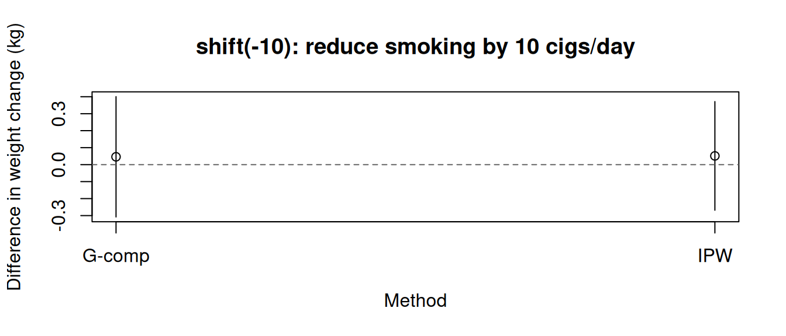
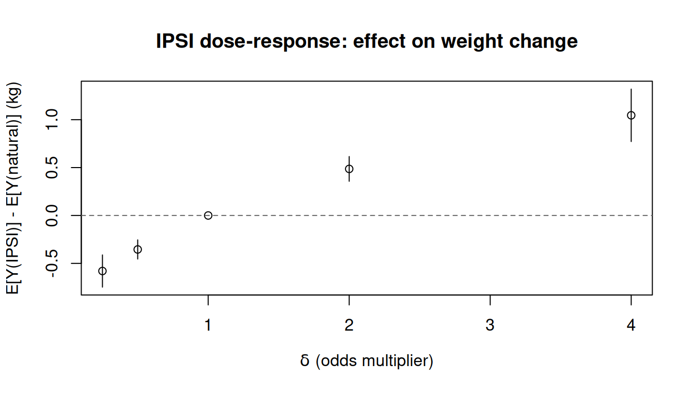
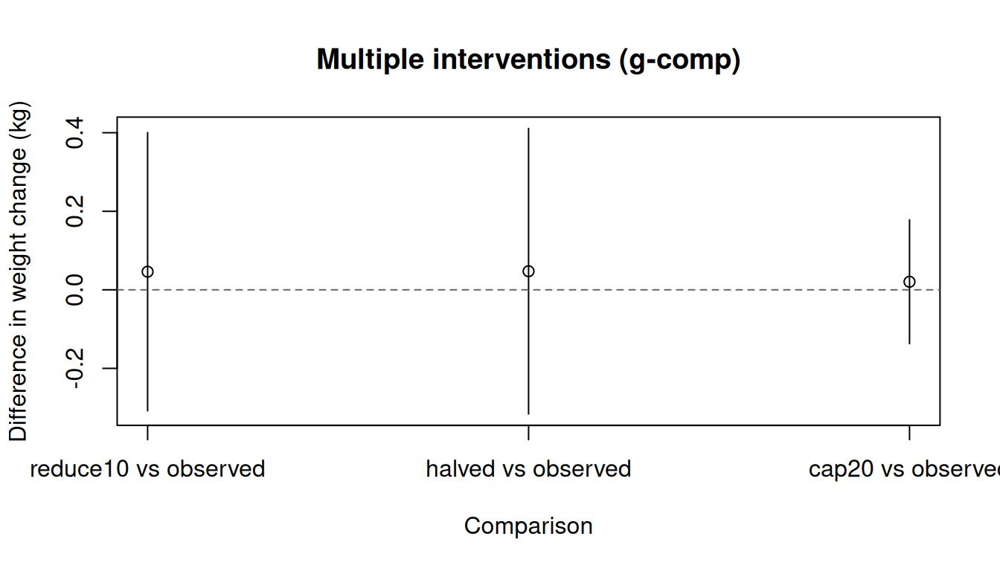

> **来源**：R 包 [causatr](https://github.com/etverse/causatr) 官方文档 [`interventions.qmd`](https://etverse.github.io/causatr/vignettes/interventions.html)，MIT 许可。
> 本页是中译，**代码与运行结果直接取自原站的渲染输出，未在本站重新执行**。
> Copyright (c) 2026 causatr authors；许可证全文见原仓库 `LICENSE.md`。

causatr 把模型拟合（`causat()`）与因果对比（`contrast()`）分开。干预 --- 也就是处理上
那个假设性的改变 --- 是在做对比时指定的，而不是在拟合时指定的。这个设计让你只拟合一次，
就能在许多不同的干预下做对比，而不必重新估计冗余模型。

本文逐一介绍每个干预构造函数，说明哪些估计量支持它，并在真实数据和模拟数据上演示调用方式。

## 干预构造函数一览

| Constructor | What it does | G-comp | IPW | AIPW | Matching |
|---|---|---|---|---|---|
| `static(v)` | 把所有人的处理设为 `v` | 所有类型 | 二值、分类 | 所有类型 | 二值 |
| `shift(d)` | 在观测到的处理上加 `d` | 连续 | 连续、计数（`d` 为整数） | 连续 | --- |
| `scale_by(c)` | 把观测到的处理乘以 `c` | 连续 | 连续、计数（保持整数） | 连续 | --- |
| `threshold(lo, hi)` | 把处理限制在 `[lo, hi]` 内 | 连续 | --- | --- | --- |
| `dynamic(rule)` | 应用用户自定义的确定性规则 | 所有类型 | 二值、分类 | 所有类型 | --- |
| `ipsi(d)` | 把处理的优势（odds）乘以 `d` | --- | 二值 | --- | --- |
| `stochastic(f)` | 从用户提供的分布中抽取处理 | 所有类型 | --- | --- | --- |
| `grace_period(w)` | 把处理的起始推迟 `w` 个周期（自然史 MTP） | 纵向、离散 | --- | --- | --- |
| `carry_forward()` | 把基线处理向后结转（LOCF；自然史 MTP） | 纵向、离散 | --- | --- | --- |
| `cap_escalation(d)` | 把每个周期的自然剂量增幅上限设为 `d`（自然史 MTP） | 纵向、有序/计数 | --- | --- | --- |
| `NULL` | 自然进程（观测值） | 所有类型 | 所有类型 | 所有类型 | --- |

`grace_period()`、`carry_forward()` 和 `cap_escalation()` 属于**自然史**修正处理策略
（G-LMTPs）：时刻 $t$ 上被干预的处理取决于处理的*反事实自然值历史*，因此它们无法写成
`dynamic()` 规则（后者只能看到观测到的滞后值）。它们由增广数据的序贯回归来估计，
需要一个处理为离散变量的纵向 G-computation 拟合。
`cap_escalation()` 针对有序/计数型剂量，当剂量以灵活的形式进入每一步的模型
（`treatment_form = ~ factor(dose)`）时它是相合的 —
可运行的示例见[纵向数据文档](causatr-longitudinal.html)和
[自然史 MTPs 文章](causatr-natural-history-mtps.html)。

## 数据：NHEFS

所有示例都使用 **NHEFS** 数据集 [@hernan_whatif]：

- **二值处理（$A$）：** `qsmk` — 是否戒烟（0/1）。用于 `static()`、`dynamic()`
  和 `ipsi()` 的示例。
- **连续处理（$A$）：** `smokeintensity` — 每天吸烟的支数。用于 `shift()`、
  `scale_by()` 和 `threshold()` 的示例。
- **结局（$Y$）：** `wt82_71` — 体重变化，单位 kg。
- **混杂因子（$L$）：** 性别、年龄、种族、受教育程度、吸烟相关变量、锻炼、
  活动水平和基线体重 — 它们是 $A$ 与 $Y$ 的共同原因。

```r
library(causatr)
library(tinyplot)

data("nhefs")

nhefs_complete <- nhefs[!is.na(nhefs$wt82_71) & !is.na(nhefs$education), ]
```

## `static()` --- 把处理设为固定值

最简单也最常用的干预。`static(1)` 表示“所有人都接受处理”；`static(0)` 表示
“没有人接受处理”。对于分类处理，把水平名作为字符串传入（例如 `static("B")`）。

### G-computation

```r
fit_gc <- causat(
  nhefs_complete,
  outcome = "wt82_71",
  treatment = "qsmk",
  confounders = ~ sex + age + I(age^2) + race + factor(education) +
    smokeintensity + I(smokeintensity^2) + smokeyrs + I(smokeyrs^2) +
    factor(exercise) + factor(active) + wt71 + I(wt71^2),
  model_fn = stats::glm
)

contrast(
  fit_gc,
  interventions = list(quit = static(1), continue = static(0)),
  reference = "continue",
  type = "difference"
)
```

| intervention | estimate | se | ci_lower | ci_upper |
|---|---|---|---|---|
| quit | 5.21 | 0.421 | 4.384 | 6.035 |
| continue | 1.747 | 0.217 | 1.321 | 2.173 |

| comparison | estimate | se | ci_lower | ci_upper |
|---|---|---|---|---|
| quit vs continue | 3.462 | 0.468 | 2.546 | 4.379 |

### IPW

```r
fit_ipw <- causat(
  nhefs_complete,
  outcome = "wt82_71",
  treatment = "qsmk",
  confounders = ~ sex + age + I(age^2) + race + factor(education) +
    smokeintensity + I(smokeintensity^2) + smokeyrs + I(smokeyrs^2) +
    factor(exercise) + factor(active) + wt71 + I(wt71^2),
  estimator = "ipw",
  model_fn = stats::glm,
  propensity_model_fn = stats::glm
)

contrast(
  fit_ipw,
  interventions = list(quit = static(1), continue = static(0)),
  reference = "continue",
  type = "difference"
)
```

| intervention | estimate | se | ci_lower | ci_upper |
|---|---|---|---|---|
| quit | 5.288 | 0.447 | 4.412 | 6.163 |
| continue | 1.788 | 0.217 | 1.363 | 2.214 |

| comparison | estimate | se | ci_lower | ci_upper |
|---|---|---|---|---|
| quit vs continue | 3.499 | 0.49 | 2.538 | 4.46 |

### AIPW（双稳健）

```r
fit_aipw <- causat(
  nhefs_complete,
  outcome = "wt82_71",
  treatment = "qsmk",
  confounders = ~ sex + age + I(age^2) + race + factor(education) +
    smokeintensity + I(smokeintensity^2) + smokeyrs + I(smokeyrs^2) +
    factor(exercise) + factor(active) + wt71 + I(wt71^2),
  estimator = "aipw",
  model_fn = stats::glm,
  propensity_model_fn = stats::glm
)

contrast(
  fit_aipw,
  interventions = list(quit = static(1), continue = static(0)),
  reference = "continue",
  type = "difference"
)
```

| intervention | estimate | se | ci_lower | ci_upper |
|---|---|---|---|---|
| quit | 5.254 | 0.44 | 4.391 | 6.116 |
| continue | 1.777 | 0.218 | 1.349 | 2.205 |

| comparison | estimate | se | ci_lower | ci_upper |
|---|---|---|---|---|
| quit vs continue | 3.477 | 0.483 | 2.531 | 4.423 |

### 匹配

```r
fit_match <- causat(
  nhefs_complete,
  outcome = "wt82_71",
  treatment = "qsmk",
  confounders = ~ sex + age + I(age^2) + race + factor(education) +
    smokeintensity + I(smokeintensity^2) + smokeyrs + I(smokeyrs^2) +
    factor(exercise) + factor(active) + wt71 + I(wt71^2),
  estimator = "matching",
  estimand = "ATT"
)

contrast(
  fit_match,
  interventions = list(quit = static(1), continue = static(0)),
  reference = "continue",
  type = "difference"
)
```

| intervention | estimate | se | ci_lower | ci_upper |
|---|---|---|---|---|
| quit | 4.525 | 0.435 | 3.672 | 5.378 |
| continue | 1.184 | 0.383 | 0.433 | 1.935 |

| comparison | estimate | se | ci_lower | ci_upper |
|---|---|---|---|---|
| quit vs continue | 3.341 | 0.559 | 2.246 | 4.436 |

四种方法给出的估计值应当大体接近（三角验证）。若出现明显差异，
说明其中一种或多种方法存在模型误设。

## `shift()` --- 在观测到的处理上加一个常数

一种修正处理策略（MTP），把每个个体观测到的处理平移一个固定量。
对连续处理，它回答的问题是：“如果每个人的暴露都增加（或减少）`delta`
个单位，会发生什么？”

### G-computation

```r
fit_gc_cont <- causat(
  nhefs_complete,
  outcome = "wt82_71",
  treatment = "smokeintensity",
  confounders = ~ sex + age + I(age^2) + race + factor(education) +
    smokeyrs + I(smokeyrs^2) + factor(exercise) + factor(active) +
    wt71 + I(wt71^2),
  model_fn = stats::glm
)

res_shift_gc <- contrast(
  fit_gc_cont,
  interventions = list(reduce10 = shift(-10), observed = NULL),
  reference = "observed",
  type = "difference"
)
res_shift_gc
```

| intervention | estimate | se | ci_lower | ci_upper |
|---|---|---|---|---|
| reduce10 | 2.684 | 0.256 | 2.183 | 3.186 |
| observed | 2.638 | 0.199 | 2.248 | 3.028 |

| comparison | estimate | se | ci_lower | ci_upper |
|---|---|---|---|---|
| reduce10 vs observed | 0.046 | 0.181 | -0.308 | 0.4 |

### IPW

在 IPW 下，`shift(delta)` 使用密度比权重：处理密度在逆平移值处的取值与在观测
值处的取值之比。前推方向的符号很重要 --- `shift(delta)` 是在 `A - delta` 处
求值，而不是 `A + delta` --- 因为权重用的是逆映射。

```r
fit_ipw_cont <- causat(
  nhefs_complete,
  outcome = "wt82_71",
  treatment = "smokeintensity",
  confounders = ~ sex + age + I(age^2) + race + factor(education) +
    smokeyrs + I(smokeyrs^2) + factor(exercise) + factor(active) +
    wt71 + I(wt71^2),
  estimator = "ipw",
  model_fn = stats::glm,
  propensity_model_fn = stats::glm
)

res_shift_ipw <- contrast(
  fit_ipw_cont,
  interventions = list(reduce10 = shift(-10), observed = NULL),
  reference = "observed",
  type = "difference"
)
res_shift_ipw
```

| intervention | estimate | se | ci_lower | ci_upper |
|---|---|---|---|---|
| reduce10 | 2.69 | 0.248 | 2.205 | 3.175 |
| observed | 2.638 | 0.199 | 2.248 | 3.028 |

| comparison | estimate | se | ci_lower | ci_upper |
|---|---|---|---|---|
| reduce10 vs observed | 0.051 | 0.163 | -0.268 | 0.371 |

### 不同方法下的 shift 结果比较

```r
est <- data.frame(
  method = c("G-comp", "IPW"),
  estimate = c(
    res_shift_gc$contrasts$estimate[1],
    res_shift_ipw$contrasts$estimate[1]
  ),
  ci_lower = c(
    res_shift_gc$contrasts$ci_lower[1],
    res_shift_ipw$contrasts$ci_lower[1]
  ),
  ci_upper = c(
    res_shift_gc$contrasts$ci_upper[1],
    res_shift_ipw$contrasts$ci_upper[1]
  )
)

tinyplot(
  estimate ~ method,
  data = est,
  type = "pointrange",
  ymin = est$ci_lower,
  ymax = est$ci_upper,
  xlab = "Method",
  ylab = "Difference in weight change (kg)",
  main = "shift(-10): reduce smoking by 10 cigs/day"
)
abline(h = 0, lty = 2, col = "grey40")
```



::: {.callout-note}
IPW 下**不支持** `threshold()`，因为连续密度在边界截断下的前推是一个混合测度
（上下界处的点质量，加上内部的连续密度）。做 threshold 干预请使用
`estimator = "gcomp"`。
:::

### 计数型处理（Poisson / 负二项）

对于取整数值的计数型处理，传入 `propensity_family = "poisson"` 或 `"negbin"`，
即可改用计数密度模型，而不是默认的高斯模型。

**DGM.** 一个服从 Poisson 分布的计数型处理（例如就诊次数），受 $L$ 混杂，
结局模型为线性。

$$
\begin{aligned}
  L &\sim N(0,1) \\
  A &\sim \text{Poisson}\!\bigl(\exp(0.5\,L)\bigr) \\
  Y &= 2 + 1.5\,A + L + \varepsilon, \quad \varepsilon \sim N(0,1)
\end{aligned}
$$

真实对比：$\mathbb{E}[Y(A+1)] - \mathbb{E}[Y(A)] = 1.5$。

```r
set.seed(6)
n <- 3000
L <- rnorm(n)
A <- rpois(n, exp(0.5 * L))
Y <- 2 + 1.5 * A + L + rnorm(n)
count_df <- data.frame(Y = Y, A = A, L = L)

fit_pois <- causat(
  count_df,
  outcome = "Y",
  treatment = "A",
  confounders = ~ L,
  estimator = "ipw",
  propensity_family = "poisson",
  model_fn = stats::glm,
  propensity_model_fn = stats::glm
)

res_pois <- contrast(
  fit_pois,
  interventions = list(plus1 = shift(1), observed = NULL),
  reference = "observed",
  type = "difference"
)
res_pois
```

| intervention | estimate | se | ci_lower | ci_upper |
|---|---|---|---|---|
| plus1 | 5.267 | 0.069 | 5.133 | 5.402 |
| observed | 3.692 | 0.049 | 3.595 | 3.788 |

| comparison | estimate | se | ci_lower | ci_upper |
|---|---|---|---|---|
| plus1 vs observed | 1.576 | 0.05 | 1.478 | 1.674 |

shift 的增量必须是整数 --- 对计数型处理使用 `shift(0.5)` 会中止，因为
`dpois()` 在非整数参数处返回 0。

## `scale_by()` --- 把观测到的处理乘以一个系数

一种按比例的 MTP。`scale_by(0.5)` 把每个个体的暴露减半；`scale_by(2)` 则加倍。

### G-computation

```r
res_scale_gc <- contrast(
  fit_gc_cont,
  interventions = list(halved = scale_by(0.5), observed = NULL),
  reference = "observed",
  type = "difference"
)
res_scale_gc
```

| intervention | estimate | se | ci_lower | ci_upper |
|---|---|---|---|---|
| halved | 2.686 | 0.259 | 2.178 | 3.193 |
| observed | 2.638 | 0.199 | 2.248 | 3.028 |

| comparison | estimate | se | ci_lower | ci_upper |
|---|---|---|---|---|
| halved vs observed | 0.047 | 0.185 | -0.316 | 0.411 |

### IPW

在 IPW 下，`scale_by(c)` 在 `A / c` 处计算密度，并把 Jacobian `|1/c|` 纳入
密度比权重。

```r
res_scale_ipw <- contrast(
  fit_ipw_cont,
  interventions = list(halved = scale_by(0.5), observed = NULL),
  reference = "observed",
  type = "difference"
)
res_scale_ipw
```

| intervention | estimate | se | ci_lower | ci_upper |
|---|---|---|---|---|
| halved | 2.45 | 0.291 | 1.88 | 3.021 |
| observed | 2.638 | 0.199 | 2.248 | 3.028 |

| comparison | estimate | se | ci_lower | ci_upper |
|---|---|---|---|---|
| halved vs observed | -0.188 | 0.223 | -0.625 | 0.249 |

## `threshold()` --- 把处理截断在给定上下界之内（仅 G-computation）

给处理设定上限和/或下限。`threshold(0, 20)` 的意思是“没有人每天吸烟超过 20 支；
低于 0 的一律设为 0”。

```r
res_thresh <- contrast(
  fit_gc_cont,
  interventions = list(cap20 = threshold(0, 20), observed = NULL),
  reference = "observed",
  type = "difference"
)
res_thresh
```

| intervention | estimate | se | ci_lower | ci_upper |
|---|---|---|---|---|
| cap20 | 2.659 | 0.208 | 2.252 | 3.066 |
| observed | 2.638 | 0.199 | 2.248 | 3.028 |

| comparison | estimate | se | ci_lower | ci_upper |
|---|---|---|---|---|
| cap20 vs observed | 0.021 | 0.08 | -0.137 | 0.178 |

该干预只在 G-computation 下可用。在 IPW 下，密度比权重在边界截断点处没有良定义
（前推密度中存在点质量间断）。causatr 会在 `estimator = "ipw"` 下拒绝
`threshold()`，并给出一条提示性错误信息，指引改用 G-computation。

## `dynamic()` --- 确定性处理规则

动态干预根据个体特征来分配处理。`rule` 函数接收两个参数 --- 完整数据和观测到的
处理向量 --- 并返回一个反事实处理值向量。

### G-computation（二值处理）

只对重度吸烟者（基线时每天 > 20 支）实施戒烟：

```r
res_dyn_gc <- contrast(
  fit_gc,
  interventions = list(
    rule = dynamic(\(data, trt) ifelse(data$smokeintensity > 20, 1, 0)),
    all_quit = static(1)
  ),
  reference = "all_quit",
  type = "difference"
)
res_dyn_gc
```

| intervention | estimate | se | ci_lower | ci_upper |
|---|---|---|---|---|
| rule | 2.725 | 0.204 | 2.325 | 3.124 |
| all_quit | 5.21 | 0.421 | 4.384 | 6.035 |

| comparison | estimate | se | ci_lower | ci_upper |
|---|---|---|---|---|
| rule vs all_quit | -2.485 | 0.337 | -3.146 | -1.824 |

### IPW（二值处理）

在 IPW 下，对二值处理使用 `dynamic()` 会采用 Horwitz--Thompson 指示权重：
`w_i = I(A_i = rule_i) / f(A_i | L_i)`。它是良定义的，因为处理只取两个值，
而且每个个体的反事实都是确定的。

```r
res_dyn_ipw <- contrast(
  fit_ipw,
  interventions = list(
    rule = dynamic(\(data, trt) ifelse(data$smokeintensity > 20, 1, 0)),
    all_quit = static(1)
  ),
  reference = "all_quit",
  type = "difference"
)
res_dyn_ipw
```

| intervention | estimate | se | ci_lower | ci_upper |
|---|---|---|---|---|
| rule | 2.803 | 0.355 | 2.107 | 3.499 |
| all_quit | 5.288 | 0.447 | 4.412 | 6.163 |

| comparison | estimate | se | ci_lower | ci_upper |
|---|---|---|---|---|
| rule vs all_quit | -2.485 | 0.385 | -3.239 | -1.73 |

### G-computation（连续处理）

作用于连续处理的动态规则在 G-computation 下可用（在结局模型上先预测再平均）。
这里把重度吸烟者降到 20，其他人保持其观测水平：

```r
res_dyn_cont <- contrast(
  fit_gc_cont,
  interventions = list(
    capped = dynamic(\(data, trt) pmin(trt, 20)),
    observed = NULL
  ),
  reference = "observed",
  type = "difference"
)
res_dyn_cont
```

| intervention | estimate | se | ci_lower | ci_upper |
|---|---|---|---|---|
| capped | 2.659 | 0.208 | 2.252 | 3.066 |
| observed | 2.638 | 0.199 | 2.248 | 3.028 |

| comparison | estimate | se | ci_lower | ci_upper |
|---|---|---|---|---|
| capped vs observed | 0.021 | 0.08 | -0.137 | 0.178 |

::: {.callout-note}
IPW 下**不支持**对连续处理使用 `dynamic()`。作用于连续处理的确定性规则对每个
个体都是一个 Dirac 分布，没有 Lebesgue 密度 --- 密度比无从定义。请把该规则改写
成平滑的 `shift()` 或 `scale_by()`，或者使用
`estimator = "gcomp"`。
:::

## `ipsi()` --- 增量倾向评分干预（仅 IPW）

Kennedy [-@kennedy2019ipsi] 的增量倾向评分干预把每个个体的*处理优势（odds）*
乘以 `delta`。它是一种随机 MTP，从不产生某个具体的反事实处理值 --- 而是平移
整个倾向评分分布。

闭式权重为：
$$w_i = \frac{\delta \cdot A_i + (1 - A_i)}{\delta \cdot p_i + (1 - p_i)}$$

其中 $p_i = P(A = 1 \mid L_i)$ 是拟合得到的倾向评分。

IPSI **只适用于二值处理，且只能用 IPW** --- G-computation 和匹配无法评估它，
因为没有可供预测的反事实处理列。

### 把戒烟的优势加倍

```r
res_ipsi_2 <- contrast(
  fit_ipw,
  interventions = list(double_odds = ipsi(2), natural = NULL),
  reference = "natural",
  type = "difference"
)
res_ipsi_2
```

| intervention | estimate | se | ci_lower | ci_upper |
|---|---|---|---|---|
| double_odds | 3.125 | 0.218 | 2.697 | 3.552 |
| natural | 2.638 | 0.199 | 2.248 | 3.028 |

| comparison | estimate | se | ci_lower | ci_upper |
|---|---|---|---|---|
| double_odds vs natural | 0.486 | 0.066 | 0.357 | 0.615 |

### 把戒烟的优势减半

```r
res_ipsi_half <- contrast(
  fit_ipw,
  interventions = list(half_odds = ipsi(0.5), natural = NULL),
  reference = "natural",
  type = "difference"
)
res_ipsi_half
```

| intervention | estimate | se | ci_lower | ci_upper |
|---|---|---|---|---|
| half_odds | 2.284 | 0.197 | 1.898 | 2.669 |
| natural | 2.638 | 0.199 | 2.248 | 3.028 |

| comparison | estimate | se | ci_lower | ci_upper |
|---|---|---|---|---|
| half_odds vs natural | -0.355 | 0.051 | -0.455 | -0.255 |

### IPSI 剂量-反应

改变 `delta` 可以在优势尺度上勾画出一条剂量-反应曲线：

```r
deltas <- c(0.25, 0.5, 1, 2, 4)
ipsi_results <- lapply(deltas, function(d) {
  res <- contrast(
    fit_ipw,
    interventions = list(shifted = ipsi(d), natural = NULL),
    reference = "natural",
    type = "difference"
  )
  data.frame(
    delta = d,
    estimate = res$contrasts$estimate[1],
    ci_lower = res$contrasts$ci_lower[1],
    ci_upper = res$contrasts$ci_upper[1]
  )
})
ipsi_df <- do.call(rbind, ipsi_results)

tinyplot(
  estimate ~ delta,
  data = ipsi_df,
  type = "pointrange",
  ymin = ipsi_df$ci_lower,
  ymax = ipsi_df$ci_upper,
  xlab = expression(delta ~ "(odds multiplier)"),
  ylab = "E[Y(IPSI)] - E[Y(natural)] (kg)",
  main = "IPSI dose-response: effect on weight change"
)
abline(h = 0, lty = 2, col = "grey40")
```



`delta = 1` 时该干预就是自然进程，因此对比为零。`delta` 越大，戒烟的可能性
越高，对体重增加的效应也越大。

## `stochastic()` --- 用户自定义随机化干预（仅 G-computation）

随机化干预从用户提供的分布中为每个个体抽取反事实处理，该分布可以依赖协变量。
与只赋一个确定性取值的 `dynamic()` 不同，`stochastic()` 用 Monte Carlo 对随机性
积分：g-formula 被求值 `n_mc` 次，每次都从抽样函数独立抽取一组取值，再把预测结果
取平均。

`sampler` 函数与 `dynamic()` 规则的签名相同 --- `function(data, treatment)` ---
但每次被调用时都应返回一次独立的随机抽样。

### 二值处理：依赖协变量的随机化

以依赖吸烟强度的概率来分配戒烟：

```r
set.seed(42)
res_stoch <- contrast(
  fit_gc,
  interventions = list(
    random_quit = stochastic(
      \(data, trt) rbinom(nrow(data), 1,
                          plogis(-1 + 0.05 * data$smokeintensity)),
      n_mc = 200L
    ),
    all_quit = static(1)
  ),
  reference = "all_quit",
  type = "difference"
)
res_stoch
```

| intervention | estimate | se | ci_lower | ci_upper |
|---|---|---|---|---|
| random_quit | 3.489 | 0.242 | 3.014 | 3.963 |
| all_quit | 5.21 | 0.421 | 4.384 | 6.035 |

| comparison | estimate | se | ci_lower | ci_upper |
|---|---|---|---|---|
| random_quit vs all_quit | -1.721 | 0.232 | -2.176 | -1.266 |

该估计值是在个体 *与* 随机化策略两个维度上取的总体平均。

### 连续处理：随机平移

给每个个体的吸烟强度加上一个随机扰动（而不是固定的平移）：

```r
set.seed(42)
res_stoch_cont <- contrast(
  fit_gc_cont,
  interventions = list(
    noisy_reduce = stochastic(
      \(data, trt) trt + rnorm(length(trt), mean = -5, sd = 2),
      n_mc = 200L
    ),
    observed = NULL
  ),
  reference = "observed",
  type = "difference"
)
res_stoch_cont
```

| intervention | estimate | se | ci_lower | ci_upper |
|---|---|---|---|---|
| noisy_reduce | 2.661 | 0.211 | 2.248 | 3.074 |
| observed | 2.638 | 0.199 | 2.248 | 3.028 |

| comparison | estimate | se | ci_lower | ci_upper |
|---|---|---|---|---|
| noisy_reduce vs observed | 0.023 | 0.09 | -0.154 | 0.2 |

::: {.callout-tip}
**`n_mc` 的选取**：常用 100--500。三明治 SE 已经计入估计时所用的 MC 抽样，因此不必
仅仅为了推断而调大 `n_mc`。如果换一个随机种子重跑，点估计值有明显变化，就增大
`n_mc`。
:::

::: {.callout-note}
`stochastic()` 只在 `estimator = "gcomp"` 下受支持（单时点与纵向）。IPW 和匹配无法
对其求值，因为用户自定义随机化策略的密度比一般难以求解。
:::

## `NULL` --- 自然进程

`NULL` 表示“不做干预；使用观测到的处理取值”。它是 MTPs 天然的参照：

```r
res_multi <- contrast(
  fit_gc_cont,
  interventions = list(
    reduce10 = shift(-10),
    halved   = scale_by(0.5),
    cap20    = threshold(0, 20),
    observed = NULL
  ),
  reference = "observed",
  type = "difference"
)
res_multi
```

| intervention | estimate | se | ci_lower | ci_upper |
|---|---|---|---|---|
| reduce10 | 2.684 | 0.256 | 2.183 | 3.186 |
| halved | 2.686 | 0.259 | 2.178 | 3.193 |
| cap20 | 2.659 | 0.208 | 2.252 | 3.066 |
| observed | 2.638 | 0.199 | 2.248 | 3.028 |

| comparison | estimate | se | ci_lower | ci_upper |
|---|---|---|---|---|
| reduce10 vs observed | 0.046 | 0.181 | -0.308 | 0.4 |
| halved vs observed | 0.047 | 0.185 | -0.316 | 0.411 |
| cap20 vs observed | 0.021 | 0.08 | -0.137 | 0.178 |

## 在一次对比中组合多个干预

G-computation 和 IPW 都支持在一次 `contrast()` 调用中传入多个干预。所有干预与参照
之间的两两差值都会被计算，方差-协方差矩阵也同时覆盖全部干预。

### G-computation

```r
est <- res_multi$contrasts
tinyplot(
  estimate ~ comparison,
  data = est,
  type = "pointrange",
  ymin = est$ci_lower,
  ymax = est$ci_upper,
  xlab = "Comparison",
  ylab = "Difference in weight change (kg)",
  main = "Multiple interventions (g-comp)"
)
abline(h = 0, lty = 2, col = "grey40")
```



### IPW

```r
res_multi_ipw <- contrast(
  fit_ipw_cont,
  interventions = list(
    reduce10 = shift(-10),
    halved   = scale_by(0.5),
    observed = NULL
  ),
  reference = "observed",
  type = "difference"
)
res_multi_ipw
```

| intervention | estimate | se | ci_lower | ci_upper |
|---|---|---|---|---|
| reduce10 | 2.69 | 0.248 | 2.205 | 3.175 |
| halved | 2.45 | 0.291 | 1.88 | 3.021 |
| observed | 2.638 | 0.199 | 2.248 | 3.028 |

| comparison | estimate | se | ci_lower | ci_upper |
|---|---|---|---|---|
| reduce10 vs observed | 0.051 | 0.163 | -0.268 | 0.371 |
| halved vs observed | -0.188 | 0.223 | -0.625 | 0.249 |

## 各估计量的干预支持情况

下表汇总了哪些组合受支持、哪些会被拒绝并给出信息明确的报错。这些限制反映的是密度比
框架真正的架构性局限，而不是实现上的缺口。

| Intervention | G-comp (point) | G-comp (longitudinal) | IPW | AIPW | Matching |
|---|---|---|---|---|---|
| `static()` | 所有处理类型 | 所有处理类型 | 二值、分类 | 所有类型 | 仅二值 |
| `shift()` | 连续 | 连续 | 连续、计数（整数增量） | 连续 | --- |
| `scale_by()` | 连续 | 连续 | 连续、计数（保持整数） | 连续 | --- |
| `threshold()` | 连续 | 连续 | ---（前推为混合测度） | --- | --- |
| `dynamic()` | 所有处理类型 | 所有处理类型 | 二值、分类 | 所有类型 | --- |
| `ipsi()` | --- | --- | 仅二值 | --- | --- |
| `stochastic()` | 所有处理类型 | 所有处理类型 | ---（密度比难以求解） | --- | --- |
| `NULL` | 全部 | 全部 | 全部 | 全部 | --- |

**为什么有些组合会被拒绝：**

- **IPW 下的 `threshold()`：** 连续密度在边界截断下的前推是一个混合测度——在
  `lo`/`hi` 处存在点质量，内部则是连续密度。密度比没有良定义。
- **IPW 下连续处理上的 `dynamic()`：** 作用于连续处理的确定性规则对每个个体都是一个
  Dirac 测度，没有 Lebesgue 密度。
- **IPW 下连续处理上的 `static(v)`：** 没有个体恰好被观测在 `v` 上，因此 HT 示性函数
  `I(A = v)` 几乎必然为零。
- **G-computation／匹配下的 `ipsi()`：** IPSI 移动的是倾向评分，而不是处理值。
  没有可供预测的反事实处理列。
- **IPW／匹配下的 `stochastic()`：** 任意用户自定义随机策略的密度比通常难以求解。
  只有 G-computation（Monte Carlo 积分）支持它。
- **计数型处理上的 `static()` / `dynamic()` / `threshold()` / `ipsi()`：**
  计数型处理（通过 `propensity_family = "poisson"` 或 `"negbin"` 启用）使用
  `dpois()` / `dnbinom()` 计算密度比。`static()` 是退化的（在计数分布上 HT 示性函数
  几乎必然为零）。`dynamic()` 存在与连续处理相同的 Dirac 问题。`threshold()` 存在
  相同的混合测度问题。`ipsi()` 只针对 Bernoulli 分布。只有 `shift()`（整数增量）和
  `scale_by()`（其中 `A / factor` 对每个观测都是整数）是良定义的。

## 参考文献

::: {#refs}
:::

