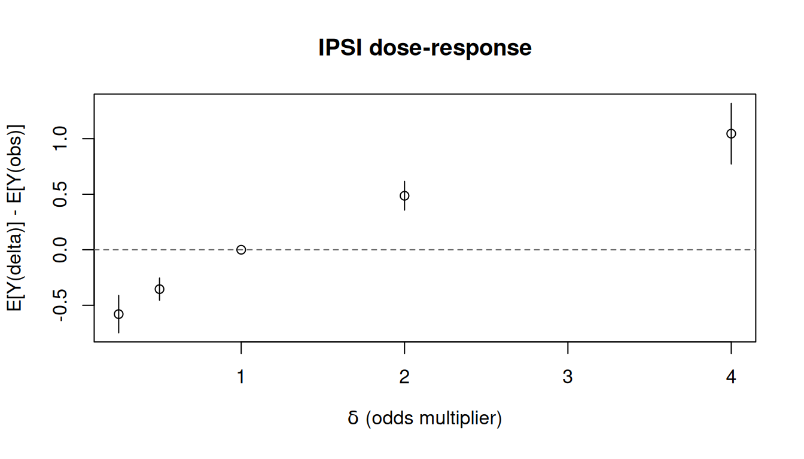
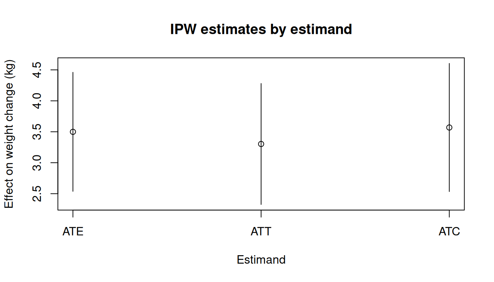
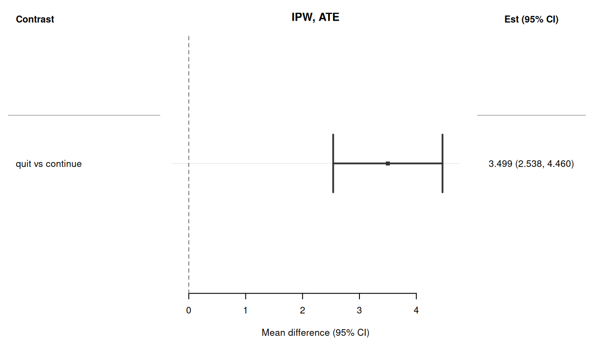

> **来源**：R 包 [causatr](https://github.com/etverse/causatr) 官方文档 [`ipw.qmd`](https://etverse.github.io/causatr/vignettes/ipw.html)，MIT 许可。
> 本页是中译，**代码与运行结果直接取自原站的渲染输出，未在本站重新执行**。
> Copyright (c) 2026 causatr authors；许可证全文见原仓库 `LICENSE.md`。

逆概率加权（IPW）通过对观测数据重新加权来估计因果效应，使混杂因子的分布在各
处理组之间达到均衡。causatr 自带一个独立的密度比引擎：它通过用户指定的
`propensity_model_fn`（默认 `stats::glm`）拟合条件处理密度，并为每个干预构造
Hájek 权重，用于在 `contrast()` 内部重新拟合一个仅含截距的边际结构模型（MSM）。

本文用 @hernan_whatif 中的 NHEFS 数据集演示 causatr 里的 IPW，覆盖时间固定处理下
处理类型、结局类型、对比尺度和推断方法的每一种受支持组合。

关于非静态干预（shift、scale、dynamic、IPSI），参见 `vignette("interventions")`。

**注意：** IPW 和匹配通过 `confounders` 中的 `A:modifier` 项支持效应修饰。
IPW 把每个干预的 MSM 扩展为包含修饰因子主效应（`Y ~ 1 + modifier`）；
匹配则扩展为饱和 MSM（`Y ~ A + modifier + A:modifier`）。在 `contrast()`
中使用 `by = "modifier"` 可得到各层的估计值。

## 准备工作

本文的例子使用 **NHEFS**（National Health and Nutrition Examination Survey ——
Epidemiologic Follow-up Study）数据集，它是 @hernan_whatif 全书贯穿的示例。
假定的因果结构是：

- **处理（$A$）：** `qsmk` —— 1971 至 1982 年间是否戒烟（二值：0/1）。
- **结局（$Y$）：** `wt82_71` —— 同一时期的体重变化，单位 kg
  （连续型）。二值结局部分使用由它派生的二值版本 `gained_weight`
  （$\mathbf{1}\{Y > 0\}$）。
- **混杂因子（$L$）：** 性别、年龄、种族、受教育程度、吸烟强度
  （支/天）、吸烟年数、锻炼、体力活动和基线体重。它们同时影响戒烟概率和
  随后的体重变化。

结构因果模型（假定）：

$$
\begin{aligned}
  L &\sim F_L \\
  A &\sim \text{Bernoulli}\!\bigl(\text{logit}^{-1}(\alpha_0 + \alpha_L^\top L)\bigr) \\
  Y &= \beta_0 + \beta_A A + \beta_L^\top L + \beta_{AL}^\top (A \cdot L) + \varepsilon,
      \quad \varepsilon \sim N(0, \sigma^2)
\end{aligned}
$$

混杂因子 $L$ 是 $A$ 和 $Y$ 的共同原因；对 $L$ 做调整可阻断所有后门路径，
从而通过 Horvitz--Thompson 重加权估计量识别 $\mathbb{E}[Y^a]$。IPW 直接对
处理机制 $P(A \mid L)$ 建模，并对结局重新加权以消除混杂，而不像 G-computation
那样对 $E[Y \mid A, L]$ 建模。

```r
library(causatr)
library(tinytable)
library(tinyplot)

data("nhefs")

nhefs_complete <- nhefs[!is.na(nhefs$wt82_71) & !is.na(nhefs$education), ]

nhefs_complete$gained_weight <- as.integer(nhefs_complete$wt82_71 > 0)

nhefs_complete$sex <- factor(
  nhefs_complete$sex,
  levels = 0:1,
  labels = c("Male", "Female")
)
```

## 二值处理、连续结局

本节复现 @hernan_whatif 第 12 章的 IPW 分析：戒烟（`qsmk`）对体重变化
（`wt82_71`）的平均因果效应。默认情况下，`confounders` 为倾向评分模型指定
同一套协变量。需要时可用 `confounders_treatment` 为处理模型单独指定另一套
（例如为了 AIPW 的双稳健性）。

### ATE 与三明治 SE

```r
fit_ipw <- causat(
  nhefs_complete,
  outcome = "wt82_71",
  treatment = "qsmk",
  confounders = ~ sex + age + I(age^2) + race + factor(education) +
    smokeintensity + I(smokeintensity^2) + smokeyrs + I(smokeyrs^2) +
    factor(exercise) + factor(active) + wt71 + I(wt71^2),
  estimator = "ipw",
  estimand = "ATE",
  model_fn = stats::glm,
  propensity_model_fn = stats::glm
)

res_ate_sw <- contrast(
  fit_ipw,
  interventions = list(quit = static(1), continue = static(0)),
  reference = "continue",
  type = "difference",
  ci_method = "sandwich"
)
res_ate_sw
```

| intervention | estimate | se | ci_lower | ci_upper |
|---|---|---|---|---|
| quit | 5.288 | 0.447 | 4.412 | 6.163 |
| continue | 1.788 | 0.217 | 1.363 | 2.214 |

| comparison | estimate | se | ci_lower | ci_upper |
|---|---|---|---|---|
| quit vs continue | 3.499 | 0.49 | 2.538 | 4.46 |

书中报告的 IPW 估计给出 ATE $\approx$ 3.4 kg（95% CI：2.4, 4.5）。

### ATE 的 bootstrap SE

```r
res_ate_bs <- contrast(
  fit_ipw,
  interventions = list(quit = static(1), continue = static(0)),
  reference = "continue",
  type = "difference",
  ci_method = "bootstrap",
  n_boot = 50L
)
res_ate_bs
```

| intervention | estimate | se | ci_lower | ci_upper |
|---|---|---|---|---|
| quit | 5.288 | 0.414 | 4.582 | 6.071 |
| continue | 1.788 | 0.199 | 1.412 | 2.165 |

| comparison | estimate | se | ci_lower | ci_upper |
|---|---|---|---|---|
| quit vs continue | 3.499 | 0.47 | 2.799 | 4.358 |

### ATT 估计目标

对 IPW 而言，估计目标在拟合时就已固定，因为它决定了权重。要估计 ATT，请用
`estimand = "ATT"` 重新拟合。

```r
fit_ipw_att <- causat(
  nhefs_complete,
  outcome = "wt82_71",
  treatment = "qsmk",
  confounders = ~ sex + age + I(age^2) + race + factor(education) +
    smokeintensity + I(smokeintensity^2) + smokeyrs + I(smokeyrs^2) +
    factor(exercise) + factor(active) + wt71 + I(wt71^2),
  estimator = "ipw",
  estimand = "ATT",
  model_fn = stats::glm,
  propensity_model_fn = stats::glm
)

res_att <- contrast(
  fit_ipw_att,
  interventions = list(quit = static(1), continue = static(0)),
  reference = "continue",
  type = "difference",
  ci_method = "sandwich"
)
res_att
```

| intervention | estimate | se | ci_lower | ci_upper |
|---|---|---|---|---|
| quit | 4.525 | 0.435 | 3.672 | 5.378 |
| continue | 1.222 | 0.296 | 0.642 | 1.803 |

| comparison | estimate | se | ci_lower | ci_upper |
|---|---|---|---|---|
| quit vs continue | 3.303 | 0.498 | 2.326 | 4.28 |

### ATC 估计目标

```r
fit_ipw_atc <- causat(
  nhefs_complete,
  outcome = "wt82_71",
  treatment = "qsmk",
  confounders = ~ sex + age + I(age^2) + race + factor(education) +
    smokeintensity + I(smokeintensity^2) + smokeyrs + I(smokeyrs^2) +
    factor(exercise) + factor(active) + wt71 + I(wt71^2),
  estimator = "ipw",
  estimand = "ATC",
  model_fn = stats::glm,
  propensity_model_fn = stats::glm
)

res_atc <- contrast(
  fit_ipw_atc,
  interventions = list(quit = static(1), continue = static(0)),
  reference = "continue",
  type = "difference",
  ci_method = "sandwich"
)
res_atc
```

| intervention | estimate | se | ci_lower | ci_upper |
|---|---|---|---|---|
| quit | 5.554 | 0.489 | 4.596 | 6.511 |
| continue | 1.984 | 0.218 | 1.557 | 2.412 |

| comparison | estimate | se | ci_lower | ci_upper |
|---|---|---|---|---|
| quit vs continue | 3.569 | 0.528 | 2.534 | 4.604 |

### ATT 的 bootstrap SE

```r
res_att_bs <- contrast(
  fit_ipw_att,
  interventions = list(quit = static(1), continue = static(0)),
  reference = "continue",
  type = "difference",
  ci_method = "bootstrap",
  n_boot = 50L
)
res_att_bs
```

| intervention | estimate | se | ci_lower | ci_upper |
|---|---|---|---|---|
| quit | 4.525 | 0.391 | 3.752 | 5.23 |
| continue | 1.222 | 0.235 | 0.79 | 1.616 |

| comparison | estimate | se | ci_lower | ci_upper |
|---|---|---|---|---|
| quit vs continue | 3.303 | 0.472 | 2.362 | 4.175 |

### 以编程方式提取结果

```r
coef(res_ate_sw)
#>     quit continue 
#> 5.287648 1.788473
confint(res_ate_sw)
#>             lower    upper
#> quit     4.412464 6.162831
#> continue 1.362560 2.214387
vcov(res_ate_sw)
#>                 quit    continue
#> quit     0.199389310 0.003155553
#> continue 0.003155553 0.047222294
tidy(res_ate_sw)
#>               term estimate std.error     type conf.low conf.high
#> 1 quit vs continue 3.499174 0.4902045 contrast 2.538391  4.459958
glance(res_ate_sw)
#>   estimator estimand contrast_type ci_method    n n_interventions
#> 1       ipw      ATE    difference  sandwich 1566               2
```

## 二值处理、二值结局

这里用 `gained_weight` 指示变量作为二值结局。IPW 引擎对每个干预重新拟合一个
仅含截距的加权 MSM；`contrast()` 计算边际风险，并通过统一的影响函数方差引擎
（`variance_if()`）导出对比，该引擎对 IPW 使用
`compute_ipw_if_self_contained_one()`，在堆叠的倾向评分 + MSM M-估计方程组上
构建个体水平的 IF。

### 风险差（三明治）

```r
fit_ipw_bin <- causat(
  nhefs_complete,
  outcome = "gained_weight",
  treatment = "qsmk",
  confounders = ~ sex + age + I(age^2) + race + factor(education) +
    smokeintensity + I(smokeintensity^2) + smokeyrs + I(smokeyrs^2) +
    factor(exercise) + factor(active) + wt71 + I(wt71^2),
  estimator = "ipw",
  model_fn = stats::glm,
  propensity_model_fn = stats::glm
)

res_rd <- contrast(
  fit_ipw_bin,
  interventions = list(quit = static(1), continue = static(0)),
  reference = "continue",
  type = "difference",
  ci_method = "sandwich"
)
res_rd
```

| intervention | estimate | se | ci_lower | ci_upper |
|---|---|---|---|---|
| quit | 0.776 | 0.021 | 0.735 | 0.818 |
| continue | 0.639 | 0.014 | 0.611 | 0.666 |

| comparison | estimate | se | ci_lower | ci_upper |
|---|---|---|---|---|
| quit vs continue | 0.138 | 0.025 | 0.089 | 0.187 |

### 风险差（bootstrap）

```r
res_rd_bs <- contrast(
  fit_ipw_bin,
  interventions = list(quit = static(1), continue = static(0)),
  reference = "continue",
  type = "difference",
  ci_method = "bootstrap",
  n_boot = 50L
)
res_rd_bs
```

| intervention | estimate | se | ci_lower | ci_upper |
|---|---|---|---|---|
| quit | 0.776 | 0.022 | 0.741 | 0.812 |
| continue | 0.639 | 0.014 | 0.616 | 0.669 |

| comparison | estimate | se | ci_lower | ci_upper |
|---|---|---|---|---|
| quit vs continue | 0.138 | 0.028 | 0.09 | 0.192 |

### 风险比

```r
res_rr <- contrast(
  fit_ipw_bin,
  interventions = list(quit = static(1), continue = static(0)),
  reference = "continue",
  type = "ratio",
  ci_method = "sandwich"
)
res_rr
```

| intervention | estimate | se | ci_lower | ci_upper |
|---|---|---|---|---|
| quit | 0.776 | 0.021 | 0.735 | 0.818 |
| continue | 0.639 | 0.014 | 0.611 | 0.666 |

| comparison | estimate | se | ci_lower | ci_upper |
|---|---|---|---|---|
| quit vs continue | 1.216 | 0.042 | 1.137 | 1.301 |

### 比值比

```r
res_or <- contrast(
  fit_ipw_bin,
  interventions = list(quit = static(1), continue = static(0)),
  reference = "continue",
  type = "or",
  ci_method = "sandwich"
)
res_or
```

| intervention | estimate | se | ci_lower | ci_upper |
|---|---|---|---|---|
| quit | 0.776 | 0.021 | 0.735 | 0.818 |
| continue | 0.639 | 0.014 | 0.611 | 0.666 |

| comparison | estimate | se | ci_lower | ci_upper |
|---|---|---|---|---|
| quit vs continue | 1.967 | 0.264 | 1.511 | 2.559 |

### 风险比（bootstrap）

```r
res_rr_bs <- contrast(
  fit_ipw_bin,
  interventions = list(quit = static(1), continue = static(0)),
  reference = "continue",
  type = "ratio",
  ci_method = "bootstrap",
  n_boot = 50L
)
res_rr_bs
```

| intervention | estimate | se | ci_lower | ci_upper |
|---|---|---|---|---|
| quit | 0.776 | 0.022 | 0.724 | 0.807 |
| continue | 0.639 | 0.014 | 0.612 | 0.663 |

| comparison | estimate | se | ci_lower | ci_upper |
|---|---|---|---|---|
| quit vs continue | 1.216 | 0.046 | 1.123 | 1.29 |

## 并行 bootstrap

只要把 `parallel` 和 `ncpus` 直接透传给 `boot::boot()`，bootstrap
重抽样就可以并行执行：

```r
res_par <- contrast(
  fit_ipw,
  interventions = list(quit = static(1), continue = static(0)),
  reference = "continue",
  ci_method = "bootstrap",
  n_boot = 200L,
  parallel = "multicore",  # or "snow" on Windows
  ncpus = 4L
)
```

这两个参数默认取 `getOption("boot.parallel", "no")` 和
`getOption("boot.ncpus", 1L)`，因此在会话级设置
`options(boot.parallel = "multicore", boot.ncpus = 4L)`，就能让每一次
`contrast()` 调用都开启并行，而不必逐次传参。

## 动态干预（二值处理）

`dynamic()` 干预会根据每个个体的协变量，为其分配一个处理值。在 IPW 下，
二值处理上的动态规则使用 Horwitz--Thompson 指示权重：$w_i = \mathbb{1}\{A_i = d(L_i)\} / f(d(L_i) \mid L_i)$。

```r
rule <- function(data, trt) {
  ifelse(data$smokeintensity > 20, 1L, 0L)
}

res_dyn <- contrast(
  fit_ipw,
  interventions = list(
    targeted = dynamic(rule),
    all_quit = static(1)
  ),
  reference = "all_quit",
  type = "difference"
)
res_dyn
```

| intervention | estimate | se | ci_lower | ci_upper |
|---|---|---|---|---|
| targeted | 2.803 | 0.355 | 2.107 | 3.499 |
| all_quit | 5.288 | 0.447 | 4.412 | 6.163 |

| comparison | estimate | se | ci_lower | ci_upper |
|---|---|---|---|---|
| targeted vs all_quit | -2.485 | 0.385 | -3.239 | -1.73 |

重度吸烟者（每天 > 20 支）被分配去戒烟，其余人保持不处理。与
`static(1)`（全体戒烟）的对比告诉我们，只针对重度吸烟者会损失多少效果。

```r
tt(tidy(res_dyn), digits = 3)
```

| term | estimate | std.error | type | conf.low | conf.high |
|---|---|---|---|---|---|
| targeted vs all_quit | -2.48 | 0.385 | contrast | -3.24 | -1.73 |

## IPSI --- 增量倾向评分干预

`ipsi(delta)` 把每个个体接受处理的优势（odds）乘以 `delta` [@kennedy2019ipsi]。
它是一种平滑的随机化干预，可以避免违反正值性 --- 没有人会被强行推到一个
他本来绝不会取到的处理值上。

```r
res_ipsi <- contrast(
  fit_ipw,
  interventions = list(
    double_odds = ipsi(2),
    observed = NULL
  ),
  reference = "observed",
  type = "difference"
)
res_ipsi
```

| intervention | estimate | se | ci_lower | ci_upper |
|---|---|---|---|---|
| double_odds | 3.125 | 0.218 | 2.697 | 3.552 |
| observed | 2.638 | 0.199 | 2.248 | 3.028 |

| comparison | estimate | se | ci_lower | ci_upper |
|---|---|---|---|---|
| double_odds vs observed | 0.486 | 0.066 | 0.357 | 0.615 |

改变 `delta` 会勾勒出一条剂量--反应曲线：

```r
deltas <- c(0.25, 0.5, 1, 2, 4)
ipsi_results <- lapply(deltas, function(d) {
  r <- contrast(
    fit_ipw,
    interventions = list(ipsi = ipsi(d), obs = NULL),
    reference = "obs",
    type = "difference"
  )
  data.frame(
    delta = d,
    estimate = r$contrasts$estimate[1],
    ci_lower = r$contrasts$ci_lower[1],
    ci_upper = r$contrasts$ci_upper[1]
  )
})
ipsi_df <- do.call(rbind, ipsi_results)

tinyplot(
  estimate ~ delta,
  data = ipsi_df,
  type = "pointrange",
  ymin = ipsi_df$ci_lower,
  ymax = ipsi_df$ci_upper,
  xlab = expression(delta ~ "(odds multiplier)"),
  ylab = "E[Y(delta)] - E[Y(obs)]",
  main = "IPSI dose-response"
)
abline(h = 0, lty = 2, col = "grey40")
```



在 `delta = 1` 时，该干预与自然进程相同，因此对比为零。小于 1 的取值会降低
接受处理的优势，大于 1 的取值则会提高它。

## 分类处理（k > 2 个水平）

当处理是因子列或字符列时，密度比引擎会自动选用多项倾向评分模型（通过
`nnet::multinom`）。每个干预对应的 MSM 只含截距项，因此 `contrast()` 可以
相对用户指定的参照水平计算任意两两差值。

**DGM.** 单个混杂因子 $L$ 同时影响三水平分类处理 $A \in \{A, B, C\}$ 和结局
$Y$。处理分配服从以类别 A 为参照水平的 softmax（多项 logistic）模型。结局
关于处理指示变量和 $L$ 是线性的。

$$
\begin{aligned}
  L &\sim N(0, 1) \\
  P(A = k \mid L) &= \frac{\exp(\gamma_k L)}{\sum_{j} \exp(\gamma_j L)},
    \quad \gamma_A = 0,\; \gamma_B = 0.5,\; \gamma_C = -0.3 \\
  Y &= 2 + 1.5 \cdot \mathbf{1}\{A = B\} - 0.8 \cdot \mathbf{1}\{A = C\}
       + 0.5\, L + \varepsilon,
    \quad \varepsilon \sim N(0, 1)
\end{aligned}
$$

真实对比（相对参照 A）：$\mathbb{E}[Y^B] - \mathbb{E}[Y^A] = 1.5$，
$\mathbb{E}[Y^C] - \mathbb{E}[Y^A] = -0.8$。

```r
set.seed(42)
n <- 2000
L <- rnorm(n)
probs <- exp(cbind(0, 0.5 * L, -0.3 * L))
probs <- probs / rowSums(probs)
A <- factor(
  apply(probs, 1, function(p) sample(c("A", "B", "C"), 1, prob = p)),
  levels = c("A", "B", "C")
)
Y <- 2 + (A == "B") * 1.5 + (A == "C") * -0.8 + 0.5 * L + rnorm(n)
cat_df <- data.frame(Y = Y, A = A, L = L)

fit_ipw_cat <- causat(
  cat_df,
  outcome = "Y",
  treatment = "A",
  confounders = ~ L,
  estimator = "ipw",
  model_fn = stats::glm,
  propensity_model_fn = nnet::multinom
)

res_ipw_cat <- contrast(
  fit_ipw_cat,
  interventions = list(
    arm_a = static("A"),
    arm_b = static("B"),
    arm_c = static("C")
  ),
  reference = "arm_a",
  type = "difference"
)
res_ipw_cat
```

| intervention | estimate | se | ci_lower | ci_upper |
|---|---|---|---|---|
| arm_a | 1.99 | 0.041 | 1.91 | 2.07 |
| arm_b | 3.451 | 0.046 | 3.361 | 3.54 |
| arm_c | 1.141 | 0.042 | 1.058 | 1.223 |

| comparison | estimate | se | ci_lower | ci_upper |
|---|---|---|---|---|
| arm_b vs arm_a | 1.461 | 0.06 | 1.344 | 1.577 |
| arm_c vs arm_a | -0.85 | 0.057 | -0.961 | -0.738 |

## 连续处理（shift / scale MTPs）

对连续处理，引擎拟合一个高斯处理密度模型，并对修正处理策略（MTP）使用密度比
权重。连续处理上的 `static()` 干预会被拒绝（没有个体恰好被观测到等于目标值，
因此 HT 指示变量几乎必然为零）。请改用 `shift()` 或 `scale_by()`：

**DGM.** 单个混杂因子 $L$ 同时驱动一个连续（高斯）处理 $A$ 和一个连续结局
$Y$。处理密度为 $A \mid L \sim N(1 + 0.5\, L,\; 1)$，结局对 $A$ 和 $L$
线性并带加性噪声。

$$
\begin{aligned}
  L &\sim N(0, 1) \\
  A \mid L &\sim N(1 + 0.5\, L,\; 1) \\
  Y &= 1 + 2\, A + L + \varepsilon, \quad \varepsilon \sim N(0, 1)
\end{aligned}
$$

因为 $\partial Y / \partial A = 2$，单位加性平移
$A \mapsto A + 1$ 的真实因果效应为
$\mathbb{E}[Y(A + 1)] - \mathbb{E}[Y(A)] = 2$。

```r
set.seed(5)
n <- 2000
L <- rnorm(n)
A <- 1 + 0.5 * L + rnorm(n)
Y <- 1 + 2 * A + L + rnorm(n)
cont_df <- data.frame(Y = Y, A = A, L = L)

fit_ipw_cont <- causat(
  cont_df,
  outcome = "Y",
  treatment = "A",
  confounders = ~ L,
  estimator = "ipw",
  model_fn = stats::glm,
  propensity_model_fn = stats::glm
)

res_shift <- contrast(
  fit_ipw_cont,
  interventions = list(up1 = shift(1), observed = NULL),
  reference = "observed",
  type = "difference"
)
res_shift

res_scale <- contrast(
  fit_ipw_cont,
  interventions = list(doubled = scale_by(2), observed = NULL),
  reference = "observed",
  type = "difference"
)
res_scale
```

结构真值：`E[Y(A+1)] - E[Y(A)] = 2`（即 `A` 的系数）。

shift、scale、dynamic 和 IPSI 干预的完整介绍见 `vignette("interventions")`，
其中给出了 G-computation 与 IPW 的并列示例。

## 计数处理（泊松 / 负二项）

整数取值的处理——剂量水平、事件计数、就诊次数——默认使用高斯处理密度；当支撑
足够稠密、正态近似无害时（以年为单位的年龄、每天吸烟支数），这样做没有问题。
对稀疏的计数数据（0--5 个剂量），高斯 pdf 会在概率为零的整数之间取值，产生
标定很差的密度比。

传入 `propensity_family = "poisson"` 或 `propensity_family = "negbin"`，即可
启用泊松或负二项处理密度模型：

**DGM.** 混杂因子 $L$ 同时影响一个服从泊松分布的计数处理 $A$ 和一个连续结局
$Y$。处理由对数线性泊松模型生成，结局对 $A$ 和 $L$ 线性。

$$
\begin{aligned}
  L &\sim N(0, 1) \\
  A \mid L &\sim \text{Poisson}\!\bigl(\exp(0.5\, L)\bigr) \\
  Y &= 2 + 1.5\, A + L + \varepsilon, \quad \varepsilon \sim N(0, 1)
\end{aligned}
$$

因为 $\partial Y / \partial A = 1.5$，单位平移 $A \mapsto A + 1$
的真实因果效应为 $\mathbb{E}[Y(A + 1)] - \mathbb{E}[Y(A)] = 1.5$。

```r
set.seed(6)
n <- 3000
L <- rnorm(n)
A <- rpois(n, exp(0.5 * L))
Y <- 2 + 1.5 * A + L + rnorm(n)
count_df <- data.frame(Y = Y, A = A, L = L)

fit_pois <- causat(
  count_df,
  outcome = "Y",
  treatment = "A",
  confounders = ~ L,
  estimator = "ipw",
  propensity_family = "poisson",
  model_fn = stats::glm,
  propensity_model_fn = stats::glm
)

res_pois <- contrast(
  fit_pois,
  interventions = list(plus1 = shift(1), observed = NULL),
  reference = "observed",
  type = "difference"
)
res_pois
```

| intervention | estimate | se | ci_lower | ci_upper |
|---|---|---|---|---|
| plus1 | 5.267 | 0.069 | 5.133 | 5.402 |
| observed | 3.692 | 0.049 | 3.595 | 3.788 |

| comparison | estimate | se | ci_lower | ci_upper |
|---|---|---|---|---|
| plus1 vs observed | 1.576 | 0.05 | 1.478 | 1.674 |

结构真值：`E[Y(A+1)] - E[Y(A)] = 1.5`。

对负二项（theta 很大时它退化为泊松），传入
`propensity_family = "negbin"`。`MASS::glm.nb` 会被自动选为倾向评分拟合函数：

```r
fit_nb <- causat(
  count_df,
  outcome = "Y",
  treatment = "A",
  confounders = ~ L,
  estimator = "ipw",
  propensity_family = "negbin",
  model_fn = stats::glm,
  propensity_model_fn = MASS::glm.nb
)
#> Warning in theta.ml(Y, mu, sum(w), w, limit = control$maxit, trace =
#> control$trace > : iteration limit reached
#> Warning in theta.ml(Y, mu, sum(w), w, limit = control$maxit, trace =
#> control$trace > : iteration limit reached

res_nb <- contrast(
  fit_nb,
  interventions = list(plus1 = shift(1), observed = NULL),
  reference = "observed",
  type = "difference"
)
res_nb
```

| intervention | estimate | se | ci_lower | ci_upper |
|---|---|---|---|---|
| plus1 | 5.261 | 0.068 | 5.127 | 5.395 |
| observed | 3.692 | 0.049 | 3.595 | 3.788 |

| comparison | estimate | se | ci_lower | ci_upper |
|---|---|---|---|---|
| plus1 vs observed | 1.57 | 0.05 | 1.472 | 1.667 |

`scale_by()` 同样适用于计数处理，但约束更严：密度比在 `A / factor` 处取值，
因此 *每一个* 观测值的 `A / factor` 都必须是非负整数。实际上这意味着，只有当
所有观测到的计数都是该因子的倍数时，对计数使用 `scale_by()` 才可行。

::: {.callout-important}
## 计数型干预的整数约束

只允许使用整数 delta 的 `shift()`，以及对每个观测 `A / factor` 均为整数的
`scale_by()`。`static()`、`dynamic()`、`threshold()` 和 `ipsi()` 会被拒绝，
因为计数分布的 pmf 在非整数取值处为零，而 HT 指示量 / IPSI 闭式表达要求二值
结构。对计数数据使用这些干预类型时，请改用 `estimator = "gcomp"`。
:::

## GAM 倾向评分模型

传入 `propensity_model_fn = mgcv::gam`，即可在处理密度模型上使用 GAM，同时
结局 MSM 仍保留默认的 `stats::glm`：

```r
fit_gam_ps <- causat(
  nhefs_complete,
  outcome = "wt82_71",
  treatment = "qsmk",
  confounders = ~ sex + s(age) + race + factor(education) +
    s(smokeintensity) + s(smokeyrs) + factor(exercise) +
    factor(active) + s(wt71),
  estimator = "ipw",
  model_fn = stats::glm,
  propensity_model_fn = mgcv::gam
)

res_gam_ps <- contrast(
  fit_gam_ps,
  interventions = list(quit = static(1), continue = static(0)),
  reference = "continue",
  type = "difference"
)
res_gam_ps
```

| intervention | estimate | se | ci_lower | ci_upper |
|---|---|---|---|---|
| quit | 5.308 | 0.44 | 4.446 | 6.17 |
| continue | 1.811 | 0.216 | 1.387 | 2.234 |

| comparison | estimate | se | ci_lower | ci_upper |
|---|---|---|---|---|
| quit vs continue | 3.497 | 0.482 | 2.553 | 4.441 |

## 外部（调查）权重

预先算好的调查权重通过 `weights =` 传入；causatr 会用 `check_weights()` 校验
它们，并与估计得到的密度比权重按元素**相乘**。合并后的权重同时驱动各干预的
MSM 拟合和影响函数三明治方差。

**DGM。** 一个受混杂的简单二值处理，配连续结局。附加了随机的调查权重（与数据
生成过程无关），用于演示外部权重的处理方式。

$$
\begin{aligned}
  L &\sim N(0, 1) \\
  A \mid L &\sim \text{Bernoulli}\!\bigl(\text{logit}^{-1}(0.5\, L)\bigr) \\
  Y &= 2 + 3\, A + 1.5\, L + \varepsilon, \quad \varepsilon \sim N(0, 1) \\
  w_i &\stackrel{\text{iid}}{\sim} \text{Uniform}(0.5,\; 2.0)
\end{aligned}
$$

真实 ATE：$\mathbb{E}[Y^1] - \mathbb{E}[Y^0] = 3$。

```r
set.seed(6)
n <- 2000
L <- rnorm(n)
A <- rbinom(n, 1, plogis(0.5 * L))
Y <- 2 + 3 * A + 1.5 * L + rnorm(n)
w <- runif(n, 0.5, 2.0)
sv_df <- data.frame(Y = Y, A = A, L = L)

fit_ipw_sv <- causat(
  sv_df,
  outcome = "Y",
  treatment = "A",
  confounders = ~ L,
  estimator = "ipw",
  weights = w,
  model_fn = stats::glm,
  propensity_model_fn = stats::glm
)

res_ipw_sv <- contrast(
  fit_ipw_sv,
  interventions = list(a1 = static(1), a0 = static(0)),
  reference = "a0",
  type = "difference"
)
res_ipw_sv
```

| intervention | estimate | se | ci_lower | ci_upper |
|---|---|---|---|---|
| a1 | 5.079 | 0.051 | 4.979 | 5.18 |
| a0 | 1.928 | 0.051 | 1.829 | 2.028 |

| comparison | estimate | se | ci_lower | ci_upper |
|---|---|---|---|---|
| a1 vs a0 | 3.151 | 0.049 | 3.054 | 3.248 |

### 直接集成 `survey::svydesign`

`causat(weights = ...)` 也可以直接接受 `survey::svydesign` 对象——用
`stats::weights(design)` 提取抽样权重，并自动采用该设计的第一阶段 PSU 作为
对比阶段的聚类（见下文）。显式指定 `cluster =` 会覆盖这一自动采用；单 PSU
设计（`svydesign(ids = ~1, ...)`）只传递权重。

```r
library(survey)
des <- svydesign(ids = ~psu, weights = ~pw, data = d)
fit <- causat(d, outcome = "Y", treatment = "A",
              confounders = ~ L, estimator = "ipw",
              weights = des,
              model_fn = stats::glm, propensity_model_fn = stats::glm)
```

## 聚类稳健三明治方差

对于设计聚类（中心、家庭、PSU、重复测量），IPW 三明治方差应当考虑个体 IF 在
聚类内部的共同变动。`causat(cluster = "col")` 让该列经 `prepare_data()` 保留
下来并存放在拟合对象上；`contrast()` 默认采用该聚类，执行“先在聚类内求和、
再平方”的 IF 汇总。除通常的 $G/(G-1)$ 小聚类因子外，它在数值上等价于对最终的
MSM 拟合 → 预测再平均这一步调用 `sandwich::vcovCL(type =
"HC0")`。

```r
fit_cl <- causat(d, outcome = "Y", treatment = "A",
                 confounders = ~ L, estimator = "ipw",
                 cluster = "site",
                 model_fn = stats::glm, propensity_model_fn = stats::glm)
contrast(fit_cl, list(a1 = static(1), a0 = static(0)))
```

## 比较不同估计目标

```r
est_df <- data.frame(
  estimand = c("ATE", "ATT", "ATC"),
  estimate = c(
    res_ate_sw$contrasts$estimate[1],
    res_att$contrasts$estimate[1],
    res_atc$contrasts$estimate[1]
  ),
  ci_lower = c(
    res_ate_sw$contrasts$ci_lower[1],
    res_att$contrasts$ci_lower[1],
    res_atc$contrasts$ci_lower[1]
  ),
  ci_upper = c(
    res_ate_sw$contrasts$ci_upper[1],
    res_att$contrasts$ci_upper[1],
    res_atc$contrasts$ci_upper[1]
  )
)

tinyplot(
  estimate ~ estimand,
  data = est_df,
  type = "pointrange",
  ymin = est_df$ci_lower,
  ymax = est_df$ci_upper,
  xlab = "Estimand",
  ylab = "Effect on weight change (kg)",
  main = "IPW estimates by estimand"
)
abline(h = 0, lty = 2, col = "grey40")
```



## 用 `by` 分析效应修饰

当 `confounders` 中包含 `A:modifier` 交互项时，IPW 会把逐干预的 MSM 从
`Y ~ 1` 扩展为 `Y ~ 1 + modifier`。修饰变量的主效应让 `predict()` 能返回
各层的反事实均值；处理本身仍由密度比权重吸收。在 `contrast()` 中使用
`by = "modifier"` 即可得到异质处理效应。

这里我们加入 `qsmk:sex` 交互项，考察戒烟对体重变化的效应如何因性别而异。
倾向评分模型会自动剔除该交互项（它只进入 MSM，不进入处理模型）。

```r
fit_ipw_hte <- causat(
  nhefs_complete,
  outcome = "wt82_71",
  treatment = "qsmk",
  confounders = ~ sex + age + I(age^2) + race + factor(education) +
    smokeintensity + I(smokeintensity^2) + smokeyrs + I(smokeyrs^2) +
    factor(exercise) + factor(active) + wt71 + I(wt71^2) +
    qsmk:sex,
  estimator = "ipw",
  model_fn = stats::glm,
  propensity_model_fn = stats::glm
)

res_ipw_by_sex <- contrast(
  fit_ipw_hte,
  interventions = list(quit = static(1), continue = static(0)),
  reference = "continue",
  type = "difference",
  ci_method = "sandwich",
  by = "sex"
)
res_ipw_by_sex
```

| intervention | estimate | se | ci_lower | ci_upper | by | n_by |
|---|---|---|---|---|---|---|
| quit | 5.367 | 0.562 | 4.266 | 6.468 | Male | 762 |
| continue | 1.798 | 0.302 | 1.206 | 2.389 | Male | 762 |
| quit | 5.21 | 0.717 | 3.805 | 6.615 | Female | 804 |
| continue | 1.78 | 0.32 | 1.153 | 2.406 | Female | 804 |

| comparison | estimate | se | ci_lower | ci_upper | by | n_by |
|---|---|---|---|---|---|---|
| quit vs continue | 3.569 | 0.633 | 2.328 | 4.81 | Male | 762 |
| quit vs continue | 3.43 | 0.777 | 1.907 | 4.953 | Female | 804 |

::: {.callout-note}
`A:modifier` 项不会进入倾向评分模型 --- 否则会造成处理后变量的问题。
`build_ps_formula()` 会自动剔除涉及处理的交互项。修饰变量只作为主效应
进入逐干预的 MSM，从而可以在密度比权重下估计各层的反事实均值。
:::

## Tidy 与 glance

causatr 的结果可以通过 `tidy()` 和 `glance()` 接入 broom 生态：

```r
tidy(res_ate_sw)
#>               term estimate std.error     type conf.low conf.high
#> 1 quit vs continue 3.499174 0.4902045 contrast 2.538391  4.459958
glance(res_ate_sw)
#>   estimator estimand contrast_type ci_method    n n_interventions
#> 1       ipw      ATE    difference  sandwich 1566               2
```

## 森林图

`plot()` 方法使用 `forrest` 包绘制森林图。

```r
plot(res_ate_sw)
```



## 诊断

拟合 IPW 模型后，用 `diagnose()` 评估正值性和协变量均衡。均衡诊断使用
[cobalt](https://ngreifer.github.io/cobalt/) 计算加权前后的标准化均数差
（SMD）。

```r
diag <- diagnose(fit_ipw)
#> Note: `s.d.denom` not specified; assuming "pooled".
diag
#> <causatr_diag>
#>  Estimator:ipw
#>  Treatment: binary
#>  Estimand:  ATE
#> 
#> Positivity:
#>       statistic        value
#>          <char>        <num>
#>             min 2.667709e-07
#>             q25 1.739280e-01
#>          median 2.356540e-01
#>             q75 3.232473e-01
#>             max 8.723380e-01
#>   n_below_lower 6.000000e+00
#>   n_above_upper 0.000000e+00
#>    n_violations 6.000000e+00
#>  pct_violations 3.800000e-01
#> 
#> Covariate balance:
#> Balance Measures
#>                         Type Diff.Un     M.Threshold.Un V.Ratio.Un
#> sex_Female            Binary -0.1603 Not Balanced, >0.1          .
#> age                  Contin.  0.2820 Not Balanced, >0.1     1.0731
#> I(age^2)             Contin.  0.2816 Not Balanced, >0.1     1.1632
#> race                  Binary -0.1771 Not Balanced, >0.1          .
#> factor(education)_0   Binary  0.0439     Balanced, <0.1          .
#> factor(education)_1   Binary -0.1018 Not Balanced, >0.1          .
#> factor(education)_2   Binary  0.0797     Balanced, <0.1          .
#> factor(education)_3   Binary  0.0234     Balanced, <0.1          .
#> factor(education)_4   Binary -0.0129     Balanced, <0.1          .
#> factor(education)_5   Binary -0.0615     Balanced, <0.1          .
#> factor(education)_6   Binary  0.0496     Balanced, <0.1          .
#> factor(education)_7   Binary  0.0025     Balanced, <0.1          .
#> factor(education)_8   Binary  0.0397     Balanced, <0.1          .
#> factor(education)_9   Binary  0.0173     Balanced, <0.1          .
#> factor(education)_10  Binary -0.0826     Balanced, <0.1          .
#> factor(education)_11  Binary -0.1044 Not Balanced, >0.1          .
#> factor(education)_12  Binary -0.0472     Balanced, <0.1          .
#> factor(education)_13  Binary  0.0089     Balanced, <0.1          .
#> factor(education)_15  Binary -0.0665     Balanced, <0.1          .
#> factor(education)_16  Binary  0.1354 Not Balanced, >0.1          .
#> factor(education)_17  Binary  0.0890     Balanced, <0.1          .
#> smokeintensity       Contin. -0.2167 Not Balanced, >0.1     1.1679
#> I(smokeintensity^2)  Contin. -0.1289 Not Balanced, >0.1     1.1519
#> smokeyrs             Contin.  0.1589 Not Balanced, >0.1     1.1846
#> I(smokeyrs^2)        Contin.  0.1789 Not Balanced, >0.1     1.3279
#> factor(exercise)_0    Binary -0.1237 Not Balanced, >0.1          .
#> factor(exercise)_1    Binary  0.0398     Balanced, <0.1          .
#> factor(exercise)_2    Binary  0.0568     Balanced, <0.1          .
#> factor(active)_0      Binary -0.0718     Balanced, <0.1          .
#> factor(active)_1      Binary  0.0268     Balanced, <0.1          .
#> factor(active)_2      Binary  0.0740     Balanced, <0.1          .
#> wt71                 Contin.  0.1332 Not Balanced, >0.1     1.0606
#> I(wt71^2)            Contin.  0.1272 Not Balanced, >0.1     1.0876
#> 
#> Balance tally for mean differences
#>                    count
#> Balanced, <0.1        19
#> Not Balanced, >0.1    14
#> 
#> Variable with the greatest mean difference
#>  Variable Diff.Un     M.Threshold.Un
#>       age   0.282 Not Balanced, >0.1
#> 
#> Sample sizes
#>     Control Treated
#> All    1163     403
#> 
#> Weight distribution:
#>    group     n     mean        sd      min       max       ess
#>   <char> <int>    <num>     <num>    <num>     <num>     <num>
#>  treated   403 3.867604 2.0214552 1.146345 18.317409  316.6996
#>  control  1163 1.346257 0.2502549 1.000000  3.517515 1124.1873
#>  overall  1566 1.995110 1.5204893 1.000000 18.317409  990.8646
```

### Love 图

Love 图用于可视化协变量均衡。SMD 绝对值低于阈值（虚线位于 0.1）的协变量
被认为均衡良好。

```r
plot(diag)
#> Note: `s.d.denom` not specified; assuming "pooled".
```


### 权重分布

极端权重会放大方差。权重摘要给出有效样本量（ESS）--- 相对名义样本量大幅
下降提示存在影响较大的权重。

```r
diag$weights
#>      group     n     mean        sd      min       max       ess
#>     <char> <int>    <num>     <num>    <num>     <num>     <num>
#> 1: treated   403 3.867604 2.0214552 1.146345 18.317409  316.6996
#> 2: control  1163 1.346257 0.2502549 1.000000  3.517515 1124.1873
#> 3: overall  1566 1.995110 1.5204893 1.000000 18.317409  990.8646
```

## 权重截断

当倾向评分模型给出极端的密度比时——可能源于接近违背正值性、严重混杂，或是跨多个分量、
多个时间点的累积乘积——由此得到的 IPW 估计量会不稳定，方差被放大。`contrast()` 的
`trim` 参数按给定分位数对密度比权重做缩尾（winsorize）处理
[@cole2008constructing; @spreafico2025positivity]。这是一个逐密度比的操作，在任何多元
或纵向乘积*之前*执行，沿用 [`lmtp`](https://cran.r-project.org/package=lmtp) 内部采用
的做法（默认 0.999）。

```r
# Without truncation
res_raw <- contrast(
  fit_ipw, interventions = list(a1 = static(1), a0 = static(0)),
  ci_method = "sandwich"
)

# With truncation at the 99.9th percentile of the density ratio
res_trim <- contrast(
  fit_ipw, interventions = list(a1 = static(1), a0 = static(0)),
  ci_method = "sandwich", trim = 0.999
)
```

```r
data.frame(
  Truncation = c("None (trim = 1)", "trim = 0.999"),
  Estimate = c(res_raw$contrasts$estimate, res_trim$contrasts$estimate),
  SE = c(res_raw$contrasts$se, res_trim$contrasts$se)
) |>
  tinytable::tt(digits = 4) |>
  tinytable::format_tt(j = 2:3, digits = 3)
```

截断把每个密度比裁剪到它的第 `trim` 分位数处（只截上尾）。关键的设计取舍：

- **逐分量、在乘积之前：** 对多元 IPW，$K$ 个逐分量密度比各自在 $\prod_k$ 乘积之前
  被截断。对纵向 IPW，逐时间点的密度比在累积 $\prod_t$ 乘积之前被截断。
- **不适用于**抽样权重（迁移）或 IPCW 权重（删失）——这些权重定义的是目标人群，
  而不是因果重加权。
- **三明治 SE** 反映的是截断后的权重：阈值固定在点估计值处，因此 `numDeriv` 的扰动
  是在截断后的权重曲面上计算 IF。
- **bootstrap** 在每次重抽样上重新计算截断阈值，从而捕捉包含截断效应在内的全部方差。

默认的 `trim = 1` 不做任何截断，复现标准的 IPW 估计量。

## 多元（联合）处理

`estimator = "ipw"` 接受多个处理列 `treatment = c("A1", "A2", ...)`。引擎通过链式法则
把联合条件密度分解为

$$f(A_1, \ldots, A_K \mid L) = \prod_{k=1}^{K} f_k(A_k \mid A_{1..k-1}, L)$$

并为每个分量拟合一个单变量密度模型（序贯分解）。联合密度比权重是 $K$ 个逐分量密度比
的乘积，其中第 $k$ 个因子的分子和分母都以**观测到的**上游处理值为条件——只有第 $k$ 个
自变量（$A_k$ 对 $d_k^{-1}(A_k)$）发生变化：

$$w_k(\alpha_k) = \frac{f_k\bigl(d_k^{-1}(A_k) \mid A_{1..k-1}^{\mathrm{obs}}, L; \alpha_k\bigr) \cdot |\mathrm{Jac}|}{f_k\bigl(A_k \mid A_{1..k-1}^{\mathrm{obs}}, L; \alpha_k\bigr)}.$$

这就是 @diaz2023lmtp 给出的*序贯 MTP* 估计目标，也是因果推断 MTP 文献中的标准做法。
三明治方差经由一个堆叠的倾向评分 bread 计算，该矩阵在 $K$ 个模型之间是分块对角的
（每个分量都独立拟合），因此倾向评分修正项就是 $K$ 个单模型修正项之和。

> **多元 G-computation 实现的是另一个估计目标。** 多元 G-computation
> 计算的是
> $E[Y^d] = E\bigl\{E[Y \mid A_1 = d_1(A_1^{\mathrm{obs}}), A_2 = d_2(A_2^{\mathrm{obs}}), L]\bigr\}$
> 即在确定性联合变换之下：每个个体的反事实是
> $(d_1(A_1^{\mathrm{obs}}), d_2(A_2^{\mathrm{obs}}))$，对每个个体同时施加。
> 对只含静态干预的情形，它与序贯 MTP 估计目标一致；而对非最终分量上的非静态
> 干预，两者可能因上游 $\to$ 下游的交叉依赖而出现差异。需要在非静态多元策略上
> 做 G-computation 与 IPW 三角验证的用户，应当注意这一估计目标上的分歧。

干预以*命名列表*的形式给出，每个处理列对应一个条目，每个条目都是一个
`causatr_intervention`：

```r
set.seed(42)
n <- 3000
L  <- rnorm(n)
A1 <- rbinom(n, 1, plogis(0.3 * L))
A2 <- rbinom(n, 1, plogis(-0.3 * L))
Y  <- 2 + 1.5 * A1 + 1.0 * A2 - 0.5 * L + rnorm(n)
df_mv <- data.frame(L = L, A1 = A1, A2 = A2, Y = Y)

fit_mv <- causat(
  df_mv, "Y", c("A1", "A2"), ~ L,
  estimator = "ipw",
  model_fn = stats::glm,
  propensity_model_fn = stats::glm
)
res_mv <- contrast(
  fit_mv,
  interventions = list(
    both    = list(A1 = static(1), A2 = static(1)),
    a1_only = list(A1 = static(1), A2 = static(0)),
    a2_only = list(A1 = static(0), A2 = static(1)),
    neither = list(A1 = static(0), A2 = static(0))
  ),
  reference = "neither"
)
tt(tidy(res_mv))
```

| term | estimate | std.error | type | conf.low | conf.high |
|---|---|---|---|---|---|
| both vs neither | 2.5763591 | 0.05232820 | contrast | 2.473798 | 2.678920 |
| a1_only vs neither | 1.5722688 | 0.05622049 | contrast | 1.462079 | 1.682459 |
| a2_only vs neither | 0.9732751 | 0.05569496 | contrast | 0.864115 | 1.082435 |

该 DGP 下的真值为：$E[Y(1,1)] = 4.5$、$E[Y(0,0)] = 2.0$、
$\mathrm{ATE}(\text{both vs neither}) = 2.5$。每个分量的干预都可以使用任意一个常规
构造函数（`static()`、`shift()`、`scale_by()`、`dynamic()`）；任何分量上使用 IPSI
都会被拒绝，因为 Kennedy 的闭式解没有对应的联合形式。分量类型可以自由混搭：
二值 × 连续、二值 × 分类（通过 `nnet::multinom`）、二值 × 泊松 / 负二项
（通过 `propensity_family = c("", "poisson")` / `c("", "negbin")`）、连续 × 连续，
以及最多 $K$ 个分量的组合。支持效应修饰 `A_k:modifier`——逐分量的倾向评分公式会
剥除所有涉及处理的项，MSM 则展开为 $Y \sim 1 + \mathrm{modifier\_main\_effects}$。
多元匹配仍然被拒绝，因为 `MatchIt` 只支持二值处理。

### 稳定化权重

传入 `stabilize = "marginal"`，把逐分量的分子换成单独拟合的模型
$g_k(A_k \mid A_{1..k-1})$，该模型在条件集中去掉了 $L$
[@robins2000msmepi]（并推广到多元情形）。逐分量权重变为

$$
w_k^{s}(\alpha_k) = \frac{g_k\bigl(d_k^{-1}(A_k) \mid A_{1..k-1}\bigr) \cdot |\mathrm{Jac}|}{f_k(A_k \mid A_{1..k-1}, L; \alpha_k)}.
$$

```r
fit_mv_stab <- causat(
  df_mv, "Y", c("A1", "A2"), ~ L,
  estimator = "ipw", stabilize = "marginal",
  model_fn = stats::glm, propensity_model_fn = stats::glm
)
res_mv_stab <- contrast(
  fit_mv_stab,
  interventions = list(
    both    = list(A1 = static(1), A2 = static(1)),
    neither = list(A1 = static(0), A2 = static(0))
  ),
  reference = "neither"
)
tt(tidy(res_mv_stab))
```

| term | estimate | std.error | type | conf.low | conf.high |
|---|---|---|---|---|---|
| both vs neither | 2.576359 | 0.0523282 | contrast | 2.473798 | 2.67892 |

稳定化会缩小还是放大三明治 SE，取决于 $A_k$ 的边际密度是否比以完整
$L$ 为条件的条件密度方差更小 —— 它并非总是有益，只是在 $L$ 对 $A_k$
有很强预测力时常用的一种降方差手段。分子模型的不确定性在三明治中
被视为固定（冗余参数固定的约定，与 $\sigma$ / $\theta$ 相同）；bootstrap
会重新拟合两个模型，捕捉完整的方差。

### 混合类型示例

混合类型的处理（二值 + 连续）可以直接使用：

```r
set.seed(7)
n <- 3000
L <- rnorm(n)
A1 <- rbinom(n, 1, 0.5)
A2 <- 5 + 0.5 * L + rnorm(n)
Y  <- 1 + 2 * A1 + 0.3 * A2 - 0.5 * L + rnorm(n)
df_mix <- data.frame(L = L, A1 = A1, A2 = A2, Y = Y)

fit_mix <- causat(
  df_mix, "Y", c("A1", "A2"), ~ L,
  estimator = "ipw",
  model_fn = stats::glm,
  propensity_model_fn = stats::glm
)
res_mix <- contrast(
  fit_mix,
  interventions = list(
    treat   = list(A1 = static(1), A2 = shift(-2)),
    control = list(A1 = static(0), A2 = shift(-2))
  ),
  reference = "control"
)
tt(tidy(res_mix))
```

| term | estimate | std.error | type | conf.low | conf.high |
|---|---|---|---|---|---|
| treat vs control | 1.810289 | 0.2155841 | contrast | 1.387752 | 2.232826 |

`A2` 的平移在两个臂下都同样施加，因此该对比恢复的是 `A1` 的边际效应
（真值 = 2）。

### 多元 + 截断

在有 $K$ 个分量时，乘积权重 $\prod_k w_k$ 会迅速增大。`trim` 会在相乘
*之前*先对每个分量的比值做截断：

```r
res_mv_trim <- contrast(
  fit_mv,
  interventions = list(
    both    = list(A1 = static(1), A2 = static(1)),
    neither = list(A1 = static(0), A2 = static(0))
  ),
  reference = "neither",
  trim = 0.99
)
tt(tidy(res_mv_trim))
```

| term | estimate | std.error | type | conf.low | conf.high |
|---|---|---|---|---|---|
| both vs neither | 2.570902 | 0.05261264 | contrast | 2.467784 | 2.674021 |

## 已覆盖组合汇总

**图例。** ✅ 已覆盖且在测试中固定了真值 · 🟡 仅冒烟测试 ·
⛔ 报出带说明的错误并拒绝。

| Treatment | Outcome | Intervention | Estimand | Contrast | Inference | Weights | Status |
|---|---|---|---|---|---|---|---|
| 二值 | 连续 | 静态 | ATE | 差值 | 三明治 | 无 | ✅ |
| 二值 | 连续 | 静态 | ATE | 差值 | bootstrap | 无 | ✅ |
| 二值 | 连续 | 静态 | ATT | 差值 | 三明治 | 无 | ✅ |
| 二值 | 连续 | 静态 | ATC | 差值 | 三明治 | 无 | ✅ |
| 二值 | 连续 | 静态 | ATT | 差值 | bootstrap | 无 | ✅ |
| 二值 | 连续 | 静态 | ATE | 差值 | 三明治 | 调查权重 | ✅ |
| 二值 | 二值 | 静态 | ATE | 差值 | 三明治 | 无 | ✅ |
| 二值 | 二值 | 静态 | ATE | 差值 | bootstrap | 无 | ✅ |
| 二值 | 二值 | 静态 | ATE | 比值 | 三明治 | 无 | ✅ |
| 二值 | 二值 | 静态 | ATE | OR | 三明治 | 无 | ✅ |
| 二值 | 二值 | 静态 | ATE | 比值 | bootstrap | 无 | ✅ |
| 二值 | 连续 | 动态 | ATE | 差值 | 三明治 | 无 | ✅ |
| 二值 | 连续 | IPSI($\delta$) | ATE | 差值 | 三明治 | 无 | ✅ |
| 连续 | 连续 | 平移 | ATE | 差值 | 三明治 | 无 | ✅ |
| 连续 | 连续 | 缩放 | ATE | 差值 | 三明治 | 无 | ✅ |
| 分类（k>2） | 连续 | 静态 | ATE | 差值 | 三明治 | 无 | ✅ |
| 分类（k>2） | 连续 | 动态 | ATE | 差值 | 三明治 | 无 | 🟡 |
| 计数（Poisson） | 连续 | 平移 | ATE | 差值 | 三明治 | 无 | ✅ |
| 计数（NB） | 连续 | 平移 | ATE | 差值 | 三明治 | 无 | ✅ |
| 任意 | --- | 阈值 | --- | --- | --- | --- | ⛔（改用 G-computation） |
| 连续 | --- | 静态 | --- | --- | --- | --- | ⛔（改用平移/缩放） |
| 连续 | --- | 动态 | --- | --- | --- | --- | ⛔（改用平移/缩放） |
| 二值 | Gaussian | 静态（含 `A:modifier`） | ATE | 差值 | 三明治 / bootstrap | 无 | ✅ |
| 多元（二值 × 二值） | Gaussian | 静态 | ATE | 差值 | 三明治 / bootstrap | 无 | ✅ |
| 多元（二值 × 连续） | Gaussian | 静态 + 平移 | ATE | 差值 | 三明治 | 无 | ✅ |
| 多元（连续 × 连续） | Gaussian | 平移 + 平移 | ATE | 差值 | 三明治 | 无 | ✅（seq-MTP） |
| 多元（二值 × 二值） | 二值 | 静态 | ATE | 差值 / 比值 / OR | 三明治 | 无 | ✅ |
| 多元（3 个及以上二值） | Gaussian | 静态 | ATE | 差值 | 三明治 | 无 | ✅ |
| 多元（二值 × 二值） | Gaussian | 静态（含 `A_k:modifier`） | 按 by 分层 | 差值 | 三明治 | 无 | ✅ |
| 多元（二值 × 分类） | Gaussian | 静态 | ATE | 差值 | 三明治 | 无 | ✅ |
| 多元（二值 × Poisson） | Gaussian | 静态 + 平移 | ATE | 差值 | 三明治 | 无 | ✅ |
| 多元（二值 × negbin） | Gaussian | 静态 + 平移 | ATE | 差值 | 三明治 | 无 | ✅ |
| 多元（任意） | --- | 任意 + `stabilize = "marginal"` | ATE | --- | 三明治 / bootstrap | 无 | ✅ |
| 多元 + IPSI 分量 | --- | --- | --- | --- | --- | --- | ⛔ |
| 纵向 | 连续 | 静态 / 平移 / 缩放 / 动态 | ATE | 差值 | 三明治 / bootstrap | 无 | ✅（见 `vignette("longitudinal")`） |
| 纵向 | 连续 | 静态 + stabilize="marginal" | ATE | 差值 | 三明治 | 无 | ✅ |
| 纵向 | 任意 | IPSI | --- | --- | --- | --- | ⛔（改用点处理 IPW） |
| 多元纵向 | 连续 | 静态 / 平移 | ATE | 差值 | 三明治 / bootstrap | 无 / 边际 | ✅（见 `vignette("longitudinal")`） |
| 多元纵向 | Gaussian | 静态 + EM（`A_k:modifier`） | 按 by 分层 | 差值 | 三明治 | 无 / 边际 | ✅ 对照 ICE |
| 多元纵向 | 任意 | IPSI 分量 | --- | --- | --- | --- | ⛔（改用 ICE） |

每一种 方法 × 处理 × 结局 × 干预 × 方差 组合的权威覆盖状态见
`FEATURE_COVERAGE_MATRIX.md`。

## 参考文献

::: {#refs}
:::

