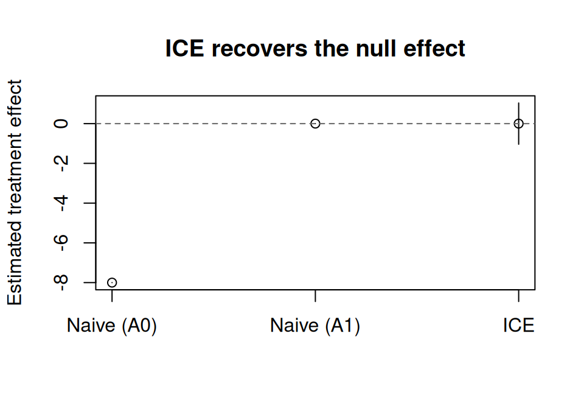
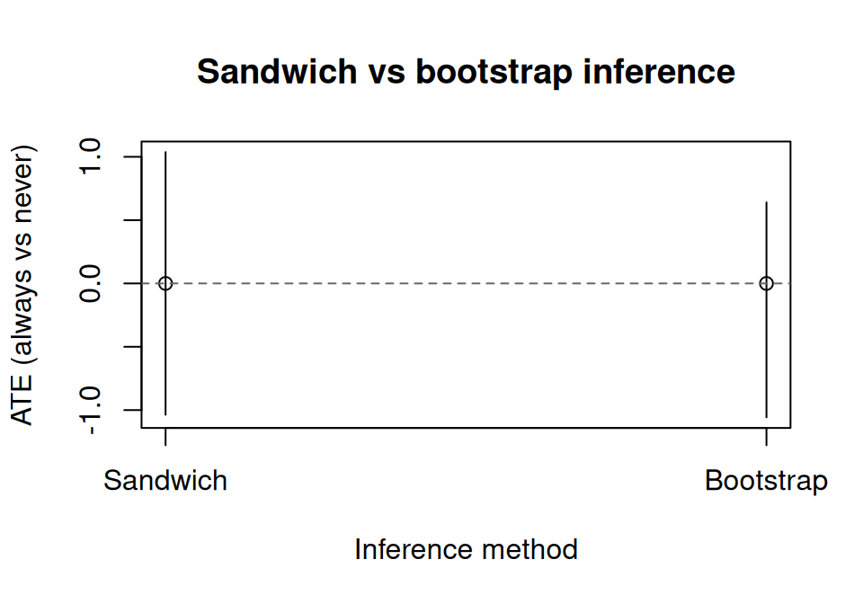
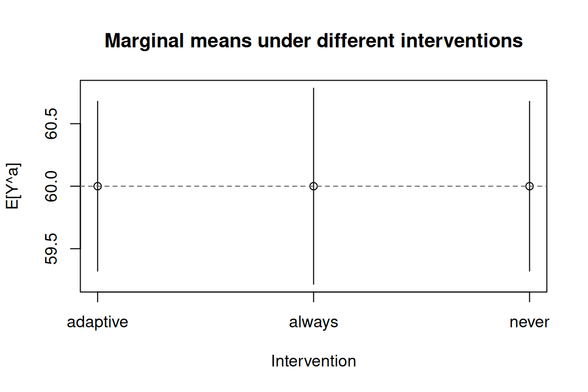
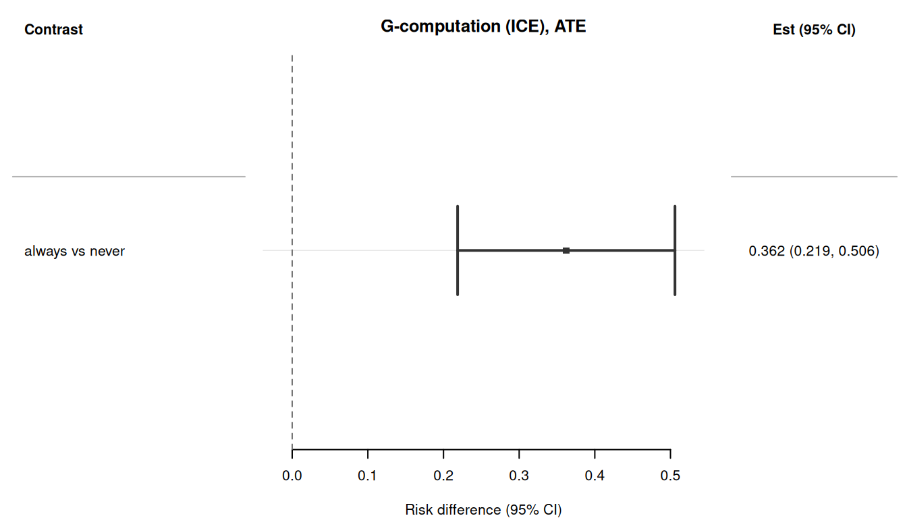
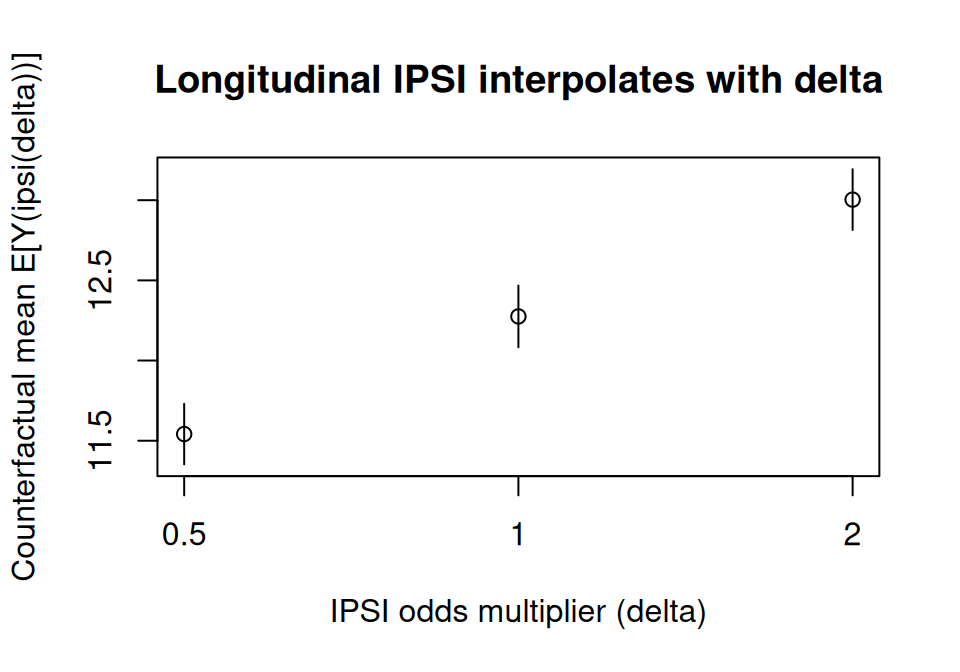

> **来源**：R 包 [causatr](https://github.com/etverse/causatr) 官方文档 [`longitudinal.qmd`](https://etverse.github.io/causatr/vignettes/longitudinal.html)，MIT 许可。
> 本页是中译，**代码与运行结果直接取自原站的渲染输出，未在本站重新执行**。
> Copyright (c) 2026 causatr authors；许可证全文见原仓库 `LICENSE.md`。

当处理和混杂因子随时间变化时，即使调整了所有混杂因子，标准回归方法给出的估计值仍然有
偏倚。G-方法可以解决这个问题。causatr 实现了 ICE（迭代条件期望）G-computation
[@zivich2024ice]，它只需要为结局建模——不需要为时变混杂因子建模。

::: {.callout-tip}
## 双稳健纵向估计

如需双稳健保护，请使用 `estimator = "aipw"`。ICE-AIPW
[@bang2005doubly] 在每一步向后回归中加入倾向评分加权的残差校正：只要*或者*结局回归
设定正确，*或者*每个时间点上的倾向评分模型设定正确，就能得到相合的估计量。
同样适用 `causat()` + `contrast()` 这套 API；三明治方差和 bootstrap 方差都支持。

`"sandwich"` 方差是完整的堆叠估计方程 M-估计三明治方差（各期倾向评分 + 各步结局
得分函数 + 边际均值方程），因此在**平衡与非平衡**面板上都是正确的——包括单调失访
或删失行过滤的情形。它涵盖 GLM 族与 `MASS::glm.nb` 结局/倾向评分模型，以及
多项（分类处理）倾向评分。**局限：**当结局或倾向评分冗余参数用*惩罚*类/非似然
学习器（`mgcv::gam`、`betareg::betareg`）拟合时，解析三明治方差不可用——
`ci_method = "sandwich"` 会抛出明确的报错，此时应改用 `ci_method = "bootstrap"`，
它对任何配置都有效。
:::

本 vignette 演示 causatr 中的 ICE G-computation，内容包括：

- 处理-混杂因子反馈问题
- ICE 的拟合与对比
- 三明治推断与 bootstrap 推断
- 静态、动态与修正处理策略干预
- `history` 参数（马尔可夫阶数）
- 二值结局
- 与朴素回归的比较

## 设置

```r
library(causatr)
library(tinytable)
library(tinyplot)
```

## 问题所在：处理-混杂因子反馈

当 $A_0$ 影响时变混杂因子 $L_1$，而 $L_1$ 又反过来同时影响
$A_1$ 和 $Y$（$A_0 \to L_1 \to A_1$ 且 $L_1 \to Y$）时，普通
回归无法还原边际反事实均值
$\mathbb{E}[Y^{a_0, a_1}]$：

- **调整** $L_1$ 会阻断 $A_0$ 到 $Y$ 的部分因果路径
  （并且视 DAG 而定，还可能经由 $L_1$ 与 $Y$ 的未测量
  共同原因打开一条对撞路径）。
- **不调整**则会留下 $L_1$ 对 $A_1 \to Y$ 这条箭头的混杂。
- **ICE G-computation** 通过迭代条件期望、并对每种干预所诱导的
  $L_1$ 分布做边际化，同时正确处理了上述两种情形。

## 表 20.1：零假设悖论

我们重建 @hernan_whatif 表 20.1 的数据集，缩放为在 2 个时间点上观测的
3,200 名个体。（原表有 32,000 人；这里只用 1/10 以加快 vignette 渲染。）
该 DGP 有一个非常特殊的性质：**每一种联合方案 $(a_0, a_1)$ 的边际
反事实均值都相同，$\mathbb{E}[Y^{a_0, a_1}] = 60$**，因此任意两种方案
之间的真实因果对比恰好为零——即“零假设为真”。
关键在于，零值只在边际层面成立：在 $L_1$ 的各层内，
$A_0$ 的*条件*效应是 $-8$。处理-混杂因子反馈正是让非零条件效应
在边际上平均为零的那个机制。

**DGM。**两个时期（$k = 0, 1$），二值处理 $A_k \in \{0, 1\}$，
二值时变混杂因子 $L_1 \in \{0, 1\}$（受 $A_0$ 影响），以及在 $k = 1$
测量的连续结局 $Y$。因果结构为
$A_0 \to L_1 \to A_1$、$A_0 \to L_1 \to Y$ 和 $A_0 \to Y$（直接）。
该表的构造使得给定 $L_1$ 时 $A_0$ 的条件效应为 $-8$，
但由于 $A_0$ 以恰好相互抵消的方式移动了 $L_1$ 的分布，
这个条件效应在边际上平均恰好为零。
该表所隐含的结构方程为：

$$
\begin{aligned}
A_0 &\sim \text{Bernoulli}(p_{A_0}), \\
L_1 \mid A_0 &\sim \text{Bernoulli}\bigl(P(L_1 = 1 \mid A_0)\bigr), \\
A_1 \mid L_1 &\sim \text{Bernoulli}\bigl(P(A_1 = 1 \mid L_1)\bigr), \\
Y &= 84 - 8 \cdot A_0 - 32 \cdot L_1.
\end{aligned}
$$

给定 $(A_0, L_1)$ 后结局是确定性的，且不直接依赖 $A_1$。
关键性质是：$P(L_1 = 1 \mid A_0 = 1) > P(L_1 = 1 \mid A_0 = 0)$，
即 $A_0$ 会提高 $L_1$，而 $L_1$ 对 $Y$ 有很强的负向效应，
于是经由 $L_1$ 的间接危害恰好抵消了直接获益。
四种联合方案的已知真值都是 $\mathbb{E}[Y^{a_0, a_1}] = 60$，
因此任意两种方案之间的 ATE 恰好为 0。

```r
groups <- data.frame(
  A0 = c(0, 0, 0, 0, 1, 1, 1, 1),
  L1 = c(0, 0, 1, 1, 0, 0, 1, 1),
  A1 = c(0, 1, 0, 1, 0, 1, 0, 1),
  Y  = c(84, 84, 52, 52, 76, 76, 44, 44),
  N  = c(240, 160, 240, 960, 480, 320, 160, 640)
)
rows <- lapply(seq_len(nrow(groups)), function(i) {
  g <- groups[i, ]
  off <- sum(groups$N[seq_len(i - 1)])
  data.frame(
    id = seq_len(g$N) + off,
    A0 = g$A0, L1 = g$L1, A1 = g$A1, Y = g$Y
  )
})
wide <- do.call(rbind, rows)

t0 <- data.frame(
  id = wide$id, time = 0L, A = wide$A0, L = NA_real_, Y = NA_real_
)
t1 <- data.frame(
  id = wide$id, time = 1L, A = wide$A1, L = wide$L1, Y = wide$Y
)
long <- rbind(t0, t1)
head(long, 4)
#>   id time A  L  Y
#> 1  1    0 0 NA NA
#> 2  2    0 0 NA NA
#> 3  3    0 0 NA NA
#> 4  4    0 0 NA NA
```

数据采用**个体-时期（长）格式**：每个个体在每个时间点占一行。
`L` 是时变混杂因子（仅在时间 1 测量）。

## 朴素方法产生的偏倚演示

@hernan_whatif 第 20 章用这张表提出了一个尖锐的论点：两种常规回归策略
*都没有*还原出零效应。真值是 $\mathbb{E}[Y^{1,1}] - \mathbb{E}[Y^{0,0}] = 0$，
而且四种联合处理方案的边际反事实均值其实都是 $60$。

**策略 1 —— 不调整。** 丢掉 $L_1$，指望每个时间点的随机化能处理掉混杂：

```r
wide_sub <- wide[!is.na(wide$Y), ]
naive_unadj <- lm(Y ~ A0 + A1, data = wide_sub)
round(coef(naive_unadj), 3)
#> (Intercept)          A0          A1 
#>      68.711      -1.244     -12.444
```

两个系数都偏离了零（$A_0 \approx -1.24$，$A_1 \approx -12.44$）。$A_1$ 的估计值
偏倚尤其严重：$L_1$ 对 $A_1 \to Y$ 造成混杂，不做调整时这种混杂会直接渗入系数。

**策略 2 —— 调整 $L_1$。** 流行病学的标准反射动作：

```r
naive_fit   <- lm(Y ~ A0 + A1 + L1, data = wide_sub)
naive_coefs <- coef(naive_fit)
round(naive_coefs, 3)
#> (Intercept)          A0          A1          L1 
#>          84          -8           0         -32
```

现在 $A_1 = 0$（这是对的，因为在这个 DGP 里 $Y$ 是 $A_0$ 与 $L_1$ 的确定性函数），
但 $A_0 = -8$ —— 这是 $L_1$ 各层内 $A_0$ 的*条件*效应，**不是**我们想要的因果对比。
调整 $L_1$ 阻断了 $A_0 \to L_1 \to Y$ 这条路径，只留下直接效应的残余，于是 $A_0$
看上去像是保护性效应，而实际上边际因果效应为零。

**要点。** 一种朴素策略让 $A_1$ 产生偏倚，另一种让 $A_0$ 产生偏倚。在这张表上，
没有任何一种回归设定能同时给出 $A_0 = 0$ 和 $A_1 = 0$。这就是催生 g-methods 的
*零效应悖论*：要还原零效应，唯一的办法是对 $L_1$ 在特定干预下的分布做边际化，
而这正是下面 ICE G-computation 所做的事。

## ICE G-computation：拟合

用 `causat()` 时，指定 `id` 和 `time` 即可触发纵向模式。基线混杂因子放进
`confounders`，时变混杂因子放进 `confounders_tv`。需要更精细的控制时，可以用
`confounders_tv_outcome` 和 `confounders_tv_treatment` 为结局模型和处理模型分别
指定不同的时变协变量。

```r
fit <- causat(
  long,
  outcome = "Y",
  treatment = "A",
  confounders = ~ 1,
  confounders_tv = ~ L,
  id = "id",
  time = "time",
  model_fn = stats::glm
)
fit
#> <causatr_fit>
#>  Estimator:  G-computation
#>  Type:       longitudinal
#>  Outcome:    Y (gaussian)
#>  Treatment:  A
#>  Estimand:   ATE
#>  Confounders: ~1 
#>  TV conf.:   ~L 
#>  ID:         id
#>  Time:       time
#>  N:          6400
```

这一阶段不拟合任何模型。ICE 把模型拟合推迟到 `contrast()`，因为序贯结局模型取决于
所评估的干预。

## ICE G-computation：带三明治 SE 的对比

比较“始终处理”（每个时间点 A = 1）与“从不处理”（每个时间点 A = 0）：

```r
result <- contrast(
  fit,
  interventions = list(always = static(1), never = static(0)),
  reference = "never",
  type = "difference",
  ci_method = "sandwich"
)
result
```

| intervention | estimate | se | ci_lower | ci_upper |
|---|---|---|---|---|
| always | 60 | 0.4 | 59.216 | 60.784 |
| never | 60 | 0.346 | 59.321 | 60.679 |

| comparison | estimate | se | ci_lower | ci_upper |
|---|---|---|---|---|
| always vs never | -0.00000000000009947598 | 0.529 | -1.037 | 1.037 |

ICE 正确还原出 **E[Y^{always}] = E[Y^{never}] = 60** 和 **ATE = 0**，与数据生成
过程的预期一致。

### 结果可视化

```r
naive_ci <- confint(naive_fit)
est_df <- data.frame(
  method = c("Naive (A0)", "Naive (A1)", "ICE"),
  estimate = c(
    naive_coefs["A0"], naive_coefs["A1"], result$contrasts$estimate[1]
  ),
  ci_lower = c(
    naive_ci["A0", 1], naive_ci["A1", 1], result$contrasts$ci_lower[1]
  ),
  ci_upper = c(
    naive_ci["A0", 2], naive_ci["A1", 2], result$contrasts$ci_upper[1]
  )
)
tinyplot(
  estimate ~ method,
  data = est_df,
  type = "pointrange",
  ymin = est_df$ci_lower,
  ymax = est_df$ci_upper,
  ylab = "Estimated treatment effect",
  xlab = "",
  main = "ICE recovers the null effect"
)
abline(h = 0, lty = 2, col = "grey40")
```



## 三明治 SE：堆叠估计方程

默认的 `ci_method = "sandwich"` 使用面向堆叠估计方程的经验三明治估计量
[@zivich2024ice]。它考虑了全部 K 个序贯结局模型带来的不确定性，而不只是最后
一个模型。

```r
result$estimates[, c("intervention", "estimate", "se")]
#>    intervention estimate        se
#>          <char>    <num>     <num>
#> 1:       always       60 0.4000000
#> 2:        never       60 0.3464102
```

标准误有限且为正，说明即便在大样本下，三明治方差估计量也在正常工作。

## Bootstrap SE

出于稳健性考虑，或在使用灵活模型（例如 GAM）时，bootstrap 会对个体重抽样
（同一个体的所有时间点一起抽取），并重新运行完整的 ICE 流程。

```r
result_boot <- contrast(
  fit,
  interventions = list(always = static(1), never = static(0)),
  reference = "never",
  type = "difference",
  ci_method = "bootstrap",
  n_boot = 20L
)
result_boot
```

| intervention | estimate | se | ci_lower | ci_upper |
|---|---|---|---|---|
| always | 60 | 0.316 | 59.44 | 60.465 |
| never | 60 | 0.371 | 59.482 | 60.679 |

| comparison | estimate | se | ci_lower | ci_upper |
|---|---|---|---|---|
| always vs never | -0.00000000000009947598 | 0.489 | -1.058 | 0.64 |

`parallel` 与 `ncpus` 参数可为较大的数据集启用并行的 bootstrap 重复。支持四种
后端：`"no"`（串行）、`"multicore"`（Unix fork，多数 Linux/macOS 环境下的默认
值）、`"snow"`（跨平台 socket 集群，这两种都通过 `boot::boot()` 实现），以及
`"future"`（任意已激活的 `future::plan()`——本地 multisession、远程
`plan(cluster, ...)`，或用于 HPC 作业数组的 `future.batchtools`）。`"future"`
绕过 `boot::boot()`，因此调度由 plan 本身负责；此时 `ncpus` 会被忽略。

```r
# boot::boot parallel (fork / socket)
result_par <- contrast(
  fit,
  interventions = list(always = static(1), never = static(0)),
  reference = "never",
  ci_method = "bootstrap",
  n_boot = 20L,
  parallel = "multicore",
  ncpus = 4L
)

# future backend (any future::plan())
library(future)
plan(multisession, workers = 4)
result_future <- contrast(
  fit,
  interventions = list(always = static(1), never = static(0)),
  reference = "never",
  ci_method = "bootstrap",
  n_boot = 500L,
  parallel = "future"
)
```

### 三明治 SE 与 bootstrap SE 的比较

```r
se_df <- data.frame(
  method = c("Sandwich", "Bootstrap"),
  estimate = c(result$contrasts$estimate[1], result_boot$contrasts$estimate[1]),
  ci_lower = c(result$contrasts$ci_lower[1], result_boot$contrasts$ci_lower[1]),
  ci_upper = c(result$contrasts$ci_upper[1], result_boot$contrasts$ci_upper[1])
)
tinyplot(
  estimate ~ method,
  data = se_df,
  type = "pointrange",
  ymin = se_df$ci_lower,
  ymax = se_df$ci_upper,
  ylab = "ATE (always vs never)",
  xlab = "Inference method",
  main = "Sandwich vs bootstrap inference"
)
abline(h = 0, lty = 2, col = "grey40")
```



## 动态干预

ICE 支持动态处理方案，即处理取决于时变协变量。这里，个体仅在 L = 1（存在该混
杂因子）时才接受处理：

```r
result_dyn <- contrast(
  fit,
  interventions = list(
    adaptive = dynamic(
      \(data, trt) ifelse(!is.na(data$L) & data$L > 0, 1L, 0L)
    ),
    always   = static(1),
    never    = static(0)
  ),
  reference = "never",
  ci_method = "sandwich"
)
result_dyn
```

| intervention | estimate | se | ci_lower | ci_upper |
|---|---|---|---|---|
| adaptive | 60 | 0.346 | 59.321 | 60.679 |
| always | 60 | 0.4 | 59.216 | 60.784 |
| never | 60 | 0.346 | 59.321 | 60.679 |

| comparison | estimate | se | ci_lower | ci_upper |
|---|---|---|---|---|
| adaptive vs never | -0.00000000000006394885 | 0 | -0 | 0 |
| always vs never | -0.00000000000009947598 | 0.529 | -1.037 | 1.037 |

### 比较多种干预

```r
est <- result_dyn$estimates
tinyplot(
  estimate ~ intervention,
  data = est,
  type = "pointrange",
  ymin = est$ci_lower,
  ymax = est$ci_upper,
  ylab = "E[Y^a]",
  xlab = "Intervention",
  main = "Marginal means under different interventions"
)
abline(h = 60, lty = 2, col = "grey40")
```



三种干预都应返回接近 60 的边际均值（在这个零效应 DGP 中，任何联合方案的结构性
真值都是 60）。

## `history` 参数

`history` 参数控制马尔可夫阶数 --- 即每个结局模型纳入多少阶处理和时变混杂因子的滞后项。

- `history = 1`（默认）：纳入 A 和 L 的一阶滞后（一阶马尔可夫）。
- `history = 2`：纳入两阶滞后（A_{k-1}, A_{k-2}, L_{k-1}, L_{k-2}）。
- `history = Inf`：纳入截至每个时间点的完整处理和混杂因子历史。

对这个 2 个时间点的例子，`history = 1` 和 `history = Inf` 是等价的。随访更长时，更高阶的历史能捕捉更远距离的依赖关系，但每个模型需要更多数据。

```r
fit_inf <- causat(
  long,
  outcome = "Y",
  treatment = "A",
  confounders = ~ 1,
  confounders_tv = ~ L,
  id = "id",
  time = "time",
  history = Inf,
  model_fn = stats::glm
)

result_inf <- contrast(
  fit_inf,
  interventions = list(always = static(1), never = static(0)),
  reference = "never",
  ci_method = "sandwich"
)
result_inf
```

| intervention | estimate | se | ci_lower | ci_upper |
|---|---|---|---|---|
| always | 60 | 0.4 | 59.216 | 60.784 |
| never | 60 | 0.346 | 59.321 | 60.679 |

| comparison | estimate | se | ci_lower | ci_upper |
|---|---|---|---|---|
| always vs never | -0.00000000000009947598 | 0.529 | -1.037 | 1.037 |

## 模拟：非零效应下的 ICE

为展示 ICE 在已知非零效应下的表现，我们模拟一组带有处理-混杂因子反馈的数据。

**DGM.** 两个时期（$k = 0, 1$），含二值处理 $A_k \in \{0, 1\}$、二值时变混杂因子 $L_k \in \{0, 1\}$ 和连续结局 $Y$。每个时期的处理分配通过 logistic 模型依赖于当前的混杂因子；$k = 1$ 时的混杂因子受先前处理 $A_0$ 影响（处理-混杂因子反馈）。结构方程为：

$$
\begin{aligned}
L_0 &\sim \text{Bernoulli}(0.5), \\
A_0 \mid L_0 &\sim \text{Bernoulli}\bigl(\text{logit}^{-1}(-0.5 + 0.5 \, L_0)\bigr), \\
L_1 \mid A_0, L_0 &\sim \text{Bernoulli}\bigl(\text{logit}^{-1}(-0.5 + 0.8 \, A_0 + 0.3 \, L_0)\bigr), \\
A_1 \mid L_1 &\sim \text{Bernoulli}\bigl(\text{logit}^{-1}(-0.5 + 0.5 \, L_1)\bigr), \\
Y \mid A_0, A_1, L_1 &= 50 + 2.5 \, A_0 + 2.5 \, A_1 - 3 \, L_1 + \varepsilon, \quad \varepsilon \sim N(0, 25).
\end{aligned}
$$

“始终处理”相对“从不处理”的结构 ATE **不是**简单的 $2.5 + 2.5 = 5$，因为 $A_0$ 影响 $L_1$（系数 $0.8$），而 $L_1$ 以系数 $-3$ 进入结局。在“始终处理”下，$A_0 = 1$ 会提高 $\mathbb{E}[L_1]$，而 $L_1$ 对 $Y$ 有负向效应，因此这条间接路径部分抵消了直接获益：

$$
\text{ATE}
  = \underbrace{(2.5 + 2.5)}_{\text{direct}}
  - 3 \bigl(\mathbb{E}[L_1 \mid A_0\!=\!1] - \mathbb{E}[L_1 \mid A_0\!=\!0]\bigr)
  \approx 5 - 3 \times 0.196
  \approx 4.41.
$$

这正是使朴素回归产生偏倚的那种处理-混杂因子反馈。

```r
set.seed(42)
n <- 2000
sim_id <- rep(seq_len(n), each = 2)
sim_time <- rep(0:1, n)

L0 <- rbinom(n, 1, 0.5)
A0 <- rbinom(n, 1, plogis(-0.5 + 0.5 * L0))
L1 <- rbinom(n, 1, plogis(-0.5 + 0.8 * A0 + 0.3 * L0))
A1 <- rbinom(n, 1, plogis(-0.5 + 0.5 * L1))
Y <- 50 + 2.5 * A0 + 2.5 * A1 - 3 * L1 + rnorm(n, 0, 5)

sim_long <- data.frame(
  id = sim_id,
  time = sim_time,
  A = c(rbind(A0, A1)),
  L = c(rbind(L0, L1)),
  Y = c(rbind(NA_real_, Y))
)

fit_sim <- causat(
  sim_long,
  outcome = "Y",
  treatment = "A",
  confounders = ~ 1,
  confounders_tv = ~ L,
  id = "id",
  time = "time",
  model_fn = stats::glm
)

res_sim <- contrast(
  fit_sim,
  interventions = list(always = static(1), never = static(0)),
  reference = "never",
  ci_method = "sandwich"
)
res_sim
```

| intervention | estimate | se | ci_lower | ci_upper |
|---|---|---|---|---|
| always | 53.134 | 0.227 | 52.69 | 53.579 |
| never | 48.832 | 0.187 | 48.465 | 49.199 |

| comparison | estimate | se | ci_lower | ci_upper |
|---|---|---|---|---|
| always vs never | 4.303 | 0.336 | 3.644 | 4.961 |

估计出的 ATE 应当接近真值 $\approx 4.41$。

## 二值结局

ICE 同样能处理二值结局。第一个结局模型使用 `binomial`（实际的 0/1 响应），而后续的伪结局模型使用 `quasibinomial`（针对 [0, 1] 区间内预测概率的分数 logistic）。

**DGM.** 这里复用上面的非零效应模拟（相同的 SEM），把连续结局按 $Y > 50$ 二值化：

$$
\begin{aligned}
Y^* &= 50 + 2.5 \, A_0 + 2.5 \, A_1 - 3 \, L_1 + \varepsilon, \quad \varepsilon \sim N(0, 25), \\
Y &= \mathbf{1}(Y^* > 50).
\end{aligned}
$$

由此得到的二值结局在风险差尺度上没有简洁的闭式 ATE，但方向为正（“始终处理”相对“从不处理”提高了 $P(Y = 1)$），因为在潜在线性预测子中两个处理系数都为正。

```r
sim_long_bin <- sim_long
sim_long_bin$Y[!is.na(sim_long_bin$Y)] <-
  as.integer(sim_long_bin$Y[!is.na(sim_long_bin$Y)] > 50)

fit_bin <- causat(
  sim_long_bin,
  outcome = "Y",
  treatment = "A",
  confounders = ~ 1,
  confounders_tv = ~ L,
  family = "binomial",
  id = "id",
  time = "time",
  model_fn = stats::glm
)

res_bin <- contrast(
  fit_bin,
  interventions = list(always = static(1), never = static(0)),
  reference = "never",
  type = "difference",
  ci_method = "sandwich"
)
res_bin
```

| intervention | estimate | se | ci_lower | ci_upper |
|---|---|---|---|---|
| always | 0.728 | 0.018 | 0.693 | 0.764 |
| never | 0.415 | 0.018 | 0.381 | 0.449 |

| comparison | estimate | se | ci_lower | ci_upper |
|---|---|---|---|---|
| always vs never | 0.313 | 0.029 | 0.256 | 0.371 |

### 二值纵向结局的风险比

```r
res_rr <- contrast(
  fit_bin,
  interventions = list(always = static(1), never = static(0)),
  reference = "never",
  type = "ratio",
  ci_method = "sandwich"
)
res_rr
```

| intervention | estimate | se | ci_lower | ci_upper |
|---|---|---|---|---|
| always | 0.728 | 0.018 | 0.693 | 0.764 |
| never | 0.415 | 0.018 | 0.381 | 0.449 |

| comparison | estimate | se | ci_lower | ci_upper |
|---|---|---|---|---|
| always vs never | 1.754 | 0.098 | 1.572 | 1.958 |

## 三期及以上

上面的例子为简单起见只用了 2 个时间点，但 ICE 可以扩展到任意期数。这里我们模拟
4 期数据，含二值处理和二值结局。后向递归会拟合 4 个序贯模型。

**DGM.** 四期（$k = 1, \dots, 4$），含二值处理 $A_k$、
连续时变混杂因子 $L_k$、连续基线混杂因子 $L_0$，
以及在 $k = 4$ 测得的二值结局 $Y$。混杂因子随处理反馈演化：每一步
$L_k$ 由 $L_{k-1}$ 加噪声决定，观测到 $A_k$ 之后，下一期的混杂因子平移 $0.3 \, A_k$。
结构方程为：

$$
\begin{aligned}
L_0 &\sim N(0, 1), \\
L_k \mid L_{k-1}, A_{k-1} &= L_{k-1} + 0.3 \, A_{k-1} + \eta_k, \quad \eta_k \sim N(0, 0.25), \\
A_k \mid L_k &\sim \text{Bernoulli}\bigl(\text{logit}^{-1}(-0.3 + 0.4 \, L_k)\bigr), \\
Y \mid A_1, \dots, A_4, L_0 &\sim \text{Bernoulli}\bigl(\text{logit}^{-1}(-1.5 + 0.4 \, \textstyle\sum_{k=1}^{4} A_k + 0.3 \, L_0)\bigr).
\end{aligned}
$$

结局取决于累积处理暴露 $\sum_k A_k$ 和基线混杂因子 $L_0$。在“始终处理”
（$\sum A_k = 4$）下，对数优势相对“从不处理”（$\sum A_k = 0$）平移
$0.4 \times 4 = 1.6$，因此概率尺度上的风险差为正，但没有简单的闭式表达
（它取决于 $L_0$ 的边际分布）。

```r
set.seed(99)
n_id <- 600
K <- 4

ids <- rep(seq_len(n_id), each = K)
times <- rep(seq_len(K), n_id)

L0 <- rep(rnorm(n_id), each = K)
sim_4p <- data.frame(id = ids, time = times, L0 = L0)

sim_4p$L <- NA_real_
sim_4p$A <- NA_integer_
for (i in seq_len(n_id)) {
  rows <- which(sim_4p$id == i)
  l_prev <- sim_4p$L0[rows[1]]
  for (k in seq_along(rows)) {
    sim_4p$L[rows[k]] <- l_prev + rnorm(1, 0, 0.5)
    sim_4p$A[rows[k]] <- rbinom(1, 1, plogis(-0.3 + 0.4 * sim_4p$L[rows[k]]))
    l_prev <- sim_4p$L[rows[k]] + 0.3 * sim_4p$A[rows[k]]
  }
}

sim_4p$Y <- NA_real_
for (i in seq_len(n_id)) {
  rows <- which(sim_4p$id == i)
  cum_a <- sum(sim_4p$A[rows])
  sim_4p$Y[rows[K]] <- rbinom(
    1, 1,
    plogis(-1.5 + 0.4 * cum_a + 0.3 * sim_4p$L0[rows[1]])
  )
}

fit_4p <- causat(
  sim_4p,
  outcome = "Y",
  treatment = "A",
  confounders = ~ L0,
  confounders_tv = ~ L,
  family = "binomial",
  id = "id",
  time = "time",
  model_fn = stats::glm
)

res_4p <- contrast(
  fit_4p,
  interventions = list(always = static(1), never = static(0)),
  reference = "never",
  type = "difference",
  ci_method = "sandwich"
)
res_4p
```

| intervention | estimate | se | ci_lower | ci_upper |
|---|---|---|---|---|
| always | 0.528 | 0.052 | 0.426 | 0.63 |
| never | 0.166 | 0.029 | 0.109 | 0.222 |

| comparison | estimate | se | ci_lower | ci_upper |
|---|---|---|---|---|
| always vs never | 0.362 | 0.073 | 0.219 | 0.506 |

```r
plot(res_4p)
```



```r
tt(tidy(res_4p), digits = 3)
```

| term | estimate | std.error | type | conf.low | conf.high |
|---|---|---|---|---|---|
| always vs never | 0.362 | 0.0733 | contrast | 0.219 | 0.506 |

ICE 的三明治方差通过堆叠估计方程的级联，把不确定性正确地在全部 4 个
序贯模型之间传播。

## 连续处理与修正处理策略

ICE 也支持把连续时变处理与修正处理策略（MTP）干预结合起来：`shift()`、
`scale_by()` 和 `threshold()`。干预在每个后向步骤上作用于当前时刻的处理；
`ice_apply_intervention_long()` 明确**不会**用干预后的取值重新计算滞后列
（那样会把非静态干预重复计入 —— 结构性原因见 `CLAUDE.md`）。

**DGM.** 两期（$k = 0, 1$），含连续处理 $A_k \in \mathbb{R}$、
连续混杂因子 $L_k$ 和连续结局 $Y$。存在处理与混杂因子之间的反馈：$A_0$ 影响 $L_1$
（系数 $0.5$），$L_1$ 又影响 $A_1$（系数 $0.5$）。结构方程为：

$$
\begin{aligned}
L_0 &\sim N(0, 1), \\
A_0 &= 1 + 0.4 \, L_0 + \eta_0, \quad \eta_0 \sim N(0, 1), \\
L_1 &= 0.3 \, L_0 + 0.5 \, A_0 + \eta_1, \quad \eta_1 \sim N(0, 1), \\
A_1 &= 1 + 0.5 \, L_1 + \eta_2, \quad \eta_2 \sim N(0, 1), \\
Y &= 2 + 1.5 \, A_0 + 2 \, A_1 + 0.5 \, L_0 - 0.3 \, L_1 + \varepsilon, \quad \varepsilon \sim N(0, 1).
\end{aligned}
$$

对于 `shift(-1)` 这个 MTP（每一期把各 $A_k$ 减少 1），相对自然进程而言，
它对 $Y$ 的结构因果效应同时包含直接路径和间接路径。把 $A_0$ 平移 $-1$，
也会把 $L_1$ 平移 $-0.5$（$L_1$ 方程中的系数为 $0.5$），这又把 $A_1$ 的自然取值
平移 $-0.25$（$A_1$ 方程中的系数为 $0.5$）。平移后的 $A_1$ 再被 MTP 额外
减少 $-1$。对 $Y$ 的总效应为：

$$
1.5 \times (-1) + 2 \times (-1.25) + (-0.3) \times (-0.5) = -1.5 - 2.5 + 0.15 = -3.85.
$$

```r
set.seed(101)
n <- 800
sim_id <- rep(seq_len(n), each = 2)
sim_time <- rep(0:1, n)

L0 <- rnorm(n)
A0 <- 1 + 0.4 * L0 + rnorm(n)
L1 <- 0.3 * L0 + 0.5 * A0 + rnorm(n)
A1 <- 1 + 0.5 * L1 + rnorm(n)
Y <- 2 + 1.5 * A0 + 2 * A1 + 0.5 * L0 - 0.3 * L1 + rnorm(n)

cont_long <- data.frame(
  id = sim_id,
  time = sim_time,
  A = c(rbind(A0, A1)),
  L = c(rbind(L0, L1)),
  Y = c(rbind(NA_real_, Y))
)

fit_cont <- causat(
  cont_long,
  outcome = "Y",
  treatment = "A",
  confounders = ~ 1,
  confounders_tv = ~ L,
  id = "id",
  time = "time",
  model_fn = stats::glm
)

res_mtp <- contrast(
  fit_cont,
  interventions = list(
    observed = NULL,
    shift_m1 = shift(-1),
    halved   = scale_by(0.5),
    capped   = threshold(0, 1)
  ),
  reference = "observed",
  type = "difference",
  ci_method = "sandwich"
)
res_mtp
```

| intervention | estimate | se | ci_lower | ci_upper |
|---|---|---|---|---|
| observed | 5.904 | 0.117 | 5.675 | 6.134 |
| shift_m1 | 2.061 | 0.147 | 1.773 | 2.349 |
| halved | 3.799 | 0.075 | 3.652 | 3.946 |
| capped | 4.326 | 0.059 | 4.21 | 4.443 |

| comparison | estimate | se | ci_lower | ci_upper |
|---|---|---|---|---|
| shift_m1 vs observed | -3.844 | 0.086 | -4.013 | -3.674 |
| halved vs observed | -2.105 | 0.066 | -2.235 | -1.976 |
| capped vs observed | -1.578 | 0.084 | -1.743 | -1.414 |

`shift(-1)` 的结构真值是 $-3.85$（推导见上）。`shift_m1` 的估计值应接近这个数值。

## 灵活的处理项（`treatment_form`）

默认情况下，处理以**裸数值**主效应的形式进入每一步的结局模型。对二值处理
而言这已经是饱和的，但对**有序 / 序数剂量**，单一的线性斜率可能会把*非单调*
或*带折点*的反事实剂量-反应误设。`treatment_form` 允许剂量通过一个变换项
——`~ factor(A)` 或 `~ splines::ns(A, df)`——进入每一步的模型，而干预仍然设定
*数值*剂量列。滞后项会自动展开（`factor(A)` → `factor(lag1_A)`）。

**DGM.** 两个时期，一个 3 水平剂量 $A_k \in \{0, 1, 2\}$ 受一个外生协变量
混杂，并刻意设置了**非单调**的水平效应
$f(0) = 0,\ f(1) = 3,\ f(2) = 1$，其中 $Y = 1 + f(A_0) + f(A_1) + 0.5\,L_0 +
\varepsilon$。由于该协变量不依赖于过去的处理，对比
$E[Y^{\text{static}(1)}] - E[Y^{\text{static}(0)}] = 2\,(f(1) - f(0)) =
6$ 恰好成立。

```r
set.seed(1)
n <- 4000
f_lvl <- c(0, 3, 1) # f(0), f(1), f(2): non-monotone
L0 <- rnorm(n)
mk_period <- function() {
  Lt <- 0.5 * L0 + rnorm(n)
  At <- pmin(2L, rpois(n, exp(-0.3 + 0.5 * Lt)))
  list(L = Lt, A = At)
}
p0 <- mk_period()
p1 <- mk_period()
Yv <- 1 + f_lvl[p0$A + 1] + f_lvl[p1$A + 1] + 0.5 * L0 + rnorm(n)

dose_long <- data.frame(
  id = rep(seq_len(n), each = 2),
  time = rep(0:1, n),
  A = c(rbind(p0$A, p1$A)),
  L = c(rbind(p0$L, p1$L)),
  Y = c(rbind(NA_real_, Yv))
)

fit_args <- list(
  data = dose_long, outcome = "Y", treatment = "A",
  confounders = ~1, confounders_tv = ~L,
  id = "id", time = "time", estimator = "gcomp", model_fn = stats::glm
)
fit_bare <- do.call(causat, fit_args)
fit_factor <- do.call(causat, c(fit_args, list(treatment_form = ~ factor(A))))

ivs <- list(a1 = static(1), a0 = static(0))
diff_of <- function(fit) {
  r <- contrast(fit, interventions = ivs, type = "difference")
  with(r$estimates, estimate[intervention == "a1"] - estimate[intervention == "a0"])
}
dose_compare <- data.frame(
  model = c("bare numeric A", "factor(A)"),
  contrast = c(diff_of(fit_bare), diff_of(fit_factor)),
  truth = 6
)
tinytable::tt(dose_compare, digits = 3)
```

| model | contrast | truth |
|---|---|---|
| bare numeric A | 1.83 | 6 |
| factor(A) | 6 | 6 |

裸数值模型只在非单调的反应上拟合一条斜率，与真值 6 相去甚远；`~ factor(A)`
给每个剂量水平各自的系数，把真值恢复到抽样误差以内。这个灵活项**只适用于
纵向 G-computation**，同时也支撑自然史剂量策略（见 *Natural-history MTPs*
vignette）。在 `factor(A)` 下，干预必须停留在观测到的剂量水平之内；
`splines::ns(A, df)` 则可以平滑外推。

## 纵向 IPW（序贯密度比权重）

ICE G-computation 对每个时期的**结局**建模并向后迭代。IPW 的对应做法是对
每个时期的**处理密度**建模，累积出每个 id 的密度比权重，然后拟合一个加权的
末期 MSM。两者针对的是同一个反事实均值 $E[Y^d]$；二者是否一致，正是 causatr
所围绕构建的方法学三角验证检验。

其数学结构与我们用于多元 IPW（Phase 8）的链式法则相同，只是索引换成了
**时间**而非处理分量。对于在每个时期 $k = 0, 1, \ldots, K$ 都施加的
干预 $d$：

$$
W_i = \prod_{k=0}^{K} \frac{f_k\bigl(d(A_{k,i}, L_{k,i}) \mid \bar A_{k-1,i}^{\mathrm{obs}}, \bar L_{k,i}\bigr) \cdot \lvert \mathrm{Jac}\,d^{-1} \rvert}{f_k\bigl(A_{k,i} \mid \bar A_{k-1,i}^{\mathrm{obs}}, \bar L_{k,i}\bigr)}.
$$

分子和分母都以**观测到的**上游处理为条件——这正是 @robins2000msmepi 与
@diaz2023lmtp 的序贯 MTP 语义。该 MSM 是在末期各行上的仅含截距的 Hájek
模型，用每个 id 的累积乘积加权；其（唯一的）系数就是 $E[Y^d]$。

```r
fit_ipw_long <- causat(
  cont_long,
  outcome     = "Y",
  treatment   = "A",
  confounders = ~ 1,
  confounders_tv = ~ L,
  id          = "id",
  time        = "time",
  estimator   = "ipw",
  model_fn = stats::glm,
  propensity_model_fn = stats::glm
)

res_ipw_long <- contrast(
  fit_ipw_long,
  interventions = list(observed = NULL, shift_m1 = shift(-1)),
  reference     = "observed",
  type          = "difference",
  ci_method     = "sandwich"
)
res_ipw_long
```

| intervention | estimate | se | ci_lower | ci_upper |
|---|---|---|---|---|
| observed | 5.904 | 0.117 | 5.675 | 6.134 |
| shift_m1 | 2.341 | 0.254 | 1.842 | 2.839 |

| comparison | estimate | se | ci_lower | ci_upper |
|---|---|---|---|---|
| shift_m1 vs observed | -3.564 | 0.234 | -4.022 | -3.105 |

ICE G-computation 与纵向 IPW 估计的是同一个目标参数，因此在正确设定的
线性高斯 DGP 上，二者的点估计值应当在 Monte Carlo 误差范围内一致。三明治
SE 则有所不同——当结局模型正确时，IPW 的方差通常比 G-computation 更重，
所以 IPW 的 SE 通常更大。

```r
res_mtp$contrasts
#>              comparison  estimate         se  ci_lower  ci_upper
#>                  <char>     <num>      <num>     <num>     <num>
#> 1: shift_m1 vs observed -3.843574 0.08631052 -4.012739 -3.674408
#> 2:   halved vs observed -2.105375 0.06595945 -2.234654 -1.976097
#> 3:   capped vs observed -1.578207 0.08385391 -1.742558 -1.413857
res_ipw_long$contrasts
#>              comparison  estimate        se  ci_lower  ci_upper
#>                  <char>     <num>     <num>     <num>     <num>
#> 1: shift_m1 vs observed -3.563666 0.2337656 -4.021838 -3.105494
```

**支持的干预。** `static()` / `shift()` / `scale_by()` /
`dynamic()` 按时期分派，走的是与点 IPW 相同的、感知分布族的
门控（`check_intervention_family_compat()`）。自然进程
（`NULL`）会把每个时期的权重都压成 1，恢复观测到的边际均值。`ipsi()` 通过
按时期的 Kennedy 乘积支持单变量二值处理（见下）。

**Bootstrap。** `ci_method = "bootstrap"` 重抽样的是**个体**
（被抽中的 id 的每一行人-时期记录都一并被带上）。对被多次抽中的
id 进行克隆，与 ICE 的 bootstrap 约定保持一致，从而保留了个体
内部的相关性。

```r
res_ipw_boot <- contrast(
  fit_ipw_long,
  interventions = list(observed = NULL, shift_m1 = shift(-1)),
  reference     = "observed",
  type          = "difference",
  ci_method     = "bootstrap",
  n_boot        = 100
)
res_ipw_boot$contrasts
```

**序贯正值性警告。** 当任何一个时期的权重出现重尾（默认为
最大值 > 100）时，引擎会发出
`causatr_longitudinal_seq_positivity` 警告，指明有问题的
时期及其该时期的最大权重。累积乘积会丢失时期归属信息，
因此这个按时期的诊断是识别哪一个时间步构成瓶颈的主要手段。

### 稳定化权重

`stabilize = "marginal"` 把每个时期的分子密度换成一个**边际**模型
$g_k(A_k \mid \bar A_{k-1}, V)$，它丢掉时变混杂因子
$L_k$（并可通过 `numerator = ~ V` 额外加入用户指定的
基线条件集 $V$）。分母仍保持完整 $L$ 的密度。每个时期的权重变为
$g_k(d(A_k) \mid \bar A_{k-1}, V) \cdot \lvert \mathrm{Jac} \rvert /
f_k(A_k \mid \bar A_{k-1}, \bar L_k)$，这会削弱
$K$ 个因子上乘性的 $L$ 依赖，通常能降低累积乘积的方差。

```r
fit_ipw_long_stab <- causat(
  cont_long,
  outcome     = "Y",
  treatment   = "A",
  confounders = ~ 1,
  confounders_tv = ~ L,
  id          = "id",
  time        = "time",
  estimator   = "ipw",
  stabilize   = "marginal",
  model_fn = stats::glm,
  propensity_model_fn = stats::glm
)

contrast(
  fit_ipw_long_stab,
  interventions = list(observed = NULL, shift_m1 = shift(-1)),
  reference     = "observed",
  type          = "difference",
  ci_method     = "sandwich"
)
```

| intervention | estimate | se | ci_lower | ci_upper |
|---|---|---|---|---|
| observed | 5.904 | 0.08 | 5.747 | 6.061 |
| shift_m1 | 2.805 | 0.175 | 2.462 | 3.147 |

| comparison | estimate | se | ci_lower | ci_upper |
|---|---|---|---|---|
| shift_m1 vs observed | -3.1 | 0.173 | -3.439 | -2.76 |

默认情况下，每个时期的分子会丢掉全部混杂因子，
只以先前的处理滞后项为条件。自定义的 `numerator =`
公式会在滞后项之上再加入仅含基线的协变量；当结构上的处理生成机制
依赖基线特征时，这通常给出最稳定的对比估计值。

三明治方差把分子的参数当作固定（与多元 IPW 的 Phase 8e
采用相同的冗余参数固定约定）；bootstrap
则在每个重抽样副本上同时重新拟合分子和分母，捕捉完整的不确定性。

### 效应修饰（基线修饰因子）

当 `confounders =` 中包含 `A:modifier` 交互项时，
每个时期的倾向评分公式会自动剥掉涉及处理的交互项（修饰因子的主效应保留），
并且末期 MSM 会从 `Y ~ 1` 扩展为 `Y ~ 1 + modifier`，
这样 `predict()` 返回的就是分层的反事实均值。

```r
fit_em <- causat(
  long_data,
  outcome     = "Y",
  treatment   = "A",
  confounders = ~ baseline + sex + A:sex,
  confounders_tv = ~ L,
  id          = "id",
  time        = "time",
  estimator   = "ipw",
  model_fn = stats::glm,
  propensity_model_fn = stats::glm
)
contrast(
  fit_em,
  interventions = list(a = static(1), z = static(0)),
  reference     = "z",
  by            = "sex"
)
```

**已知局限 [@robins2000msmepi]。** 在纵向 IPW 下，
修饰因子必须是**基线**协变量。MSM 中的时变修饰因子
相当于以处理后变量为条件，会通过中介路径和对撞路径使估计目标产生偏倚。
causatr 不会在运行时强制要求基线性（时变与否无法从数据推断）；
该约束仅写在文档里。对于时变效应修饰，科学上
正确的工具是结构嵌套模型——用 `estimator = "snm"` 并配合 `id =` 和 `time =`
（见 `vignette("snm")`）。

基线效应修饰也可以与**多元**纵向处理组合使用：
每个时期 × 每个分量的倾向评分各自剥掉自己的 `A_k:modifier` 交互项
（把修饰因子保留为混杂因子主效应），而唯一的末期 MSM 仍然扩展为
`Y ~ 1 + modifier`。每个分量各指定一次交互项，例如
`confounders = ~ baseline + sex + A1:sex + A2:sex` 配合
`treatment = c("A1", "A2")`。

### 增量倾向评分干预（IPSI）

对于**二值**时变处理，`ipsi(delta)` 在每个时期把处理优势
按因子 $\delta$ 平移，而不是固定某个
反事实取值。Kennedy [-@kennedy2019ipsi] 的闭式权重可以推广为
逐时期的乘积：

$$
W_i = \prod_{t=1}^{T} \frac{\delta \, A_{t,i} + (1 - A_{t,i})}
                            {\delta \, p_{t,i} + (1 - p_{t,i})},
\qquad p_{t,i} = P(A_t = 1 \mid \bar A_{t-1}, \bar L_t).
$$

$\delta = 1$ 还原自然进程（每个因子都等于 1）；$\delta > 1$
把所有人推向接受处理，$\delta < 1$ 则推离处理。由于每个
分母都落在 $[\min(1, \delta), \max(1, \delta)]$ 内，每个时期的
权重按构造就是有界的——当正值性处于临界状态时，IPSI 是确定性
“总是处理”对比的一种稳定替代方案。

```r
set.seed(204)
n_ip <- 800
ip_id <- rep(seq_len(n_ip), each = 2)
ip_time <- rep(0:1, n_ip)
L0_ip <- rnorm(n_ip)
A0_ip <- rbinom(n_ip, 1, plogis(0.5 * L0_ip))
L1_ip <- 0.5 * L0_ip + 0.4 * A0_ip + rnorm(n_ip)
A1_ip <- rbinom(n_ip, 1, plogis(0.3 * L1_ip + 0.2 * A0_ip))
Y_ip <- 10 + 2 * (A0_ip + A1_ip) + L0_ip + L1_ip + rnorm(n_ip)
ipsi_long <- data.frame(
  id = ip_id,
  time = ip_time,
  A = as.vector(rbind(A0_ip, A1_ip)),
  L = as.vector(rbind(L0_ip, L1_ip)),
  L0 = rep(L0_ip, each = 2),
  Y = as.vector(rbind(rep(NA_real_, n_ip), Y_ip))
)

fit_ipsi_long <- causat(
  ipsi_long,
  outcome     = "Y",
  treatment   = "A",
  confounders = ~ L0,
  confounders_tv = ~ L,
  id          = "id",
  time        = "time",
  estimator   = "ipw"
)
#> Warning: `model_fn` not specified; defaulting to `stats::glm`.
#> ℹ Set `model_fn` explicitly (e.g. `model_fn = stats::glm` or `model_fn = mgcv::gam`).
#> Warning: `propensity_model_fn` not specified; defaulting to `stats::glm`.
#> ℹ Set `propensity_model_fn` explicitly if you need a different fitter (e.g. `mgcv::gam`).
#> Warning: Treatment model has aliased (collinear) coefficient(s): L0. Dropping from the sandwich variance computation.
#> Treatment model has aliased (collinear) coefficient(s): L0. Dropping from the sandwich variance computation.

res_ipsi <- contrast(
  fit_ipsi_long,
  interventions = list(
    down = ipsi(0.5),
    observed = ipsi(1),
    up = ipsi(2)
  ),
  ci_method = "sandwich"
)
tt(tidy(res_ipsi), digits = 3)
```

| term | estimate | std.error | type | conf.low | conf.high |
|---|---|---|---|---|---|
| observed vs down | 0.734 | 0.0248 | contrast | 0.685 | 0.782 |
| up vs down | 1.462 | 0.047 | contrast | 1.37 | 1.554 |

这三个均值单调地内插：降低处理优势
（$\delta = 0.5$）把反事实均值拉到自然进程
（$\delta = 1$）之下，提高处理优势（$\delta = 2$）则把它推高。

```r
ipsi_df <- res_ipsi$estimates
ipsi_df$delta <- c(0.5, 1, 2)[match(
  ipsi_df$intervention,
  c("down", "observed", "up")
)]
ipsi_df <- ipsi_df[order(ipsi_df$delta), ]
tinyplot(
  estimate ~ factor(delta),
  data = ipsi_df,
  type = "pointrange",
  ymin = ipsi_df$ci_lower,
  ymax = ipsi_df$ci_upper,
  ylab = "Counterfactual mean E[Y(ipsi(delta))]",
  xlab = "IPSI odds multiplier (delta)",
  main = "Longitudinal IPSI interpolates with delta"
)
```



`ipsi()` 在纵向 IPW 下**只支持单变量二值处理**。多变量 IPSI
（`treatment = c("A1", "A2")` 中带有 `ipsi()` 分量）以及 `ipsi()` 与
`stabilize = "marginal"` 组合使用，都会被带类别的错误拒绝
（`causatr_longitudinal_ipsi_multivariate`、
`causatr_longitudinal_ipsi_stabilize`）。纵向 AIPW 不支持 IPSI ——
请改用 `estimator = "ipw"`。

### 权重截断

当有 $T$ 个时间期时，逐期密度比的累积乘积 $\prod_{t=1}^{T} w_t$ 可能出现重尾。
`trim` 是 `contrast()` 的参数，它会在做累积乘积*之前*，把密度比在给定分位数处
做缩尾处理 [@cole2008constructing]。`trim = 0.999` 把每个逐期比值截断在其
99.9 百分位数 —— 这是
[`lmtp`](https://cran.r-project.org/package=lmtp) 的默认设置。

```r
res_ipw_trim <- contrast(
  fit_ipw_long,
  interventions = list(shift_m1 = shift(-1), observed = NULL),
  reference     = "observed",
  type          = "difference",
  ci_method     = "sandwich",
  trim          = 0.999
)
res_ipw_trim
```

| intervention | estimate | se | ci_lower | ci_upper |
|---|---|---|---|---|
| shift_m1 | 2.402 | 0.236 | 1.94 | 2.864 |
| observed | 5.904 | 0.117 | 5.675 | 6.134 |

| comparison | estimate | se | ci_lower | ci_upper |
|---|---|---|---|---|
| shift_m1 vs observed | -3.502 | 0.213 | -3.919 | -3.085 |

默认的 `trim = 1` 不做任何截断。在 `stabilize = "marginal"` 下，稳定化与截断
可以叠加：稳定化后的逐期比值先在该分位数阈值处截断，再做累积乘积。

## 多变量时变处理

当多个处理随时间变化时（例如两种药物联合给药），向 `treatment =` 传入一个字符
向量，并把每个干预写成具名的子列表。滞后列由 `prepare_data()` 按分量分别构建。

**DGM。** 两个时期（$k = 0, 1$），两个二值处理
$A_{1,k}, A_{2,k} \in \{0, 1\}$、一个连续混杂因子 $L_k$ 和一个连续结局 $Y$。
$k = 0$ 时的两个处理都会作用于混杂因子 $L_1$，由此形成处理—混杂反馈。结构方程
如下：

$$
\begin{aligned}
L_0 &\sim N(0, 1), \\
A_{1,0} \mid L_0 &\sim \text{Bernoulli}\bigl(\text{logit}^{-1}(0.3 \, L_0)\bigr), \\
A_{2,0} \mid L_0 &\sim \text{Bernoulli}\bigl(\text{logit}^{-1}(0.1 \, L_0)\bigr), \\
L_1 &= 0.3 \, L_0 + 0.4 \, A_{1,0} + 0.2 \, A_{2,0} + \eta, \quad \eta \sim N(0, 1), \\
A_{1,1} \mid L_1 &\sim \text{Bernoulli}\bigl(\text{logit}^{-1}(0.3 \, L_1)\bigr), \\
A_{2,1} \mid L_1 &\sim \text{Bernoulli}\bigl(\text{logit}^{-1}(0.1 \, L_1)\bigr), \\
Y &= 2 + 1.5 \, A_{1,0} + 1.5 \, A_{1,1} + 0.8 \, A_{2,0} + 0.8 \, A_{2,1} + 0.5 \, L_1 + \varepsilon, \quad \varepsilon \sim N(0, 1).
\end{aligned}
$$

结局对两个时期的两个处理都是线性的。「两个都施加」相对「两个都不施加」的结构 ATE
包含经由 $L_1$ 的间接路径：设定 $A_{1,0} = A_{2,0} = 1$ 会使 $\mathbb{E}[L_1]$
相对「两个都不施加」移动 $0.4 + 0.2 = 0.6$；而 $L_1$ 进入 $Y$ 的系数为 $0.5$，
因此额外贡献 $0.3$，加到直接效应之和 $2 \times (1.5 + 0.8) = 4.6$ 上：

$$
\text{ATE} = \underbrace{4.6}_{\text{direct}} + \underbrace{0.5 \times 0.6}_{\text{indirect via } L_1} = 4.9.
$$

```r
set.seed(202)
n <- 600
sim_id <- rep(seq_len(n), each = 2)
sim_time <- rep(0:1, n)
L0 <- rnorm(n)
A10 <- rbinom(n, 1, plogis(0.3 * L0))
A20 <- rbinom(n, 1, plogis(0.1 * L0))
L1 <- 0.3 * L0 + 0.4 * A10 + 0.2 * A20 + rnorm(n)
A11 <- rbinom(n, 1, plogis(0.3 * L1))
A21 <- rbinom(n, 1, plogis(0.1 * L1))
Y <- 2 + 1.5 * A10 + 1.5 * A11 + 0.8 * A20 + 0.8 * A21 + 0.5 * L1 + rnorm(n)

mv_long <- data.frame(
  id = sim_id,
  time = sim_time,
  A1 = c(rbind(A10, A11)),
  A2 = c(rbind(A20, A21)),
  L = c(rbind(L0, L1)),
  Y = c(rbind(NA_real_, Y))
)

fit_mv_long <- causat(
  mv_long,
  outcome = "Y",
  treatment = c("A1", "A2"),
  confounders = ~ 1,
  confounders_tv = ~ L,
  id = "id",
  time = "time",
  model_fn = stats::glm
)

res_mv_long <- contrast(
  fit_mv_long,
  interventions = list(
    both_on  = list(A1 = static(1), A2 = static(1)),
    both_off = list(A1 = static(0), A2 = static(0))
  ),
  reference = "both_off",
  type = "difference"
)
res_mv_long
```

| intervention | estimate | se | ci_lower | ci_upper |
|---|---|---|---|---|
| both_on | 6.914 | 0.095 | 6.728 | 7.1 |
| both_off | 1.967 | 0.098 | 1.774 | 2.16 |

| comparison | estimate | se | ci_lower | ci_upper |
|---|---|---|---|---|
| both_on vs both_off | 4.947 | 0.17 | 4.613 | 5.281 |

结构真值：`both_on − both_off = 4.9`（直接效应 $4.6$ 加上间接效应
$0.3$，后者经由 $L_1$）。

### 多元处理下的稳定化

`stabilize = "marginal"` 可以和多元纵向 IPW 组合使用。边际分子在**两个**维度上
分解：按时期分解，按分量分解。每个分量的分子丢掉时变混杂因子 $L$，但保留处理
的滞后项和同一时期内排在前面的分量 $A_{1,\dots,k-1}$，与分母的链式法则一一对应：

$$
g(\bar{A}_1, \bar{A}_2 \mid V)
  = \prod_t \prod_k g_{t,k}\bigl(A_{t,k} \mid A_{t,1:k-1}, \bar{A}_{t-1}, V\bigr).
$$

在二值处理的静态干预下，稳定化与未稳定化的估计值完全一致——示性函数把每个
条件变量都钉死在目标值上，于是分子与分母的密度在保留下来的行上相互抵消：

```r
fit_mv_long_stab <- causat(
  mv_long,
  outcome = "Y",
  treatment = c("A1", "A2"),
  confounders = ~ 1,
  confounders_tv = ~ L,
  id = "id",
  time = "time",
  model_fn = stats::glm,
  stabilize = "marginal"
)

res_mv_long_stab <- contrast(
  fit_mv_long_stab,
  interventions = list(
    both_on  = list(A1 = static(1), A2 = static(1)),
    both_off = list(A1 = static(0), A2 = static(0))
  ),
  reference = "both_off",
  type = "difference"
)
res_mv_long_stab
```

| intervention | estimate | se | ci_lower | ci_upper |
|---|---|---|---|---|
| both_on | 6.914 | 0.095 | 6.728 | 7.1 |
| both_off | 1.967 | 0.098 | 1.774 | 2.16 |

| comparison | estimate | se | ci_lower | ci_upper |
|---|---|---|---|---|
| both_on vs both_off | 4.947 | 0.17 | 4.613 | 5.281 |

### 双稳健的多元纵向 AIPW

要对联合的时变处理获得双稳健保护，改用 `estimator = "aipw"`。ICE-AIPW 递推
[@bang2005doubly] 用多元的逐时期密度比权重来增强序贯结局模型——也就是 IPW
路径所用的那条逐时期 $\times$ 逐分量的链。只要结局模型序列**或**逐时期的倾向
评分链两者之一设定正确，该估计量就是相合的。

```r
fit_mv_long_aipw <- causat(
  mv_long,
  outcome = "Y",
  treatment = c("A1", "A2"),
  confounders = ~ 1,
  confounders_tv = ~ L,
  id = "id",
  time = "time",
  estimator = "aipw",
  model_fn = stats::glm
)
#> Warning: `propensity_model_fn` not specified; defaulting to `stats::glm`.
#> ℹ Set `propensity_model_fn` explicitly if you need a different fitter (e.g. `mgcv::gam`).

res_mv_long_aipw <- contrast(
  fit_mv_long_aipw,
  interventions = list(
    both_on  = list(A1 = static(1), A2 = static(1)),
    both_off = list(A1 = static(0), A2 = static(0))
  ),
  reference = "both_off",
  type = "difference",
  ci_method = "sandwich"
)
tt(tidy(res_mv_long_aipw), digits = 3)
```

| term | estimate | std.error | type | conf.low | conf.high |
|---|---|---|---|---|---|
| both_on vs both_off | 4.86 | 0.204 | contrast | 4.46 | 5.26 |

点估计值复现了与上面 IPW 和 G-computation 拟合相同的结构性真值（`both_on −
both_off = 4.9`）——在静态对比下，多元 IPW、G-computation 和 AIPW 的估计目标
是重合的 [@diaz2023lmtp]。三明治 SE 来自一个 $T \times K$ 的分块对角堆叠估计
方程组（每个时期 $\times$ 分量一个倾向评分块，外加结局的级联部分）。

这条路径上有两种组合**不**受支持：

- 纵向 AIPW 会拒绝 `stabilize = "marginal"`（若要稳定化的纵向权重，请用
  `estimator = "ipw"`）。
- 纵向 AIPW 的迁移（`target =`）尚不可用。

## 外部权重（IPCW / 调查）

外部权重——调查权重或预先算好的 IPCW——会通过 `model_fn` 的 `weights =` 参数
传入每一个反向步骤的模型。ICE 三明治方差引擎借助 `A_{k-1,k}` 级联梯度来处理
异质权重（参见 `variance-theory.qmd` §5.4 以及 `R/variance_if.R:variance_if_ice_one`
中的行内注释）。

**DGM.** 两个时期（$k = 0, 1$），含二值处理 $A_k$、二值混杂因子 $L_k$、连续
结局 $Y$，以及从 $\text{Uniform}(0.5, 2.0)$ 独立抽取的无信息调查权重。结构方程
如下：

$$
\begin{aligned}
L_0 &\sim \text{Bernoulli}(0.5), \\
A_0 \mid L_0 &\sim \text{Bernoulli}\bigl(\text{logit}^{-1}(-0.2 + 0.6 \, L_0)\bigr), \\
L_1 \mid A_0, L_0 &\sim \text{Bernoulli}\bigl(\text{logit}^{-1}(-0.2 + 0.8 \, A_0 + 0.3 \, L_0)\bigr), \\
A_1 \mid L_1 &\sim \text{Bernoulli}\bigl(\text{logit}^{-1}(-0.2 + 0.6 \, L_1)\bigr), \\
Y &= 2 + 2.5 \, A_0 + 2.5 \, A_1 - 0.5 \, L_1 + \varepsilon, \quad \varepsilon \sim N(0, 1), \\
w_i &\sim \text{Uniform}(0.5, 2.0).
\end{aligned}
$$

由于权重是无信息的（与其他一切都独立），“始终处理”对“从不处理”的结构性 ATE
与无权重情形相同。直接效应之和为 $2.5 + 2.5 = 5$，但 $A_0$ 把 $\mathbb{E}[L_1]$
平移了 $\approx 0.19$，而 $L_1$ 进入 $Y$ 的系数为 $-0.5$，于是真实 ATE 为
$\approx 4.90$。这个例子的目的是演示 ICE 三明治方差引擎能沿反向递推正确地传播
异质权重。

```r
set.seed(303)
n <- 500
sim_id <- rep(seq_len(n), each = 2)
sim_time <- rep(0:1, n)
L0 <- rbinom(n, 1, 0.5)
A0 <- rbinom(n, 1, plogis(-0.2 + 0.6 * L0))
L1 <- rbinom(n, 1, plogis(-0.2 + 0.8 * A0 + 0.3 * L0))
A1 <- rbinom(n, 1, plogis(-0.2 + 0.6 * L1))
Y <- 2 + 2.5 * A0 + 2.5 * A1 - 0.5 * L1 + rnorm(n)
weights_long <- runif(2 * n, 0.5, 2.0)

w_long_df <- data.frame(
  id = sim_id,
  time = sim_time,
  A = c(rbind(A0, A1)),
  L = c(rbind(L0, L1)),
  Y = c(rbind(NA_real_, Y))
)

fit_w <- causat(
  w_long_df,
  outcome = "Y",
  treatment = "A",
  confounders = ~ 1,
  confounders_tv = ~ L,
  id = "id",
  time = "time",
  weights = weights_long,
  model_fn = stats::glm
)

res_w <- contrast(
  fit_w,
  interventions = list(always = static(1), never = static(0)),
  reference = "never",
  type = "difference",
  ci_method = "sandwich"
)
res_w
```

| intervention | estimate | se | ci_lower | ci_upper |
|---|---|---|---|---|
| always | 6.756 | 0.075 | 6.61 | 6.902 |
| never | 1.629 | 0.099 | 1.434 | 1.823 |

| comparison | estimate | se | ci_lower | ci_upper |
|---|---|---|---|---|
| always vs never | 5.128 | 0.139 | 4.854 | 5.401 |

## 删失（IPCW 式行筛选）

通过 `censoring =` 传入时变删失指示变量。在每一个向后的步骤上，ICE 把拟合
限制在未删失的行上；预测则不论删失状态、对整个目标人群进行，因此只要删失机制
满足通常的序贯随机化假设，该估计量就是有效的。

**DGM.** 两个时期（$k = 0, 1$），含二值处理 $A_k$、二值混杂因子 $L_k$、
连续结局 $Y$，以及删失指示变量 $C_1$（位于 $k = 1$），它取决于处理和基线混杂因子。
约 20% 的个体在第二个时期被删失。结构方程为：

$$
\begin{aligned}
L_0 &\sim \text{Bernoulli}(0.5), \\
A_0 \mid L_0 &\sim \text{Bernoulli}\bigl(\text{logit}^{-1}(-0.2 + 0.6 \, L_0)\bigr), \\
L_1 \mid A_0, L_0 &\sim \text{Bernoulli}\bigl(\text{logit}^{-1}(-0.2 + 0.8 \, A_0 + 0.3 \, L_0)\bigr), \\
A_1 \mid L_1 &\sim \text{Bernoulli}\bigl(\text{logit}^{-1}(-0.2 + 0.6 \, L_1)\bigr), \\
Y^* &= 2 + 2 \, A_0 + 2 \, A_1 - 0.5 \, L_1 + \varepsilon, \quad \varepsilon \sim N(0, 1), \\
C_1 \mid A_0, L_0 &\sim \text{Bernoulli}\bigl(\text{logit}^{-1}(-2 + 0.5 \, A_0 + 0.3 \, L_0)\bigr), \\
Y &= \begin{cases} Y^* & \text{if } C_1 = 0, \\ \text{NA} & \text{if } C_1 = 1. \end{cases}
\end{aligned}
$$

“始终处理”对比“从不处理”在完整（未删失）结局上的结构 ATE 为
$\approx 3.90$（直接效应 $2 + 2 = 4$，减去 $0.5 \times 0.19 \approx 0.10$，
后者对应间接通路 $A_0 \to L_1 \to Y$）。在随机删失假设
（$Y^{a_0, a_1} \perp C_1 \mid A_0, L_0$）下，带行筛选的 ICE 通过在未删失的行上
拟合结局模型、再在完整人群上标准化，即可还原这一效应。

```r
set.seed(404)
n <- 500
sim_id <- rep(seq_len(n), each = 2)
sim_time <- rep(0:1, n)
L0 <- rbinom(n, 1, 0.5)
A0 <- rbinom(n, 1, plogis(-0.2 + 0.6 * L0))
L1 <- rbinom(n, 1, plogis(-0.2 + 0.8 * A0 + 0.3 * L0))
A1 <- rbinom(n, 1, plogis(-0.2 + 0.6 * L1))
Y_full <- 2 + 2 * A0 + 2 * A1 - 0.5 * L1 + rnorm(n)
# 20% censoring at t = 1 depending on A0 + L0.
C1 <- rbinom(n, 1, plogis(-2 + 0.5 * A0 + 0.3 * L0))
Y <- ifelse(C1 == 1, NA_real_, Y_full)

cens_long <- data.frame(
  id = sim_id,
  time = sim_time,
  A = c(rbind(A0, A1)),
  L = c(rbind(L0, L1)),
  C = c(rbind(0L, C1)),
  Y = c(rbind(NA_real_, Y))
)

fit_c <- causat(
  cens_long,
  outcome = "Y",
  treatment = "A",
  confounders = ~ 1,
  confounders_tv = ~ L,
  id = "id",
  time = "time",
  censoring = "C",
  model_fn = stats::glm
)

res_c <- contrast(
  fit_c,
  interventions = list(always = static(1), never = static(0)),
  reference = "never",
  type = "difference",
  ci_method = "sandwich"
)
res_c
```

| intervention | estimate | se | ci_lower | ci_upper |
|---|---|---|---|---|
| always | 5.721 | 0.081 | 5.562 | 5.879 |
| never | 1.683 | 0.09 | 1.506 | 1.86 |

| comparison | estimate | se | ci_lower | ci_upper |
|---|---|---|---|---|
| always vs never | 4.038 | 0.138 | 3.767 | 4.309 |

结构真值 $\approx 3.90$（推导见上）。估计值应与之接近，三明治 SE 则反映了删失
在每一步造成的有效样本量下降。

## ICE 的工作原理

ICE G-computation [@zivich2024ice] 在时间上**向后**推进：

1. **最后时点 K**：在未删失的个体中拟合 E[Y | A_K, L_K, baseline]。
   在干预下做预测，得到伪结局。
2. **每个更早的时点 k**：把伪结局当作响应变量，拟合
   E[pseudo | A_k, L_k, baseline]。在干预下做预测。
3. **首个时点**：伪结局的均值就是边际均值 E[Y^a]。

这**只需要结局模型**——与前向模拟（“big g-formula”）不同，无需为时变混杂因子
建立模型。

### 为什么用 ICE 而不是前向模拟？

| | ICE g-comp | Forward simulation |
|---|---|---|
| **所需模型** | 仅结局模型（每个时点各一个） | 结局模型 + 每个时变混杂因子 |
| **推断** | 三明治（堆叠 EE） | 只能用 bootstrap |
| **速度** | 快 | 慢（模型多 + 需模拟） |
| **模型误设** | K 个模型 | K + p*K 个模型 |
| **实现** | causatr | gfoRmula |

## 关键参数

- `confounders`：基线（时间不变）混杂因子。它们在每个时间步都会进入每个结局
  模型。
- `confounders_tv`：时变混杂因子。连同其滞后项一起纳入（由 `history` 控制）。
- `history`：马尔可夫阶数。`history = 1`（默认）纳入处理和 TV 混杂因子的一期
  滞后。`history = Inf` 纳入完整历史。
- `censoring`：时变删失指示变量（1 = 删失）。ICE 在每个反向步骤中限制为未删失
  个体；当删失机制在给定协变量历史下条件随机时，所得估计量是 IPCW 有效的。
- `weights`：外部调查权重或预先算好的 IPCW。可直接接受数值向量，也可直接接受
  `survey::svydesign` 对象；传入设计对象时，抽样权重经 `stats::weights()`
  解包，并自动采用该设计的第一阶段 PSU 作为对比时的聚类。由
  `check_weights()` 预先校验（拒绝 NA、Inf、负值、长度不匹配），并在反向
  递归的每一步中向下传递。ICE 三明治方差引擎通过 `A_{k-1,k}` 级联梯度
  计入权重——丢掉权重会在权重异质时把 SE 大约低估一半。
- `cluster`：`data` 中标识设计聚类的列名（研究中心、家庭、PSU、重复测量
  id）。经 `prepare_data()` 保留，并在对比时由“先在聚类内求和、再取平方”的
  IF 聚合器（`vcov_from_if(cluster = ...)`）使用。它从拟合结果默认传入
  `contrast()`，用户无需重复指定；在对比时传入不同的 `cluster =`（或
  NULL）即可覆盖或关闭。匹配法会以 `causatr_bad_cluster` 拒绝该参数，
  因为其子类聚类是结构性的。
- `parallel` / `ncpus`：四种后端——`"no"`、`"multicore"`、`"snow"`
  （均通过 `boot::boot()`），以及 `"future"`（通过
  `future.apply::future_lapply()`，因此任何已激活的 `future::plan()`
  都会被遵循）。默认取 `getOption("boot.parallel", "no")` /
  `getOption("boot.ncpus", 1L)`，因此在会话级设置 `options(boot.parallel =
  "multicore")` 就能为每一次 `contrast()` 调用打开并行。当
  `parallel = "future"` 时 `ncpus` 被忽略（工作进程数由 plan 决定）。

三明治与 bootstrap、连续/二值、外部权重、删失、多元处理以及 ipsi 拒绝这些
组合的完整清单，见 `FEATURE_COVERAGE_MATRIX.md` §"Method 4 — ICE longitudinal
g-computation"（20 余行以 `lmtp::lmtp_tmle` / 解析目标值 / @hernan_whatif
表 20.1 为真值锚定）。

## 跨时间的效应修饰

当 `confounders` 中含有 `A:modifier` 交互项（例如
`~ L0 + sex + A:sex`）时，ICE 会沿处理的滞后项自动展开该交互。在每个反向
步骤中，结局模型不仅包含 `A:sex`（当期），还对所有可用滞后包含
`lag1_A:sex`、`lag2_A:sex` 等。这样就刻画了每个时间点上的处理效应如何被
该基线变量修饰。

若不做这一展开，ICE 就只能刻画当期处理的效应修饰，在 2 期 DGP 中会把预期
的异质性压掉大约一半。

**DGM.** 一个带有性别特异处理效应的 2 期 DGP：

$$
\begin{aligned}
  L_0, \text{sex} &\sim N(0,1),\; \text{Bern}(0.5) \\
  A_0 \mid L_0 &\sim \text{Bern}(\text{expit}(0.3 L_0)) \\
  L_1 \mid A_0, L_0 &= A_0 + 0.5 L_0 + \varepsilon \\
  A_1 \mid L_1 &\sim \text{Bern}(\text{expit}(0.3 L_1)) \\
  Y \mid \bar{A}, \bar{L}, \text{sex} &= 10 + (2 + 1.5 \cdot \text{sex})(A_0 + A_1) + L_0 + L_1 + \varepsilon
\end{aligned}
$$

真实的“始终处理 vs 从不处理”ATE：$\text{ATE}|\text{sex}=0 = 5$，
$\text{ATE}|\text{sex}=1 = 8$。

```r
set.seed(42)
n <- 5000
L0 <- rnorm(n)
sex <- rbinom(n, 1, 0.5)
Ltv0 <- 0.5 * L0 + rnorm(n, 0, 0.5)
A0 <- rbinom(n, 1, plogis(0.3 * L0))
L1 <- A0 + 0.5 * L0 + rnorm(n, 0, 0.5)
A1 <- rbinom(n, 1, plogis(0.3 * L1))
Y <- 10 + (2 + 1.5 * sex) * (A0 + A1) + Ltv0 + L1 + rnorm(n)

d_em <- rbind(
  data.frame(id = 1:n, time = 0L, A = A0, L = Ltv0,
             L0 = L0, sex = sex, Y = NA_real_),
  data.frame(id = 1:n, time = 1L, A = A1, L = L1,
             L0 = L0, sex = sex, Y = Y)
)

fit_ice_em <- causat(
  d_em,
  outcome = "Y",
  treatment = "A",
  confounders = ~ L0 + sex + A:sex,
  confounders_tv = ~ L,
  id = "id",
  time = "time",
  model_fn = stats::glm
)

res_ice_em <- contrast(
  fit_ice_em,
  interventions = list(always = static(1), never = static(0)),
  reference = "never",
  type = "difference",
  ci_method = "sandwich",
  by = "sex"
)
res_ice_em
```

| intervention | estimate | se | ci_lower | ci_upper | by | n_by |
|---|---|---|---|---|---|---|
| always | 15.052 | 0.044 | 14.966 | 15.138 | 0 | 2466 |
| never | 10.01 | 0.044 | 9.924 | 10.097 | 0 | 2466 |
| always | 17.974 | 0.042 | 17.892 | 18.057 | 1 | 2534 |
| never | 9.943 | 0.044 | 9.856 | 10.029 | 1 | 2534 |

| comparison | estimate | se | ci_lower | ci_upper | by | n_by |
|---|---|---|---|---|---|---|
| always vs never | 5.042 | 0.062 | 4.921 | 5.163 | 0 | 2466 |
| always vs never | 8.032 | 0.058 | 7.918 | 8.146 | 1 | 2534 |

`A:sex` 交互项在最后一个反向步骤被自动展开，从而纳入 `lag1_A:sex`，因此
两个处理期都会贡献性别特异的效应。三明治方差引擎无需任何特殊处理——模型
矩阵只是增大以容纳额外的交互列，ICE 级联梯度会在其中传播。

## 分层 ICE（`stratified = "G"`）

当结局与处理的关系在**基线**亚组 `G` 之间存在结构性差异时——各亚组的函数形式不同、
效应修饰不同，或离散程度不同——单一的合并式逐步结局模型就是误设的。
`causat(..., stratified = "G")` 会在 ICE 递归的每一个反向步骤上，**按 `G` 的每个水平**
各拟合一个结局／伪结局模型。

由于 `G` 不随时间变化、个体也不会跨层，分层 ICE **完全等价于**在每个层的子集上分别运行
合并式 ICE：估计目标——边际反事实均值 $E[Y^{\bar d}]$（以及任何 `by` / `subset`
限定）——保持不变。这是*冗余参数模型*的选择，而不是估计目标的改变。`G` 必须是基线的、
完整无缺失的、取值类别数很少的列（时变、连续或含 NA 的分层变量会以带类的错误被拒绝）。

```r
set.seed(7)
n <- 4000
G <- rbinom(n, 1, 0.5) # baseline stratum; the treatment effect differs by G
L0 <- rnorm(n)
A0 <- rbinom(n, 1, plogis(0.3 * L0))
L1 <- 0.5 * L0 + 0.4 * A0 + rnorm(n)
A1 <- rbinom(n, 1, plogis(0.3 * L1))
Y <- 2 + (1 + 2 * G) * (A0 + A1) + L0 + L1 + rnorm(n)
d_strat <- rbind(
  data.frame(id = 1:n, time = 0L, A = A0, L = 0, G = G, L0 = L0, Y = NA_real_),
  data.frame(id = 1:n, time = 1L, A = A1, L = L1, G = G, L0 = L0, Y = Y)
)

fit_strat <- causat(
  d_strat,
  outcome = "Y", treatment = "A",
  confounders = ~ L0 + G, confounders_tv = ~ L,
  id = "id", time = "time", estimator = "gcomp",
  stratified = "G"
)
#> Warning: `model_fn` not specified; defaulting to `stats::glm`.
#> ℹ Set `model_fn` explicitly (e.g. `model_fn = stats::glm` or `model_fn = mgcv::gam`).

contrast(
  fit_strat,
  interventions = list(always = static(1), never = static(0)),
  reference = "never", ci_method = "sandwich", by = "G"
)$contrasts
#>         comparison estimate         se ci_lower ci_upper     by  n_by
#>             <char>    <num>      <num>    <num>    <num> <char> <int>
#> 1: always vs never 2.627786 0.07824623 2.474427 2.781146      0  2023
#> 2: always vs never 6.362850 0.07907203 6.207871 6.517828      1  1977
```

两个层呈现出明显不同的效应（按构造，这里 `G = 1` 的 always 与 never 对比效应大约是
`G = 0` 的两倍）。两条方差路径都可用：按 ID 聚类的 bootstrap **以及**解析的按层 ×
按时间堆叠 EE 的三明治方差（与 `delicatessen` 的 `MEstimator` 比对，一致到约 1e-7）。
层内的公式会自动剔除常数项 `G`。

## 自然史修正处理策略（宽限期）

有些策略把时刻 $t$ 的干预处理设定为**处理的自然值历史**的函数——宽限期、延迟和结转。
这些是 **G-LMTPs** [@diaz2026glmtp]，它们*无法*用 `dynamic()` 规则表达：标准的 ICE
递归以*观测到的*滞后处理为条件，而该策略需要的是*反事实*的自然值；在处理—状态反馈下，
后者与观测值并不相同（因此 `dynamic(\(d, trt) d$lag1_A)` 能跑通，却会悄悄地指向错误的
估计目标）。causatr 通过 `grace_period()`、`carry_forward()` 和 `cap_escalation()`
这几个构造函数，用增广数据的序贯回归来估计它们（纵向 G-computation、离散处理、按 ID
聚类的 bootstrap）。`cap_escalation(d)` 把有序／计数型剂量每期的自然增量上限设为 `d`；
当剂量以灵活的形式进入逐步模型时（`treatment_form = ~ factor(dose)`），它是相合的。

这一族方法有专门的一篇文章：参见
[**自然史 MTPs（宽限期）**](causatr-natural-history-mtps.html)，其中讲解了概念、各策略如何分配
处理的可视化、为什么 `dynamic(lag1_A)` 是错的、增广数据的直观解释、与前向模拟真值比对
验证过的实例（复现 @diaz2026glmtp 第 6 节的延迟结果），以及它与 LMTPs 和自然值 IPW
的关系。

## 已覆盖组合汇总

**图例。** ✅ 已覆盖且在测试中锁定真值（比对 Table 20.1 或 `lmtp::lmtp_tmle()`）·
🟡 仅冒烟测试 · ⛔ 以带信息的错误被拒绝。

| Treatment | Outcome | Intervention | Estimand | Contrast | Inference | Weights | Status |
|---|---|---|---|---|---|---|---|
| 二值 | 连续 | 静态（始终 vs 从不） | ATE | 差值 | 三明治 | 无 | ✅ 表 20.1 |
| 二值 | 连续 | 静态 | ATE | 差值 | bootstrap | 无 | ✅ 表 20.1 |
| 二值 | 连续 | 动态（基于 L 的规则） | ATE | 差值 | 三明治 | 无 | ✅ |
| 二值 | 连续 | 静态 | ATE | 差值 | 三明治 + bootstrap | 调查 | ✅ |
| 连续 | 连续 | 平移 / 缩放 / 阈值 | ATE | 差值 | 三明治 | 无 | ✅（vs lmtp） |
| 连续 | 连续 | 平移 | ATE | 差值 | bootstrap | 无 | ✅（vs lmtp） |
| 多元 | 连续 | 静态 / 平移 | ATE | 差值 | 三明治 | 无 | ✅ |
| 二值 | 二值 | 静态 / 动态 | ATE | 差值 | 三明治 / bootstrap | 无 | ✅（2 期） |
| 二值 | 二值 | 静态 | ATE | 差值 | 三明治 | 无 | ✅（4 期） |
| 二值 | 二值 | 静态 | ATE | 差值 | bootstrap（并行） | 无 | ✅ |
| 二值 | 二值 | 静态 | ATE | 差值 | bootstrap（future 后端） | 无 | ✅ |
| 二值 | 连续 | 静态 | ATE | 差值 | 三明治（聚类稳健） | 无 | ✅ |
| 二值 | 连续 | 静态 | ATE | 差值 | 三明治 | 删失 | ✅ |
| 二值 | 连续 | 静态 + EM | ATE | 差值 | 三明治 / bootstrap | 无 | ✅ |
| 连续 | 连续 | 平移 + EM | ATE | 差值 | 三明治 | 无 | ✅ |
| 多元 | 连续 | 静态 + EM（`A1:sex` + `A2:sex`） | ATE | 差值 | 三明治 | 无 / 边际 | ✅ 真值 + vs ICE |
| 多元（AIPW） | 连续 / 二值 | 静态 / 平移 | ATE | 差值 | 三明治 / bootstrap | 无 | ✅ 真值 + DR + vs ICE/IPW |
| 多元（AIPW） | 任意 | 静态 | ATE | 差值 | 三明治 | 边际 | ⛔ stabilize 被拒绝 |
| 二值 | 连续 | IPSI($\delta$) | ATE | 差值 | 三明治 / bootstrap | 无 | ✅ +oracle（逐期 Kennedy） |
| 多元 | 任意 | IPSI($\delta$) 分量 | — | — | — | — | ⛔ 仅支持二值单变量 |
| 二值 | 任意 | IPSI($\delta$) | ATE | — | — | 边际 | ⛔ 无边际分子 |
| 二值 | 连续 | 静态，**分层 ICE**（`stratified = "G"`） | ATE / `by(G)` | 差值 | 三明治 / bootstrap | 无 | ✅ vs 逐层合并 + delicatessen |
| 二值（吸收型） | 连续 / 二值 | `grace_period` / `carry_forward`（自然史 MTP） | ATE | 差值 | bootstrap / 三明治 | 无 / cens / ext | ✅ vs 前向 MC 真值 [@diaz2026glmtp, §6]；三明治已对照 Python oracle 验证 |
| 有序剂量 `{0,1,2}` | 连续 | `cap_escalation` + `treatment_form = ~ factor(dose)` | ATE | 差值 | bootstrap / 三明治 | 无 | ✅ 紧贴前向 MC 真值（差距 ≈0.0015） |
| 二值 | 任意 | 静态 / ATT | ATT | — | — | — | ⛔ ICE 仅支持 ATE |

参见 `FEATURE_COVERAGE_MATRIX.md`，其中给出方法 × 处理 × 结局 × 干预 × 方差每一种组合的权威覆盖状态。

## 参考文献

::: {#refs}
:::

