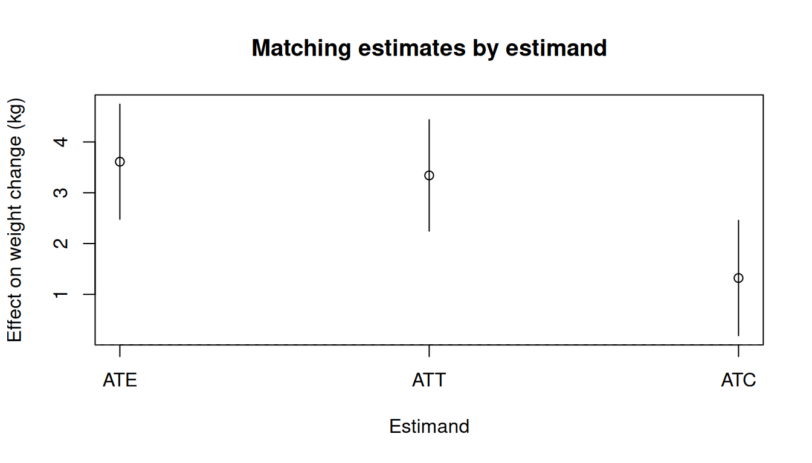
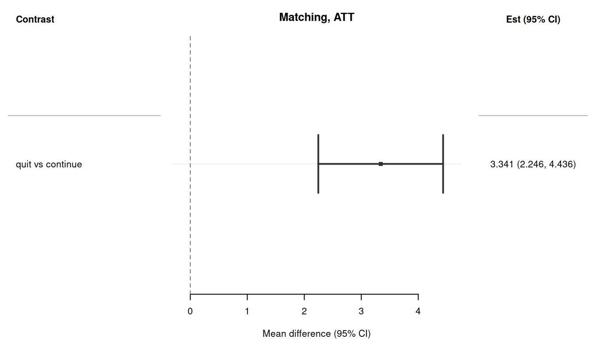

> **来源**：R 包 [causatr](https://github.com/etverse/causatr) 官方文档 [`matching.qmd`](https://etverse.github.io/causatr/vignettes/matching.html)，MIT 许可。
> 本页是中译，**代码与运行结果直接取自原站的渲染输出，未在本站重新执行**。
> Copyright (c) 2026 causatr authors；许可证全文见原仓库 `LICENSE.md`。

倾向评分匹配把倾向评分相近的处理个体与对照个体配成对，再在匹配集内比较结局，
由此估计因果效应。causatr 把匹配的构造交给
[MatchIt](https://kosukeimai.github.io/MatchIt/) [@ho2011matchit]，并在匹配样本上
拟合结局模型。推断走统一的影响函数方差引擎（`variance_if()`）：IF 在匹配样本上
计算，并在匹配对子类上按**聚类稳健**方式汇总 —— 这是 `sandwich::vcovCL()` 的 IF
对应形式，推导见 `vignettes/variance-theory.qmd` §4.3。

本文用 @hernan_whatif 的 NHEFS 数据集演示 causatr 中的倾向评分匹配，覆盖时间固定
处理下所支持的全部处理类型、结局类型、对比尺度与推断方法组合。

**注意：** 匹配只支持 `static()` 干预和**二值点处理**。`MatchIt` 本身只能处理
二值情形，因此分类（k > 2 个水平）处理和连续处理会在一开始就被拒绝并给出明确
报错 —— 这类情形请改用 `estimator = "gcomp"` 或 `estimator = "ipw"`。纵向匹配
同样不支持。对于修正处理策略（平移 / 缩放 / 阈值 / 动态 / MTP），请使用
G-computation（见 `vignette("gcomp")`）。

## 数据：NHEFS

所有示例都使用 **NHEFS** 数据集 [@hernan_whatif]。假定的因果结构是：

- **处理（$A$）：** `qsmk` —— 1971 至 1982 年间是否戒烟（二值：0/1）。
- **结局（$Y$）：** `wt82_71` —— 以 kg 计的体重变化（连续），或
  `gained_weight`（$\mathbf{1}\{Y > 0\}$，二值）。
- **混杂因子（$L$）：** 性别、年龄、种族、教育程度、吸烟强度、吸烟年数、锻炼、
  体力活动和基线体重 —— 它们是 $A$ 与 $Y$ 的共同原因。

倾向评分匹配的做法是构造一个匹配样本，使 $L$ 的分布在各处理组间（近似）均衡，
再在匹配集内比较结局，由此估计 $\mathbb{E}[Y^{a=1}] - \mathbb{E}[Y^{a=0}]$。

```r
library(causatr)
library(tinytable)
library(tinyplot)

data("nhefs")

nhefs_complete <- nhefs[complete.cases(nhefs), ]

nhefs_complete$gained_weight <- as.integer(nhefs_complete$wt82_71 > 0)

nhefs_complete$sex <- factor(
  nhefs_complete$sex,
  levels = 0:1,
  labels = c("Male", "Female")
)
```

## 二值处理、连续结局

按 @hernan_whatif 第 15 章的做法，用匹配估计戒烟对体重变化的效应。

### ATT（三明治 SE）

匹配天然以 ATT（处理组上的效应）为目标，这也是最近邻匹配的默认设置。

```r
fit_m <- causat(
  nhefs_complete,
  outcome = "wt82_71",
  treatment = "qsmk",
  confounders = ~ sex + age + I(age^2) + race + factor(education) +
    smokeintensity + I(smokeintensity^2) + smokeyrs + I(smokeyrs^2) +
    factor(exercise) + factor(active) + wt71 + I(wt71^2),
  estimator = "matching",
  estimand = "ATT"
)

res_att_sw <- contrast(
  fit_m,
  interventions = list(quit = static(1), continue = static(0)),
  reference = "continue",
  type = "difference",
  ci_method = "sandwich"
)
res_att_sw
```

| intervention | estimate | se | ci_lower | ci_upper |
|---|---|---|---|---|
| quit | 4.525 | 0.435 | 3.672 | 5.378 |
| continue | 1.184 | 0.383 | 0.433 | 1.935 |

| comparison | estimate | se | ci_lower | ci_upper |
|---|---|---|---|---|
| quit vs continue | 3.341 | 0.559 | 2.246 | 4.436 |

### ATT（bootstrap SE）

bootstrap 对个体重抽样，在每个 bootstrap 样本上重新匹配并重新拟合结局模型，
从而完整计入匹配带来的不确定性。

```r
res_att_bs <- contrast(
  fit_m,
  interventions = list(quit = static(1), continue = static(0)),
  reference = "continue",
  type = "difference",
  ci_method = "bootstrap",
  n_boot = 50L
)
res_att_bs
```

| intervention | estimate | se | ci_lower | ci_upper |
|---|---|---|---|---|
| quit | 4.525 | 0.413 | 3.81 | 5.205 |
| continue | 1.184 | 0.384 | 0.529 | 1.98 |

| comparison | estimate | se | ci_lower | ci_upper |
|---|---|---|---|---|
| quit vs continue | 3.341 | 0.614 | 2.013 | 4.287 |

### ATE 估计目标

对 ATE，MatchIt 做的是全匹配（每个个体都得到一个权重），而不是 1:1 最近邻
匹配。

```r
fit_m_ate <- causat(
  nhefs_complete,
  outcome = "wt82_71",
  treatment = "qsmk",
  confounders = ~ sex + age + I(age^2) + race + factor(education) +
    smokeintensity + I(smokeintensity^2) + smokeyrs + I(smokeyrs^2) +
    factor(exercise) + factor(active) + wt71 + I(wt71^2),
  estimator = "matching",
  estimand = "ATE"
)

res_ate_sw <- contrast(
  fit_m_ate,
  interventions = list(quit = static(1), continue = static(0)),
  reference = "continue",
  type = "difference",
  ci_method = "sandwich"
)
res_ate_sw
```

| intervention | estimate | se | ci_lower | ci_upper |
|---|---|---|---|---|
| quit | 5.442 | 0.55 | 4.364 | 6.519 |
| continue | 1.831 | 0.241 | 1.359 | 2.303 |

| comparison | estimate | se | ci_lower | ci_upper |
|---|---|---|---|---|
| quit vs continue | 3.611 | 0.578 | 2.479 | 4.743 |

### 用 bootstrap SE 的 ATE

```r
res_ate_bs <- contrast(
  fit_m_ate,
  interventions = list(quit = static(1), continue = static(0)),
  reference = "continue",
  type = "difference",
  ci_method = "bootstrap",
  n_boot = 50L
)
res_ate_bs
```

| intervention | estimate | se | ci_lower | ci_upper |
|---|---|---|---|---|
| quit | 5.442 | 0.606 | 3.918 | 6.241 |
| continue | 1.831 | 0.223 | 1.421 | 2.356 |

| comparison | estimate | se | ci_lower | ci_upper |
|---|---|---|---|---|
| quit vs continue | 3.611 | 0.603 | 2.145 | 4.39 |

### 带外部调查权重的 ATT

预先算好的调查权重通过 `weights =` 传给 `causat()`（可以是数值向量，也可以是
`survey::svydesign` 对象——后者会被自动拆包），并由 `check_weights()` 在一开始
完成校验。causatr 内部把调查权重**乘以** `MatchIt` 给出的匹配权重；合成后的
权重驱动匹配样本上的结局模型拟合，并通过 `prior.weights` 进入聚类稳健的 IF
方差。匹配样本与用户提供的权重之间的行对齐由
`combine_match_and_external_weights()`（定义在 `R/matching.R`）处理，因此这条
不变量只在一处断言。

::: {.callout-note}
## 匹配下不能使用 cluster 参数

在 `estimator = "matching"` 下，`causat(cluster = ...)` 和
`contrast(cluster = ...)` 会以 `causatr_bad_cluster` 中止并被拒绝。匹配样本
已经按 `subclass`（配对或层）做了聚类稳健的聚合，用户提供的设计聚类要么与之
冲突，要么会对子类内的行重复计数。如果设计聚类在匹配结构之外（中心、家庭、
PSU），请改用 `estimator = "gcomp"` 或 `"ipw"`——两者都通过 `cluster =` 提供
同样的「先在聚类内求和、再平方」的 IF 聚合。

同样，在匹配下把带有非平凡 PSU 的 `survey::svydesign` 对象传给 `weights =`
也会中止：该设计的第一阶段聚类会落进聚类槽位，触发同一条拒绝规则。请用
`svydesign(ids = ~1, weights = ~pw, data = d)` 声明一个只含抽样权重的设计
（不含聚类），或者直接以数值向量提供权重。
:::

```r
set.seed(42)
# Synthetic survey weights unrelated to the outcome — demonstrates the
# plumbing without introducing real bias.
svy_w <- runif(nrow(nhefs_complete), 0.5, 2.0)

fit_m_sv <- causat(
  nhefs_complete,
  outcome = "wt82_71",
  treatment = "qsmk",
  confounders = ~ sex + age + I(age^2) + race + factor(education) +
    smokeintensity + I(smokeintensity^2) + smokeyrs + I(smokeyrs^2) +
    factor(exercise) + factor(active) + wt71 + I(wt71^2),
  estimator = "matching",
  estimand = "ATT",
  weights = svy_w
)

res_m_sv <- contrast(
  fit_m_sv,
  interventions = list(quit = static(1), continue = static(0)),
  reference = "continue",
  type = "difference",
  ci_method = "sandwich"
)
res_m_sv
```

| intervention | estimate | se | ci_lower | ci_upper |
|---|---|---|---|---|
| quit | 4.576 | 0.456 | 3.683 | 5.469 |
| continue | 1.424 | 0.386 | 0.667 | 2.181 |

| comparison | estimate | se | ci_lower | ci_upper |
|---|---|---|---|---|
| quit vs continue | 3.152 | 0.593 | 1.99 | 4.315 |

### ATC 估计目标

ATC 针对的是对照组（即继续吸烟的人）中的效应。

```r
fit_m_atc <- causat(
  nhefs_complete,
  outcome = "wt82_71",
  treatment = "qsmk",
  confounders = ~ sex + age + I(age^2) + race + factor(education) +
    smokeintensity + I(smokeintensity^2) + smokeyrs + I(smokeyrs^2) +
    factor(exercise) + factor(active) + wt71 + I(wt71^2),
  estimator = "matching",
  estimand = "ATC"
)
#> Fewer treated units than control units; not all control units will get
#> a match.

res_atc <- contrast(
  fit_m_atc,
  interventions = list(quit = static(1), continue = static(0)),
  reference = "continue",
  type = "difference",
  ci_method = "sandwich"
)
res_atc
```

| intervention | estimate | se | ci_lower | ci_upper |
|---|---|---|---|---|
| quit | 4.525 | 0.435 | 3.672 | 5.378 |
| continue | 3.203 | 0.355 | 2.507 | 3.899 |

| comparison | estimate | se | ci_lower | ci_upper |
|---|---|---|---|---|
| quit vs continue | 1.322 | 0.579 | 0.187 | 2.457 |

### 以编程方式提取结果

```r
coef(res_att_sw)
#>     quit continue 
#> 4.525079 1.184069
confint(res_att_sw)
#>              lower    upper
#> quit     3.6720225 5.378136
#> continue 0.4328705 1.935267
vcov(res_att_sw)
#>                quit   continue
#> quit     0.18943466 0.01213288
#> continue 0.01213288 0.14689705
tidy(res_att_sw)
#>               term estimate std.error     type conf.low conf.high
#> 1 quit vs continue  3.34101 0.5586286 contrast 2.246118  4.435902
glance(res_att_sw)
#>   estimator estimand contrast_type ci_method   n n_interventions
#> 1  matching      ATT    difference  sandwich 403               2
```

## 二值处理、二值结局

把 `gained_weight` 指示变量用作二值结局。匹配样本上的结局模型仍然是
`Y ~ A`（线性概率模型），因此 `contrast()` 会从加权预测值计算边际风险。

### 风险差（三明治）

```r
fit_m_bin <- causat(
  nhefs_complete,
  outcome = "gained_weight",
  treatment = "qsmk",
  confounders = ~ sex + age + I(age^2) + race + factor(education) +
    smokeintensity + I(smokeintensity^2) + smokeyrs + I(smokeyrs^2) +
    factor(exercise) + factor(active) + wt71 + I(wt71^2),
  estimator = "matching",
  estimand = "ATT"
)

res_rd <- contrast(
  fit_m_bin,
  interventions = list(quit = static(1), continue = static(0)),
  reference = "continue",
  type = "difference",
  ci_method = "sandwich"
)
res_rd
```

| intervention | estimate | se | ci_lower | ci_upper |
|---|---|---|---|---|
| quit | 0.742 | 0.022 | 0.699 | 0.785 |
| continue | 0.593 | 0.024 | 0.545 | 0.641 |

| comparison | estimate | se | ci_lower | ci_upper |
|---|---|---|---|---|
| quit vs continue | 0.149 | 0.032 | 0.087 | 0.211 |

### 风险差（bootstrap）

```r
res_rd_bs <- contrast(
  fit_m_bin,
  interventions = list(quit = static(1), continue = static(0)),
  reference = "continue",
  type = "difference",
  ci_method = "bootstrap",
  n_boot = 50L
)
res_rd_bs
```

| intervention | estimate | se | ci_lower | ci_upper |
|---|---|---|---|---|
| quit | 0.742 | 0.022 | 0.701 | 0.782 |
| continue | 0.593 | 0.025 | 0.578 | 0.666 |

| comparison | estimate | se | ci_lower | ci_upper |
|---|---|---|---|---|
| quit vs continue | 0.149 | 0.03 | 0.076 | 0.18 |

### 风险比

```r
res_rr <- contrast(
  fit_m_bin,
  interventions = list(quit = static(1), continue = static(0)),
  reference = "continue",
  type = "ratio",
  ci_method = "sandwich"
)
res_rr
```

| intervention | estimate | se | ci_lower | ci_upper |
|---|---|---|---|---|
| quit | 0.742 | 0.022 | 0.699 | 0.785 |
| continue | 0.593 | 0.024 | 0.545 | 0.641 |

| comparison | estimate | se | ci_lower | ci_upper |
|---|---|---|---|---|
| quit vs continue | 1.251 | 0.061 | 1.136 | 1.377 |

### 比值比

```r
res_or <- contrast(
  fit_m_bin,
  interventions = list(quit = static(1), continue = static(0)),
  reference = "continue",
  type = "or",
  ci_method = "sandwich"
)
res_or
```

| intervention | estimate | se | ci_lower | ci_upper |
|---|---|---|---|---|
| quit | 0.742 | 0.022 | 0.699 | 0.785 |
| continue | 0.593 | 0.024 | 0.545 | 0.641 |

| comparison | estimate | se | ci_lower | ci_upper |
|---|---|---|---|---|
| quit vs continue | 1.973 | 0.291 | 1.478 | 2.634 |

### 风险比（bootstrap）

```r
res_rr_bs <- contrast(
  fit_m_bin,
  interventions = list(quit = static(1), continue = static(0)),
  reference = "continue",
  type = "ratio",
  ci_method = "bootstrap",
  n_boot = 50L
)
res_rr_bs
```

| intervention | estimate | se | ci_lower | ci_upper |
|---|---|---|---|---|
| quit | 0.742 | 0.021 | 0.703 | 0.778 |
| continue | 0.593 | 0.029 | 0.557 | 0.656 |

| comparison | estimate | se | ci_lower | ci_upper |
|---|---|---|---|---|
| quit vs continue | 1.251 | 0.064 | 1.126 | 1.322 |

### Quasibinomial 结局

当二值结局出现过度离散，或者你想在不加严格二项方差假设的前提下得到保守的 SE 时，
使用 `family = "quasibinomial"`：

```r
fit_m_quasi <- causat(
  nhefs_complete,
  outcome = "gained_weight",
  treatment = "qsmk",
  confounders = ~ sex + age + I(age^2) + race + factor(education) +
    smokeintensity + I(smokeintensity^2) + smokeyrs + I(smokeyrs^2) +
    factor(exercise) + factor(active) + wt71 + I(wt71^2),
  estimator = "matching",
  estimand = "ATT",
  family = "quasibinomial"
)

res_quasi <- contrast(
  fit_m_quasi,
  interventions = list(quit = static(1), continue = static(0)),
  reference = "continue",
  type = "difference",
  ci_method = "sandwich"
)
res_quasi
```

| intervention | estimate | se | ci_lower | ci_upper |
|---|---|---|---|---|
| quit | 0.742 | 0.022 | 0.699 | 0.785 |
| continue | 0.593 | 0.024 | 0.545 | 0.641 |

| comparison | estimate | se | ci_lower | ci_upper |
|---|---|---|---|---|
| quit vs continue | 0.149 | 0.032 | 0.087 | 0.211 |

```r
tt(tidy(res_quasi), digits = 3)
```

| term | estimate | std.error | type | conf.low | conf.high |
|---|---|---|---|---|---|
| quit vs continue | 0.149 | 0.0317 | contrast | 0.0868 | 0.211 |

## 比较不同估计目标

```r
results_list <- list(
  data.frame(
    estimand = "ATT",
    estimate = res_att_sw$contrasts$estimate[1],
    ci_lower = res_att_sw$contrasts$ci_lower[1],
    ci_upper = res_att_sw$contrasts$ci_upper[1]
  ),
  data.frame(
    estimand = "ATC",
    estimate = res_atc$contrasts$estimate[1],
    ci_lower = res_atc$contrasts$ci_lower[1],
    ci_upper = res_atc$contrasts$ci_upper[1]
  )
)
if (requireNamespace("optmatch", quietly = TRUE)) {
  results_list <- c(list(data.frame(
    estimand = "ATE",
    estimate = res_ate_sw$contrasts$estimate[1],
    ci_lower = res_ate_sw$contrasts$ci_lower[1],
    ci_upper = res_ate_sw$contrasts$ci_upper[1]
  )), results_list)
}
est_df <- do.call(rbind, results_list)

tinyplot(
  estimate ~ estimand,
  data = est_df,
  type = "pointrange",
  ymin = est_df$ci_lower,
  ymax = est_df$ci_upper,
  xlab = "Estimand",
  ylab = "Effect on weight change (kg)",
  main = "Matching estimates by estimand"
)
abline(h = 0, lty = 2, col = "grey40")
```



## 转发 MatchIt 参数（CEM）

传给 `causat()` 的任何额外参数都会经由 `...` 直接进入
`MatchIt::matchit()`。由于 causatr 的参数现在叫 `estimator`（而不是
`method`），MatchIt 自己的 `method = "..."` 就空了出来，你可以选用
非默认的匹配算法。下面的例子把默认的最近邻匹配器换成
**粗化精确匹配** [@iacus2012cem]，它内置于 MatchIt，不需要额外的包。
其他可转发的取值包括 `"optimal"`（需要 `optmatch`）、
`"genetic"`（需要 `Matching`）、`"cardinality"`（需要 LP 求解器），
以及 MatchIt 完整的 method 列表。

```r
fit_cem <- causat(
  nhefs_complete,
  outcome = "wt82_71",
  treatment = "qsmk",
  confounders = ~ sex + age + race + factor(education) +
    smokeintensity + smokeyrs + factor(exercise) + factor(active) + wt71,
  estimator = "matching",
  estimand = "ATT",
  method = "cem"  # forwarded to MatchIt::matchit()
)

res_cem <- contrast(
  fit_cem,
  interventions = list(quit = static(1), continue = static(0)),
  reference = "continue",
  type = "difference",
  ci_method = "sandwich"
)
res_cem
```

| intervention | estimate | se | ci_lower | ci_upper |
|---|---|---|---|---|
| quit | 4.446 | 1.496 | 1.515 | 7.378 |
| continue | 2.894 | 1.295 | 0.357 | 5.431 |

| comparison | estimate | se | ci_lower | ci_upper |
|---|---|---|---|---|
| quit vs continue | 1.552 | 1.422 | -1.235 | 4.339 |

MatchIt 的其他调节参数（`ratio`、`replace`、`caliper`、`distance`、
`k2k`、…）都可以用同样的方式传入。

## 用 `by` 刻画效应修饰

当 `confounders` 中包含 `A:modifier` 交互项时，匹配会把结局 MSM 从
`Y ~ A` 扩展为 `Y ~ A + modifier + A:modifier`。饱和的 MSM 可以在匹配
样本上还原出各层特有的处理效应。在 `contrast()` 中使用
`by = "modifier"` 即可得到异质性处理效应。

这里我们加入 `qsmk:sex` 交互项，考察戒烟对体重变化的效应如何随性别
不同而变化。匹配所用的倾向评分模型会自动剔除该交互项。

```r
fit_m_hte <- causat(
  nhefs_complete,
  outcome = "wt82_71",
  treatment = "qsmk",
  confounders = ~ sex + age + I(age^2) + race + factor(education) +
    smokeintensity + I(smokeintensity^2) + smokeyrs + I(smokeyrs^2) +
    factor(exercise) + factor(active) + wt71 + I(wt71^2) +
    qsmk:sex,
  estimator = "matching"
)

res_m_by_sex <- contrast(
  fit_m_hte,
  interventions = list(quit = static(1), continue = static(0)),
  reference = "continue",
  type = "difference",
  ci_method = "sandwich",
  by = "sex"
)
res_m_by_sex
```

| intervention | estimate | se | ci_lower | ci_upper | by | n_by |
|---|---|---|---|---|---|---|
| quit | 4.995 | 0.551 | 3.915 | 6.076 | Male | 762 |
| continue | 1.938 | 0.241 | 1.465 | 2.411 | Male | 762 |
| quit | 5.906 | 0.551 | 4.825 | 6.987 | Female | 804 |
| continue | 1.727 | 0.241 | 1.254 | 2.201 | Female | 804 |

| comparison | estimate | se | ci_lower | ci_upper | by | n_by |
|---|---|---|---|---|---|---|
| quit vs continue | 3.057 | 0.579 | 1.923 | 4.191 | Male | 762 |
| quit vs continue | 4.178 | 0.579 | 3.045 | 5.312 | Female | 804 |

::: {.callout-note}
匹配的这种扩展方式与 IPW 不同：因为匹配权重是子类指示变量（而不是
密度比权重），处理**不会**被权重吸收掉。所以结局 MSM 必须同时包含
`A`、`modifier` 和 `A:modifier` --- 即处理与修饰因子交互的完整饱和
模型。用于构造匹配的倾向评分模型会自动剔除 `A:modifier` 项。
:::

## Tidy 与 glance

causatr 的结果可以通过 `tidy()` 和 `glance()` 接入 broom 生态：

```r
tidy(res_att_sw)
#>               term estimate std.error     type conf.low conf.high
#> 1 quit vs continue  3.34101 0.5586286 contrast 2.246118  4.435902
glance(res_att_sw)
#>   estimator estimand contrast_type ci_method   n n_interventions
#> 1  matching      ATT    difference  sandwich 403               2
```

## 森林图

`plot()` 方法会使用 `forrest` 包生成森林图。

```r
plot(res_att_sw)
```



## 诊断

拟合匹配模型之后，用 `diagnose()` 评估协变量均衡和匹配质量。均衡诊断
借助 [cobalt](https://ngreifer.github.io/cobalt/) 比较匹配前后的 SMD。

```r
diag <- diagnose(fit_m)
diag
#> <causatr_diag>
#>  Estimator:matching
#>  Treatment: binary
#>  Estimand:  ATT
#> 
#> Positivity:
#>       statistic        value
#>          <char>        <num>
#>             min 2.667709e-07
#>             q25 1.739280e-01
#>          median 2.356540e-01
#>             q75 3.232473e-01
#>             max 8.723380e-01
#>   n_below_lower 6.000000e+00
#>   n_above_upper 0.000000e+00
#>    n_violations 6.000000e+00
#>  pct_violations 3.800000e-01
#> 
#> Covariate balance:
#> Balance Measures
#>                          Type Diff.Un V.Ratio.Un Diff.Adj    M.Threshold
#> distance             Distance  0.5697     1.4784   0.0468 Balanced, <0.1
#> sex_Female             Binary -0.1604          .   0.0299 Balanced, <0.1
#> age                   Contin.  0.2771     1.0731  -0.0116 Balanced, <0.1
#> I(age^2)              Contin.  0.2715     1.1632  -0.0123 Balanced, <0.1
#> race                   Binary -0.1993          .   0.0261 Balanced, <0.1
#> factor(education)_0    Binary  0.0394          .  -0.0250 Balanced, <0.1
#> factor(education)_1    Binary -0.0835          .   0.0000 Balanced, <0.1
#> factor(education)_2    Binary  0.0654          .   0.0501 Balanced, <0.1
#> factor(education)_3    Binary  0.0221          .   0.0000 Balanced, <0.1
#> factor(education)_4    Binary -0.0134          .  -0.0289 Balanced, <0.1
#> factor(education)_5    Binary -0.0762          .  -0.0353 Balanced, <0.1
#> factor(education)_6    Binary  0.0461          .   0.0152 Balanced, <0.1
#> factor(education)_7    Binary  0.0025          .   0.0421 Balanced, <0.1
#> factor(education)_8    Binary  0.0386          .  -0.0166 Balanced, <0.1
#> factor(education)_9    Binary  0.0170          .   0.0109 Balanced, <0.1
#> factor(education)_10   Binary -0.0879          .  -0.0184 Balanced, <0.1
#> factor(education)_11   Binary -0.1159          .  -0.0229 Balanced, <0.1
#> factor(education)_12   Binary -0.0475          .  -0.0204 Balanced, <0.1
#> factor(education)_13   Binary  0.0088          .   0.0428 Balanced, <0.1
#> factor(education)_15   Binary -0.0759          .  -0.0410 Balanced, <0.1
#> factor(education)_16   Binary  0.1221          .   0.0088 Balanced, <0.1
#> factor(education)_17   Binary  0.0823          .   0.0298 Balanced, <0.1
#> smokeintensity        Contin. -0.2087     1.1679  -0.0014 Balanced, <0.1
#> I(smokeintensity^2)   Contin. -0.1246     1.1519   0.0148 Balanced, <0.1
#> smokeyrs              Contin.  0.1526     1.1846  -0.0421 Balanced, <0.1
#> I(smokeyrs^2)         Contin.  0.1675     1.3279  -0.0342 Balanced, <0.1
#> factor(exercise)_0     Binary -0.1307          .   0.0068 Balanced, <0.1
#> factor(exercise)_1     Binary  0.0397          .  -0.0851 Balanced, <0.1
#> factor(exercise)_2     Binary  0.0565          .   0.0808 Balanced, <0.1
#> factor(active)_0       Binary -0.0721          .  -0.0251 Balanced, <0.1
#> factor(active)_1       Binary  0.0268          .  -0.0099 Balanced, <0.1
#> factor(active)_2       Binary  0.0706          .   0.0552 Balanced, <0.1
#> wt71                  Contin.  0.1313     1.0606  -0.0126 Balanced, <0.1
#> I(wt71^2)             Contin.  0.1247     1.0876  -0.0139 Balanced, <0.1
#>                      V.Ratio.Adj
#> distance                  1.2040
#> sex_Female                     .
#> age                       0.9930
#> I(age^2)                  1.0026
#> race                           .
#> factor(education)_0            .
#> factor(education)_1            .
#> factor(education)_2            .
#> factor(education)_3            .
#> factor(education)_4            .
#> factor(education)_5            .
#> factor(education)_6            .
#> factor(education)_7            .
#> factor(education)_8            .
#> factor(education)_9            .
#> factor(education)_10           .
#> factor(education)_11           .
#> factor(education)_12           .
#> factor(education)_13           .
#> factor(education)_15           .
#> factor(education)_16           .
#> factor(education)_17           .
#> smokeintensity            1.0721
#> I(smokeintensity^2)       1.0921
#> smokeyrs                  1.0200
#> I(smokeyrs^2)             1.0645
#> factor(exercise)_0             .
#> factor(exercise)_1             .
#> factor(exercise)_2             .
#> factor(active)_0               .
#> factor(active)_1               .
#> factor(active)_2               .
#> wt71                      0.9769
#> I(wt71^2)                 0.9424
#> 
#> Balance tally for mean differences
#>                    count
#> Balanced, <0.1        34
#> Not Balanced, >0.1     0
#> 
#> Variable with the greatest mean difference
#>            Variable Diff.Adj    M.Threshold
#>  factor(exercise)_1  -0.0851 Balanced, <0.1
#> 
#> Sample sizes
#>           Control Treated
#> All          1163     403
#> Matched       403     403
#> Unmatched     760       0
#> 
#> Match quality:
#>     statistic  value
#>        <char>  <num>
#>       n_total 1566.0
#>     n_matched  806.0
#>   n_discarded  760.0
#>  pct_retained   51.5
```

### Love 图

```r
plot(diag)
```


### 匹配质量

```r
diag$match_quality
#>       statistic  value
#>          <char>  <num>
#> 1:      n_total 1566.0
#> 2:    n_matched  806.0
#> 3:  n_discarded  760.0
#> 4: pct_retained   51.5
```

## 已覆盖组合汇总

**图例。** ✅ 已覆盖，并在测试中锚定真值 · 🟡 仅有冒烟测试 ·
⛔ 会给出带说明的报错并拒绝。

| Treatment | Outcome | Intervention | Estimand | Contrast | Inference | Weights | Status |
|---|---|---|---|---|---|---|---|
| 二值 | 连续 | 静态 | ATT | 差值 | 三明治 | 无 | ✅ |
| 二值 | 连续 | 静态 | ATT | 差值 | bootstrap | 无 | ✅ |
| 二值 | 连续 | 静态 | ATT | 差值 | 三明治 | survey | ✅ |
| 二值 | 连续 | 静态 | ATE | 差值 | 三明治 | 无 | ✅ |
| 二值 | 连续 | 静态 | ATE | 差值 | bootstrap | 无 | ✅ |
| 二值 | 连续 | 静态 | ATC | 差值 | 三明治 | 无 | ✅ |
| 二值 | 二值 | 静态 | ATT | 差值 | 三明治 | 无 | ✅ |
| 二值 | 二值 | 静态 | ATT | 差值 | bootstrap | 无 | ✅ |
| 二值 | 二值 | 静态 | ATT | 比值 | 三明治 | 无 | ✅ |
| 二值 | 二值 | 静态 | ATT | OR | 三明治 | 无 | ✅ |
| 二值 | 二值（quasibinomial） | 静态 | ATT | 差值 | 三明治 | 无 | ✅ |
| 二值 | 二值 | 静态 | ATT | 比值 | bootstrap | 无 | ✅ |
| 二值 | Gaussian | 静态 | ATE（含 `A:modifier`） | 差值 | 三明治 / bootstrap | 无 | ✅ |
| 分类（k>2）/ 连续 | — | — | — | — | — | — | ⛔ 仅支持二值 |
| 任意 | — | 动态 / 平移 / 缩放 / 阈值 / IPSI | — | — | — | — | ⛔ 第 4 阶段 |

每一种方法 × 处理 × 结局 × 干预 × 方差组合的权威覆盖状态，
请查阅 `FEATURE_COVERAGE_MATRIX.md`。

## 参考文献

::: {#refs}
:::

