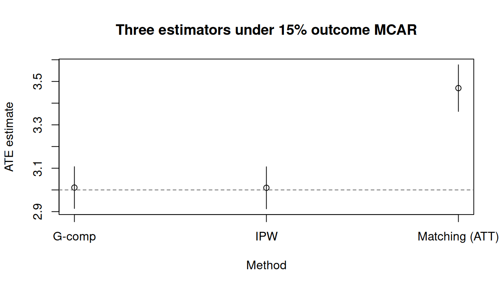
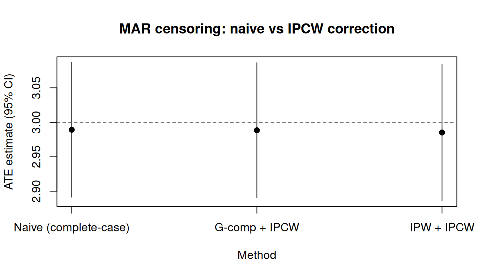

> **来源**：R 包 [causatr](https://github.com/etverse/causatr) 官方文档 [`missing-data.qmd`](https://etverse.github.io/causatr/vignettes/missing-data.html)，MIT 许可。
> 本页是中译，**代码与运行结果直接取自原站的渲染输出，未在本站重新执行**。
> Copyright (c) 2026 causatr authors；许可证全文见原仓库 `LICENSE.md`。

缺失数据在观察性研究中很常见。causatr 的处理方式取决于*哪个*变量缺失（结局、处理还是
协变量），以及使用的是*哪种*估计量。本文逐一演示各种情形下的行为，并说明如何验证你的
分析是否稳健。

## 准备工作

```r
library(causatr)
library(tinytable)
library(tinyplot)
```

我们先模拟一个已知真值的基准数据集，再引入缺失。

**数据生成机制。** 两个独立的混杂因子 $L_1$ 和 $L_2$ 同时影响二值处理 $A$ 和连续结局
$Y$。处理概率服从以 $L_1$ 和 $L_2$ 为自变量的 logistic 模型，结局关于 $A$、$L_1$ 和
$L_2$ 是线性的，并带有可加高斯噪声。

$$
\begin{aligned}
L_1 &\sim \mathcal{N}(0, 1) \\
L_2 &\sim \mathcal{N}(0, 1) \\
A &\sim \text{Bernoulli}\bigl(\text{logit}^{-1}(0.3\,L_1 + 0.2\,L_2)\bigr) \\
Y &= 2 + 3\,A + 1.5\,L_1 + 0.8\,L_2 + \varepsilon, \quad \varepsilon \sim \mathcal{N}(0, 1)
\end{aligned}
$$

处理的系数为 3 且不存在效应修饰，因此真实的平均处理效应为
$\text{ATE} = E[Y^{a=1}] - E[Y^{a=0}] = 3$。

```r
set.seed(42)
n <- 2000
L1 <- rnorm(n)
L2 <- rnorm(n)
A <- rbinom(n, 1, plogis(0.3 * L1 + 0.2 * L2))
Y <- 2 + 3 * A + 1.5 * L1 + 0.8 * L2 + rnorm(n)
df <- data.frame(Y = Y, A = A, L1 = L1, L2 = L2)
```

## 结局缺失（MCAR）

当结局值是完全随机缺失（MCAR）时，结局模型在完整个案上拟合。`contrast()` 会对*所有*行
做预测，再把预测值为 NA 的行从目标人群的平均中排除。在 MCAR 下这样做是无偏的。

```r
df_y_miss <- df
df_y_miss$Y[sample(n, round(0.15 * n))] <- NA

fit_y <- causat(
  df_y_miss,
  outcome = "Y",
  treatment = "A",
  confounders = ~ L1 + L2,
  model_fn = stats::glm
)

res_y <- contrast(
  fit_y,
  interventions = list(a1 = static(1), a0 = static(0)),
  reference = "a0",
  type = "difference",
  ci_method = "sandwich"
)
res_y
```

| intervention | estimate | se | ci_lower | ci_upper |
|---|---|---|---|---|
| a1 | 4.966 | 0.052 | 4.864 | 5.067 |
| a0 | 1.955 | 0.051 | 1.854 | 2.056 |

| comparison | estimate | se | ci_lower | ci_upper |
|---|---|---|---|---|
| a1 vs a0 | 3.011 | 0.049 | 2.914 | 3.107 |

尽管有 15% 的结局缺失，估计值仍接近 3。

### 比较：完整数据 vs 结局缺失数据

```r
fit_complete <- causat(
  df,
  outcome = "Y",
  treatment = "A",
  confounders = ~ L1 + L2,
  model_fn = stats::glm
)
res_complete <- contrast(
  fit_complete,
  interventions = list(a1 = static(1), a0 = static(0)),
  reference = "a0",
  type = "difference",
  ci_method = "sandwich"
)

comp_df <- data.frame(
  Analysis = c("Complete data", "15% outcome MCAR"),
  Estimate = c(res_complete$contrasts$estimate[1], res_y$contrasts$estimate[1]),
  SE = c(res_complete$contrasts$se[1], res_y$contrasts$se[1]),
  CI_lower = c(res_complete$contrasts$ci_lower[1], res_y$contrasts$ci_lower[1]),
  CI_upper = c(res_complete$contrasts$ci_upper[1], res_y$contrasts$ci_upper[1])
)
tt(comp_df, digits = 3)
```

| Analysis | Estimate | SE | CI_lower | CI_upper |
|---|---|---|---|---|
| Complete data | 2.99 | 0.0456 | 2.91 | 3.08 |
| 15% outcome MCAR | 3.01 | 0.0492 | 2.91 | 3.11 |

有缺失数据时 SE 略有增大（信息量更少），但点估计值仍然贴近真值。

## IPW 下的结局缺失

IPW 同样能处理结局缺失。处理模型在按结局筛选后的子集（Y 被观测到的行）上拟合，密度比
权重也在同一子集上计算。

```r
fit_y_ipw <- causat(
  df_y_miss,
  outcome = "Y",
  treatment = "A",
  confounders = ~ L1 + L2,
  estimator = "ipw",
  model_fn = stats::glm,
  propensity_model_fn = stats::glm
)

res_y_ipw <- contrast(
  fit_y_ipw,
  interventions = list(a1 = static(1), a0 = static(0)),
  reference = "a0",
  type = "difference",
  ci_method = "sandwich"
)
res_y_ipw
```

| intervention | estimate | se | ci_lower | ci_upper |
|---|---|---|---|---|
| a1 | 4.989 | 0.055 | 4.881 | 5.097 |
| a0 | 1.979 | 0.055 | 1.871 | 2.086 |

| comparison | estimate | se | ci_lower | ci_upper |
|---|---|---|---|---|
| a1 vs a0 | 3.01 | 0.049 | 2.913 | 3.107 |

## 匹配下的结局缺失

匹配通过 MatchIt 的内部机制来处理结局缺失。Y 缺失的行会被排除在匹配样本之外。

```r
fit_y_match <- causat(
  df_y_miss,
  outcome = "Y",
  treatment = "A",
  confounders = ~ L1 + L2,
  estimator = "matching",
  estimand = "ATT"
)

res_y_match <- contrast(
  fit_y_match,
  interventions = list(a1 = static(1), a0 = static(0)),
  reference = "a0",
  type = "difference",
  ci_method = "sandwich"
)
res_y_match
```

| intervention | estimate | se | ci_lower | ci_upper |
|---|---|---|---|---|
| a1 | 5.222 | 0.066 | 5.093 | 5.351 |
| a0 | 1.753 | 0.068 | 1.621 | 1.885 |

| comparison | estimate | se | ci_lower | ci_upper |
|---|---|---|---|---|
| a1 vs a0 | 3.469 | 0.055 | 3.362 | 3.577 |

### 结局缺失下的三种方法比较

```r
methods_df <- data.frame(
  Method = c("G-comp", "IPW", "Matching (ATT)"),
  Estimate = c(
    res_y$contrasts$estimate[1],
    res_y_ipw$contrasts$estimate[1],
    res_y_match$contrasts$estimate[1]
  ),
  CI_lower = c(
    res_y$contrasts$ci_lower[1],
    res_y_ipw$contrasts$ci_lower[1],
    res_y_match$contrasts$ci_lower[1]
  ),
  CI_upper = c(
    res_y$contrasts$ci_upper[1],
    res_y_ipw$contrasts$ci_upper[1],
    res_y_match$contrasts$ci_upper[1]
  )
)

tinyplot(
  Estimate ~ Method,
  data = methods_df,
  type = "pointrange",
  ymin = methods_df$CI_lower,
  ymax = methods_df$CI_upper,
  ylab = "ATE estimate",
  main = "Three estimators under 15% outcome MCAR"
)
abline(h = 3, lty = 2, col = "grey40")
```



三个估计量都还原了真值（虚线位于 3）。

## 协变量缺失

当协变量存在缺失值时，`glm(na.action = na.omit)` 会在模型拟合中丢弃这些行。`contrast()` 对协变量缺失的行返回 NA 预测，并把它们排除在目标人群之外。

```r
df_l_miss <- df
df_l_miss$L1[sample(n, round(0.10 * n))] <- NA

fit_l <- causat(
  df_l_miss,
  outcome = "Y",
  treatment = "A",
  confounders = ~ L1 + L2,
  model_fn = stats::glm
)

res_l <- contrast(
  fit_l,
  interventions = list(a1 = static(1), a0 = static(0)),
  reference = "a0",
  type = "difference",
  ci_method = "sandwich"
)
#> 200 row(s) with NA predictions excluded from the target population.
res_l
```

| intervention | estimate | se | ci_lower | ci_upper |
|---|---|---|---|---|
| a1 | 4.995 | 0.052 | 4.893 | 5.096 |
| a0 | 2.006 | 0.052 | 1.903 | 2.108 |

| comparison | estimate | se | ci_lower | ci_upper |
|---|---|---|---|---|
| a1 vs a0 | 2.989 | 0.048 | 2.895 | 3.083 |

在 MCAR 协变量缺失下，估计值是无偏的。在 MAR 下，完整个案拟合是*有偏倚*的——缺失的行并不是数据的随机样本——因此需要多重插补。下一节用 `causat_mice()` 走一遍这个流程。

## MAR 协变量与处理的多重插补

当协变量（或处理）是**随机**缺失（MAR）而不是完全随机缺失时，丢弃不完整的行会扭曲分析：观测到的子集不再具有代表性。多重插补（MI）解决这个问题的办法是，多次从缺失值的预测分布中把它们填补出来，在每个补全后的数据集上运行分析，再把结果汇总。causatr 的 `causat_mice()` 负责的是*分析与汇总*这一步：你在上游用 `mice::mice()` 完成插补，然后把 `mids` 对象交给 `causat_mice()`，它会在每个补全后的数据集上运行 `causat()` + `contrast()`，并把结果汇总成单个 `causatr_result`。

```r
# Multiple imputation needs the mice package (a Suggested dependency). Every
# chunk in this section is guarded so the vignette still renders without it.
has_mice <- requireNamespace("mice", quietly = TRUE)
```

**一个 MAR 协变量。** 我们模拟一个混杂因子 `L`，它的缺失依赖于*观测到的*处理 `A`（因此是 MAR，而不是 MCAR）——未处理者的 `L` 记录得更少。真实 ATE 为 3。

```r
set.seed(2024)
n_mi <- 2000
L <- rnorm(n_mi)
A <- rbinom(n_mi, 1, plogis(0.5 * L))
Y <- 2 + 3 * A + 1.5 * L + rnorm(n_mi) # true ATE = 3
# L is observed more often among the treated -> missing more often among
# controls: missingness depends on the observed A (MAR, not MCAR).
R_L <- rbinom(n_mi, 1, plogis(0.6 + 0.7 * A))
df_full <- data.frame(Y = Y, A = A, L = L)
df_mar_l <- df_full
df_mar_l$L[R_L == 0] <- NA
round(mean(is.na(df_mar_l$L)), 2) # fraction of L missing
#> [1] 0.29
```

一个辅助函数，把差值对比读作带对称区间的有符号量值（参照方向只是一种展示约定；真实效应为 3）：

```r
ate_row <- function(res, label) {
  e <- res$contrasts$estimate[1]
  half <- (res$contrasts$ci_upper[1] - res$contrasts$ci_lower[1]) / 2
  data.frame(Method = label, Estimate = abs(e),
             CI_lower = abs(e) - half, CI_upper = abs(e) + half)
}
```

**完整个案分析会丢弃不完整的行。** 有一个值得如实说明的微妙之处：在结局模型*设定正确*的 G-computation 下，只依赖已建模变量（这里是 `A`）的协变量缺失，会让完整个案估计值近似*有效*——所以在下面它会落在真值附近。但这是一个脆弱的特例，而不是普遍保证：

- 它丢掉了每一个部分观测的行（这里约 30%）；
- 它对 `estimator = "ipw"` 或 `"matching"` 甚至不是一个选项，因为它们遇到混杂因子缺失的行会直接中止；
- 一旦缺失依赖于**结局**，它就会失效，而只含协变量的模型无法吸收这一点。

多重插补通过使用每一行、并把插补的不确定性传递进标准误，同时回避了这三个问题。

```r
cc_fit <- causat(df_mar_l, outcome = "Y", treatment = "A",
                 confounders = ~L, model_fn = stats::glm)
cc_res <- contrast(cc_fit, interventions = list(a1 = static(1), a0 = static(0)),
                   reference = "a0", type = "difference", ci_method = "sandwich")
#> 572 row(s) with NA predictions excluded from the target population.
cc_res
```

| intervention | estimate | se | ci_lower | ci_upper |
|---|---|---|---|---|
| a1 | 5.082 | 0.052 | 4.981 | 5.184 |
| a0 | 2.033 | 0.056 | 1.923 | 2.144 |

| comparison | estimate | se | ci_lower | ci_upper |
|---|---|---|---|---|
| a1 vs a0 | 3.049 | 0.056 | 2.94 | 3.158 |

**多重插补会用到每一行。** 用 `mice()` 插补 `L`（默认的预测矩阵同时带有 `A` *和* `Y`，这正是我们想要的——见下面关于相容性的说明），然后用 `causat_mice()` 汇总：

```r
library(mice)
#> 
#> Attaching package: 'mice'
#> The following object is masked from 'package:stats':
#> 
#>     filter
#> The following objects are masked from 'package:base':
#> 
#>     cbind, rbind
imp <- mice(df_mar_l, m = 20, printFlag = FALSE)

mi_res <- causat_mice(
  imp,
  outcome = "Y",
  treatment = "A",
  confounders = ~L,
  interventions = list(a1 = static(1), a0 = static(0)),
  estimator = "gcomp",
  type = "difference"
)
#> Warning: `model_fn` not specified; defaulting to `stats::glm`.
#> ℹ Set `model_fn` explicitly (e.g. `model_fn = stats::glm` or `model_fn = mgcv::gam`).
#> `model_fn` not specified; defaulting to `stats::glm`.
#> ℹ Set `model_fn` explicitly (e.g. `model_fn = stats::glm` or `model_fn = mgcv::gam`).
#> `model_fn` not specified; defaulting to `stats::glm`.
#> ℹ Set `model_fn` explicitly (e.g. `model_fn = stats::glm` or `model_fn = mgcv::gam`).
#> `model_fn` not specified; defaulting to `stats::glm`.
#> ℹ Set `model_fn` explicitly (e.g. `model_fn = stats::glm` or `model_fn = mgcv::gam`).
#> `model_fn` not specified; defaulting to `stats::glm`.
#> ℹ Set `model_fn` explicitly (e.g. `model_fn = stats::glm` or `model_fn = mgcv::gam`).
#> `model_fn` not specified; defaulting to `stats::glm`.
#> ℹ Set `model_fn` explicitly (e.g. `model_fn = stats::glm` or `model_fn = mgcv::gam`).
#> `model_fn` not specified; defaulting to `stats::glm`.
#> ℹ Set `model_fn` explicitly (e.g. `model_fn = stats::glm` or `model_fn = mgcv::gam`).
#> `model_fn` not specified; defaulting to `stats::glm`.
#> ℹ Set `model_fn` explicitly (e.g. `model_fn = stats::glm` or `model_fn = mgcv::gam`).
#> `model_fn` not specified; defaulting to `stats::glm`.
#> ℹ Set `model_fn` explicitly (e.g. `model_fn = stats::glm` or `model_fn = mgcv::gam`).
#> `model_fn` not specified; defaulting to `stats::glm`.
#> ℹ Set `model_fn` explicitly (e.g. `model_fn = stats::glm` or `model_fn = mgcv::gam`).
#> `model_fn` not specified; defaulting to `stats::glm`.
#> ℹ Set `model_fn` explicitly (e.g. `model_fn = stats::glm` or `model_fn = mgcv::gam`).
#> `model_fn` not specified; defaulting to `stats::glm`.
#> ℹ Set `model_fn` explicitly (e.g. `model_fn = stats::glm` or `model_fn = mgcv::gam`).
#> `model_fn` not specified; defaulting to `stats::glm`.
#> ℹ Set `model_fn` explicitly (e.g. `model_fn = stats::glm` or `model_fn = mgcv::gam`).
#> `model_fn` not specified; defaulting to `stats::glm`.
#> ℹ Set `model_fn` explicitly (e.g. `model_fn = stats::glm` or `model_fn = mgcv::gam`).
#> `model_fn` not specified; defaulting to `stats::glm`.
#> ℹ Set `model_fn` explicitly (e.g. `model_fn = stats::glm` or `model_fn = mgcv::gam`).
#> `model_fn` not specified; defaulting to `stats::glm`.
#> ℹ Set `model_fn` explicitly (e.g. `model_fn = stats::glm` or `model_fn = mgcv::gam`).
#> `model_fn` not specified; defaulting to `stats::glm`.
#> ℹ Set `model_fn` explicitly (e.g. `model_fn = stats::glm` or `model_fn = mgcv::gam`).
#> `model_fn` not specified; defaulting to `stats::glm`.
#> ℹ Set `model_fn` explicitly (e.g. `model_fn = stats::glm` or `model_fn = mgcv::gam`).
#> `model_fn` not specified; defaulting to `stats::glm`.
#> ℹ Set `model_fn` explicitly (e.g. `model_fn = stats::glm` or `model_fn = mgcv::gam`).
#> `model_fn` not specified; defaulting to `stats::glm`.
#> ℹ Set `model_fn` explicitly (e.g. `model_fn = stats::glm` or `model_fn = mgcv::gam`).
mi_res
```

| intervention | estimate | se | ci_lower | ci_upper |
|---|---|---|---|---|
| a1 | 5.027 | 0.047 | 4.935 | 5.12 |
| a0 | 1.991 | 0.048 | 1.897 | 2.085 |

| comparison | estimate | se | ci_lower | ci_upper |
|---|---|---|---|---|
| a0 vs a1 | -3.037 | 0.053 | -3.141 | -2.932 |

合并后的标准误同时反映了插补内的抽样变异和插补间的不确定性，依据的是 Rubin [-@rubin1987mi] 规则
与 Barnard-Rubin [-@barnard1999df] 自由度。逐次插补的诊断（包括缺失信息比例）
存放在 `"mi_details"` 属性里：

```r
attr(mi_res, "mi_details")$contrasts
#>         between      within       total      df       fmi
#>           <num>       <num>       <num>   <num>     <num>
#> 1: 0.0006324742 0.002169654 0.002833752 282.118 0.2397236
```

这里要如实说明 MI 在此能买到什么、买不到什么。本设计下完整个案是有效的，两个估计值
也高度一致——MI 不会凭空让一个本就有效的分析变得更锐利。它确实用上了部分观测的行
（所以它的区间即便有差别，也只是比完整个案略窄一点），而 `fmi` 列报告了缺失究竟损失了
多少信息。诚实的告诫恰恰是*反过来*的：MI 的上限完全由它的插补模型决定。误设的插补会让
因果估计值的偏倚**比完整个案还严重**——下面我们就把 `Y` 从预测矩阵中剔除，
正是为了演示这一点。而 MI 决定性的*优势*，则出现在完整个案**有偏倚**的时候——
也就是下一个设计。

### 完整个案失效之时：依赖结局的缺失

上面完整个案之所以有效，靠的是 `L` 的缺失仅仅是 `A` 的函数——而它是一个*已建模的*
协变量。现在让缺失依赖于**结局**，而且在两个处理臂中方向*相反*：处理组里 `Y` 低时才
记录 `L`，对照组里则是 `Y` 高时才记录。结局回归以协变量为条件，而不是以它自身的选择
为条件，所以完整个案的拟合无法消除这种扭曲，其 ATE 偏倚严重。而 MI 在全样本上用
`(A, Y)` 插补 `L`，恢复了真值。

```r
# Reusable complete-case (na.omit) + MI g-computation on a partially observed
# data frame, each summarised by ate_row().
cc_mi_gcomp <- function(dmar, m = 20) {
  ints <- list(a1 = static(1), a0 = static(0))
  cc <- contrast(
    causat(na.omit(dmar), outcome = "Y", treatment = "A",
           confounders = ~L, model_fn = stats::glm),
    interventions = ints, reference = "a0", ci_method = "sandwich"
  )
  imp_d <- mice(dmar, m = m, printFlag = FALSE)
  mi <- causat_mice(imp_d, outcome = "Y", treatment = "A", confounders = ~L,
                    interventions = ints, estimator = "gcomp")
  list(cc = cc, mi = mi)
}

set.seed(3)
n2 <- 4000
L2 <- rnorm(n2)
A2 <- rbinom(n2, 1, plogis(0.5 * L2))
Y2 <- 2 + 3 * A2 + 1.5 * L2 + rnorm(n2) # true ATE = 3
z2 <- (Y2 - mean(Y2)) / sd(Y2)
# Observe L with arm-flipped dependence on Y: MAR on (A, Y), unmodellable by a
# covariate-only outcome regression fit on complete cases.
R2 <- rbinom(n2, 1, plogis(1.0 + 1.8 * ifelse(A2 == 1, -z2, z2)))
df2_full <- data.frame(Y = Y2, A = A2, L = L2)
df2 <- df2_full
df2$L[R2 == 0] <- NA
fit2 <- cc_mi_gcomp(df2)
#> Warning: `model_fn` not specified; defaulting to `stats::glm`.
#> ℹ Set `model_fn` explicitly (e.g. `model_fn = stats::glm` or `model_fn = mgcv::gam`).
#> `model_fn` not specified; defaulting to `stats::glm`.
#> ℹ Set `model_fn` explicitly (e.g. `model_fn = stats::glm` or `model_fn = mgcv::gam`).
#> `model_fn` not specified; defaulting to `stats::glm`.
#> ℹ Set `model_fn` explicitly (e.g. `model_fn = stats::glm` or `model_fn = mgcv::gam`).
#> `model_fn` not specified; defaulting to `stats::glm`.
#> ℹ Set `model_fn` explicitly (e.g. `model_fn = stats::glm` or `model_fn = mgcv::gam`).
#> `model_fn` not specified; defaulting to `stats::glm`.
#> ℹ Set `model_fn` explicitly (e.g. `model_fn = stats::glm` or `model_fn = mgcv::gam`).
#> `model_fn` not specified; defaulting to `stats::glm`.
#> ℹ Set `model_fn` explicitly (e.g. `model_fn = stats::glm` or `model_fn = mgcv::gam`).
#> `model_fn` not specified; defaulting to `stats::glm`.
#> ℹ Set `model_fn` explicitly (e.g. `model_fn = stats::glm` or `model_fn = mgcv::gam`).
#> `model_fn` not specified; defaulting to `stats::glm`.
#> ℹ Set `model_fn` explicitly (e.g. `model_fn = stats::glm` or `model_fn = mgcv::gam`).
#> `model_fn` not specified; defaulting to `stats::glm`.
#> ℹ Set `model_fn` explicitly (e.g. `model_fn = stats::glm` or `model_fn = mgcv::gam`).
#> `model_fn` not specified; defaulting to `stats::glm`.
#> ℹ Set `model_fn` explicitly (e.g. `model_fn = stats::glm` or `model_fn = mgcv::gam`).
#> `model_fn` not specified; defaulting to `stats::glm`.
#> ℹ Set `model_fn` explicitly (e.g. `model_fn = stats::glm` or `model_fn = mgcv::gam`).
#> `model_fn` not specified; defaulting to `stats::glm`.
#> ℹ Set `model_fn` explicitly (e.g. `model_fn = stats::glm` or `model_fn = mgcv::gam`).
#> `model_fn` not specified; defaulting to `stats::glm`.
#> ℹ Set `model_fn` explicitly (e.g. `model_fn = stats::glm` or `model_fn = mgcv::gam`).
#> `model_fn` not specified; defaulting to `stats::glm`.
#> ℹ Set `model_fn` explicitly (e.g. `model_fn = stats::glm` or `model_fn = mgcv::gam`).
#> `model_fn` not specified; defaulting to `stats::glm`.
#> ℹ Set `model_fn` explicitly (e.g. `model_fn = stats::glm` or `model_fn = mgcv::gam`).
#> `model_fn` not specified; defaulting to `stats::glm`.
#> ℹ Set `model_fn` explicitly (e.g. `model_fn = stats::glm` or `model_fn = mgcv::gam`).
#> `model_fn` not specified; defaulting to `stats::glm`.
#> ℹ Set `model_fn` explicitly (e.g. `model_fn = stats::glm` or `model_fn = mgcv::gam`).
#> `model_fn` not specified; defaulting to `stats::glm`.
#> ℹ Set `model_fn` explicitly (e.g. `model_fn = stats::glm` or `model_fn = mgcv::gam`).
#> `model_fn` not specified; defaulting to `stats::glm`.
#> ℹ Set `model_fn` explicitly (e.g. `model_fn = stats::glm` or `model_fn = mgcv::gam`).
#> `model_fn` not specified; defaulting to `stats::glm`.
#> ℹ Set `model_fn` explicitly (e.g. `model_fn = stats::glm` or `model_fn = mgcv::gam`).
fit2$cc$contrasts
#>    comparison estimate         se ci_lower ci_upper
#>        <char>    <num>      <num>    <num>    <num>
#> 1:   a1 vs a0 2.382369 0.04584096 2.292523 2.472216
fit2$mi$contrasts
#>    comparison  estimate         se  ci_lower  ci_upper
#>        <char>     <num>      <num>     <num>     <num>
#> 1:   a0 vs a1 -3.019228 0.04563368 -3.110141 -2.928315
```

把两者并排比较，并以（不可观测的）全数据 oracle 作参照。设计 1 是良性的协变量-MAR
情形（完整个案有效，MI 略宽）；设计 2 是依赖结局的情形（完整个案有偏倚，MI 命中目标）：

```r
oracle1 <- contrast(causat(df_full, "Y", "A", confounders = ~L, model_fn = stats::glm),
                    interventions = list(a1 = static(1), a0 = static(0)),
                    reference = "a0", ci_method = "sandwich")
oracle2 <- contrast(causat(df2_full, "Y", "A", confounders = ~L, model_fn = stats::glm),
                    interventions = list(a1 = static(1), a0 = static(0)),
                    reference = "a0", ci_method = "sandwich")

d1 <- "Design 1: covariate-MAR (CC valid)"
d2 <- "Design 2: outcome-dependent (CC biased)"
compare <- rbind(
  cbind(Design = d1, rbind(ate_row(oracle1, "Oracle"),
        ate_row(cc_res, "Complete-case"), ate_row(mi_res, "MI"))),
  cbind(Design = d2, rbind(ate_row(oracle2, "Oracle"),
        ate_row(fit2$cc, "Complete-case"), ate_row(fit2$mi, "MI")))
)
compare$Method <- factor(compare$Method,
                         levels = c("Oracle", "Complete-case", "MI"))
tt(compare, digits = 3)
```

| Design | Method | Estimate | CI_lower | CI_upper |
|---|---|---|---|---|
| Design 1: covariate-MAR (CC valid) | Oracle | 3.01 | 2.92 | 3.1 |
| Design 1: covariate-MAR (CC valid) | Complete-case | 3.05 | 2.94 | 3.16 |
| Design 1: covariate-MAR (CC valid) | MI | 3.04 | 2.93 | 3.14 |
| Design 2: outcome-dependent (CC biased) | Oracle | 3.04 | 2.98 | 3.11 |
| Design 2: outcome-dependent (CC biased) | Complete-case | 2.38 | 2.29 | 2.47 |
| Design 2: outcome-dependent (CC biased) | MI | 3.02 | 2.93 | 3.11 |

```r
tinyplot(
  Estimate ~ Method | Design,
  data = compare,
  type = "pointrange",
  ymin = compare$CI_lower,
  ymax = compare$CI_upper,
  ylab = "ATE estimate",
  xlab = "",
  main = "Complete-case vs MI across two missingness designs"
)
abline(h = 3, lty = 2, col = "grey40")
```


设计 2 才是 MI 真正体现价值的地方：完整个案离真值差了一大截，而 MI 正落在真值上。
设计 1 则是诚实的反向砝码——完整个案有效时，MI 什么也换不来，还要损失一点精度。

`causat_mice()` 是**与估计量无关**的——把 `estimator = "ipw"` 换成
`"aipw"`、`"matching"` 或 `"snm"`，更换结局分布族、对比缩放，加上 `by =` 分层，
或者用 `id =`/`time =` 转为纵向，同样的合并方式都适用。对 `"ipw"` 和 `"matching"`
来说，MI 不只是更好，而是*必需*的：这些引擎遇到缺失的混杂因子就会中止，所以仅剩的
替代方案就是手动整行删除或插补。MAR 的*处理*变量也按同样的方式应对：插补 `A`
（作为因子，这样 `mice` 会用 logistic 回归），再把 `mids` 对象传下去。

### Boot MI：不假定相容性的推断

默认的 `pool_method = "rubin"` 只有在插补模型与分析模型*相容*时才严格成立。
因果估计目标常与 `mice` 模型不相容，而在不相容的情况下，Rubin 方差可能朝任一
方向产生偏倚 [@meng1994uncongenial; @bartlett2020bootstrap]——并非可靠地偏保守。
`pool_method = "boot_mi"` [@vonhippel2020howmany] 用先 bootstrap 后插补的重抽样
方差取代了 Rubin 的方差分解：

```r
boot_res <- causat_mice(
  imp,
  outcome = "Y",
  treatment = "A",
  confounders = ~L,
  interventions = list(a1 = static(1), a0 = static(0)),
  estimator = "gcomp",
  type = "difference",
  pool_method = "boot_mi",
  B = 50, # raise to ~200-1000 in practice; small here for a fast vignette
  M = 2,
  seed = 1
)
#> Warning: `model_fn` not specified; defaulting to `stats::glm`.
#> ℹ Set `model_fn` explicitly (e.g. `model_fn = stats::glm` or `model_fn = mgcv::gam`).
#> `model_fn` not specified; defaulting to `stats::glm`.
#> ℹ Set `model_fn` explicitly (e.g. `model_fn = stats::glm` or `model_fn = mgcv::gam`).
#> `model_fn` not specified; defaulting to `stats::glm`.
#> ℹ Set `model_fn` explicitly (e.g. `model_fn = stats::glm` or `model_fn = mgcv::gam`).
#> `model_fn` not specified; defaulting to `stats::glm`.
#> ℹ Set `model_fn` explicitly (e.g. `model_fn = stats::glm` or `model_fn = mgcv::gam`).
#> `model_fn` not specified; defaulting to `stats::glm`.
#> ℹ Set `model_fn` explicitly (e.g. `model_fn = stats::glm` or `model_fn = mgcv::gam`).
#> `model_fn` not specified; defaulting to `stats::glm`.
#> ℹ Set `model_fn` explicitly (e.g. `model_fn = stats::glm` or `model_fn = mgcv::gam`).
#> `model_fn` not specified; defaulting to `stats::glm`.
#> ℹ Set `model_fn` explicitly (e.g. `model_fn = stats::glm` or `model_fn = mgcv::gam`).
#> `model_fn` not specified; defaulting to `stats::glm`.
#> ℹ Set `model_fn` explicitly (e.g. `model_fn = stats::glm` or `model_fn = mgcv::gam`).
#> `model_fn` not specified; defaulting to `stats::glm`.
#> ℹ Set `model_fn` explicitly (e.g. `model_fn = stats::glm` or `model_fn = mgcv::gam`).
#> `model_fn` not specified; defaulting to `stats::glm`.
#> ℹ Set `model_fn` explicitly (e.g. `model_fn = stats::glm` or `model_fn = mgcv::gam`).
#> `model_fn` not specified; defaulting to `stats::glm`.
#> ℹ Set `model_fn` explicitly (e.g. `model_fn = stats::glm` or `model_fn = mgcv::gam`).
#> `model_fn` not specified; defaulting to `stats::glm`.
#> ℹ Set `model_fn` explicitly (e.g. `model_fn = stats::glm` or `model_fn = mgcv::gam`).
#> `model_fn` not specified; defaulting to `stats::glm`.
#> ℹ Set `model_fn` explicitly (e.g. `model_fn = stats::glm` or `model_fn = mgcv::gam`).
#> `model_fn` not specified; defaulting to `stats::glm`.
#> ℹ Set `model_fn` explicitly (e.g. `model_fn = stats::glm` or `model_fn = mgcv::gam`).
#> `model_fn` not specified; defaulting to `stats::glm`.
#> ℹ Set `model_fn` explicitly (e.g. `model_fn = stats::glm` or `model_fn = mgcv::gam`).
#> `model_fn` not specified; defaulting to `stats::glm`.
#> ℹ Set `model_fn` explicitly (e.g. `model_fn = stats::glm` or `model_fn = mgcv::gam`).
#> `model_fn` not specified; defaulting to `stats::glm`.
#> ℹ Set `model_fn` explicitly (e.g. `model_fn = stats::glm` or `model_fn = mgcv::gam`).
#> `model_fn` not specified; defaulting to `stats::glm`.
#> ℹ Set `model_fn` explicitly (e.g. `model_fn = stats::glm` or `model_fn = mgcv::gam`).
#> `model_fn` not specified; defaulting to `stats::glm`.
#> ℹ Set `model_fn` explicitly (e.g. `model_fn = stats::glm` or `model_fn = mgcv::gam`).
#> `model_fn` not specified; defaulting to `stats::glm`.
#> ℹ Set `model_fn` explicitly (e.g. `model_fn = stats::glm` or `model_fn = mgcv::gam`).
#> `model_fn` not specified; defaulting to `stats::glm`.
#> ℹ Set `model_fn` explicitly (e.g. `model_fn = stats::glm` or `model_fn = mgcv::gam`).
#> `model_fn` not specified; defaulting to `stats::glm`.
#> ℹ Set `model_fn` explicitly (e.g. `model_fn = stats::glm` or `model_fn = mgcv::gam`).
#> `model_fn` not specified; defaulting to `stats::glm`.
#> ℹ Set `model_fn` explicitly (e.g. `model_fn = stats::glm` or `model_fn = mgcv::gam`).
#> `model_fn` not specified; defaulting to `stats::glm`.
#> ℹ Set `model_fn` explicitly (e.g. `model_fn = stats::glm` or `model_fn = mgcv::gam`).
#> `model_fn` not specified; defaulting to `stats::glm`.
#> ℹ Set `model_fn` explicitly (e.g. `model_fn = stats::glm` or `model_fn = mgcv::gam`).
#> `model_fn` not specified; defaulting to `stats::glm`.
#> ℹ Set `model_fn` explicitly (e.g. `model_fn = stats::glm` or `model_fn = mgcv::gam`).
#> `model_fn` not specified; defaulting to `stats::glm`.
#> ℹ Set `model_fn` explicitly (e.g. `model_fn = stats::glm` or `model_fn = mgcv::gam`).
#> `model_fn` not specified; defaulting to `stats::glm`.
#> ℹ Set `model_fn` explicitly (e.g. `model_fn = stats::glm` or `model_fn = mgcv::gam`).
#> `model_fn` not specified; defaulting to `stats::glm`.
#> ℹ Set `model_fn` explicitly (e.g. `model_fn = stats::glm` or `model_fn = mgcv::gam`).
#> `model_fn` not specified; defaulting to `stats::glm`.
#> ℹ Set `model_fn` explicitly (e.g. `model_fn = stats::glm` or `model_fn = mgcv::gam`).
#> `model_fn` not specified; defaulting to `stats::glm`.
#> ℹ Set `model_fn` explicitly (e.g. `model_fn = stats::glm` or `model_fn = mgcv::gam`).
#> `model_fn` not specified; defaulting to `stats::glm`.
#> ℹ Set `model_fn` explicitly (e.g. `model_fn = stats::glm` or `model_fn = mgcv::gam`).
#> `model_fn` not specified; defaulting to `stats::glm`.
#> ℹ Set `model_fn` explicitly (e.g. `model_fn = stats::glm` or `model_fn = mgcv::gam`).
#> `model_fn` not specified; defaulting to `stats::glm`.
#> ℹ Set `model_fn` explicitly (e.g. `model_fn = stats::glm` or `model_fn = mgcv::gam`).
#> `model_fn` not specified; defaulting to `stats::glm`.
#> ℹ Set `model_fn` explicitly (e.g. `model_fn = stats::glm` or `model_fn = mgcv::gam`).
#> `model_fn` not specified; defaulting to `stats::glm`.
#> ℹ Set `model_fn` explicitly (e.g. `model_fn = stats::glm` or `model_fn = mgcv::gam`).
#> `model_fn` not specified; defaulting to `stats::glm`.
#> ℹ Set `model_fn` explicitly (e.g. `model_fn = stats::glm` or `model_fn = mgcv::gam`).
#> `model_fn` not specified; defaulting to `stats::glm`.
#> ℹ Set `model_fn` explicitly (e.g. `model_fn = stats::glm` or `model_fn = mgcv::gam`).
#> `model_fn` not specified; defaulting to `stats::glm`.
#> ℹ Set `model_fn` explicitly (e.g. `model_fn = stats::glm` or `model_fn = mgcv::gam`).
#> `model_fn` not specified; defaulting to `stats::glm`.
#> ℹ Set `model_fn` explicitly (e.g. `model_fn = stats::glm` or `model_fn = mgcv::gam`).
#> `model_fn` not specified; defaulting to `stats::glm`.
#> ℹ Set `model_fn` explicitly (e.g. `model_fn = stats::glm` or `model_fn = mgcv::gam`).
#> `model_fn` not specified; defaulting to `stats::glm`.
#> ℹ Set `model_fn` explicitly (e.g. `model_fn = stats::glm` or `model_fn = mgcv::gam`).
#> `model_fn` not specified; defaulting to `stats::glm`.
#> ℹ Set `model_fn` explicitly (e.g. `model_fn = stats::glm` or `model_fn = mgcv::gam`).
#> `model_fn` not specified; defaulting to `stats::glm`.
#> ℹ Set `model_fn` explicitly (e.g. `model_fn = stats::glm` or `model_fn = mgcv::gam`).
#> `model_fn` not specified; defaulting to `stats::glm`.
#> ℹ Set `model_fn` explicitly (e.g. `model_fn = stats::glm` or `model_fn = mgcv::gam`).
#> `model_fn` not specified; defaulting to `stats::glm`.
#> ℹ Set `model_fn` explicitly (e.g. `model_fn = stats::glm` or `model_fn = mgcv::gam`).
#> `model_fn` not specified; defaulting to `stats::glm`.
#> ℹ Set `model_fn` explicitly (e.g. `model_fn = stats::glm` or `model_fn = mgcv::gam`).
#> `model_fn` not specified; defaulting to `stats::glm`.
#> ℹ Set `model_fn` explicitly (e.g. `model_fn = stats::glm` or `model_fn = mgcv::gam`).
#> `model_fn` not specified; defaulting to `stats::glm`.
#> ℹ Set `model_fn` explicitly (e.g. `model_fn = stats::glm` or `model_fn = mgcv::gam`).
#> `model_fn` not specified; defaulting to `stats::glm`.
#> ℹ Set `model_fn` explicitly (e.g. `model_fn = stats::glm` or `model_fn = mgcv::gam`).
#> `model_fn` not specified; defaulting to `stats::glm`.
#> ℹ Set `model_fn` explicitly (e.g. `model_fn = stats::glm` or `model_fn = mgcv::gam`).
#> `model_fn` not specified; defaulting to `stats::glm`.
#> ℹ Set `model_fn` explicitly (e.g. `model_fn = stats::glm` or `model_fn = mgcv::gam`).
#> `model_fn` not specified; defaulting to `stats::glm`.
#> ℹ Set `model_fn` explicitly (e.g. `model_fn = stats::glm` or `model_fn = mgcv::gam`).
#> `model_fn` not specified; defaulting to `stats::glm`.
#> ℹ Set `model_fn` explicitly (e.g. `model_fn = stats::glm` or `model_fn = mgcv::gam`).
#> `model_fn` not specified; defaulting to `stats::glm`.
#> ℹ Set `model_fn` explicitly (e.g. `model_fn = stats::glm` or `model_fn = mgcv::gam`).
#> `model_fn` not specified; defaulting to `stats::glm`.
#> ℹ Set `model_fn` explicitly (e.g. `model_fn = stats::glm` or `model_fn = mgcv::gam`).
#> `model_fn` not specified; defaulting to `stats::glm`.
#> ℹ Set `model_fn` explicitly (e.g. `model_fn = stats::glm` or `model_fn = mgcv::gam`).
#> `model_fn` not specified; defaulting to `stats::glm`.
#> ℹ Set `model_fn` explicitly (e.g. `model_fn = stats::glm` or `model_fn = mgcv::gam`).
#> `model_fn` not specified; defaulting to `stats::glm`.
#> ℹ Set `model_fn` explicitly (e.g. `model_fn = stats::glm` or `model_fn = mgcv::gam`).
#> `model_fn` not specified; defaulting to `stats::glm`.
#> ℹ Set `model_fn` explicitly (e.g. `model_fn = stats::glm` or `model_fn = mgcv::gam`).
#> `model_fn` not specified; defaulting to `stats::glm`.
#> ℹ Set `model_fn` explicitly (e.g. `model_fn = stats::glm` or `model_fn = mgcv::gam`).
#> `model_fn` not specified; defaulting to `stats::glm`.
#> ℹ Set `model_fn` explicitly (e.g. `model_fn = stats::glm` or `model_fn = mgcv::gam`).
#> `model_fn` not specified; defaulting to `stats::glm`.
#> ℹ Set `model_fn` explicitly (e.g. `model_fn = stats::glm` or `model_fn = mgcv::gam`).
#> `model_fn` not specified; defaulting to `stats::glm`.
#> ℹ Set `model_fn` explicitly (e.g. `model_fn = stats::glm` or `model_fn = mgcv::gam`).
#> `model_fn` not specified; defaulting to `stats::glm`.
#> ℹ Set `model_fn` explicitly (e.g. `model_fn = stats::glm` or `model_fn = mgcv::gam`).
#> `model_fn` not specified; defaulting to `stats::glm`.
#> ℹ Set `model_fn` explicitly (e.g. `model_fn = stats::glm` or `model_fn = mgcv::gam`).
#> `model_fn` not specified; defaulting to `stats::glm`.
#> ℹ Set `model_fn` explicitly (e.g. `model_fn = stats::glm` or `model_fn = mgcv::gam`).
#> `model_fn` not specified; defaulting to `stats::glm`.
#> ℹ Set `model_fn` explicitly (e.g. `model_fn = stats::glm` or `model_fn = mgcv::gam`).
#> `model_fn` not specified; defaulting to `stats::glm`.
#> ℹ Set `model_fn` explicitly (e.g. `model_fn = stats::glm` or `model_fn = mgcv::gam`).
#> `model_fn` not specified; defaulting to `stats::glm`.
#> ℹ Set `model_fn` explicitly (e.g. `model_fn = stats::glm` or `model_fn = mgcv::gam`).
#> `model_fn` not specified; defaulting to `stats::glm`.
#> ℹ Set `model_fn` explicitly (e.g. `model_fn = stats::glm` or `model_fn = mgcv::gam`).
#> `model_fn` not specified; defaulting to `stats::glm`.
#> ℹ Set `model_fn` explicitly (e.g. `model_fn = stats::glm` or `model_fn = mgcv::gam`).
#> `model_fn` not specified; defaulting to `stats::glm`.
#> ℹ Set `model_fn` explicitly (e.g. `model_fn = stats::glm` or `model_fn = mgcv::gam`).
#> `model_fn` not specified; defaulting to `stats::glm`.
#> ℹ Set `model_fn` explicitly (e.g. `model_fn = stats::glm` or `model_fn = mgcv::gam`).
#> `model_fn` not specified; defaulting to `stats::glm`.
#> ℹ Set `model_fn` explicitly (e.g. `model_fn = stats::glm` or `model_fn = mgcv::gam`).
#> `model_fn` not specified; defaulting to `stats::glm`.
#> ℹ Set `model_fn` explicitly (e.g. `model_fn = stats::glm` or `model_fn = mgcv::gam`).
#> `model_fn` not specified; defaulting to `stats::glm`.
#> ℹ Set `model_fn` explicitly (e.g. `model_fn = stats::glm` or `model_fn = mgcv::gam`).
#> `model_fn` not specified; defaulting to `stats::glm`.
#> ℹ Set `model_fn` explicitly (e.g. `model_fn = stats::glm` or `model_fn = mgcv::gam`).
#> `model_fn` not specified; defaulting to `stats::glm`.
#> ℹ Set `model_fn` explicitly (e.g. `model_fn = stats::glm` or `model_fn = mgcv::gam`).
#> `model_fn` not specified; defaulting to `stats::glm`.
#> ℹ Set `model_fn` explicitly (e.g. `model_fn = stats::glm` or `model_fn = mgcv::gam`).
#> `model_fn` not specified; defaulting to `stats::glm`.
#> ℹ Set `model_fn` explicitly (e.g. `model_fn = stats::glm` or `model_fn = mgcv::gam`).
#> `model_fn` not specified; defaulting to `stats::glm`.
#> ℹ Set `model_fn` explicitly (e.g. `model_fn = stats::glm` or `model_fn = mgcv::gam`).
#> `model_fn` not specified; defaulting to `stats::glm`.
#> ℹ Set `model_fn` explicitly (e.g. `model_fn = stats::glm` or `model_fn = mgcv::gam`).
#> `model_fn` not specified; defaulting to `stats::glm`.
#> ℹ Set `model_fn` explicitly (e.g. `model_fn = stats::glm` or `model_fn = mgcv::gam`).
#> `model_fn` not specified; defaulting to `stats::glm`.
#> ℹ Set `model_fn` explicitly (e.g. `model_fn = stats::glm` or `model_fn = mgcv::gam`).
#> `model_fn` not specified; defaulting to `stats::glm`.
#> ℹ Set `model_fn` explicitly (e.g. `model_fn = stats::glm` or `model_fn = mgcv::gam`).
#> `model_fn` not specified; defaulting to `stats::glm`.
#> ℹ Set `model_fn` explicitly (e.g. `model_fn = stats::glm` or `model_fn = mgcv::gam`).
#> `model_fn` not specified; defaulting to `stats::glm`.
#> ℹ Set `model_fn` explicitly (e.g. `model_fn = stats::glm` or `model_fn = mgcv::gam`).
#> `model_fn` not specified; defaulting to `stats::glm`.
#> ℹ Set `model_fn` explicitly (e.g. `model_fn = stats::glm` or `model_fn = mgcv::gam`).
#> `model_fn` not specified; defaulting to `stats::glm`.
#> ℹ Set `model_fn` explicitly (e.g. `model_fn = stats::glm` or `model_fn = mgcv::gam`).
#> `model_fn` not specified; defaulting to `stats::glm`.
#> ℹ Set `model_fn` explicitly (e.g. `model_fn = stats::glm` or `model_fn = mgcv::gam`).
#> `model_fn` not specified; defaulting to `stats::glm`.
#> ℹ Set `model_fn` explicitly (e.g. `model_fn = stats::glm` or `model_fn = mgcv::gam`).
#> `model_fn` not specified; defaulting to `stats::glm`.
#> ℹ Set `model_fn` explicitly (e.g. `model_fn = stats::glm` or `model_fn = mgcv::gam`).
#> `model_fn` not specified; defaulting to `stats::glm`.
#> ℹ Set `model_fn` explicitly (e.g. `model_fn = stats::glm` or `model_fn = mgcv::gam`).
#> `model_fn` not specified; defaulting to `stats::glm`.
#> ℹ Set `model_fn` explicitly (e.g. `model_fn = stats::glm` or `model_fn = mgcv::gam`).
#> `model_fn` not specified; defaulting to `stats::glm`.
#> ℹ Set `model_fn` explicitly (e.g. `model_fn = stats::glm` or `model_fn = mgcv::gam`).
#> `model_fn` not specified; defaulting to `stats::glm`.
#> ℹ Set `model_fn` explicitly (e.g. `model_fn = stats::glm` or `model_fn = mgcv::gam`).
#> `model_fn` not specified; defaulting to `stats::glm`.
#> ℹ Set `model_fn` explicitly (e.g. `model_fn = stats::glm` or `model_fn = mgcv::gam`).
#> `model_fn` not specified; defaulting to `stats::glm`.
#> ℹ Set `model_fn` explicitly (e.g. `model_fn = stats::glm` or `model_fn = mgcv::gam`).
#> `model_fn` not specified; defaulting to `stats::glm`.
#> ℹ Set `model_fn` explicitly (e.g. `model_fn = stats::glm` or `model_fn = mgcv::gam`).
boot_res
```

| intervention | estimate | se | ci_lower | ci_upper |
|---|---|---|---|---|
| a1 | 5.04 | 0.049 | 4.942 | 5.137 |
| a0 | 2.001 | 0.051 | 1.898 | 2.104 |

| comparison | estimate | se | ci_lower | ci_upper |
|---|---|---|---|---|
| a0 vs a1 | -3.039 | 0.045 | -3.13 | -2.948 |

两种合并规则的好坏都取决于底层估计量的一致性——下一节说明这为什么要求把结局
放进插补模型。

### 相容性、一致性，以及为什么 Y 必须作为预测变量

bootstrap（以及 Rubin 规则）校正的是点估计中的*方差*，而不是*偏倚*。两种合并
规则都只有在**因果估计量保持一致**时才能达到近似名义的覆盖率
[@bartlett2020bootstrap]。保持一致性最重要的一条做法，就是**把结局 `Y` 作为预测
变量纳入插补模型** [@vanbuuren2018flexible, ch. 6]：遗漏它会产生有偏的插补协变量，
进而使因果估计值产生偏倚——任何合并规则都无法弥补这一点。

设计 2 让风险变得具体。把 `Y` 从预测矩阵中*排除*后重新插补——这正是缺失机制会
惩罚的那种误设——此时 MI 估计值偏离真值的程度*甚至超过*完整个案分析。
`causat_mice()` 会把这一点标记出来：当某个分析变量不在插补模型中、或插补模型
没有用到它时，它会发出警告。

```r
pred <- mice::make.predictorMatrix(df2)
pred[, "Y"] <- 0 # deliberately drop Y from the predictor matrix
imp_noY <- mice(df2, predictorMatrix = pred, m = 20, printFlag = FALSE)

# The warning fires: Y is present in the data but never used to impute L.
mi_noY <- causat_mice(
  imp_noY,
  outcome = "Y",
  treatment = "A",
  confounders = ~L,
  interventions = list(a1 = static(1), a0 = static(0)),
  estimator = "gcomp"
)
#> Warning: Some analysis variables are not used by the imputation model.
#> ✖ Absent or never used as a predictor: `Y`.
#> ℹ Include all analysis variables (outcome, treatment, confounders, effect modifiers) as predictors in `mice::mice()` to reduce bias and uncongeniality.
#> Warning: `model_fn` not specified; defaulting to `stats::glm`.
#> ℹ Set `model_fn` explicitly (e.g. `model_fn = stats::glm` or `model_fn = mgcv::gam`).
#> `model_fn` not specified; defaulting to `stats::glm`.
#> ℹ Set `model_fn` explicitly (e.g. `model_fn = stats::glm` or `model_fn = mgcv::gam`).
#> `model_fn` not specified; defaulting to `stats::glm`.
#> ℹ Set `model_fn` explicitly (e.g. `model_fn = stats::glm` or `model_fn = mgcv::gam`).
#> `model_fn` not specified; defaulting to `stats::glm`.
#> ℹ Set `model_fn` explicitly (e.g. `model_fn = stats::glm` or `model_fn = mgcv::gam`).
#> `model_fn` not specified; defaulting to `stats::glm`.
#> ℹ Set `model_fn` explicitly (e.g. `model_fn = stats::glm` or `model_fn = mgcv::gam`).
#> `model_fn` not specified; defaulting to `stats::glm`.
#> ℹ Set `model_fn` explicitly (e.g. `model_fn = stats::glm` or `model_fn = mgcv::gam`).
#> `model_fn` not specified; defaulting to `stats::glm`.
#> ℹ Set `model_fn` explicitly (e.g. `model_fn = stats::glm` or `model_fn = mgcv::gam`).
#> `model_fn` not specified; defaulting to `stats::glm`.
#> ℹ Set `model_fn` explicitly (e.g. `model_fn = stats::glm` or `model_fn = mgcv::gam`).
#> `model_fn` not specified; defaulting to `stats::glm`.
#> ℹ Set `model_fn` explicitly (e.g. `model_fn = stats::glm` or `model_fn = mgcv::gam`).
#> `model_fn` not specified; defaulting to `stats::glm`.
#> ℹ Set `model_fn` explicitly (e.g. `model_fn = stats::glm` or `model_fn = mgcv::gam`).
#> `model_fn` not specified; defaulting to `stats::glm`.
#> ℹ Set `model_fn` explicitly (e.g. `model_fn = stats::glm` or `model_fn = mgcv::gam`).
#> `model_fn` not specified; defaulting to `stats::glm`.
#> ℹ Set `model_fn` explicitly (e.g. `model_fn = stats::glm` or `model_fn = mgcv::gam`).
#> `model_fn` not specified; defaulting to `stats::glm`.
#> ℹ Set `model_fn` explicitly (e.g. `model_fn = stats::glm` or `model_fn = mgcv::gam`).
#> `model_fn` not specified; defaulting to `stats::glm`.
#> ℹ Set `model_fn` explicitly (e.g. `model_fn = stats::glm` or `model_fn = mgcv::gam`).
#> `model_fn` not specified; defaulting to `stats::glm`.
#> ℹ Set `model_fn` explicitly (e.g. `model_fn = stats::glm` or `model_fn = mgcv::gam`).
#> `model_fn` not specified; defaulting to `stats::glm`.
#> ℹ Set `model_fn` explicitly (e.g. `model_fn = stats::glm` or `model_fn = mgcv::gam`).
#> `model_fn` not specified; defaulting to `stats::glm`.
#> ℹ Set `model_fn` explicitly (e.g. `model_fn = stats::glm` or `model_fn = mgcv::gam`).
#> `model_fn` not specified; defaulting to `stats::glm`.
#> ℹ Set `model_fn` explicitly (e.g. `model_fn = stats::glm` or `model_fn = mgcv::gam`).
#> `model_fn` not specified; defaulting to `stats::glm`.
#> ℹ Set `model_fn` explicitly (e.g. `model_fn = stats::glm` or `model_fn = mgcv::gam`).
#> `model_fn` not specified; defaulting to `stats::glm`.
#> ℹ Set `model_fn` explicitly (e.g. `model_fn = stats::glm` or `model_fn = mgcv::gam`).
```

```r
data.frame(
  Method = c("Complete-case", "MI (Y included)", "MI (Y excluded)"),
  Estimate = round(c(abs(fit2$cc$contrasts$estimate[1]),
                     abs(fit2$mi$contrasts$estimate[1]),
                     abs(mi_noY$contrasts$estimate[1])), 3)
) |> tt()
```

可见 MI 并非天然安全：做得好（带上 `Y`）能找回完整个案分析错失的真值；做得差
（不带 `Y`）则可能比完整个案分析*更糟*。插补模型很重要。

**不要**插补 `Y` 本身：结局缺失应交给删失逆概率加权（`ipcw = TRUE`，见下文）或
完整个案分析处理，而不是 MI。把 `Y` 作为*预测变量*纳入（正确）与*插补* `Y`
（用错工具）恰恰相反。

## 结局与协变量同时缺失

causatr 能妥善处理 Y 与 L 同时存在缺失值的情形（缺失可能位于不同的行）：

```r
df_both <- df
df_both$Y[sample(n, round(0.10 * n))] <- NA
df_both$L1[sample(n, round(0.10 * n))] <- NA

fit_both <- causat(
  df_both,
  outcome = "Y",
  treatment = "A",
  confounders = ~ L1 + L2,
  model_fn = stats::glm
)

res_both <- contrast(
  fit_both,
  interventions = list(a1 = static(1), a0 = static(0)),
  reference = "a0",
  type = "difference",
  ci_method = "sandwich"
)
#> 200 row(s) with NA predictions excluded from the target population.
res_both
```

| intervention | estimate | se | ci_lower | ci_upper |
|---|---|---|---|---|
| a1 | 4.986 | 0.054 | 4.881 | 5.091 |
| a0 | 1.993 | 0.054 | 1.886 | 2.099 |

| comparison | estimate | se | ci_lower | ci_upper |
|---|---|---|---|---|
| a1 vs a0 | 2.993 | 0.051 | 2.892 | 3.094 |

## 处理值缺失

处理变量的 NA **不被允许** --- 不知道观测到的处理值，就无法定义反事实。causatr
会中止运行并给出明确的错误信息：
```r
df_a_miss <- df
df_a_miss$A[1:10] <- NA

causat(
  df_a_miss,
  outcome = "Y",
  treatment = "A",
  confounders = ~ L1 + L2,
  model_fn = stats::glm
)
#> Error in `causat()`:
#> ! Treatment variable 'A' has 10 missing values.
#> ℹ Use `censoring = '...'` for inverse probability of censoring weights.
#> ℹ Or impute upstream with `mice::mice()` and pool with `causat_mice()` (multiple imputation for MAR treatment).
#> ℹ Or remove incomplete cases before calling `causat()`.
```

如果处理是 MCAR，直接删掉这些行。如果是 MAR，用 `mice()` 插补 `A`（存成因子，这样
`mice` 才会用 logistic 回归），再用 `causat_mice()` 合并，与上文 MAR 协变量的做法完全一致。

## 连续处理下的结局缺失

同样的原则适用于连续处理。这里演示在结局缺失的情况下，配合 `shift()` 干预使用 IPW。

**数据生成机制。** 单个混杂因子 $L$ 同时影响连续处理 $A$ 和连续结局 $Y$。处理服从
高斯分布，其均值依赖于 $L$；结局关于 $A$ 和 $L$ 是线性的。

$$
\begin{aligned}
L &\sim \mathcal{N}(0, 1) \\
A &\sim \mathcal{N}(0.5\,L,\; 1) \\
Y &= 1 + 2\,A + L + \varepsilon, \quad \varepsilon \sim \mathcal{N}(0, 1)
\end{aligned}
$$

在单位可加平移干预 $A^* = A + 1$ 下，每个个体的处理增加 1，结局增加 $2 \times 1 = 2$。
真实的因果对比为 $E[Y(A+1)] - E[Y(A)] = 2$。

```r
set.seed(43)
L <- rnorm(n)
A_cont <- rnorm(n, mean = 0.5 * L)
Y_cont <- 1 + 2 * A_cont + L + rnorm(n)
df_cont <- data.frame(Y = Y_cont, A = A_cont, L = L)
df_cont$Y[sample(n, round(0.10 * n))] <- NA

fit_cont_ipw <- causat(
  df_cont,
  outcome = "Y",
  treatment = "A",
  confounders = ~ L,
  estimator = "ipw",
  model_fn = stats::glm,
  propensity_model_fn = stats::glm
)

res_cont_ipw <- contrast(
  fit_cont_ipw,
  interventions = list(up1 = shift(1), observed = NULL),
  reference = "observed",
  type = "difference",
  ci_method = "sandwich"
)
res_cont_ipw
```

| intervention | estimate | se | ci_lower | ci_upper |
|---|---|---|---|---|
| up1 | 3.043 | 0.135 | 2.779 | 3.307 |
| observed | 1.029 | 0.071 | 0.889 | 1.169 |

| comparison | estimate | se | ci_lower | ci_upper |
|---|---|---|---|---|
| up1 vs observed | 2.014 | 0.114 | 1.791 | 2.237 |

结构真值：`E[Y(A+1)] - E[Y(A)] = 2`。

## 分类处理下的数据缺失

G-computation 可以处理分类处理下的结局缺失。

**数据生成机制。** 三臂分类处理 $A \in \{A, B, C\}$ 独立于混杂因子 $L$ 抽取，结局
同时依赖于处理臂和 $L$。

$$
\begin{aligned}
A &\sim \text{Categorical}(0.3,\; 0.4,\; 0.3) \\
L &\sim \mathcal{N}(0, 1) \\
Y &= 1 + \mathbf{1}(A = B) \cdot 1 + \mathbf{1}(A = C) \cdot 2 + 0.5\,L + \varepsilon, \quad \varepsilon \sim \mathcal{N}(0, 1)
\end{aligned}
$$

相对于 A 臂的真实对比为：
$E[Y^{B}] - E[Y^{A}] = 1$，$E[Y^{C}] - E[Y^{A}] = 2$。

```r
set.seed(44)
A_cat <- factor(
  sample(c("A", "B", "C"), n, replace = TRUE, prob = c(0.3, 0.4, 0.3))
)
L <- rnorm(n)
Y_cat <- 1 +
  ifelse(A_cat == "B", 1, ifelse(A_cat == "C", 2, 0)) +
  0.5 * L + rnorm(n)
df_cat <- data.frame(Y = Y_cat, A = A_cat, L = L)
df_cat$Y[sample(n, round(0.10 * n))] <- NA

fit_cat <- causat(
  df_cat,
  outcome = "Y",
  treatment = "A",
  confounders = ~ L,
  model_fn = stats::glm
)

res_cat <- contrast(
  fit_cat,
  interventions = list(
    arm_a = static("A"),
    arm_b = static("B"),
    arm_c = static("C")
  ),
  reference = "arm_a",
  type = "difference",
  ci_method = "sandwich"
)
res_cat
```

| intervention | estimate | se | ci_lower | ci_upper |
|---|---|---|---|---|
| arm_a | 0.999 | 0.046 | 0.909 | 1.089 |
| arm_b | 1.976 | 0.039 | 1.899 | 2.054 |
| arm_c | 3.005 | 0.042 | 2.923 | 3.088 |

| comparison | estimate | se | ci_lower | ci_upper |
|---|---|---|---|---|
| arm_b vs arm_a | 0.977 | 0.059 | 0.863 | 1.092 |
| arm_c vs arm_a | 2.006 | 0.06 | 1.888 | 2.125 |

## 纵向数据中的结局缺失（ICE）

ICE G-computation 可以处理末期结局缺失。反向递归在拟合每个序贯结局模型时会排除 NA 行。

**数据生成机制。** 一个两期面板（$K = 2$），含 $n = 500$ 个个体。每个个体有一个基线
混杂因子 $L_0$、一个时变混杂因子 $L_k$，以及每期一个二值处理 $A_k$。结局 $Y$ 只在
末期观测，取决于两期累计接受的处理。

$$
\begin{aligned}
L_0 &\sim \mathcal{N}(0, 1) \\
L_k &= L_0 + \eta_k, \quad \eta_k \sim \mathcal{N}(0, 0.25) \\
A_k &\sim \text{Bernoulli}\bigl(\text{logit}^{-1}(0.3\,L_k)\bigr), \quad k = 1, 2 \\
Y &= 2 + 1.5\,(A_1 + A_2) + 0.5\,L_0 + \varepsilon, \quad \varepsilon \sim \mathcal{N}(0, 1)
\end{aligned}
$$

在“始终处理”方案（$A_1 = A_2 = 1$）与“从不处理”方案（$A_1 = A_2 = 0$）的对比下，
真实 ATE 为 $1.5 \times 2 = 3$。

```r
set.seed(45)
n_id <- 500
ids <- rep(seq_len(n_id), each = 2)
times <- rep(1:2, n_id)
L0 <- rep(rnorm(n_id), each = 2)
L_tv <- L0 + rnorm(n_id * 2, 0, 0.5)
A_tv <- rbinom(n_id * 2, 1, plogis(0.3 * L_tv))

Y_long <- NA_real_
for (i in seq_len(n_id)) {
  rows <- which(ids == i)
  Y_long[rows[2]] <- 2 + 1.5 * sum(A_tv[rows]) + 0.5 * L0[rows[1]] + rnorm(1)
}

long_df <- data.frame(
  id = ids, time = times, Y = Y_long, A = A_tv, L0 = L0, L = L_tv
)
long_df$Y[sample(which(!is.na(long_df$Y)), round(0.10 * n_id))] <- NA

fit_ice_miss <- causat(
  long_df,
  outcome = "Y",
  treatment = "A",
  confounders = ~ L0,
  confounders_tv = ~ L,
  id = "id",
  time = "time",
  model_fn = stats::glm
)

res_ice_miss <- contrast(
  fit_ice_miss,
  interventions = list(always = static(1), never = static(0)),
  reference = "never",
  type = "difference",
  ci_method = "sandwich"
)
res_ice_miss
```

| intervention | estimate | se | ci_lower | ci_upper |
|---|---|---|---|---|
| always | 4.991 | 0.085 | 4.825 | 5.158 |
| never | 1.905 | 0.089 | 1.731 | 2.079 |

| comparison | estimate | se | ci_lower | ci_upper |
|---|---|---|---|---|
| always vs never | 3.086 | 0.14 | 2.812 | 3.361 |

结构真值：ATE = `1.5 * 2 = 3`（两期二值处理）。

## 缺失数据下的 bootstrap

bootstrap 推断能正确处理缺失数据——每个重复样本都会对个体做有放回重抽样，
并重新拟合整条流程：

```r
res_boot_miss <- contrast(
  fit_y,
  interventions = list(a1 = static(1), a0 = static(0)),
  reference = "a0",
  type = "difference",
  ci_method = "bootstrap",
  n_boot = 50L
)
res_boot_miss
```

| intervention | estimate | se | ci_lower | ci_upper |
|---|---|---|---|---|
| a1 | 4.966 | 0.051 | 4.895 | 5.077 |
| a0 | 1.955 | 0.054 | 1.873 | 2.097 |

| comparison | estimate | se | ci_lower | ci_upper |
|---|---|---|---|---|
| a1 vs a0 | 3.011 | 0.04 | 2.928 | 3.075 |

### 缺失数据下三明治与 bootstrap 的比较

```r
boot_comp <- data.frame(
  Inference = c("Sandwich", "Bootstrap"),
  Estimate = c(
    res_y$contrasts$estimate[1], res_boot_miss$contrasts$estimate[1]
  ),
  SE = c(res_y$contrasts$se[1], res_boot_miss$contrasts$se[1]),
  CI_lower = c(
    res_y$contrasts$ci_lower[1], res_boot_miss$contrasts$ci_lower[1]
  ),
  CI_upper = c(
    res_y$contrasts$ci_upper[1], res_boot_miss$contrasts$ci_upper[1]
  )
)
tt(boot_comp, digits = 3)
```

| Inference | Estimate | SE | CI_lower | CI_upper |
|---|---|---|---|---|
| Sandwich | 3.01 | 0.0492 | 2.91 | 3.11 |
| Bootstrap | 3.01 | 0.0402 | 2.93 | 3.07 |

## 删失处理模式：行过滤与内置 IPCW

causatr 通过 `censoring =` 参数提供两种处理结局删失的方式：

1. **行过滤**（`censoring = "C"`、`ipcw = FALSE` — 默认）：删失行在模型拟合
   前被剔除，不拟合任何删失模型。在 G-computation 下，只要结局模型设定正确，
   这对 MCAR 和 MAR 删失就已足够（结局模型会对删失的预测变量做调整）。在
   IPW 下，对 MAR 而言这是**有偏倚**的，因为处理模型无法校正差异性删失。

2. **内置 IPCW**（`censoring = "C"`、`ipcw = TRUE`）：causatr 会在内部拟合
   删失模型 $P(C = 0 \mid A, L)$ 并计算稳定化 IPCW 权重。这些权重会与任何外部
   `weights =` 以乘法方式合成。对 G-computation 而言，这提供了双稳健保护
   （*只要*结局模型*或*删失模型设定正确，结果就是正确的）。对 IPW 而言，在
   MAR 下它是必需的。三明治 SE 完整计入了删失模型的估计不确定性（通道 2 修正）。

::: {.callout-tip}
**自定义删失模型。** 删失模型默认使用 `stats::glm`。传入
`censoring_model_fn = mgcv::gam`（或任何具有标准
`(formula, data, family, weights, ...)` 签名的函数）即可为删失机制换用更灵活的
模型。用 `confounders_censoring` 可以给删失模型指定与结局模型或处理模型不同的
协变量集合（例如删失依赖于另一个协变量子集时）。
:::

## 内置 IPCW（`ipcw = TRUE`）

当结局在给定处理和协变量的条件下随机缺失（MAR）时，causatr 可以在内部拟合
删失模型 $P(C = 0 \mid A, L)$ 并计算稳定化 IPCW 权重。这需要一个二值删失
指示列（1 = 删失，0 = 观测到）以及 `ipcw = TRUE`。

**删失机制。** 从上面的基线 DGM（ATE $= 3$）出发，我们引入 MAR 结局删失。
被删失的概率同时依赖于处理 $A$ 和混杂因子 $L_1$：

$$
\begin{aligned}
C_i &\sim \text{Bernoulli}\bigl(\text{logit}^{-1}(-2 + 0.5\,A_i + 0.3\,L_{1,i})\bigr) \\
Y_i^{\text{obs}} &= \begin{cases} Y_i & \text{if } C_i = 0 \\ \text{NA} & \text{if } C_i = 1 \end{cases}
\end{aligned}
$$

截距 $-2$ 使删失率保持在中等水平。由于删失依赖于 $A$ 和 $L_1$，完整个案分析
会有偏倚；IPCW 权重能恢复一致性。真实 ATE 仍为 3。

```r
df_mar <- df
cens_prob <- plogis(-2 + 0.5 * df_mar$A + 0.3 * df_mar$L1)
C <- as.integer(runif(n) < cens_prob)
df_mar$C <- C
df_mar$Y[C == 1L] <- NA
```

### 带 IPCW 的 G-computation

```r
fit_ipcw <- causat(
  df_mar,
  outcome = "Y",
  treatment = "A",
  confounders = ~ L1 + L2,
  censoring = "C",
  ipcw = TRUE,
  model_fn = stats::glm
)

res_ipcw <- contrast(
  fit_ipcw,
  interventions = list(a1 = static(1), a0 = static(0)),
  reference = "a0",
  type = "difference",
  ci_method = "sandwich"
)
res_ipcw
```

| intervention | estimate | se | ci_lower | ci_upper |
|---|---|---|---|---|
| a1 | 4.967 | 0.052 | 4.865 | 5.068 |
| a0 | 1.978 | 0.052 | 1.876 | 2.08 |

| comparison | estimate | se | ci_lower | ci_upper |
|---|---|---|---|---|
| a1 vs a0 | 2.988 | 0.05 | 2.89 | 3.086 |

### IPW 结合 IPCW

对 IPW 而言，在 MAR 删失下 IPCW 必不可少——没有它，密度比权重无法校正
差异性删失带来的选择偏倚。

```r
fit_ipcw_ipw <- causat(
  df_mar,
  outcome = "Y",
  treatment = "A",
  confounders = ~ L1 + L2,
  estimator = "ipw",
  censoring = "C",
  ipcw = TRUE,
  model_fn = stats::glm,
  propensity_model_fn = stats::glm
)

res_ipcw_ipw <- contrast(
  fit_ipcw_ipw,
  interventions = list(a1 = static(1), a0 = static(0)),
  reference = "a0",
  type = "difference",
  ci_method = "sandwich"
)
res_ipcw_ipw
```

| intervention | estimate | se | ci_lower | ci_upper |
|---|---|---|---|---|
| a1 | 4.974 | 0.05 | 4.876 | 5.073 |
| a0 | 1.989 | 0.051 | 1.89 | 2.089 |

| comparison | estimate | se | ci_lower | ci_upper |
|---|---|---|---|---|
| a1 vs a0 | 2.985 | 0.051 | 2.886 | 3.084 |

### 比较：完整个案 vs IPCW

```r
fit_naive <- causat(
  df_mar,
  outcome = "Y",
  treatment = "A",
  confounders = ~ L1 + L2,
  censoring = "C",
  model_fn = stats::glm
)
res_naive <- contrast(
  fit_naive,
  interventions = list(a1 = static(1), a0 = static(0)),
  reference = "a0",
  type = "difference",
  ci_method = "sandwich"
)

comp_ipcw <- data.frame(
  Analysis = c("Complete-case (naive)", "G-comp + IPCW", "IPW + IPCW"),
  Estimate = c(
    res_naive$contrasts$estimate[1],
    res_ipcw$contrasts$estimate[1],
    res_ipcw_ipw$contrasts$estimate[1]
  ),
  SE = c(
    res_naive$contrasts$se[1],
    res_ipcw$contrasts$se[1],
    res_ipcw_ipw$contrasts$se[1]
  )
)
tt(comp_ipcw, digits = 3)
```

| Analysis | Estimate | SE |
|---|---|---|
| Complete-case (naive) | 2.99 | 0.0499 |
| G-comp + IPCW | 2.99 | 0.05 |
| IPW + IPCW | 2.99 | 0.0505 |

IPCW 估计值应当比朴素的完整个案分析更接近真值（ATE = 3）：

```r
ipcw_plot_df <- data.frame(
  Method = factor(
    c("Naive (complete-case)", "G-comp + IPCW", "IPW + IPCW"),
    levels = c("Naive (complete-case)", "G-comp + IPCW", "IPW + IPCW")
  ),
  Estimate = c(
    res_naive$contrasts$estimate[1],
    res_ipcw$contrasts$estimate[1],
    res_ipcw_ipw$contrasts$estimate[1]
  ),
  CI_lower = c(
    res_naive$contrasts$ci_lower[1],
    res_ipcw$contrasts$ci_lower[1],
    res_ipcw_ipw$contrasts$ci_lower[1]
  ),
  CI_upper = c(
    res_naive$contrasts$ci_upper[1],
    res_ipcw$contrasts$ci_upper[1],
    res_ipcw_ipw$contrasts$ci_upper[1]
  )
)

tinyplot::tinyplot(
  Estimate ~ Method,
  data = ipcw_plot_df,
  type = "pointrange",
  ymin = ipcw_plot_df$CI_lower,
  ymax = ipcw_plot_df$CI_upper,
  pch = 19,
  ylab = "ATE estimate (95% CI)",
  main = "MAR censoring: naive vs IPCW correction"
)
abline(h = 3, lty = 2, col = "grey40")
```



### 诊断

```r
diag_ipcw <- diagnose(fit_ipcw)
#> Note: `s.d.denom` not specified; assuming "pooled".
diag_ipcw
#> <causatr_diag>
#>  Estimator:gcomp
#>  Treatment: binary
#>  Estimand:  ATE
#> 
#> Positivity:
#>       statistic     value
#>          <char>     <num>
#>             min 0.2255037
#>             q25 0.4298190
#>          median 0.4861678
#>             q75 0.5451238
#>             max 0.7504067
#>   n_below_lower 0.0000000
#>   n_above_upper 0.0000000
#>    n_violations 0.0000000
#>  pct_violations 0.0000000
#> 
#> Covariate balance:
#> Balance Measures
#>       Type Diff.Un     M.Threshold.Un V.Ratio.Un
#> L1 Contin.  0.2690 Not Balanced, >0.1     0.9252
#> L2 Contin.  0.2241 Not Balanced, >0.1     1.0007
#> 
#> Balance tally for mean differences
#>                    count
#> Balanced, <0.1         0
#> Not Balanced, >0.1     2
#> 
#> Variable with the greatest mean difference
#>  Variable Diff.Un     M.Threshold.Un
#>        L1   0.269 Not Balanced, >0.1
#> 
#> Sample sizes
#>     Control Treated
#> All     867     823
#> 
#> Censoring:
#>        statistic     value
#>           <char>     <num>
#>          n_total 2000.0000
#>       n_censored  310.0000
#>     pct_censored   15.5000
#>        ipcw_mean    1.0000
#>          ipcw_sd    0.0387
#>         ipcw_min    0.9110
#>         ipcw_max    1.1889
#>         ipcw_ess 1687.4750
#>     p_uncens_min    0.7107
#>     p_uncens_q05    0.7885
#>  p_uncens_median    0.8477
#>     p_uncens_q95    0.8931
#>     p_uncens_max    0.9276
```

删失面板会给出 IPCW 权重摘要以及删失模型的正值性（预测的
$P(C = 0 \mid A, L)$ 分位数）。要留意极端权重或接近零的未删失概率。

## 通过 `weights =` 手动实现 IPCW

如果高级用户想完全掌控删失模型，可以在外部计算 IPCW 权重，再通过
`weights =` 传入：

```r
observed <- !is.na(df$Y) | (df_mar$C == 0L)
cens_model <- glm(observed ~ A + L1 + L2, data = df_mar, family = binomial)
#> Warning: glm.fit: algorithm did not converge
ipcw_manual <- ifelse(observed, 1 / predict(cens_model, type = "response"), 0)

fit_manual_ipcw <- causat(
  df_mar[observed, ],
  outcome = "Y",
  treatment = "A",
  confounders = ~ L1 + L2,
  weights = ipcw_manual[observed],
  model_fn = stats::glm
)

res_manual_ipcw <- contrast(
  fit_manual_ipcw,
  interventions = list(a1 = static(1), a0 = static(0)),
  reference = "a0",
  type = "difference",
  ci_method = "sandwich"
)
res_manual_ipcw
```

| intervention | estimate | se | ci_lower | ci_upper |
|---|---|---|---|---|
| a1 | 4.967 | 0.052 | 4.866 | 5.069 |
| a0 | 1.978 | 0.052 | 1.877 | 2.08 |

| comparison | estimate | se | ci_lower | ci_upper |
|---|---|---|---|---|
| a1 vs a0 | 2.989 | 0.05 | 2.891 | 3.087 |

注意：手动做 IPCW 时，三明治 SE *不*考虑删失模型的估计不确定性（即通道 2
校正）。要得到正确的标准误，请使用 `ipcw = TRUE`，或者在手动权重下使用
`ci_method = "bootstrap"`。

## 缺失处理小结

```r
summary_df <- data.frame(
  Variable = c("Outcome (Y)", "Outcome (Y)", "Outcome (Y)",
               "Outcome (Y)", "Outcome (Y)",
               "Treatment (A)", "Treatment (A)",
               "Covariates (L)", "Covariates (L)", "Y + L"),
  Mechanism = c("MCAR", "MCAR", "MCAR", "MAR", "MAR",
                "NA to causat()", "MAR", "MCAR", "MAR", "MCAR"),
  Method = c("G-comp", "IPW", "Matching",
             "Any + ipcw=TRUE", "Any + manual weights",
             "Any", "Any", "G-comp", "Any", "G-comp"),
  Handling = c(
    "Complete-case model, predict on all rows",
    "Fit treatment model on observed-Y subset",
    "MatchIt excludes NA-Y rows",
    "Built-in IPCW via censoring= + ipcw=TRUE",
    "External IPCW weights via weights=",
    "Rejected (abort with error)",
    "Impute A, then causat_mice()",
    "na.omit drops rows; predict returns NA",
    "Multiple imputation via causat_mice()",
    "Combines both drop rules"
  ),
  Status = c("Supported", "Supported", "Supported",
             "Supported", "Supported",
             "Rejected", "Supported", "Supported", "Supported", "Supported")
)
tt(summary_df)
```

## 要点

1. **结局缺失（MCAR）**由所有估计量自动处理。估计值无偏；SE 随信息损失
   成比例增大。

2. **处理变量缺失**不能直接传给 `causat()`。删除这些行（MCAR），或用
   `mice()` + `causat_mice()` 插补（MAR）。

3. **协变量缺失（MCAR）**在 G-computation 下通过 `na.omit` 开箱即用。
   对 MAR 缺失，用 `causat_mice()` 做多重插补（默认用 Rubin 规则，相容性
   存疑时用 Boot MI）。插补模型中务必把结局作为*预测变量*纳入。

4. **MAR 结局缺失**由 `ipcw = TRUE` 处理，它会拟合一个删失模型并自动
   计算稳定化 IPCW 权重。高级用户也可以通过 `weights =` 提供手动 IPCW
   权重。

5. **bootstrap** 通过对整条流程重抽样，正确处理所有缺失模式。

## 参考文献

::: {#refs}
:::

