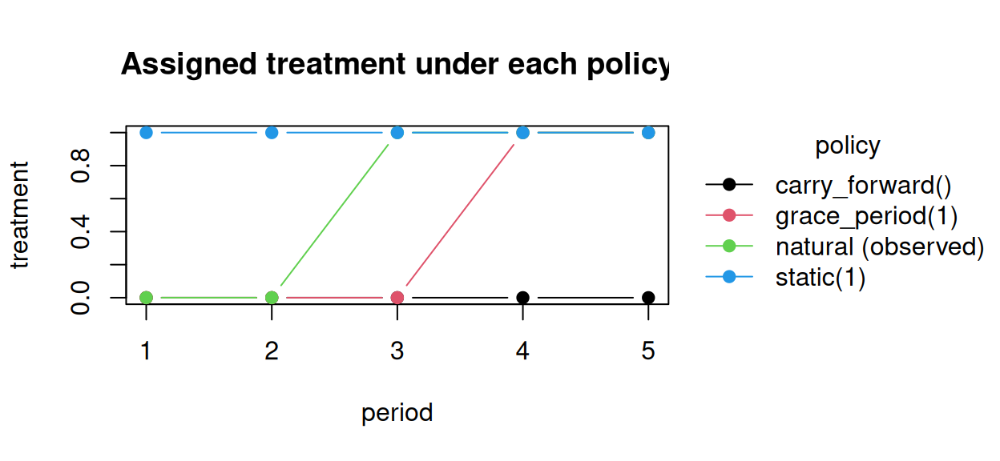

> **来源**：R 包 [causatr](https://github.com/etverse/causatr) 官方文档 [`natural-history-mtps.qmd`](https://etverse.github.io/causatr/vignettes/natural-history-mtps.html)，MIT 许可。
> 本页是中译，**代码与运行结果直接取自原站的渲染输出，未在本站重新执行**。
> Copyright (c) 2026 causatr authors；许可证全文见原仓库 `LICENSE.md`。

```r
library(causatr)
library(tinytable)
library(tinyplot)
```

大多数干预把处理设为**协变量**的函数——`static(1)` 什么都不看，`dynamic(rule)`
读取协变量历史，`shift(δ)` 对观测值做微调。**自然史修正处理策略**（G-LMTP；
[@diaz2026glmtp]）则不同：在时刻 *t* 分配的处理取决于**处理的自然值**——即
患者在没有干预时*本会*接受的处理——在 *t* 时**以及更早各期**的取值。

最典型的例子是**宽限期**或**延迟**：“相对于患者自然开始治疗的时点，把处理起始
推迟一期。”光是要定义这个干预，就得知道患者的自然起始时间，而它是一个反事实量。

本文说明这类策略是什么、为什么它们不能写成 `dynamic()` 规则、causatr 如何用增广
数据的序贯回归来估计它们，以及该估计量与 LMTP 和自然值 IPW 之间的关系。

## 处理的自然值

记 $A_t$ 为第 *t* 期的处理，$L_t$ 为时变协变量。在纵向方案 *d* 下，**自然值**
$A_t(\bar A^d_{t-1})$ 指：在方案一直执行到 *t−1* 的前提下，若干预恰好在 *t* 之前
停止，则在 *t* 时*将会观测到*的处理。它是“患者自行会做什么”的形式化表述。

- **标准 LMTP** [@diaz2023lmtp] 分配 $A^d_t = d_t(A_t, H_t)$——它可以使用*同期*
  自然值 $A_t$ 和协变量历史 $H_t$。`shift()`、`scale_by()`、`threshold()` 都属于
  这一类。
- **自然史 MTP（G-LMTP）** 分配
  $A^d_t = d_t(\bar A_t, H_t)$——它可以使用*整个自然值历史*
  $\bar A_t = (A_1, A_2(A^d_1), \dots, A_t(\bar A^d_{t-1}))$。宽限期、
  延迟和剂量递增上限都需要这一类。

## 各策略分配的处理

看清差别最干净的办法，是跟踪一位患者：他的自然（未干预进程）处理路径在第 3 期
起始并一直持续（吸收态）：$\bar A = (0, 0, 1, 1, 1)$。

```r
nat <- c(0, 0, 1, 1, 1) # natural / observed treatment path
traj <- rbind(
  data.frame(t = 1:5, A = nat, policy = "natural (observed)"),
  data.frame(t = 1:5, A = rep(1, 5), policy = "static(1)"),
  data.frame(t = 1:5, A = c(0, 0, 0, 1, 1), policy = "grace_period(1)"),
  data.frame(t = 1:5, A = rep(nat[1], 5), policy = "carry_forward()")
)
with(traj, tinyplot(
  A ~ t | policy,
  type = "b", pch = 19,
  ylab = "treatment", xlab = "period",
  main = "Assigned treatment under each policy"
))
```



`static(1)` 和 `carry_forward()` 是平的——它们不读取自然值。`grace_period(1)`
跟随自然路径，但整体后移一期：这个*延迟*就是估计目标。关键在于，延迟是相对于
患者**自己**的（反事实）起始时间定义的，这恰恰使它成为一个自然史策略。

## 为什么这不是 `dynamic()` 规则

很容易想把这个延迟写成 `dynamic(\(data, trt) data$lag1_A)`——“把本期处理设成
上一期的处理”。**这是错的**，而且它会悄无声息地出错。causatr 的 ICE 递归是以
*观测到的*滞后处理（`lag1_A`）为条件的，但在延迟策略下，只要策略扰动了轨迹
（处理—状态反馈），*t* 时的自然值就与观测值不再相同。这条规则能跑通、不报错，
还会返回一个数——只不过是错误的因果估计目标。

下面是在一个带协变量反馈的模拟吸收型处理过程上的差距（因此该方案下的自然史确实
会偏离观测历史）：

```r
set.seed(1)
n <- 2500L
tau <- 4L
L0 <- rnorm(n)
A <- matrix(0L, n, tau)
L <- matrix(0, n, tau)
Lprev <- L0
Aprev <- integer(n)
for (t in seq_len(tau)) {
  Lt <- if (t == 1L) 0.5 * L0 + rnorm(n) else 0.5 * Lprev + 0.8 * Aprev + rnorm(n)
  At <- ifelse(Aprev == 1L, 1L, rbinom(n, 1L, plogis(-1 + 0.5 * Lt)))
  A[, t] <- At; L[, t] <- Lt; Lprev <- Lt; Aprev <- At
}
Y <- 1 + 0.8 * rowSums(A) + 0.4 * L[, tau] - 0.5 * L0 + rnorm(n)
d <- data.frame(
  id = rep(seq_len(n), each = tau), time = rep(seq_len(tau), n),
  L0 = rep(L0, each = tau), A = as.vector(t(A)), L = as.vector(t(L)),
  Y = NA_real_
)
d$Y[d$time == tau] <- Y

fit <- causat(
  d, outcome = "Y", treatment = "A",
  confounders = ~ L0, confounders_tv = ~ L,
  id = "id", time = "time", estimator = "gcomp", history = Inf
)
#> Warning: `model_fn` not specified; defaulting to `stats::glm`.
#> ℹ Set `model_fn` explicitly (e.g. `model_fn = stats::glm` or `model_fn = mgcv::gam`).

# Correct: natural-history engine.
mu_grace <- contrast(
  fit, list(delay1 = grace_period(1L)),
  ci_method = "bootstrap", n_boot = 100L
)$estimates$estimate[1]

# Wrong: a dynamic() rule that reads the OBSERVED lag.
naive <- dynamic(function(data, trt) {
  v <- data$lag1_A; v[is.na(v)] <- 0L; v
})
mu_naive <- contrast(
  fit, list(naive = naive), ci_method = "bootstrap", n_boot = 2L
)$estimates$estimate[1]

c(grace_period = mu_grace, naive_dynamic_lag = mu_naive)
#>      grace_period naive_dynamic_lag 
#>          2.281738          1.003515
```

在这个数据生成过程中，一期延迟的真实均值约为 2.30；增广引擎把它恢复到 ~1% 以内，
而朴素的 `dynamic(lag1_A)` 规则则偏离达几十个百分点。`tests/testthat/test-glmtp.R`
测试套件用前向模拟的真值把这一点钉住，并复现了 @diaz2026glmtp
第 6 节的延迟结果。

## causatr 如何估计：增广数据

标准的序贯回归 g-formula 在这类策略下会失效：在向后积分的某一步，它需要把同一个
过去的处理同时设成**两个**值——一个是它所条件化的值（出现在 $P(a_{t+1}\mid a_t)$
中），另一个是策略向前传递的值（出现在 $d_{t+1}(\dots, a_t)$ 中）。

解决办法（论文中的增广数据）是把两者**解耦**。每条观测按每一个可能的自然处理史
序列 $\bar s_t$ 各复制一份，该序列作为*标签*在向后递归中一路传递：

| original row | natural-history label $\bar s_t$ | response used |
|---|---|---|
| 患者 *i* | $(0, 0)$ | $q_{t+1}((0,0), A_{t+1,i}, H_{t+1,i})$ |
| 患者 *i* | $(0, 1)$ | $q_{t+1}((0,1), A_{t+1,i}, H_{t+1,i})$ |
| 患者 *i* | $(1, 0)$ | $q_{t+1}((1,0), A_{t+1,i}, H_{t+1,i})$ |
| 患者 *i* | $(1, 1)$ | $q_{t+1}((1,1), A_{t+1,i}, H_{t+1,i})$ |

每个标签单独拟合一个结局模型（这样条件化的值和策略输入的值绝不会冲突），随后在
预测阶段施加策略。在模型设定正确时，causatr 的参数化插入式估计量是 $\sqrt n$ 相合
的，并用 ID 聚类 bootstrap 做推断。处理的**滞后列保留其观测值**（它们是条件化用的
历史）；只有*标签*携带反事实的自然史——这个解耦就是全部诀窍。

## 实例演示

`grace_period(window)` 推迟起始处理；`carry_forward()` 把所有人保持在各自的基线
水平。两者都需要在离散处理下做纵向 G-computation 拟合，并使用 ID 聚类 bootstrap。

```r
res <- contrast(
  fit,
  interventions = list(
    delay1 = grace_period(1L),
    locf = carry_forward(),
    natural = NULL
  ),
  reference = "natural",
  ci_method = "bootstrap", n_boot = 200L
)
tt(res$estimates)

est <- res$estimates
with(est, tinyplot(
  x = factor(intervention, levels = intervention), y = estimate,
  ymin = ci_lower, ymax = ci_upper,
  type = "pointrange", ylab = expression(E(Y^d)), xlab = ""
))
```

相对自然进程，推迟起始会降低反事实均值（接受处理的人期更少）；carry-forward
（保持在基线）则进一步降低它。

## 与 LMTPs 及自然值 IPW 的关系

自然值干预有其渊源。下表把 causatr 的 G-LMTP 引擎与标准 LMTP 框架以及最初的 IPW
做法并列对照。

| | @young2014natural | LMTP [@diaz2023lmtp] | G-LMTP [@diaz2026glmtp] |
|---|---|---|---|
| 策略读取 | 自然值（奠基性工作） | **同期**自然值 $A_t$ + $H_t$ | 自然值**历史** $\bar A_t$ + $H_t$ |
| 估计方式 | IPW（密度比 $g^d/g$） | G-computation / IPW / **双稳健** TMLE/SDR | **增广数据**序贯回归 |
| 在 causatr 中 | IPW 引擎（`shift`/`scale_by`/`ipsi`） | IPW 引擎 | **G-computation** 引擎（`grace_period`/`carry_forward`） |

两点实践提示：

- **`lmtp` 在这里不是有效的 oracle。** `lmtp` 包只对观测数据施加一次平移，算出的
  是*标准*的 LMTP——只要策略扰动了轨迹，它就与自然史目标不同。正确的参照是对
  自然史机制做前向 Monte-Carlo 模拟（论文的命题 1），测试套件用的就是它。
- **为什么 causatr 里的 G-LMTP 只走 G-computation。** 对*依赖历史*的自然值策略，
  Young 式的 IPW 估计量需要整条轨迹的自然史密度与观测密度之比；正值性很脆弱，
  方差会爆炸。增广 G-computation 路线绕开了这一点——这就是为什么宽限期走
  G-computation 引擎，而同期自然值的 MTPs（shift/scale/ipsi）用 IPW 密度比引擎。

## 适用范围与限制

- **仅支持单一标量离散处理。** 增强需要枚举自然史的支撑集，只有当暴露是离散变量时
  该支撑集才是有限的。连续处理会被拒绝（`shift()` / `scale_by()` 才是连续型的
  MTPs）；增强引擎支持二值**以及**有序/计数型处理。多元（向量值）处理同样会被拒绝
  （`causatr_glmtp_multivariate`）：原论文只针对标量暴露推导了增强，而联合离散支撑集
  要枚举的是联合基数的期数次幂——计算上不可行，这也正是该论文自己在结论中指出的局限。
- **仅支持纵向 G-computation。** 在 IPW / AIPW / 匹配下，以及对于点处理，
  `grace_period()` / `carry_forward()` 都会被拒绝。
- **bootstrap *与* 三明治方差。** `ci_method = "bootstrap"`（按 ID 聚类）和
  `ci_method = "sandwich"`（对每个 (step, label) 做解析式 M-估计）两种都支持。
- **剂量爬坡上限**（`cap_escalation()`）以及其他非线性有序策略，只要剂量以足够灵活的
  形式进入每步模型，就能被相合地估计——见下文*灵活剂量模型*。

## 有序处理的灵活剂量模型

默认情况下，处理以**裸数值**主效应的形式进入每一步的结局模型。对二值处理来说这恰好是
饱和的，但对**有序 / 序数型剂量**而言，单一的线性斜率可能会误设非单调或*带折点*的反事实
响应——典型的例子就是*剂量爬坡上限*，它的策略关于剂量是分段线性的。这时，即便增强递归
本身完全正确，裸数值的插入式估计仍会带有一个虽小但持续存在的渐近偏倚。

`cap_escalation(delta)` 正是针对这种情形的自然史策略：它把**自然**剂量每期的增幅上限设为
`delta`，做法是比较 $t$ 时刻的自然剂量与 $t-1$ 时刻的自然剂量。`treatment_form` 允许剂量
以变换后的项进入每步模型，而策略设置的仍然是*数值型*剂量列——改变的只是模型的设计项。
下面是一个完整示例，剂量为序数型的 `{0, 1, 2}`，在三期内逐步爬坡：

```r
set.seed(2)
n <- 2000L; tau <- 3L; m <- 2L           # dose levels {0, 1, 2}
L0 <- rnorm(n)
dose <- matrix(0L, n, tau); L <- matrix(0, n, tau)
Lprev <- L0; Aprev <- integer(n)
for (t in seq_len(tau)) {
  Lt <- 0.5 * Lprev + 0.3 * Aprev + rnorm(n)
  step <- rbinom(n, 2L, plogis(-0.2 + 0.6 * Lt))
  At <- pmin(m, Aprev + step)            # natural dose escalates, capped at 2
  dose[, t] <- At; L[, t] <- Lt; Lprev <- Lt; Aprev <- At
}
Y <- 1 + 0.7 * rowSums(dose) + 0.4 * L[, tau] - 0.5 * L0 + rnorm(n)
dose_data <- data.frame(
  id = rep(seq_len(n), each = tau), t = rep(seq_len(tau), n),
  L0 = rep(L0, each = tau), dose = as.vector(t(dose)),
  L = as.vector(t(L)), Y = NA_real_
)
dose_data$Y[dose_data$t == tau] <- Y

fit_cap <- causat(
  dose_data, outcome = "Y", treatment = "dose",
  confounders = ~ L0, confounders_tv = ~ L,
  id = "id", time = "t", estimator = "gcomp", history = Inf,
  treatment_form = ~ factor(dose)        # each dose level its own coefficient
)
#> Warning: `model_fn` not specified; defaulting to `stats::glm`.
#> ℹ Set `model_fn` explicitly (e.g. `model_fn = stats::glm` or `model_fn = mgcv::gam`).
res_cap <- contrast(
  fit_cap,
  interventions = list(cap1 = cap_escalation(1), natural = NULL),
  reference = "natural", ci_method = "bootstrap", n_boot = 100L
)
tt(res_cap$estimates)
```

| intervention | estimate | se | ci_lower | ci_upper |
|---|---|---|---|---|
| cap1 | 4.100219 | 0.03991312 | 3.995161 | 4.156022 |
| natural | 4.181199 | 0.03954115 | 4.079189 | 4.234457 |

把每期爬坡幅度限制为一个级别，会使反事实均值低于自然进程（受上限约束的患者积累的
高剂量期数更少）。使用 `~ factor(dose)` 时每个剂量水平都有各自的系数，于是带折点的
封顶剂量响应能在抽样误差范围内被还原，而不是被一条斜率硬拟合；相比之下，当上限起作用
时，裸数值的默认设定会带来一个虽小但在固定随机种子下稳定出现的偏倚。滞后项会自动展开
（`factor(dose)` → `factor(lag1_dose)`）。这个灵活项只适用于纵向 G-computation，它对
标准的 ICE 方案（`static` / `shift` / `dynamic`）与对自然史策略同样有益。在
`factor(dose)` 下，干预必须把剂量保持在已观测到的水平之内（出现新水平会导致预测失败）；
`splines::ns(dose, df)` 则可以平滑外推。

## 参考文献

::: {#refs}
:::

