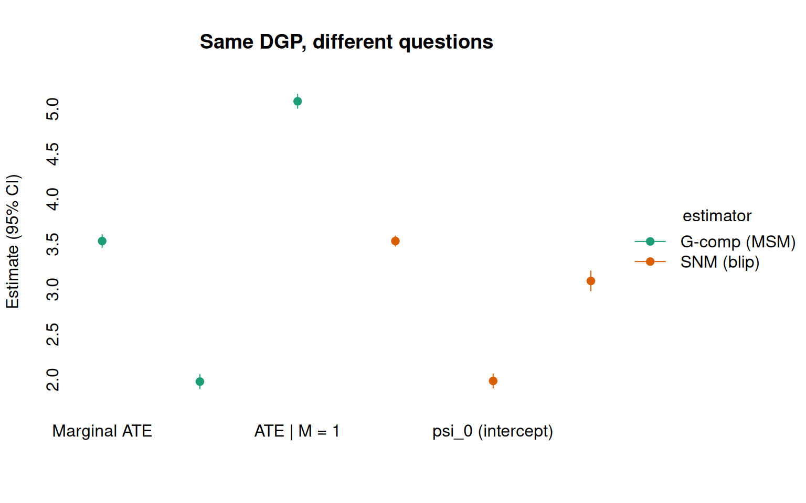
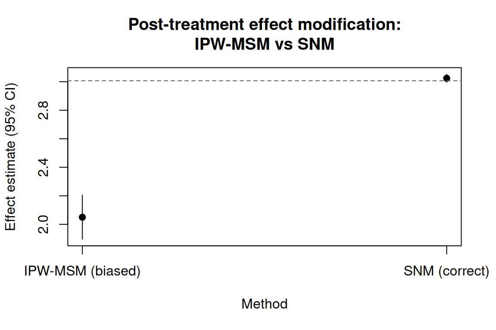
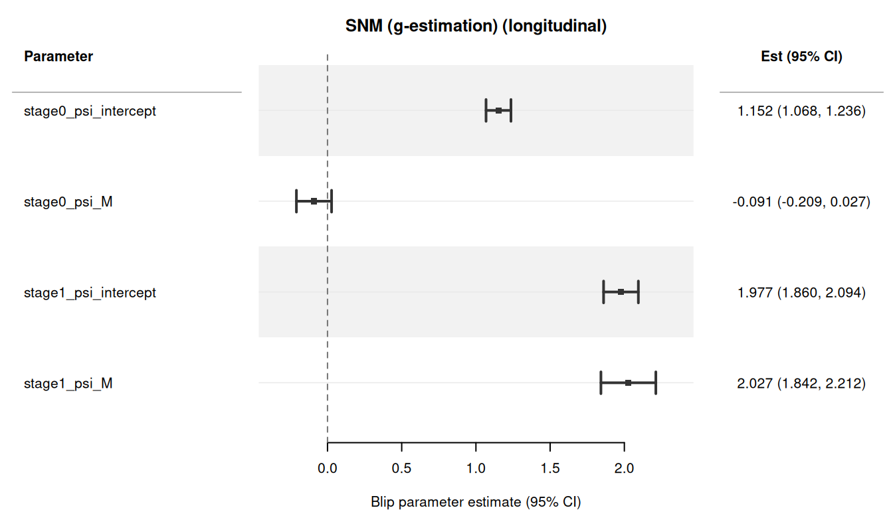
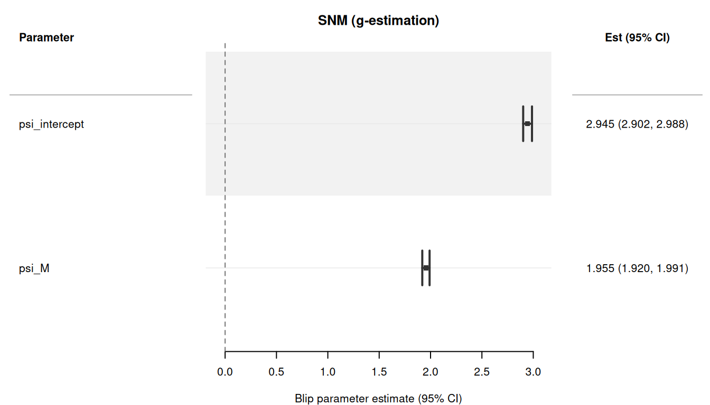

> **来源**：R 包 [causatr](https://github.com/etverse/causatr) 官方文档 [`snm.qmd`](https://etverse.github.io/causatr/vignettes/snm.html)，MIT 许可。
> 本页是中译，**代码与运行结果直接取自原站的渲染输出，未在本站重新执行**。
> Copyright (c) 2026 causatr authors；许可证全文见原仓库 `LICENSE.md`。

结构嵌套均值模型（SNMM）是 Robins 三角的第三条边——另外两条是 g-formula（G-computation/ICE）和逆概率加权（IPW-MSM）。它们估计的是 **blip 参数**，用来刻画每个时间点上的处理在给定协变量的条件下如何因果地改变结局。

最重要的特性是：SNMM 能正确处理**时变效应修饰**——即效应修饰变量本身受处理影响。IPW-MSM 和匹配要求效应修饰变量必须是基线（处理前）变量；在 MSM 中对处理后的效应修饰变量做条件化，会打开对撞路径并使估计目标产生偏倚 [@robins2000msmvssnm]。SNMM 只要处理模型设定正确就能识别 blip，因此处理后的效应修饰变量是合法的 [@vansteelandt2014snm]。

## SNM 估计什么，MSM 又估计什么

在深入到只有 SNM 才管用的场景之前，先看清它们*不同*在哪里会很有帮助——哪怕在两类估计量都完全有效的场景里也是如此。

核心区别在于 [@robins2000msmvssnm]：

- **MSM** 回答的是：“如果所有人都接受处理 $a$，总体的平均结局会是多少？”其估计目标是 $E[Y(a)]$，一个边际反事实均值。
- **SNM** 回答的是：“实际接受的处理带来的因果效应是多少，它如何随协变量变化？”其估计目标是 **blip 函数** $\gamma(a, \ell; \psi) = E[Y(a) - Y(0) \mid A = a, L = \ell]$，一个条件处理效应结构。

两者编码的是同一个底层因果真相，只是透镜不同。MSM 给出的是假想方案下汇总层面的潜在结局。SNM 给出的是处理效应的*架构*——它如何在不同协变量层之间变化。

### 一个共享的 DGP

考虑一个简单的点处理设定，带一个基线二值效应修饰变量 $M$：

```r
library(causatr)

set.seed(1800)
n <- 5000
L <- rnorm(n)
M <- rbinom(n, 1, 0.5)
A <- rbinom(n, 1, plogis(0.3 * L + 0.2 * M))
Y <- 1 + 2 * A + 3 * A * M + 0.5 * L + 0.8 * M + rnorm(n)
d <- data.table::data.table(Y = Y, A = A, L = L, M = M)
```

结构性真值：

- Blip：$\gamma(A, M; \psi) = A \cdot (\psi_0 + \psi_M \cdot M)$，其中 $\psi_0 = 2$、$\psi_M = 3$。
- 当 $M = 0$ 时：处理效应为 $2$。
- 当 $M = 1$ 时：处理效应为 $2 + 3 = 5$。
- 边际 ATE：$\psi_0 + \psi_M \cdot P(M = 1) = 2 + 3 \times 0.5 = 3.5$。

这三个数字都是对同一个 DGP 的正确描述。问题只在于你想要哪种表述方式。

### MSM 的问题：干预之下会发生什么？

G-computation 和 IPW-MSM 都是先对每个干预方案计算反事实均值 $\hat{E}[Y(a)]$，再把它们做对比。输出是一个 ATE——单个汇总数字：

```r
fit_gc <- causat(d, outcome = "Y", treatment = "A",
                 confounders = ~ L + M + A:M, estimator = "gcomp",
                 model_fn = stats::glm)
r_gc <- contrast(fit_gc,
                 interventions = list(a1 = static(1), a0 = static(0)),
                 type = "difference", ci_method = "sandwich")
r_gc$contrasts
#>    comparison  estimate         se  ci_lower  ci_upper
#>        <char>     <num>      <num>     <num>     <num>
#> 1:   a0 vs a1 -3.535713 0.03569227 -3.605668 -3.465757
```

G-computation 的估计值给出 $\widehat{\text{ATE}} \approx 3.5$，即正确的边际处理效应。它回答的是：“平均而言，处理有多大帮助？”

要揭示各亚组特有的效应，MSM/G-computation 这条路线可以用 `by` 做分层：

```r
r_gc_by <- contrast(fit_gc,
                    interventions = list(a1 = static(1), a0 = static(0)),
                    type = "difference", ci_method = "sandwich",
                    by = "M")
r_gc_by$contrasts
#>    comparison  estimate         se  ci_lower  ci_upper     by  n_by
#>        <char>     <num>      <num>     <num>     <num> <char> <int>
#> 1:   a0 vs a1 -1.977829 0.03973574 -2.055709 -1.899948      0  2493
#> 2:   a0 vs a1 -5.084897 0.03959283 -5.162498 -5.007297      1  2507
```

现在我们看到了各亚组特有的 ATE：$M = 0$ 时为 $\approx 2$，$M = 1$ 时为 $\approx
5$。但这些仍然是反事实均值之差——MSM 框架里没有任何单个参数直接代表效应修饰。你得把估计量跑两遍（或者用 `by`），再靠肉眼比较各亚组的估计值。效应修饰本身是一个*派生*量，而不是模型参数。

### SNM 的问题：处理效应的结构是什么？

SNM 直接估计 blip 参数 $\psi$，它以协变量的函数形式描述处理如何改变结局：

```r
fit_snm <- causat(d, outcome = "Y", treatment = "A",
                  confounders_outcome = ~ L + M + A:M,
                  confounders_treatment = ~ L + M,
                  estimator = "snm",
                  treatment_free = ~ L + M)
#> Warning: `propensity_model_fn` not specified; defaulting to `stats::glm`.
#> ℹ Set `propensity_model_fn` explicitly if you need a different fitter (e.g. `mgcv::gam`).
r_snm <- contrast(fit_snm, ci_method = "sandwich")
r_snm$estimates
#>        parameter estimate         se ci_lower ci_upper
#>           <char>    <num>      <num>    <num>    <num>
#> 1: psi_intercept 1.984661 0.04000629 1.906250 2.063072
#> 2:         psi_M 3.093240 0.05641067 2.982677 3.203803
```

SNM 的输出不是反事实均值，也不是不同干预方案之间的对比。它就是**效应修饰结构本身**：$\hat\psi_0 \approx 2$
（$M = 0$ 时的效应）和 $\hat\psi_M \approx 3$（$M = 1$ 时的额外效应）。这些量可以直接解释：

- 处理对所有人都有益（$\psi_0 > 0$），但在 $M = 1$ 时益处大得多（$\psi_M > 0$，
  而 $z$ 检验（针对 $\psi_M$）就是效应修饰的直接检验）。
- 不需要事后分层，也不需要亚组比较——blip 参数*就是*效应修饰的估计值。

### 把两者联系起来

MSM 的边际 ATE 和 SNM 的 blip 参数编码的是同一个因果事实。平均后的 blip，$\Delta = (a_1 - a_0) \cdot (\hat\psi_0 + \hat\psi_M
\cdot \bar{M})$，可以还原出 MSM 的 ATE：

```r
r_avg <- contrast(fit_snm, treatment_values = c(0, 1))
r_avg$estimates
#>          parameter estimate         se ci_lower ci_upper
#>             <char>    <num>      <num>    <num>    <num>
#> 1: avg_blip_effect 3.535611 0.02820541  3.48033 3.590893
```

平均后的 blip 估计值（$\approx 3.5$）与 G-computation 的估计值一致。SNM 把这个平均值
分解为各个组成部分；MSM 则直接报告合成后的结果。

下图把全部六个估计值并排展示。G-computation（MSM）面板报告三个聚合层次上的反事实
均值之差；SNM（blip）面板报告结构效应参数。两者都还原了真值（虚线），只是透过了不同
的视角：

```r
comp_df <- data.frame(
  estimator = factor(
    rep(c("G-comp (MSM)", "SNM (blip)"), each = 3),
    levels = c("G-comp (MSM)", "SNM (blip)")
  ),
  parameter = factor(
    c("Marginal ATE", "ATE | M = 0", "ATE | M = 1",
      "Averaged blip", "psi_0 (intercept)", "psi_M (modifier)"),
    levels = c("psi_M (modifier)", "psi_0 (intercept)", "Averaged blip",
               "ATE | M = 1", "ATE | M = 0", "Marginal ATE")
  ),
  estimate = c(-r_gc$contrasts$estimate[1],
               -r_gc_by$contrasts$estimate[1],
               -r_gc_by$contrasts$estimate[2],
               r_avg$estimates$estimate[1],
               r_snm$estimates$estimate[1],
               r_snm$estimates$estimate[2]),
  ci_lower = c(-r_gc$contrasts$ci_upper[1],
               -r_gc_by$contrasts$ci_upper[1],
               -r_gc_by$contrasts$ci_upper[2],
               r_avg$estimates$ci_lower[1],
               r_snm$estimates$ci_lower[1],
               r_snm$estimates$ci_lower[2]),
  ci_upper = c(-r_gc$contrasts$ci_lower[1],
               -r_gc_by$contrasts$ci_lower[1],
               -r_gc_by$contrasts$ci_lower[2],
               r_avg$estimates$ci_upper[1],
               r_snm$estimates$ci_upper[1],
               r_snm$estimates$ci_upper[2]),
  truth = c(3.5, 2, 5, 3.5, 2, 3)
)

tinyplot::tinyplot(
  estimate ~ parameter | estimator,
  data = comp_df,
  type = "pointrange",
  ymin = comp_df$ci_lower,
  ymax = comp_df$ci_upper,
  pch = 19,
  ylab = "Estimate (95% CI)",
  xlab = "",
  main = "Same DGP, different questions",
  palette = "dark2",
  axes = "l"
)
```



亚组特异的 MSM 估计值（$\text{ATE} \mid M = 0$ 与 $\text{ATE}
\mid M = 1$）对应于在各个修饰因子水平上取值的 blip。但这个映射是单向的：你总是可以把
blip 参数聚合成 ATE，却无法在不指定 blip 模型的情况下把 ATE 分解成 blip 参数。

### 建模框架何时才重要？

在这个简单的基线修饰因子情形里，两种估计量都可用，选择取决于你想报告
什么：

| Goal | Better tool |
|---|---|
| 群体层面的处理策略决策 | MSM（各方案下的反事实均值） |
| 理解*谁从处理中获益最多* | SNM（blip 参数直接刻画异质性） |
| 效应修饰的正式检验 | SNM（针对 $\psi_M$ 的 $z$ 检验） |
| 特定干预下的剂量-反应 | MSM 配合 `shift()` 或 `scale_by()` |
| 最优处理规则（DTR）估计 | SNM（blip 的符号决定最优分配） |

下一节展示 SNM 不只是方便、而是**必需**的场景：修饰因子本身受处理影响。
在那里，MSM 只要纳入 $M$ 就会引入对撞偏倚，而 SNM 天然能处理这种情形。

## 何时必须使用 SNM？

当你的研究问题涉及**由一个本身受处理影响的变量带来的效应修饰**时，标准
估计量会给出有偏倚的结果。本节用一个模拟 DGP 演示这个问题，并说明 SNM
g-估计能还原真值。

### DGP

```r
set.seed(1801)
n <- 5000
L <- rnorm(n)
A <- rnorm(n, mean = 0.5 * L, sd = 1)

# M is post-treatment: it depends on A
M <- 0.3 * A + 0.5 * L + rnorm(n, sd = sqrt(0.5))

# Y depends on A, L, and the A*M interaction
Y <- 2 + 3 * A + 1.5 * L + 2 * A * M + rnorm(n)
d <- data.table::data.table(Y = Y, A = A, L = L, M = M)
```

结构 blip 为 $\gamma(a, m; \psi) = a \cdot (\psi_0 + \psi_M \cdot m)$，
真值是 $\psi_0 = 3$ 与 $\psi_M = 2$。

### IPW-MSM：有偏倚

当我们在 IPW-MSM 中把 M 作为效应修饰纳入时，估计量就以 A 的后代为条件。
这会打开一条非因果通路，产生严重偏倚的估计值：

```r
fit_ipw <- causat(d, outcome = "Y", treatment = "A",
                  confounders = ~ L + A:M, estimator = "ipw")
#> Warning: `model_fn` not specified; defaulting to `stats::glm`.
#> ℹ Set `model_fn` explicitly (e.g. `model_fn = stats::glm` or `model_fn = mgcv::gam`).
#> Warning: `propensity_model_fn` not specified; defaulting to `stats::glm`.
#> ℹ Set `propensity_model_fn` explicitly if you need a different fitter (e.g. `mgcv::gam`).
r_ipw <- contrast(fit_ipw,
                  interventions = list(a1 = shift(1), a0 = shift(0)),
                  type = "difference")
r_ipw$contrasts
#>    comparison  estimate         se  ci_lower  ci_upper
#>        <char>     <num>      <num>     <num>     <num>
#> 1:   a0 vs a1 -2.049563 0.07879844 -2.204005 -1.895121
```

由于 $M = 0.3A + 0.5L + \epsilon$，且 $A$ 与 $L$ 的均值都为零，所以 $\bar{M}
\approx 0$，真实的平均 blip 为 $\approx 3 + 2 \times 0 = 3$。IPW 估计值
明显偏离这个数值。

### SNM g-估计：正确

SNM 以处理残差作为工具变量来识别 blip。再配一个无处理模型（treatment-free）
吸收 $L \to Y$ 通路，结构 blip 参数就能被还原：

```r
fit_snm <- causat(d, outcome = "Y", treatment = "A",
                  confounders_outcome = ~ L + A:M,
                  confounders_treatment = ~ L,
                  estimator = "snm",
                  treatment_free = ~ L)
#> Warning: `propensity_model_fn` not specified; defaulting to `stats::glm`.
#> ℹ Set `propensity_model_fn` explicitly if you need a different fitter (e.g. `mgcv::gam`).

# Blip parameter table
r_blip <- contrast(fit_snm, ci_method = "sandwich")
r_blip$estimates
#>        parameter estimate         se ci_lower ci_upper
#>           <char>    <num>      <num>    <num>    <num>
#> 1: psi_intercept 3.017628 0.01443905 2.989328 3.045928
#> 2:         psi_M 1.988832 0.01263058 1.964076 2.013587
```

估计得到的 $\hat\psi_0 \approx 3$ 和 $\hat\psi_M \approx 2$ 与真值高度吻合，
标准误也很小。

### 平均 blip 效应

要得到单一的汇总数值（比如 ATE），使用 `treatment_values`：

```r
r_avg <- contrast(fit_snm, treatment_values = c(0, 1))
r_avg$estimates
#>          parameter estimate         se ci_lower ci_upper
#>             <char>    <num>      <num>    <num>    <num>
#> 1: avg_blip_effect 3.024219 0.01443917 2.995918 3.052519
```

### 可视化偏倚

两种做法的对比在图上最清楚。IPW-MSM 的估计值（向下偏倚）远离真实的平均
blip（$\approx 3$，虚线），而 SNM 还原了真值：

```r
bias_df <- data.frame(
  Method = factor(
    c("IPW-MSM (biased)", "SNM (correct)"),
    levels = c("IPW-MSM (biased)", "SNM (correct)")
  ),
  estimate = c(-r_ipw$contrasts$estimate[1],
               r_avg$estimates$estimate[1]),
  ci_lower = c(-r_ipw$contrasts$ci_upper[1],
               r_avg$estimates$ci_lower[1]),
  ci_upper = c(-r_ipw$contrasts$ci_lower[1],
               r_avg$estimates$ci_upper[1])
)

# Approximate truth: 3 + 2 * mean(M) where M = 0.3*A + 0.5*L + noise
avg_blip_truth <- 3 + 2 * mean(d$M)

tinyplot::tinyplot(
  estimate ~ Method,
  data = bias_df,
  type = "pointrange",
  ymin = bias_df$ci_lower,
  ymax = bias_df$ci_upper,
  pch = 19,
  ylab = "Effect estimate (95% CI)",
  main = "Post-treatment effect modification:\nIPW-MSM vs SNM"
)
abline(h = avg_blip_truth, lty = 2, col = "grey40")
```



## 基本用法

### 带效应修饰的单时点处理

```r
set.seed(42)
n <- 2000
L <- rnorm(n)
sex <- rbinom(n, 1, 0.5)
A <- rbinom(n, 1, plogis(0.3 * L + 0.2 * sex))
Y <- 1 + 2 * A + L + 1.5 * A * sex + rnorm(n)
d <- data.table::data.table(Y = Y, A = A, L = L, sex = sex)

fit <- causat(d, outcome = "Y", treatment = "A",
              confounders_outcome = ~ L + sex + A:sex,
              confounders_treatment = ~ L + sex,
              estimator = "snm",
              treatment_free = ~ L + sex)
#> Warning: `propensity_model_fn` not specified; defaulting to `stats::glm`.
#> ℹ Set `propensity_model_fn` explicitly if you need a different fitter (e.g. `mgcv::gam`).

contrast(fit, ci_method = "sandwich")
```

| parameter | estimate | se | ci_lower | ci_upper |
|---|---|---|---|---|
| psi_intercept | 1.921 | 0.069 | 1.786 | 2.056 |
| psi_sex | 1.658 | 0.095 | 1.473 | 1.844 |

blip 参数为：$\psi_{\text{intercept}}$（`sex = 0` 时的处理效应）和
$\psi_{\text{sex}}$（`sex = 1` 时的额外效应）。

### 连续处理

SNM 天然适用于连续处理——这正是 SNMM 的经典场景。
处理模型默认是高斯 GLM：

```r
set.seed(101)
n <- 2000
L <- rnorm(n)
A <- rnorm(n, mean = 0.5 * L, sd = 1)
M <- as.numeric(L > 0)
Y <- 2 + 3 * A + 1.5 * L + 2 * A * M + rnorm(n)
d <- data.table::data.table(Y = Y, A = A, L = L, M = M)

fit <- causat(d, outcome = "Y", treatment = "A",
              confounders_outcome = ~ L + A:M,
              confounders_treatment = ~ L,
              estimator = "snm")
#> Warning: `propensity_model_fn` not specified; defaulting to `stats::glm`.
#> ℹ Set `propensity_model_fn` explicitly if you need a different fitter (e.g. `mgcv::gam`).

contrast(fit, ci_method = "sandwich")
```

| parameter | estimate | se | ci_lower | ci_upper |
|---|---|---|---|---|
| psi_intercept | 2.905 | 0.049 | 2.81 | 3.001 |
| psi_M | 2.13 | 0.082 | 1.969 | 2.292 |

### 用 treatment-free 模型提升有效性

`treatment_free` 参数指定一个结局模型 $E[Y \mid L]$，用来吸收
$L \to Y$ 带来的方差，从而提升有效性
[@vansteelandt2014snm]。当 blip 设定正确时，它不改变点估计值——只会缩小标准误：

```r
# Without treatment-free model
r_no_tf <- contrast(fit, ci_method = "sandwich")

# With treatment-free model
fit_tf <- causat(d, outcome = "Y", treatment = "A",
                 confounders_outcome = ~ L + A:M,
                 confounders_treatment = ~ L,
                 estimator = "snm",
                 treatment_free = ~ L)
#> Warning: `propensity_model_fn` not specified; defaulting to `stats::glm`.
#> ℹ Set `propensity_model_fn` explicitly if you need a different fitter (e.g. `mgcv::gam`).
r_tf <- contrast(fit_tf, ci_method = "sandwich")

# Compare SEs
data.table::data.table(
  parameter = r_no_tf$estimates$parameter,
  se_without_tf = r_no_tf$estimates$se,
  se_with_tf = r_tf$estimates$se,
  reduction_pct = round(100 * (1 - r_tf$estimates$se / r_no_tf$estimates$se), 1)
)
#>        parameter se_without_tf se_with_tf reduction_pct
#>           <char>         <num>      <num>         <num>
#> 1: psi_intercept    0.04879214 0.03217362          34.1
#> 2:         psi_M    0.08245686 0.04475478          45.7
```

## 解释

SNM 的 blip 参数具有直接的因果解释：

- **$\psi_{\text{intercept}}$**：在参照层（所有效应修饰因子 = 0）中，处理
  增加一个单位所产生的因果效应。
- **$\psi_{\text{modifier}}$**：效应修饰因子每增加一个单位带来的额外因果
  效应。这就是效应修饰参数。

平均 blip 效应 $\Delta = (a_1 - a_0) \cdot (\hat\psi_0 + \sum_j \hat\psi_j \bar{m}_j)$
是一个类似 ATE 的汇总量，它在观测到的效应修饰因子分布上对 blip 取
平均。

## 与其他估计量的主要区别

| Feature | gcomp | IPW-MSM | SNM |
|---|---|---|---|
| 时变 EM | 需要正确设定的高维结局模型 | 有偏倚（对处理后变量取条件） | 正确（核心应用场景） |
| 识别 | 结局模型 | 处理模型 | 处理模型 |
| 输出 | 反事实均值 | 反事实均值 | blip 参数 |
| `interventions =` | 是 | 是 | 否（改用 `treatment_values =`） |
| 近正值性 | 外推风险 | 权重爆炸 | 退化平缓 |

## 纵向 SNM

SNM 可以自然地推广到时变处理。后向序贯 g-估计算法 [@robins1994snm]
从最后一个时间点开始反向迭代，逐阶段估计 blip 参数
$\psi_k$：

1. 在阶段 $K$，用观测到的结局 $Y$ 求解 blip 方程，得到 $\psi_K$。
2. 在阶段 $k < K$，把 $Y$ 替换为**后向变换结局**
   $H_k = Y - \sum_{j > k} \gamma_j(A_j, \bar{L}_j; \hat\psi_j)$——即从
   $k+1$ 起不接受处理时的假设结局。

### 带时变效应修饰的两期 DGP

这是最核心的用例：效应修饰变量 $M_1 = \mathbf{1}\{L_1 > 0\}$ 是处理后变量（它依赖于 $A_0$），因此 IPW-MSM 若把它纳入模型就会产生对撞偏倚。SNM 则能正确识别各阶段的 blip。

```r
set.seed(18)
n <- 5000

L0 <- rnorm(n)
A0 <- rbinom(n, 1, plogis(0.3 * L0))
L1 <- 0.5 * L0 + 0.3 * A0 + rnorm(n, sd = sqrt(0.5))
M1 <- as.numeric(L1 > 0)
A1 <- rbinom(n, 1, plogis(0.3 * L1 + 0.2 * A0))
Y <- 2 + 1 * A0 + 2 * A1 + 2 * A1 * M1 + 1.5 * L0 + 0.5 * L1 + rnorm(n)

d_long <- data.table::rbindlist(list(
  data.table::data.table(id = seq_len(n), time = 0L,
    A = A0, L = L0, M = as.numeric(L0 > 0), Y = NA_real_),
  data.table::data.table(id = seq_len(n), time = 1L,
    A = A1, L = L1, M = M1, Y = Y)
))

fit_long <- causat(d_long, outcome = "Y", treatment = "A",
  confounders_outcome = ~ A:M,
  confounders_tv = ~ L,
  id = "id", time = "time", type = "longitudinal",
  estimator = "snm",
  treatment_free = ~ L)
#> Warning: `propensity_model_fn` not specified; defaulting to `stats::glm`.
#> ℹ Set `propensity_model_fn` explicitly if you need a different fitter (e.g. `mgcv::gam`).

result_long <- contrast(fit_long, ci_method = "sandwich")
result_long$estimates
#>               parameter    estimate         se   ci_lower   ci_upper
#>                  <char>       <num>      <num>      <num>      <num>
#> 1: stage0_psi_intercept  1.15210608 0.04282554  1.0681696 1.23604259
#> 2:         stage0_psi_M -0.09101977 0.06044861 -0.2094969 0.02745732
#> 3: stage1_psi_intercept  1.97726358 0.05978991  1.8600775 2.09444964
#> 4:         stage1_psi_M  2.02718665 0.09437425  1.8422165 2.21215678
```

真值为 $\psi_{0,\text{intercept}} = 1$、$\psi_{1,\text{intercept}} = 2$、$\psi_{1,M} = 2$。SNM 通过后向序贯 g-估计和聚类稳健三明治标准误恢复出这些各阶段 blip 参数。

森林图展示了所有各阶段 blip 参数及其 95% CI：

```r
plot(result_long)
```



## 分类处理

SNM 同样适用于分类处理（$k > 2$ 个水平）。处理模型是通过 `nnet::multinom()` 拟合的多项 logistic 回归。blip 展开为 $(K-1)$ 个水平特异的参数（相对于参考水平）：

```r
set.seed(1803)
n <- 3000
L <- rnorm(n)

# Multinomial probabilities from softmax
eta1 <- 0.2 + 0.5 * L
eta2 <- -0.3 + 0.3 * L
denom <- 1 + exp(eta1) + exp(eta2)
A_num <- sapply(seq_len(n), function(i) {
  sample(0:2, 1, prob = c(1 / denom[i], exp(eta1[i]) / denom[i],
                           exp(eta2[i]) / denom[i]))
})
A <- factor(A_num, levels = c("0", "1", "2"))
Y <- 2 + 0.8 * (A_num == 1) + 1.5 * (A_num == 2) + L + rnorm(n)
d <- data.table::data.table(Y = Y, A = A, L = L)

fit_cat <- causat(d, outcome = "Y", treatment = "A",
                  confounders = ~ L,
                  estimator = "snm",
                  propensity_model_fn = nnet::multinom)
#> No effect-modification terms (e.g. `A:modifier`) found in confounders.
#> ℹ The SNMM blip reduces to a single constant-effect parameter (equivalent to an ATE). Add `A:modifier` terms to the confounders formula to estimate effect modification.

contrast(fit_cat, ci_method = "sandwich")
```

| parameter | estimate | se | ci_lower | ci_upper |
|---|---|---|---|---|
| level_1_psi_intercept | 0.702 | 0.042 | 0.621 | 0.784 |
| level_2_psi_intercept | 1.467 | 0.049 | 1.372 | 1.562 |

真值为 $\psi_1 = 0.8$（水平 1 对 0）和 $\psi_2 = 1.5$（水平 2 对 0）。注意 `treatment_values` 对分类 SNM 不可用——各水平的 blip 参数本身就是估计目标。

## 计数处理

泊松或负二项处理使用相应的倾向模型。g-估计方程中使用残差 $R = A - \hat\lambda$：

```r
set.seed(1804)
n <- 3000
L <- rnorm(n)
A <- rpois(n, lambda = exp(0.5 + 0.3 * L))
M <- as.numeric(L > 0)
Y <- 2 + 0.5 * A + 0.3 * A * M + L + rnorm(n)
d <- data.table::data.table(Y = Y, A = A, L = L, M = M)

fit_count <- causat(d, outcome = "Y", treatment = "A",
                    confounders_outcome = ~ L + A:M,
                    confounders_treatment = ~ L,
                    estimator = "snm",
                    propensity_family = "poisson")
#> Warning: `propensity_model_fn` not specified; defaulting to `stats::glm`.
#> ℹ Set `propensity_model_fn` explicitly if you need a different fitter (e.g. `mgcv::gam`).

contrast(fit_count, ci_method = "sandwich")
```

| parameter | estimate | se | ci_lower | ci_upper |
|---|---|---|---|---|
| psi_intercept | 0.511 | 0.03 | 0.452 | 0.571 |
| psi_M | 0.283 | 0.045 | 0.194 | 0.372 |

真值为 $\psi_0 = 0.5$、$\psi_M = 0.3$。

## Bootstrap 置信区间

所有 SNM 变体都支持通过 `ci_method = "bootstrap"` 做 bootstrap 推断。
对纵向 SNM，bootstrap 使用按 ID 聚类的重抽样：

```r
set.seed(1805)
n <- 2000
L <- rnorm(n)
A <- rnorm(n, mean = 0.5 * L, sd = 1)
M <- 0.3 * A + 0.5 * L + rnorm(n, sd = sqrt(0.5))
Y <- 2 + 3 * A + 1.5 * L + 2 * A * M + rnorm(n)
d <- data.table::data.table(Y = Y, A = A, L = L, M = M)

fit <- causat(d, outcome = "Y", treatment = "A",
              confounders_outcome = ~ L + A:M,
              confounders_treatment = ~ L,
              estimator = "snm",
              treatment_free = ~ L)
#> Warning: `propensity_model_fn` not specified; defaulting to `stats::glm`.
#> ℹ Set `propensity_model_fn` explicitly if you need a different fitter (e.g. `mgcv::gam`).

r_boot <- contrast(fit, ci_method = "bootstrap", n_boot = 500)
r_boot$estimates
#>        parameter estimate         se ci_lower ci_upper
#>           <char>    <num>      <num>    <num>    <num>
#> 1: psi_intercept 2.944718 0.02085849 2.905194 2.985051
#> 2:         psi_M 1.955069 0.01804071 1.918346 1.989488
```

## 查看结果

标准的 S3 方法同样适用于 SNM 结果。`print()` 会显示 “Blip parameters”（blip 参数）
表头，`summary()` 给出 blip 的方差-协方差矩阵，`plot()` 生成带零参考线的森林图
（blip = 0 表示没有处理效应）：

```r
fit_demo <- causat(d, outcome = "Y", treatment = "A",
                   confounders_outcome = ~ L + A:M,
                   confounders_treatment = ~ L,
                   estimator = "snm",
                   treatment_free = ~ L)
#> Warning: `propensity_model_fn` not specified; defaulting to `stats::glm`.
#> ℹ Set `propensity_model_fn` explicitly if you need a different fitter (e.g. `mgcv::gam`).
r_demo <- contrast(fit_demo, ci_method = "sandwich")

# Forest plot: reference line at 0
plot(r_demo)
```



`tidy()` 方法返回与 `broom` 兼容的整洁数据框：

```r
# Use which = "means" for blip parameters (SNM Path A has no contrasts)
tidy(r_demo, which = "means")
#>            term estimate  std.error      type conf.low conf.high
#> 1 psi_intercept 2.944718 0.02190377 parameter 2.901787  2.987649
#> 2         psi_M 1.955069 0.01813524 parameter 1.919524  1.990613
```

## 参考文献

::: {#refs}
:::

