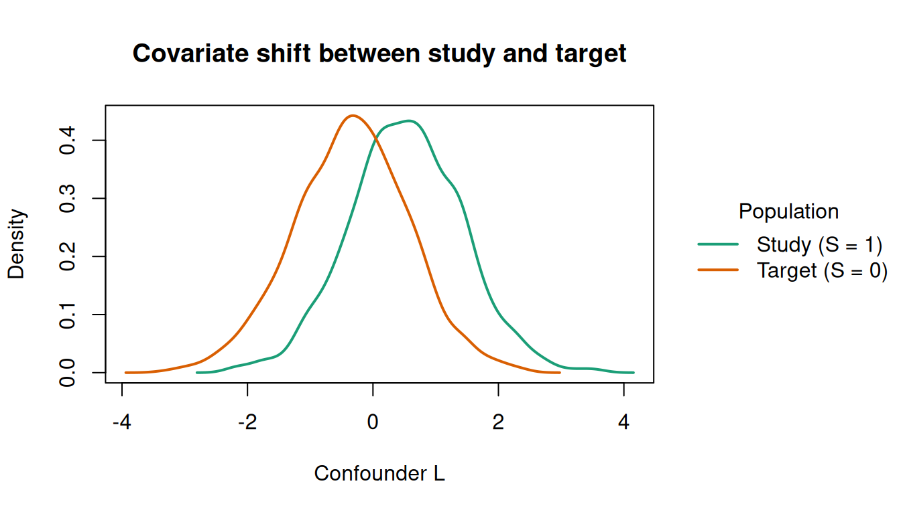
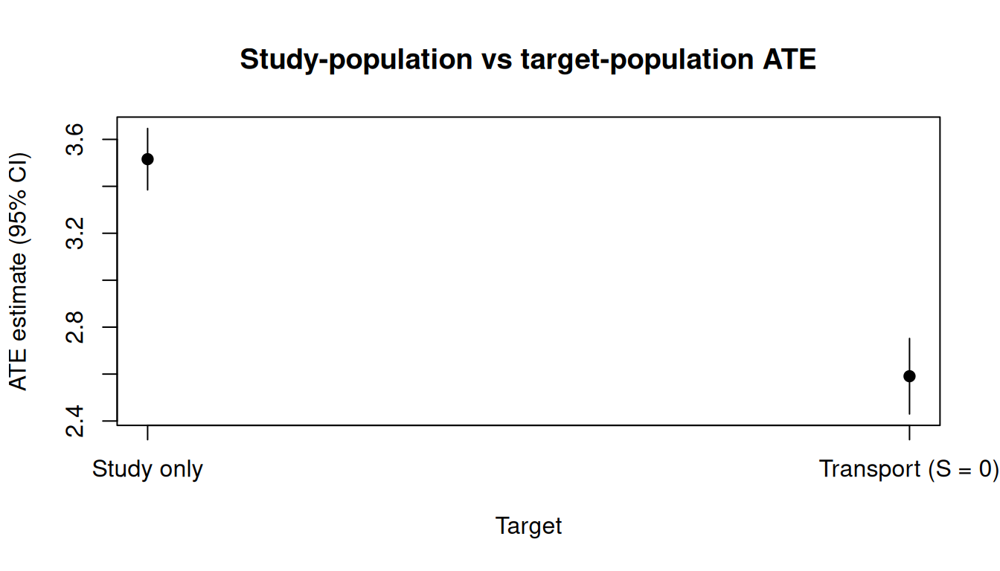
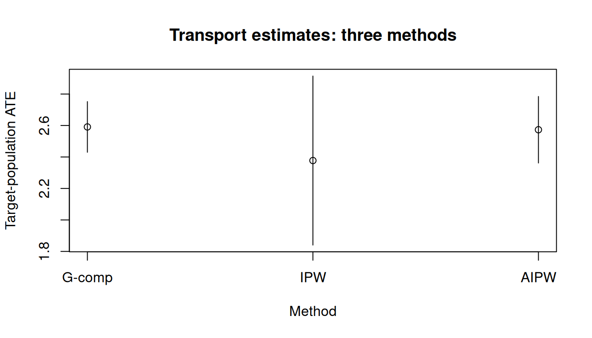

> **来源**：R 包 [causatr](https://github.com/etverse/causatr) 官方文档 [`transportability.qmd`](https://etverse.github.io/causatr/vignettes/transportability.html)，MIT 许可。
> 本页是中译，**代码与运行结果直接取自原站的渲染输出，未在本站重新执行**。
> Copyright (c) 2026 causatr authors；许可证全文见原仓库 `LICENSE.md`。

`causat()` 估计的因果效应默认是**研究样本**中的效应——也就是 `data` 的各行。
在实际应用中，科学问题往往针对另一个人群：某家诊所、某个国家或某个队列，
它们的协变量分布与研究不同。把估计目标从研究搬到目标人群，正是**可迁移性**
（或**可推广性**）权重要做的事。

本文介绍如何用 `target =` 参数把因果估计值迁移到目标人群。

## 准备

```r
library(causatr)
```

### 模拟数据

我们模拟一个混合数据集，其中包含研究行（$S = 1$，数据完整）和目标行
（$S = 0$，只有协变量）：

```r
set.seed(42)
n <- 3000
L <- rnorm(n)
S <- rbinom(n, 1, plogis(-0.5 + 1.0 * L))
A <- ifelse(S == 1L, rbinom(n, 1, plogis(0.2 + 0.3 * L)), NA_integer_)
Y <- ifelse(S == 1L, 2 + 3 * A + 1.5 * L + 1.0 * A * L + rnorm(n), NA_real_)

df <- data.frame(Y = Y, A = A, L = L, S = S)
head(df)
#>          Y  A          L S
#> 1 8.600228  1  1.3709584 1
#> 2       NA NA -0.5646982 0
#> 3       NA NA  0.3631284 0
#> 4 7.208478  1  0.6328626 1
#> 5       NA NA  0.4042683 0
#> 6       NA NA -0.1061245 0
table(df$S)
#> 
#>    0    1 
#> 1843 1157
```

任何人群中的真实 ATE 都是 $3 + 1 \cdot E[L]$（常数主效应 3 加上一个交互项
$A \times L$）。由于抽样模型平移了 $L$ 的分布，研究人群（$E[L \mid S=1] \approx
0.5$）与目标人群（$E[L \mid S=0] \approx -0.35$）的 ATE 并不相同：大约分别为
3.5 和 2.65。

按选择状态分层看 $L$ 的密度，就能看到这种协变量平移。研究人群（$S = 1$）中
$L$ 的高值占比偏高，而目标人群（$S = 0$）则向左平移：

```r
dens_df <- data.frame(
  L = df$L,
  Population = ifelse(df$S == 1L, "Study (S = 1)", "Target (S = 0)")
)

tinyplot::tinyplot(
  ~ L | Population,
  data = dens_df,
  type = "density",
  lwd = 2,
  xlab = "Confounder L",
  ylab = "Density",
  main = "Covariate shift between study and target",
  palette = "dark2"
)
```



这种平移正是抽样模型 $P(S = 1 \mid L)$ 所刻画的内容。没有迁移权重时，因果估计值
反映的是研究样本偏斜的 $L$ 分布，而不是目标人群的分布。

## `target =` 参数

把二值选择指示变量（$S$）的名字传给 `target =`：

```r
fit_gc <- causat(
  df,
  outcome = "Y",
  treatment = "A",
  confounders_outcome = ~ L + A:L,
  confounders_treatment = ~ L,
  confounders_sampling = ~ L,
  target = "S"
)
#> Warning: `model_fn` not specified; defaulting to `stats::glm`.
#> ℹ Set `model_fn` explicitly (e.g. `model_fn = stats::glm` or `model_fn = mgcv::gam`).
fit_gc
#> <causatr_fit>
#>  Estimator:  G-computation
#>  Type:       point
#>  Outcome:    Y (gaussian)
#>  Treatment:  A
#>  Estimand:   ATE
#>  Conf (outcome):   ~L + A:L 
#>  Conf (treatment): ~L 
#>  Conf (sampling):  ~L 
#>  N:          3000
```

结局模型中加入了 `A:L` 交互项，用来刻画异质性处理效应。没有它，G-computation
无论面对哪个目标人群，都只会估计出一个常数 ATE（$\approx 3$）。

这会让 causatr：

1. 只在研究行（$S = 1$）上拟合结局模型。
2. 在全部行上拟合**抽样模型** $P(S = 1 \mid L)$。
3. 在做对比时，按目标人群的协变量（而不是研究样本的协变量）标准化预测值。

用 `confounders_sampling` 可以为抽样模型指定一组与结局模型或处理模型不同的
协变量。

### 对比

```r
res_gc <- contrast(
  fit_gc,
  interventions = list(a1 = static(1), a0 = static(0)),
  reference = "a0"
)
res_gc
```

| intervention | estimate | se | ci_lower | ci_upper |
|---|---|---|---|---|
| a1 | 4.169 | 0.078 | 4.015 | 4.323 |
| a0 | 1.578 | 0.063 | 1.455 | 1.701 |

| comparison | estimate | se | ci_lower | ci_upper |
|---|---|---|---|---|
| a1 vs a0 | 2.591 | 0.082 | 2.43 | 2.752 |

与只用研究样本的估计值（不给 `target =`）作比较：

```r
fit_study <- causat(
  df[df$S == 1, ],
  outcome = "Y",
  treatment = "A",
  confounders = ~ L + A:L
)
#> Warning: `model_fn` not specified; defaulting to `stats::glm`.
#> ℹ Set `model_fn` explicitly (e.g. `model_fn = stats::glm` or `model_fn = mgcv::gam`).

res_study <- contrast(
  fit_study,
  interventions = list(a1 = static(1), a0 = static(0)),
  reference = "a0"
)
res_study
```

| intervention | estimate | se | ci_lower | ci_upper |
|---|---|---|---|---|
| a1 | 6.357 | 0.078 | 6.205 | 6.51 |
| a0 | 2.842 | 0.06 | 2.725 | 2.959 |

| comparison | estimate | se | ci_lower | ci_upper |
|---|---|---|---|---|
| a1 vs a0 | 3.516 | 0.067 | 3.385 | 3.647 |

两个估计值不同，是因为目标人群的 $L$ 分布与研究样本不同：

```r
study_transport_df <- data.frame(
  Target = c("Study only", "Transport (S = 0)"),
  Estimate = c(res_study$contrasts$estimate[1],
               res_gc$contrasts$estimate[1]),
  CI_lower = c(res_study$contrasts$ci_lower[1],
               res_gc$contrasts$ci_lower[1]),
  CI_upper = c(res_study$contrasts$ci_upper[1],
               res_gc$contrasts$ci_upper[1])
)

tinyplot::tinyplot(
  Estimate ~ Target,
  data = study_transport_df,
  type = "pointrange",
  ymin = study_transport_df$CI_lower,
  ymax = study_transport_df$CI_upper,
  pch = 19,
  ylab = "ATE estimate (95% CI)",
  main = "Study-population vs target-population ATE"
)
```



## 可迁移性与可推广性

`target_subset` 参数控制由哪些行定义目标人群：

- `target_subset = "target"`（默认）：目标人群仅为 $S = 0$。这就是**可迁移性**——研究处在目标人群之外。
- `target_subset = "all"`：目标人群是 $S = 0 \cup S = 1$（合并后的完整样本）。这就是**可推广性**——研究是目标人群的一个有偏子样本。

```r
fit_gen <- causat(
  df,
  outcome = "Y",
  treatment = "A",
  confounders_outcome = ~ L + A:L,
  confounders_treatment = ~ L,
  confounders_sampling = ~ L,
  target = "S",
  target_subset = "all"
)
#> Warning: `model_fn` not specified; defaulting to `stats::glm`.
#> ℹ Set `model_fn` explicitly (e.g. `model_fn = stats::glm` or `model_fn = mgcv::gam`).

res_gen <- contrast(
  fit_gen,
  interventions = list(a1 = static(1), a0 = static(0)),
  reference = "a0"
)
res_gen
```

| intervention | estimate | se | ci_lower | ci_upper |
|---|---|---|---|---|
| a1 | 5.013 | 0.067 | 4.882 | 5.144 |
| a0 | 2.065 | 0.053 | 1.961 | 2.17 |

| comparison | estimate | se | ci_lower | ci_upper |
|---|---|---|---|---|
| a1 vs a0 | 2.948 | 0.069 | 2.812 | 3.083 |

## 三种估计量

三种点处理估计量都支持 `target =`：

### IPW 迁移

在 IPW 下，处理的密度比权重要乘以抽样权重 $w^S_i = [1 - \hat P(S = 1 \mid L_i)] / \hat P(S = 1 \mid L_i)$：

```r
fit_ipw <- causat(
  df,
  outcome = "Y",
  treatment = "A",
  confounders = ~ L,
  estimator = "ipw",
  target = "S"
)
#> Warning: `model_fn` not specified; defaulting to `stats::glm`.
#> ℹ Set `model_fn` explicitly (e.g. `model_fn = stats::glm` or `model_fn = mgcv::gam`).
#> Warning: `propensity_model_fn` not specified; defaulting to `stats::glm`.
#> ℹ Set `propensity_model_fn` explicitly if you need a different fitter (e.g. `mgcv::gam`).

res_ipw <- contrast(
  fit_ipw,
  interventions = list(a1 = static(1), a0 = static(0)),
  reference = "a0"
)
res_ipw
```

| intervention | estimate | se | ci_lower | ci_upper |
|---|---|---|---|---|
| a1 | 3.989 | 0.252 | 3.496 | 4.482 |
| a0 | 1.611 | 0.122 | 1.373 | 1.85 |

| comparison | estimate | se | ci_lower | ci_upper |
|---|---|---|---|---|
| a1 vs a0 | 2.377 | 0.274 | 1.84 | 2.914 |

### AIPW 迁移（双稳健）

AIPW 把结局模型和处理权重与抽样权重结合起来，只要结局模型与处理模型中有一个设定正确，估计就具有一致性：

```r
fit_aipw <- causat(
  df,
  outcome = "Y",
  treatment = "A",
  confounders_outcome = ~ L + A:L,
  confounders_treatment = ~ L,
  confounders_sampling = ~ L,
  estimator = "aipw",
  target = "S"
)
#> Warning: `model_fn` not specified; defaulting to `stats::glm`.
#> ℹ Set `model_fn` explicitly (e.g. `model_fn = stats::glm` or `model_fn = mgcv::gam`).
#> Warning: `propensity_model_fn` not specified; defaulting to `stats::glm`.
#> ℹ Set `propensity_model_fn` explicitly if you need a different fitter (e.g. `mgcv::gam`).

res_aipw <- contrast(
  fit_aipw,
  interventions = list(a1 = static(1), a0 = static(0)),
  reference = "a0"
)
res_aipw
```

| intervention | estimate | se | ci_lower | ci_upper |
|---|---|---|---|---|
| a1 | 4.127 | 0.115 | 3.902 | 4.352 |
| a0 | 1.554 | 0.069 | 1.418 | 1.689 |

| comparison | estimate | se | ci_lower | ci_upper |
|---|---|---|---|---|
| a1 vs a0 | 2.573 | 0.108 | 2.362 | 2.784 |

### 比较

```r
methods_df <- data.frame(
  Method = c("G-comp", "IPW", "AIPW"),
  Estimate = c(
    res_gc$contrasts$estimate[1],
    res_ipw$contrasts$estimate[1],
    res_aipw$contrasts$estimate[1]
  ),
  CI_lower = c(
    res_gc$contrasts$ci_lower[1],
    res_ipw$contrasts$ci_lower[1],
    res_aipw$contrasts$ci_lower[1]
  ),
  CI_upper = c(
    res_gc$contrasts$ci_upper[1],
    res_ipw$contrasts$ci_upper[1],
    res_aipw$contrasts$ci_upper[1]
  )
)

tinyplot::tinyplot(
  Estimate ~ Method,
  data = methods_df,
  type = "pointrange",
  ymin = methods_df$CI_lower,
  ymax = methods_df$CI_upper,
  ylab = "Target-population ATE",
  main = "Transport estimates: three methods"
)
```



## 删失结局（IPCW × 迁移）

当结局存在右删失时，`censoring =` 会加上删失逆概率权重（IPCW）。这些权重与可迁移性权重可以无缝组合——三个权重分量（处理、删失、抽样）逐点相乘：

```r
set.seed(99)
n2 <- 4000
L2 <- rnorm(n2)
S2 <- rbinom(n2, 1, plogis(-0.5 + 1.0 * L2))
A2 <- ifelse(S2 == 1L, rbinom(n2, 1, plogis(0.2 + 0.3 * L2)), NA_integer_)
C2 <- ifelse(S2 == 1L, rbinom(n2, 1, plogis(-1.5 + 0.5 * A2 + 0.3 * L2)), 0L)
#> Warning in rbinom(n2, 1, plogis(-1.5 + 0.5 * A2 + 0.3 * L2)): NAs produced
Y2_full <- ifelse(S2 == 1L, 2 + 3 * A2 + 1.5 * L2 + rnorm(n2), NA_real_)
Y2 <- ifelse(C2 == 1L, NA_real_, Y2_full)

df2 <- data.frame(Y = Y2, A = A2, L = L2, S = S2, C = C2)
```

三种估计量都支持 IPCW + 迁移：

```r
fit_ipcw_gc <- causat(
  df2,
  outcome = "Y",
  treatment = "A",
  confounders = ~ L,
  target = "S",
  censoring = "C"
)
#> Warning: `model_fn` not specified; defaulting to `stats::glm`.
#> ℹ Set `model_fn` explicitly (e.g. `model_fn = stats::glm` or `model_fn = mgcv::gam`).

res_ipcw_gc <- contrast(
  fit_ipcw_gc,
  interventions = list(a1 = static(1), a0 = static(0)),
  reference = "a0"
)
res_ipcw_gc
```

| intervention | estimate | se | ci_lower | ci_upper |
|---|---|---|---|---|
| a1 | 4.583 | 0.057 | 4.472 | 4.694 |
| a0 | 1.529 | 0.055 | 1.421 | 1.636 |

| comparison | estimate | se | ci_lower | ci_upper |
|---|---|---|---|---|
| a1 vs a0 | 3.055 | 0.061 | 2.936 | 3.174 |

三明治方差通过影响函数修正链，把结局、删失、抽样这三个冗余模型全部纳入考虑。

## 修正处理策略（MTP）+ 迁移

对于静态干预，目标行的预测直接使用 $\hat{m}(a, L_i)$。但 MTP 干预 --- `shift()`、
`scale_by()`、`threshold()`、`dynamic()` --- 会通过 $d(A, L)$ 变换*观测到的*处理，
而目标行（S = 0）的 $A = \text{NA}$。causatr 用 **MC 边缘化**解决这个问题：它把
$E_{A \mid L, S=1}[\hat{m}(d(A,L), L)]$ 在研究人群的处理分布上积分。二值处理下
这是精确枚举；连续处理下则从拟合好的处理模型中抽取 Monte Carlo 样本。

```r
set.seed(201)
n3 <- 6000
L3 <- rnorm(n3)
S3 <- rbinom(n3, 1, plogis(-0.5 + L3))
A3 <- ifelse(S3 == 1L, rnorm(n3, 0.5 + 0.3 * L3, 1), NA_real_)
Y3 <- ifelse(
  S3 == 1L,
  2 + 3 * A3 + 1.5 * L3 + A3 * L3 + rnorm(n3),
  NA_real_
)
df3 <- data.frame(Y = Y3, A = A3, L = L3, S = S3)

fit_mtp <- causat(df3, "Y", "A", ~ L + A:L, target = "S")
#> Warning: `model_fn` not specified; defaulting to `stats::glm`.
#> ℹ Set `model_fn` explicitly (e.g. `model_fn = stats::glm` or `model_fn = mgcv::gam`).

res_mtp <- contrast(
  fit_mtp,
  interventions = list(shifted = shift(1), natural = NULL),
  reference = "natural",
  type = "difference",
  ci_method = "bootstrap",
  n_boot = 200
)
res_mtp
```

| intervention | estimate | se | ci_lower | ci_upper |
|---|---|---|---|---|
| shifted | 5.34 | 0.098 | 5.141 | 5.526 |
| natural | 2.693 | 0.089 | 2.518 | 2.86 |

| comparison | estimate | se | ci_lower | ci_upper |
|---|---|---|---|---|
| shifted vs natural | 2.647 | 0.034 | 2.59 | 2.721 |

该 DGP 的解析真值为 $3 \delta + \delta \cdot E[L \mid S = 0]$；bootstrap CI
应当把它包含在内。

**重要**：MTP + 迁移下，G-computation 和 AIPW 都不提供三明治方差，因为 MC
边缘化引入了当前 IF 链未能刻画的处理模型依赖。请改用
`ci_method = "bootstrap"`。IPW + MTP + 迁移支持三明治（不需要 MC 边缘化）。

## 纵向迁移

可迁移性可以与纵向 IPW（`id =`、`time =`）组合使用。抽样模型在首期各行上拟合，
得到的抽样优势权重会被广播到每个个体的所有个体-时期行上。在纵向 Hájek MSM
内部，该抽样权重与逐期的处理密度比权重相乘。

```r
set.seed(314)
n_long <- 1500
L0 <- rnorm(n_long)
S <- rbinom(n_long, 1, plogis(-0.3 + 0.8 * L0))

A0 <- ifelse(S == 1L, rbinom(n_long, 1, plogis(0.3 * L0)), NA_integer_)
L1 <- ifelse(S == 1L, 0.5 * L0 + 0.4 * A0 + rnorm(n_long, sd = 0.5), NA_real_)
A1 <- ifelse(S == 1L, rbinom(n_long, 1, plogis(0.3 * L1)), NA_integer_)
#> Warning in rbinom(n_long, 1, plogis(0.3 * L1)): NAs produced
Y <- ifelse(
  S == 1L,
  2 * A0 + 2 * A1 + L0 + 0.5 * L1 + rnorm(n_long),
  NA_real_
)

# Build person-period data
wide <- data.frame(id = seq_len(n_long), L0 = L0, S = S,
                   A0 = A0, L_1 = L0, A1 = A1, L_2 = L1, Y = Y)
long <- to_person_period(
  wide,
  id = "id",
  time_varying = list(L = c("L_1", "L_2"), A = c("A0", "A1")),
  time_invariant = c("L0", "S", "Y")
)
```

```r
fit_long <- causat(
  long,
  outcome = "Y",
  treatment = "A",
  confounders = ~ L0,
  confounders_tv = ~ L,
  id = "id",
  time = "time",
  estimator = "ipw",
  target = "S"
)

res_long <- contrast(
  fit_long,
  interventions = list(always = static(1), never = static(0)),
  reference = "never"
)
res_long
```

| intervention | estimate | se | ci_lower | ci_upper |
|---|---|---|---|---|
| always | 3.975 | 0.12 | 3.739 | 4.211 |
| never | -0.737 | 0.148 | -1.027 | -0.448 |

| comparison | estimate | se | ci_lower | ci_upper |
|---|---|---|---|---|
| always vs never | 4.712 | 0.184 | 4.352 | 5.073 |

ICE G-computation 同样支持纵向迁移 --- 结局模型在研究行上拟合，反事实预测则在
目标人群的基线协变量上取平均。

## 多元处理 × 迁移

联合处理 IPW（`treatment = c("A1", "A2")`）可以与迁移组合。序贯 MTP 分解得到的
逐分量密度比权重会与抽样优势权重相乘：

```r
set.seed(808)
n_mv <- 2000
L_mv <- rnorm(n_mv)
S_mv <- rbinom(n_mv, 1, plogis(-0.5 + 0.8 * L_mv))

A1_mv <- ifelse(
  S_mv == 1L, rbinom(n_mv, 1, plogis(0.2 + 0.3 * L_mv)), NA_integer_
)
A2_mv <- ifelse(
  S_mv == 1L,
  rbinom(n_mv, 1, plogis(0.1 + 0.2 * L_mv + 0.3 * A1_mv)),
  NA_integer_
)
#> Warning in rbinom(n_mv, 1, plogis(0.1 + 0.2 * L_mv + 0.3 * A1_mv)): NAs
#> produced
Y_mv <- ifelse(
  S_mv == 1L,
  1 + 2 * A1_mv + 1.5 * A2_mv + L_mv + 0.5 * A1_mv * L_mv + rnorm(n_mv),
  NA_real_
)

df_mv <- data.frame(Y = Y_mv, A1 = A1_mv, A2 = A2_mv, L = L_mv, S = S_mv)
```

```r
fit_mv <- causat(
  df_mv,
  outcome = "Y",
  treatment = c("A1", "A2"),
  confounders = ~ L,
  estimator = "ipw",
  target = "S"
)
#> Warning: `model_fn` not specified; defaulting to `stats::glm`.
#> ℹ Set `model_fn` explicitly (e.g. `model_fn = stats::glm` or `model_fn = mgcv::gam`).
#> Warning: `propensity_model_fn` not specified; defaulting to `stats::glm`.
#> ℹ Set `propensity_model_fn` explicitly if you need a different fitter (e.g. `mgcv::gam`).

res_mv <- contrast(
  fit_mv,
  interventions = list(
    both = list(A1 = static(1), A2 = static(1)),
    neither = list(A1 = static(0), A2 = static(0))
  ),
  reference = "neither"
)
res_mv
```

| intervention | estimate | se | ci_lower | ci_upper |
|---|---|---|---|---|
| both | 4.193 | 0.176 | 3.848 | 4.538 |
| neither | 0.736 | 0.112 | 0.517 | 0.954 |

| comparison | estimate | se | ci_lower | ci_upper |
|---|---|---|---|---|
| both vs neither | 3.458 | 0.196 | 3.073 | 3.842 |

三明治方差和 bootstrap 方差对多元 IPW 迁移都适用。稳定化权重
（`stabilize = "marginal"`）同样可以与迁移组合。

## 分别指定混杂因子

用 `confounders_sampling` 控制哪些协变量进入抽样模型
$P(S = 1 \mid L)$，这与结局模型或处理模型所用的协变量相互独立：

```r
fit_sep <- causat(
  df,
  outcome = "Y",
  treatment = "A",
  confounders_outcome = ~ L + A:L + I(L^2),
  confounders_treatment = ~ L,
  confounders_sampling = ~ L,
  estimator = "aipw",
  target = "S"
)
#> Warning: `model_fn` not specified; defaulting to `stats::glm`.
#> ℹ Set `model_fn` explicitly (e.g. `model_fn = stats::glm` or `model_fn = mgcv::gam`).
#> Warning: `propensity_model_fn` not specified; defaulting to `stats::glm`.
#> ℹ Set `propensity_model_fn` explicitly if you need a different fitter (e.g. `mgcv::gam`).

res_sep <- contrast(
  fit_sep,
  interventions = list(a1 = static(1), a0 = static(0)),
  reference = "a0"
)
res_sep
```

| intervention | estimate | se | ci_lower | ci_upper |
|---|---|---|---|---|
| a1 | 4.131 | 0.112 | 3.911 | 4.351 |
| a0 | 1.552 | 0.069 | 1.417 | 1.686 |

| comparison | estimate | se | ci_lower | ci_upper |
|---|---|---|---|---|
| a1 vs a0 | 2.579 | 0.104 | 2.375 | 2.783 |

当结局模型需要灵活的设定（样条、多项式）而抽样模型只需要
一组核心的基线混杂因子时，这种做法尤其有用。

## 诊断

对于迁移拟合，`diagnose()` 会包含一个**抽样模型面板**，
报告抽样评分的分布、抽样权重摘要以及极端权重标记：

```r
diag <- diagnose(fit_ipw)
#> Note: `s.d.denom` not specified; assuming "pooled".
diag
#> <causatr_diag>
#>  Estimator:ipw
#>  Treatment: binary
#>  Estimand:  ATE
#> 
#> Positivity:
#>       statistic     value
#>          <char>     <num>
#>             min 0.3283844
#>             q25 0.5232723
#>          median 0.5772245
#>             q75 0.6320640
#>             max 0.8095657
#>   n_below_lower 0.0000000
#>   n_above_upper 0.0000000
#>    n_violations 0.0000000
#>  pct_violations 0.0000000
#> 
#> Covariate balance:
#> Balance Measures
#>      Type Diff.Un     M.Threshold.Un V.Ratio.Un
#> L Contin.  0.3319 Not Balanced, >0.1     1.1408
#> 
#> Balance tally for mean differences
#>                    count
#> Balanced, <0.1         0
#> Not Balanced, >0.1     1
#> 
#> Variable with the greatest mean difference
#>  Variable Diff.Un     M.Threshold.Un
#>         L  0.3319 Not Balanced, >0.1
#> 
#> Sample sizes
#>     Control Treated
#> All     492     665
#> 
#> Weight distribution:
#>    group     n     mean        sd      min      max       ess
#>   <char> <int>    <num>     <num>    <num>    <num>     <num>
#>  treated   665 1.742163 0.2607069 1.235230 2.994992  650.4557
#>  control   492 2.346339 0.4437681 1.488947 5.075262  475.0418
#>  overall  1157 1.999081 0.4604115 1.235230 5.075262 1098.7680
#> 
#> Sampling model:
#>        statistic     value
#>           <char>     <num>
#>          n_study 1157.0000
#>         n_target 1843.0000
#>        pct_study   38.5700
#>    target_subset        NA
#>      p_study_min    0.0159
#>      p_study_q05    0.0875
#>   p_study_median    0.3619
#>      p_study_q95    0.7599
#>      p_study_max    0.9619
#>  p_study_mean_s1    0.4980
#>  p_study_mean_s0    0.3152
#>          sw_mean    1.5937
#>            sw_sd    1.9389
#>           sw_min    0.0396
#>           sw_max   18.6510
#>           sw_ess  466.7700
#>     sw_n_extreme    0.0000
```

需要检查的关键诊断：

- **抽样正值性**：$P(S = 1 \mid L)$ 不应太接近 0 或 1。`p_study_min`
  和 `p_study_max` 这两个分位数会标记重叠性违背。
- **极端权重**：抽样权重过大，说明在 $L$ 的某些区域研究样本对目标人群
  的代表性不足，会带来不稳定。
- **ESS**：抽样重加权之后的有效样本量。ESS 偏低说明估计值由少数几个
  观测主导。

## 识别假定

迁移估计值需要四条假定 [@dahabreh2020extending]：

1. **研究内部的条件可交换性：**
   $Y^a \perp A \mid L, S = 1$。
2. **研究内部的处理正值性：**
   $0 < P(A = a \mid L, S = 1) < 1$。
3. **跨人群的可交换性（可迁移性）：**
   $E[Y^a \mid L, S = 1] = E[Y^a \mid L, S = 0]$ --- 给定 $L$ 时，
   条件潜在结局均值在两个人群中相同。
4. **抽样正值性：**
   在目标人群的支撑集上 $P(S = 1 \mid L) > 0$。

假定 1--2 是标准的因果假定（用 `diagnose()` 的均衡面板和正值性面板检查）。
假定 3 是可迁移性的跨越 --- 它无法直接检验，只能依靠领域知识。
假定 4 由抽样诊断来检查。

## 不支持匹配

匹配 + 可迁移性会被直接拒绝：

```r
causat(
  df,
  outcome = "Y",
  treatment = "A",
  confounders = ~ L,
  estimator = "matching",
  target = "S"
)
#> Error in `causat()`:
#> ! `target` is not supported with `estimator = "matching"`.
#> ℹ Transportability does not compose cleanly with matching. Use `estimator = "gcomp"` or `"ipw"` instead.
```

这是有意为之：MatchIt 的匹配权重路径无法与外部抽样权重干净地组合。

## 已覆盖组合汇总

```r
comb <- data.frame(
  Estimator = c(
    "gcomp", "gcomp", "gcomp", "gcomp",
    "IPW", "IPW", "IPW", "IPW",
    "AIPW", "AIPW", "AIPW",
    "matching"
  ),
  Treatment = c(
    "binary", "continuous (MTP)", "multivariate", "longitudinal (ICE)",
    "binary", "continuous (MTP)", "multivariate", "longitudinal",
    "binary", "continuous (MTP)", "multivariate",
    "any"
  ),
  Transport = c(
    "Yes", "Yes (MC)", "Yes", "Yes",
    "Yes", "Yes", "Yes", "Yes",
    "Yes", "Yes (MC)", "Yes",
    "No"
  ),
  Sandwich = c(
    "Yes", "No (bootstrap)", "Yes", "Yes",
    "Yes", "Yes", "Yes", "Yes",
    "Yes", "No (bootstrap)", "Yes",
    "---"
  ),
  IPCW = c(
    "Yes", "---", "---", "---",
    "Yes", "---", "---", "Yes",
    "Yes", "---", "---",
    "---"
  ),
  Status = c(
    "Yes", "Yes", "Yes", "Yes",
    "Yes", "Yes", "Yes", "Yes",
    "Yes", "Yes", "Yes",
    "Rejected"
  )
)
tinytable::tt(comb) |>
  tinytable::style_tt(j = 1:6, align = "lllccc")
```

完整的测试级覆盖明细见
[`FEATURE_COVERAGE_MATRIX.md`](https://github.com/etverse/causatr/blob/main/FEATURE_COVERAGE_MATRIX.md)。

## 参考文献

::: {#refs}
:::

