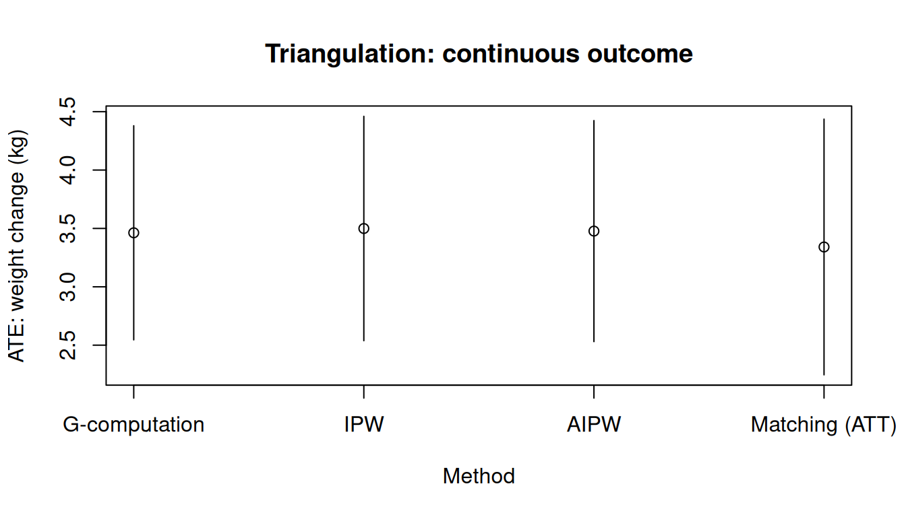
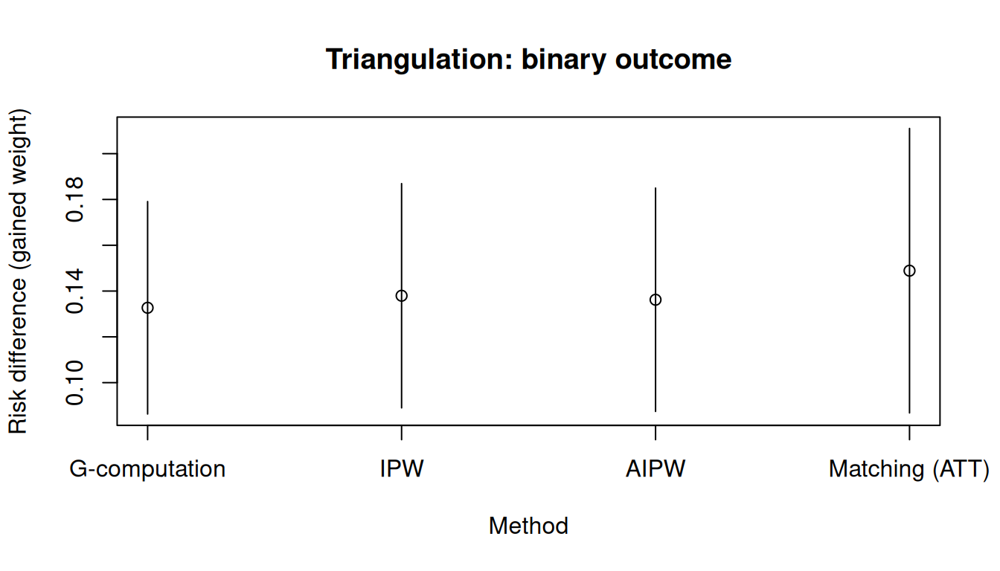
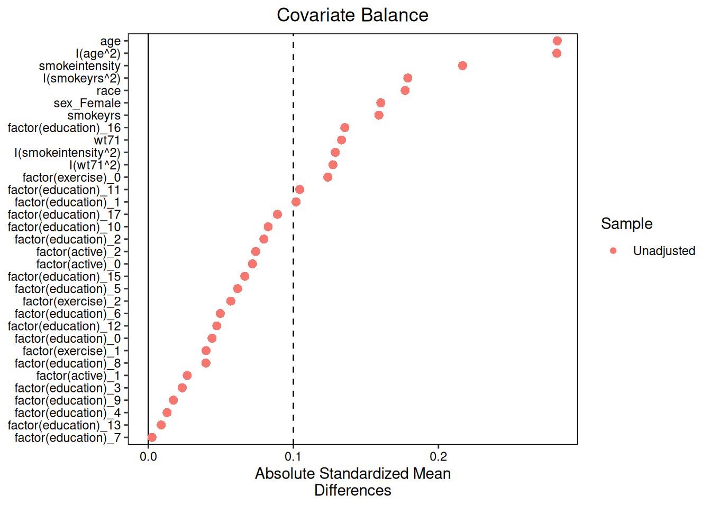
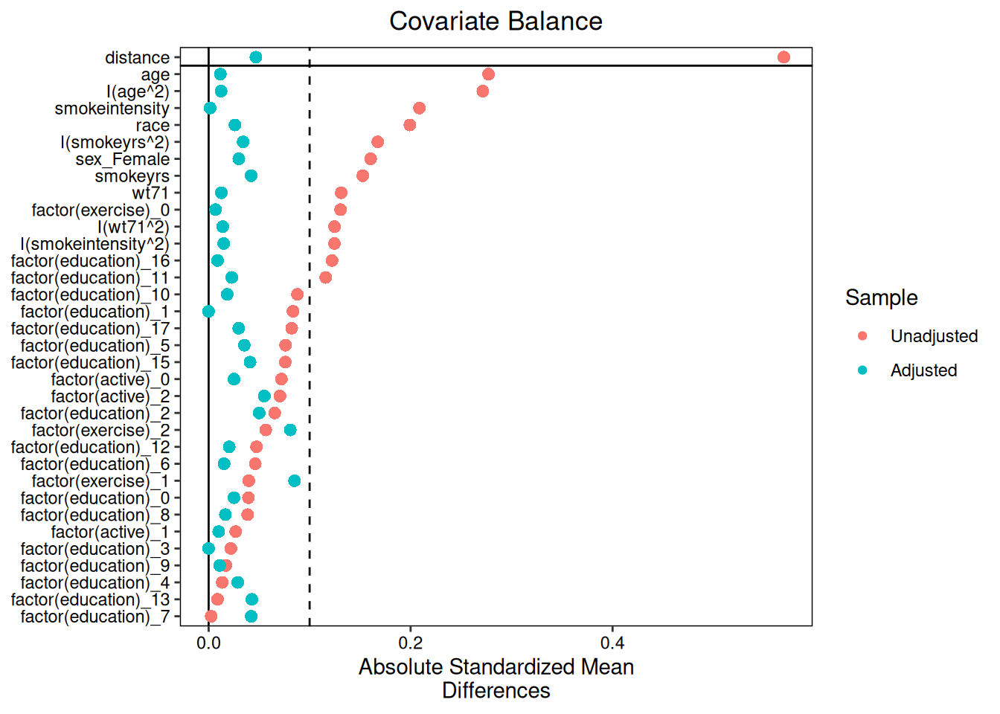
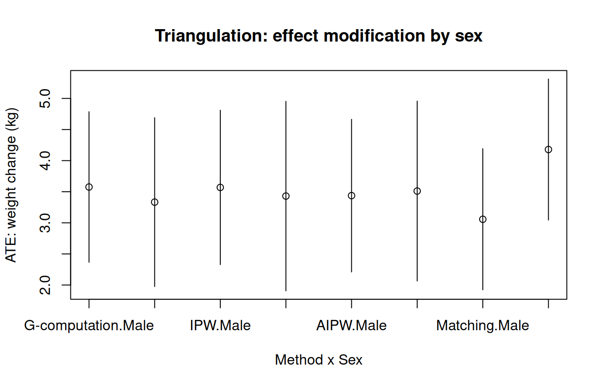

> **来源**：R 包 [causatr](https://github.com/etverse/causatr) 官方文档 [`triangulation.qmd`](https://etverse.github.io/causatr/vignettes/triangulation.html)，MIT 许可。
> 本页是中译，**代码与运行结果直接取自原站的渲染输出，未在本站重新执行**。
> Copyright (c) 2026 causatr authors；许可证全文见原仓库 `LICENSE.md`。

当多种估计方法对同一因果效应给出一致结果时，我们更有把握认为该结果不是单一建模
假定造成的假象。本文在 NHEFS 数据集上比较全部五种方法：

- **G-computation** 依赖于正确的结局模型。
- **IPW** 依赖于正确的倾向评分模型。
- **AIPW**（双稳健）只要*其中一个*模型正确就是相合的，两个模型都正确时还具有
  半参数有效性。
- **SNM**（结构嵌套均值模型）依赖于正确的处理模型，直接估计 blip 参数——它是唯一
  能正确处理时变效应修饰的方法。参见 `vignette("snm")`。
- **匹配**依赖于正确的倾向评分模型，目标是 ATT。

## 数据：NHEFS

所有示例都使用 **NHEFS** 数据集 [@hernan_whatif]。假定的因果结构如下：

- **处理（$A$）：** `qsmk` —— 1971 至 1982 年间是否戒烟（二值：0/1）。
- **结局（$Y$）：** `wt82_71` —— 体重变化，单位为 kg（连续），或
  `gained_weight`（$\mathbf{1}\{Y > 0\}$，二值）。
- **混杂因子（$L$）：** 性别、年龄、种族、受教育程度、吸烟强度、
  吸烟年数、锻炼、体力活动和基线体重。

$$
\begin{aligned}
  L &\sim F_L \\
  A &\sim \text{Bernoulli}\!\bigl(\text{logit}^{-1}(\alpha_0 + \alpha_L^\top L)\bigr) \\
  Y &= \beta_0 + \beta_A A + \beta_L^\top L + \varepsilon
\end{aligned}
$$

混杂因子 $L$ 是 $A$ 和 $Y$ 的共同原因。在这一结构下，G-computation 通过结局模型
对 $L$ 做调整，IPW 通过处理模型做调整，匹配则在处理组之间均衡 $L$。当四种方法
结果一致时，该结果就不太可能是单一建模假定造成的假象。

```r
library(causatr)
library(tinyplot)
data("nhefs")

nhefs_complete <- nhefs[complete.cases(nhefs), ]
nhefs_complete$gained_weight <- as.integer(nhefs_complete$wt82_71 > 0)
nhefs_complete$sex <- factor(
  nhefs_complete$sex,
  levels = 0:1,
  labels = c("Male", "Female")
)

confounders <- ~ sex + age + I(age^2) + race + factor(education) +
  smokeintensity + I(smokeintensity^2) + smokeyrs + I(smokeyrs^2) +
  factor(exercise) + factor(active) + wt71 + I(wt71^2)
```

## 连续结局：体重变化

### 拟合全部四种方法

```r
fit_gc <- causat(
  nhefs,
  outcome = "wt82_71",
  treatment = "qsmk",
  confounders = confounders,
  censoring = "censored",
  model_fn = stats::glm
)

fit_ipw <- causat(
  nhefs_complete,
  outcome = "wt82_71",
  treatment = "qsmk",
  confounders = confounders,
  estimator = "ipw",
  model_fn = stats::glm,
  propensity_model_fn = stats::glm
)

fit_aipw <- causat(
  nhefs_complete,
  outcome = "wt82_71",
  treatment = "qsmk",
  confounders = confounders,
  estimator = "aipw",
  model_fn = stats::glm,
  propensity_model_fn = stats::glm
)

fit_m <- causat(
  nhefs_complete,
  outcome = "wt82_71",
  treatment = "qsmk",
  confounders = confounders,
  estimator = "matching",
  estimand = "ATT"
)
```

### 对比

```r
ivs <- list(quit = static(1), continue = static(0))

res_gc   <- contrast(fit_gc,   ivs, reference = "continue")
#> 117 row(s) with NA predictions excluded from the target population.
res_ipw  <- contrast(fit_ipw,  ivs, reference = "continue")
res_aipw <- contrast(fit_aipw, ivs, reference = "continue")
res_m    <- contrast(fit_m,    ivs, reference = "continue")

results <- rbind(
  cbind(method = "G-computation", res_gc$contrasts),
  cbind(method = "IPW",           res_ipw$contrasts),
  cbind(method = "AIPW",          res_aipw$contrasts),
  cbind(method = "Matching (ATT)", res_m$contrasts)
)
results
#>            method       comparison estimate        se ci_lower ci_upper
#>            <char>           <char>    <num>     <num>    <num>    <num>
#> 1:  G-computation quit vs continue 3.462484 0.4677686 2.545674 4.379294
#> 2:            IPW quit vs continue 3.499174 0.4902045 2.538391 4.459958
#> 3:           AIPW quit vs continue 3.477009 0.4828865 2.530569 4.423449
#> 4: Matching (ATT) quit vs continue 3.341010 0.5586286 2.246118 4.435902
```

::: {.callout-note}
## AIPW 的 SE 为何可能更小

当结局模型与倾向评分模型都设定正确时，AIPW 达到半参数有效界——它的标准误不会
大于单纯的 G-computation，也不会大于单纯的 IPW。在实际数据中，这一收益往往
不大，但绝不会是负的。
:::

### 森林图

```r
tinyplot(
  estimate ~ method,
  data = results,
  type = "pointrange",
  ymin = results$ci_lower,
  ymax = results$ci_upper,
  xlab = "Method",
  ylab = "ATE: weight change (kg)",
  main = "Triangulation: continuous outcome"
)
abline(h = 0, lty = 2, col = "grey40")
```



## 二值结局：体重增加

```r
fit_gc_bin <- causat(
  nhefs_complete,
  outcome = "gained_weight",
  treatment = "qsmk",
  confounders = confounders,
  family = "binomial",
  model_fn = stats::glm
)

fit_ipw_bin <- causat(
  nhefs_complete,
  outcome = "gained_weight",
  treatment = "qsmk",
  confounders = confounders,
  estimator = "ipw",
  model_fn = stats::glm,
  propensity_model_fn = stats::glm
)

fit_aipw_bin <- causat(
  nhefs_complete,
  outcome = "gained_weight",
  treatment = "qsmk",
  confounders = confounders,
  estimator = "aipw",
  family = "binomial",
  model_fn = stats::glm,
  propensity_model_fn = stats::glm
)

fit_m_bin <- causat(
  nhefs_complete,
  outcome = "gained_weight",
  treatment = "qsmk",
  confounders = confounders,
  estimator = "matching",
  estimand = "ATT"
)

res_gc_bin   <- contrast(fit_gc_bin,   ivs, reference = "continue")
res_ipw_bin  <- contrast(fit_ipw_bin,  ivs, reference = "continue")
res_aipw_bin <- contrast(fit_aipw_bin, ivs, reference = "continue")
res_m_bin    <- contrast(fit_m_bin,    ivs, reference = "continue")

results_bin <- rbind(
  cbind(method = "G-computation", res_gc_bin$contrasts),
  cbind(method = "IPW",           res_ipw_bin$contrasts),
  cbind(method = "AIPW",          res_aipw_bin$contrasts),
  cbind(method = "Matching (ATT)", res_m_bin$contrasts)
)
results_bin
#>            method       comparison  estimate         se   ci_lower  ci_upper
#>            <char>           <char>     <num>      <num>      <num>     <num>
#> 1:  G-computation quit vs continue 0.1326922 0.02366249 0.08631463 0.1790699
#> 2:            IPW quit vs continue 0.1379464 0.02498002 0.08898648 0.1869064
#> 3:           AIPW quit vs continue 0.1361954 0.02487782 0.08743580 0.1849550
#> 4: Matching (ATT) quit vs continue 0.1488834 0.03168677 0.08677844 0.2109883
```

```r
tinyplot(
  estimate ~ method,
  data = results_bin,
  type = "pointrange",
  ymin = results_bin$ci_lower,
  ymax = results_bin$ci_upper,
  xlab = "Method",
  ylab = "Risk difference (gained weight)",
  main = "Triangulation: binary outcome"
)
abline(h = 0, lty = 2, col = "grey40")
```



## 诊断

在解释结果之前，先检查假设是否成立。`diagnose()` 提供正值性检查、协变量均衡
以及各方法特有的汇总。

```r
diag_ipw <- diagnose(fit_ipw)
#> Note: `s.d.denom` not specified; assuming "pooled".
diag_m <- diagnose(fit_m)
```

### IPW 均衡

```r
plot(diag_ipw)
#> Note: `s.d.denom` not specified; assuming "pooled".
```



### 匹配均衡

```r
plot(diag_m)
```



## 跨方法的效应修饰
四种单时点处理方法都支持通过 `A:modifier` 这类交互项来刻画效应修饰，交互项写在
`confounders` 里。当四种方法在各层的处理效应上一致时，这有力地说明效应异质性是
真实的，而不是模型设定造成的假象。

这里我们加入 `qsmk:sex`，考察戒烟对体重变化的效应是否因性别而异。各方法处理
交互项的方式不同（G-computation 把它交给结局模型；IPW 把 MSM 扩展为
`Y ~ 1 + sex`；匹配则扩展为 `Y ~ qsmk + sex + qsmk:sex`），但在设定正确时
都应当还原出相同的各层估计值。

```r
confounders_em <- ~ sex + age + I(age^2) + race + factor(education) +
  smokeintensity + I(smokeintensity^2) + smokeyrs + I(smokeyrs^2) +
  factor(exercise) + factor(active) + wt71 + I(wt71^2) +
  qsmk:sex

fit_gc_em <- causat(
  nhefs_complete,
  outcome = "wt82_71",
  treatment = "qsmk",
  confounders = confounders_em,
  model_fn = stats::glm
)
fit_ipw_em <- causat(
  nhefs_complete,
  outcome = "wt82_71",
  treatment = "qsmk",
  confounders = confounders_em,
  estimator = "ipw",
  model_fn = stats::glm,
  propensity_model_fn = stats::glm
)
fit_aipw_em <- causat(
  nhefs_complete,
  outcome = "wt82_71",
  treatment = "qsmk",
  confounders = confounders_em,
  estimator = "aipw",
  model_fn = stats::glm,
  propensity_model_fn = stats::glm
)
fit_m_em <- causat(
  nhefs_complete,
  outcome = "wt82_71",
  treatment = "qsmk",
  confounders = confounders_em,
  estimator = "matching"
)

res_gc_em <- contrast(
  fit_gc_em, ivs,
  reference = "continue",
  ci_method = "sandwich",
  by = "sex"
)
res_ipw_em <- contrast(
  fit_ipw_em, ivs,
  reference = "continue",
  ci_method = "sandwich",
  by = "sex"
)
res_aipw_em <- contrast(
  fit_aipw_em, ivs,
  reference = "continue",
  ci_method = "sandwich",
  by = "sex"
)
res_m_em <- contrast(
  fit_m_em, ivs,
  reference = "continue",
  ci_method = "sandwich",
  by = "sex"
)

results_em <- rbind(
  cbind(method = "G-computation", res_gc_em$contrasts),
  cbind(method = "IPW",           res_ipw_em$contrasts),
  cbind(method = "AIPW",          res_aipw_em$contrasts),
  cbind(method = "Matching",      res_m_em$contrasts)
)
results_em
#>           method       comparison estimate        se ci_lower ci_upper     by
#>           <char>           <char>    <num>     <num>    <num>    <num> <char>
#> 1: G-computation quit vs continue 3.576000 0.6174533 2.365814 4.786186   Male
#> 2: G-computation quit vs continue 3.333079 0.6924483 1.975906 4.690253 Female
#> 3:           IPW quit vs continue 3.568991 0.6329339 2.328464 4.809519   Male
#> 4:           IPW quit vs continue 3.430123 0.7769946 1.907242 4.953005 Female
#> 5:          AIPW quit vs continue 3.437330 0.6259255 2.210539 4.664122   Male
#> 6:          AIPW quit vs continue 3.511083 0.7378491 2.064925 4.957240 Female
#> 7:      Matching quit vs continue 3.057178 0.5785409 1.923259 4.191097   Male
#> 8:      Matching quit vs continue 4.178475 0.5785409 3.044555 5.312394 Female
#>     n_by
#>    <int>
#> 1:   762
#> 2:   804
#> 3:   762
#> 4:   804
#> 5:   762
#> 6:   804
#> 7:   762
#> 8:   804
```

```r
tinyplot(
  estimate ~ interaction(method, by),
  data = results_em,
  type = "pointrange",
  ymin = results_em$ci_lower,
  ymax = results_em$ci_upper,
  xlab = "Method x Sex",
  ylab = "ATE: weight change (kg)",
  main = "Triangulation: effect modification by sex"
)
abline(h = 0, lty = 2, col = "grey40")
```



各方法在每一层内结果一致，说明按性别划分的效应是真实的。若结果不一致，
则提示其中一种或多种方法存在模型误设。

::: {.callout-important}
## IPW、AIPW 和匹配下效应修饰因子必须是基线变量

在 IPW、AIPW 和匹配下，`A:modifier` 中的修饰因子必须是**基线**（处理前）变量。
边际结构模型中的时变修饰因子相当于对处理后变量取条件，会通过中介路径和对撞路径
使估计目标产生偏倚 [@robins2000msmepi]。
G-computation 没有这一限制，因为它建模的是结局，而不是处理。

对于**时变效应修饰**（修饰因子受先前处理影响），请使用 `estimator = "snm"`，
参见 `vignette("snm")`。

causatr 不会在运行时强制检查基线性（仅凭数据无法推断是否时变）。这需要用户自行负责。
:::

## 各方法的适用场景

| Criterion | G-computation | IPW | AIPW | SNM | Matching |
|---|---|---|---|---|---|
| 需要的模型 | 结局 | 处理 | 两者 | 处理 | 处理 |
| 双稳健 | 否 | 否 | **是** | 否 | 否 |
| 半参数有效 | 否 | 否 | **是**（两个模型都正确时） | 否 | 否 |
| 非静态干预 | 是 | 是（shift、scale\_by、dynamic、IPSI） | 是（同 IPW） | 否（仅 `treatment_values =`） | 否（仅静态） |
| 连续处理 | 是 | 是（GPS） | 是（shift、scale\_by） | 是 | 否 |
| 分类（k > 2） | 是 | 是 | 是 | 待实现 | 否 |
| 纵向（时变） | 是（ICE） | 是 | 是（ICE-AIPW） | 是（后向 g-估计） | 否 |
| 时变效应修饰 | 需要设定正确的高维结局模型 | 有偏倚 | 有偏倚 | **是**（核心适用场景） | 有偏倚 |
| 方差估计 | 三明治或 bootstrap | 三明治或 bootstrap | 三明治或 bootstrap | 三明治（bootstrap 待实现） | 聚类稳健三明治 |

**推荐：**

- 当结局模型和处理模型都可信，并希望对其中任一模型的误设有所防护时，使用 **AIPW**。
- 当希望利用密度比引擎不支持的复杂结局模型结构（例如 `threshold()` 干预、
  以 GAM 拟合的冗余函数）时，使用 **G-computation**。
- 当处理模型是主要的科学关注对象，且希望避免设定结局模型时，使用 **IPW**。
- 当研究问题涉及由某个本身受处理影响的变量带来的效应修饰时，使用 **SNM** ——
  在这种情形下其他方法都会给出有偏倚的结果。参见 `vignette("snm")`。
- 当以均衡诊断为主要产出来估计 ATT 时，使用**匹配**。

当所有方法结果一致时，该结果不太可能是某一个建模假设造成的假象。结果不一致则提示存在
误设——可用 `diagnose()` 和协变量均衡检查进一步排查。

对于标记为“否”的功能，causatr 会在拟合或对比阶段中止并指向规划文档，而不是悄悄返回
错误答案——完整的拒绝路径清单见 `FEATURE_COVERAGE_MATRIX.md`。

## 为双稳健分别指定混杂因子

只要结局模型或倾向评分模型*其中之一*设定正确，AIPW 就是相合的。要利用这一点，
可以通过 `confounders_outcome` 和 `confounders_treatment` 向两个模型传入不同的
协变量集合：

```r
fit_dr <- causat(
  nhefs_complete,
  outcome = "wt82_71",
  treatment = "qsmk",
  confounders_outcome = ~ sex + age + I(age^2) + race +
    factor(education) + smokeintensity + I(smokeintensity^2) +
    smokeyrs + I(smokeyrs^2) + factor(exercise) + factor(active) +
    wt71 + I(wt71^2),
  confounders_treatment = ~ sex + age + race + factor(education) +
    smokeintensity + smokeyrs + factor(exercise) + factor(active) + wt71,
  estimator = "aipw",
  propensity_model_fn = stats::glm
)
```

每个估计量都支持这种按组件分别指定公式的写法（不过 G-computation 只使用结局侧，
IPW 只使用处理侧）。此外还有针对删失模型（`confounders_censoring`）、可迁移性抽样
模型（`confounders_sampling`）以及时变混杂因子（`confounders_tv_outcome`、
`confounders_tv_treatment`）的分组件公式。

旧有的 `confounders` 参数仍然可用，作为一次性设定所有组件的简写。

## 参考文献

::: {#refs}
:::

