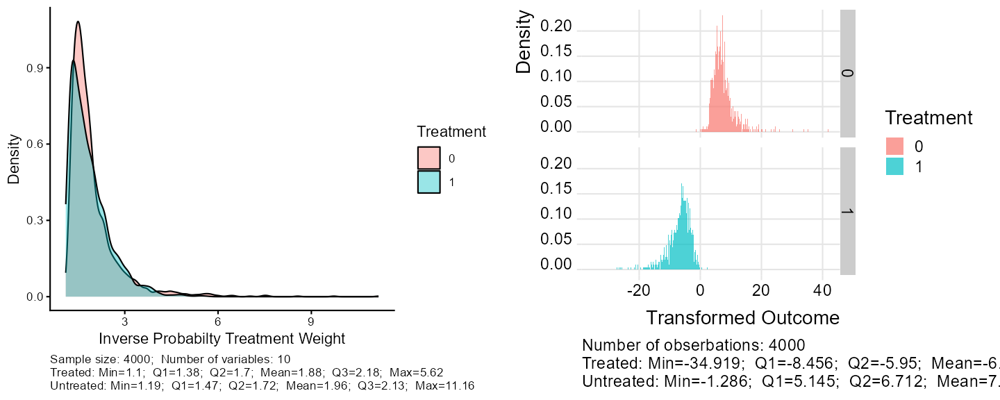
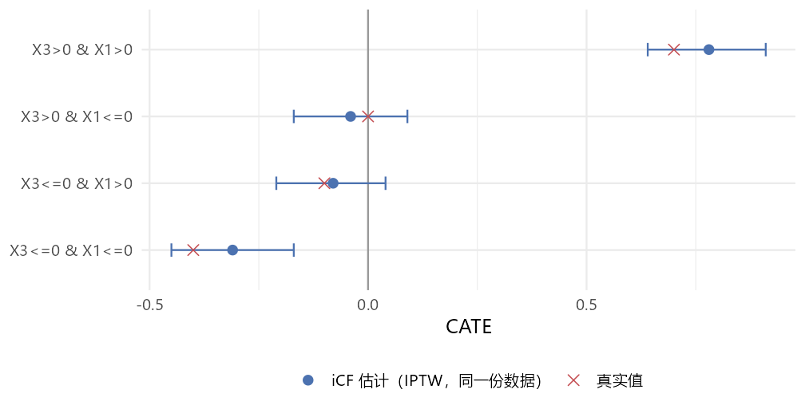

iCF 的绘图函数分两类：单步结果图（变量重要性、倾向评分、深度分布，已在
第 3、4 页介绍），以及 `iCFCV()` 之后的**交叉验证诊断图**。本页讲后者，
并补一张包里没有、但最该画的图——亚组效应森林图。

## 函数一览

| 函数 | 输入 | 画什么 | 页面 |
|---|---|---|---|
| `GG_VI(varimp_cf, title, var_label)` | 重要性向量 | 条形图 | [第 3 页](03-cf-raw-key.qmd#sec-viz) |
| `PlotVI(varimp_CF, title, var_label)` | （忽略第一个参数） | 散点 + 标签 | [第 3 页](03-cf-raw-key.qmd#sec-viz) |
| `GG_PS(dat, PS, title, filename)` | 任意按行对应的数值 | 两组密度，**同时写 png** | [第 3 页](03-cf-raw-key.qmd#sec-viz) |
| `MinLeafSizeTune()$depth_gg` | — | 最佳树深度分布 | [第 4 页](04-leafsize.qmd) |
| `GG_DepthDistribution(...)` | 四张 `depth_gg` | 2 × 2 拼图，**写出空白 tiff** | [第 4 页](04-leafsize.qmd#sec-depth-dist) |
| `GG_Xs(pcttop)` | 读全局 `varimp_cf`、`X` | 只画入选的高维变量 | [第 8 页](08-hdicf.qmd) |
| `GG_CV_stab_vote(iCFoutput)` | `iCFCV()` 结果 | 各折 × 各深度的投票稳定性 | 本页 |
| `GG_CV_Dx_PS(result, K)` | `iCFCV()` 结果 | 各折训练/验证集倾向评分 | 本页 |
| `GG_CV_Dx_iptw(result, K)` | 同上 | 各折 IPTW 权重 | 本页 |
| `GG_CV_Dx_Ystar(result, K)`、`GG_CV_Dx_YstarNo0(result, K)` | 同上 | 各折转换结局（后者去掉 0） | 本页 |
| `GG_Y_star(dat, Y_star, No0)` | 转换结局向量 | 按治疗组分面的直方图 | 本页 |
| `MAJORITY_VOTE()$split_value_plot` | — | 胜出结构的切点分布（山脊图） | [第 6 页](06-internals.qmd) |

## 投票稳定性：`GG_CV_stab_vote()`

```r
GG_CV_stab_vote(res)
```

读 `res$stability_vote_across_CV`（K × 4），每个点是某折某深度的折内稳定性，
点越大越稳定：

{fig-align="center" width="80%"}

两点要知道：

- 横轴标签在源码里**写死**为 `CV fold 1` … `CV fold 5`，轴标题写死为 `Cluster`；
  `K` 不是 5 时标签错位。
- 本例每一行在 5 折之间**一模一样**（D2 都是 0.6、D3 都是 0.4……）。
  这不是巧合：各折实际上在同一份全样本上、用同一串随机种子重复了同一次发现，
  见[第 9 页](09-pitfalls.qmd#sec-identical-folds)。所以这张图在当前代码下
  只能读出"各深度的折内稳定性"，看不出跨折变化。

## 各折诊断：`GG_CV_Dx_*()`

```r
GG_CV_Dx_PS(res, 5)
GG_CV_Dx_iptw(res, 5)
GG_CV_Dx_Ystar(res, 5)
GG_CV_Dx_YstarNo0(res, 5)
```

四个函数版式相同：`K = 5` 时拼成 2 行 × 5 列，第 1 行是 5 个**训练折**，
第 2 行是 5 个**验证折**；`K = 10` 时拼成 4 行 × 5 列。
**其它 `K` 不支持**——源码只写了这两个分支，`K = 3` 时报
`object 'Dx_fig' not found`（本机实测）。

{fig-align="center" width="100%"}

验证折的倾向评分来自 `regression_forest_4PS()` **在该验证折内部**重新拟合的回归森林，
所以下排每张图只基于 1 000 人。这组图主要用来查两件事：
两组倾向评分是否重叠、有没有接近 0 或 1 的极端值——后者会让 IPTW 权重和转换结局爆掉。

`GG_CV_Dx_Ystar()` 与 `GG_CV_Dx_YstarNo0()` 在常规宽度下基本不可读：
每个小图还要再按治疗组分面，转换结局的长尾把横轴压扁，图注文字互相重叠。
需要时直接取返回值里的单折图：

```r
cowplot::plot_grid(res$IPTW_distribution[[1]], res$Y_star_distribution[[1]], ncol = 2)
```

{fig-align="center" width="100%"}

右图说明了为什么[第 5 页](05-icfcv.qmd)的交叉验证 MSE 在 7 以上：
本例结局约在 −8 到 0 之间，除以倾向评分后，治疗组的 $Y^*$ 最小到 −34.9，
对照组的长尾延伸到 40 附近。$Y^*$ 的条件期望等于 CATE，但单个值的方差很大，
MSE 的绝对大小没有解释意义，只能在 G2–G5 之间横向比较。

返回值里对应的逐折图列表：

| 列表 | 训练折 | 验证折 |
|---|---|---|
| 倾向评分 | `PS_distribution` | `PS_distribution_test` |
| IPTW 权重 | `IPTW_distribution` | `IPTW_distribution_test` |
| 转换结局 | `Y_star_distribution` | `Y_star_distribution_test` |
| 非零转换结局 | `Y_star_No0_distribution` | `Y_star_No0_distribution_test` |

"非零"版本是给二分类结局准备的：$Y = 0$ 时 $Y^* = 0$，大量的 0 会把直方图压扁。

## 包里没有、但最该画的图：亚组效应

`iCFCV()` 的效应是字符串（如 `-0.31(-0.45,-0.17)`），包里没有画它的函数。
拆成数值后自己画（代码见[第 5 页](05-icfcv.qmd#sec-cate)）：

{fig-align="center" width="85%"}

真实数据没有"真实值"那一列。更重要的是区间来源：上图的区间是在发现亚组的
同一份数据上、用模型标准误算的，偏窄。[第 9 页](09-pitfalls.qmd#sec-honest)
给出拆样本后的同类图，两者放在一起看最能说明问题。

## 看一棵最佳树

grf 自带树的绘图（依赖 DiagrammeR，在 RStudio Viewer 里显示）：

```r
bt <- quiet(find_best_tree(cf_demo, "causal"))
plot(grf::get_tree(cf_demo, bt$best_tree))
```

iCF 在 `CF_RAW_key()` 和每次 `iCF()` 迭代里都执行这一句，但把结果丢弃了。
