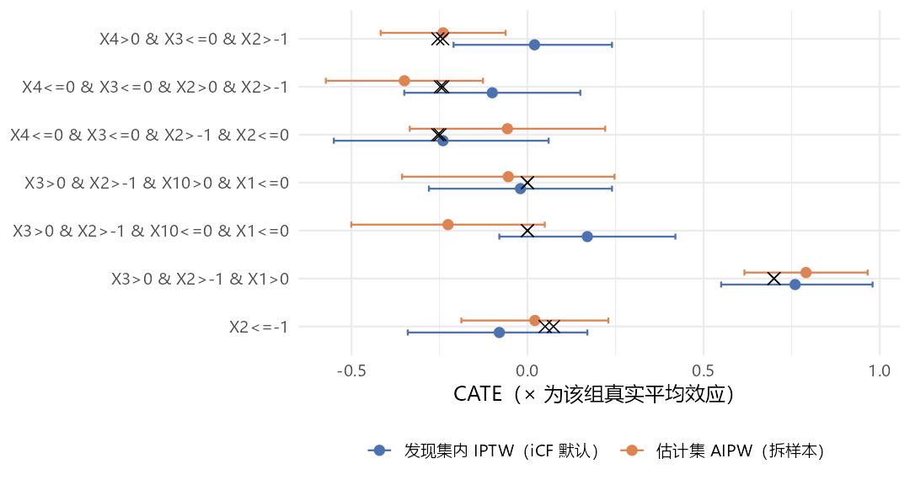

本页先把前八页的问题收成一张表，再展开五个决定"结果能不能信"的实验，
最后给一套在当前代码下可以照抄的工作流。

## 陷阱总表

证据列：**源码**＝本机安装的 iCF（commit `8932f6a`）函数体；
**实测**＝Windows R 4.4.3、grf 2.6.1 下实际运行；**README**＝作者仓库说明原文。

```{=html}
<style>
.tbl-evidence table td:last-child,
.tbl-evidence table th:last-child { white-space: nowrap; }
.tbl-evidence table td:first-child,
.tbl-evidence table th:first-child { white-space: nowrap; }
</style>
```

::: {.column-page .tbl-evidence}

| # | 现象 | 后果 | 怎么办 | 证据 |
|---|---|---|---|---|
| 1 | `install_github()` 装不上 | `R/iCF_README.R` 被执行、旧 `NAMESPACE` 报错 | 最小修补安装 | [实测](02-setup.qmd#sec-why-not) |
| 2 | README 漏写 `glmnet`、`cowplot` | 算亚组效应时报 `could not find function "cv.glmnet"` | 加载时补上 | 源码 + 实测 |
| 3 | 核心函数从全局环境读数据 | 包进函数或换数据后静默用旧数据 | 顶层运行；换数据重设全部全局对象 | [源码](02-setup.qmd#sec-globals) |
| 4 | `plyr` 屏蔽 `summarise()` | `PS_trim()` 报 `..1 must be of size 1` | 先 `detach("package:plyr")` | [实测](08-hdicf.qmd#sec-ps-trim) |
| 5 | `CF_RAW_key()` 内 `set.seed(1234)`、基础绘图 | 重置随机数流；非交互会话写 `Rplots.pdf` | 工作目录设到临时目录 | [源码 + 实测](02-setup.qmd#sec-side) |
| 6 | `variable_type = "hd"` 且 `hdPctTop = 1` | 报 `object 'selected_cf.idx_hd' not found` | 用 < 1 的分位数或 > 1 的个数 | [实测](03-cf-raw-key.qmd#sec-select) |
| 7 | 只选中 1 个变量时 `CF()` 取列退化成向量 | grf 报 `only supported data input types are matrix, data.frame` | `min.split.var` ≥ 2 | [源码 + 实测](06-internals.qmd#sec-cf) |
| 8 | `treeNo` < 20 | `find_best_tree()` 报 `missing value where TRUE/FALSE needed` | `treeNo` ≥ 20 | [实测](06-internals.qmd#sec-besttree) |
| 9 | `iCFCV()` 的 `min.split.var`、`variable_type`、`hdPctTop` | 对种树不起作用 | 在第 1 步设好全局 `selected_cf.idx` | [实测](05-icfcv.qmd#sec-min-split-var) |
| 10 | P 值不过 `P_threshold` | `iCFCV()` 报 `object 'vote_D2_subgroup.L.majority' not found` | 自己先看 P 值再决定是否调用 | [实测](#sec-null-branch) |
| 11 | `P_threshold = 1` 且无真实异质性 | 仍输出亚组（纯噪声切分） | 看 P 值、看稳定性、拆样本验证 | [实测](#sec-null-branch) |
| 12 | P 值先四舍五入到一位小数 | 0.14 当作 0.1 | 知道即可 | [源码](05-icfcv.qmd#sec-pthreshold) |
| 13 | 每折种树都读全局全样本 | 验证折参与亚组发现 | 拆样本 | [实测](#sec-leak) |
| 14 | 各折发现过程逐位相同 | 跨折稳定性恒为 1、`_icvsw` 与 `_ori` 恒相同 | 不把跨折稳定性当证据 | [实测](#sec-identical-folds) |
| 15 | 每折 D2 森林种两遍 | 多耗约 1/5 时间 | 无 | [实测](06-internals.qmd#sec-pipeline) |
| 16 | R-loss 剪枝结果被丢弃 | 亚组数由叶大小决定 | 认真调叶大小 | [实测](06-internals.qmd#sec-prune) |
| 17 | 连续变量 + `split_val_round_posi = 0` | 切点 0.5 变成 0 | 事先分类，或取 1–2 位小数 | [实测](#sec-round) |
| 18 | 亚组效应在同一份数据上估计、用模型标准误 | 区间偏窄（稳健区间宽 34%） | 另一半数据上用 AIPW 估计 | [实测](05-icfcv.qmd#sec-cate-ci) |
| 19 | `CATE_t2_ori` 每人一行、`n` 列全是 1 | 误把 `n` 当亚组样本量 | `distinct()` 后自己数 | [实测](05-icfcv.qmd#sec-cate) |
| 20 | `PlotVI()` 忽略第一个参数 | 画的是全局 `varimp_cf` | 用 `GG_VI()` | [实测](03-cf-raw-key.qmd#sec-viz) |
| 21 | `GG_DepthDistribution()` 的 tiff 是空白的 | 25 MB 白图 | 直接 `cowplot::plot_grid()` | [实测](04-leafsize.qmd#sec-depth-dist) |
| 22 | `GG_CV_Dx_*()` 只支持 `K` = 5 或 10 | 其它 K 报 `object 'Dx_fig' not found` | 取返回值里的单折图 | [实测](07-plots.qmd) |
| 23 | `LEAFSIZE_tune()`、`GRID_LEAFSIZE()` | 调用不存在的 `iCF_basic()` | 用 `MinLeafSizeTune()` | [源码](04-leafsize.qmd#sec-old-tuners) |
| 24 | hdiCF README 合并稀疏级别后没重建 `Train` | 可能报 `factor ... has new levels` | `data.frame(Y, W, X)` 重建 | [源码 + 实测](08-hdicf.qmd) |
| 25 | 结局只有 3–7 个不同取值 | `CF_GROUP_DECISION()` 模型对象未定义 | 结局用 0/1 或连续 | 源码 |
| 26 | `man/` 下的帮助页过时 | 17 个 Rd 描述已不存在的函数 | 以源码为准 | [源码](06-internals.qmd) |

: {tbl-colwidths="[3,30,27,26,14]"}

:::

## 实验 1：无异质性数据 {#sec-null-branch}

用 README 的设定，但**去掉全部交互项**（真实效应恒为 −0.4），n = 3 000，种子 99。
下面的 `sim_readme()` 只是把[第 3 页](03-cf-raw-key.qmd#sec-sim)的生成代码包成函数，
`hte = FALSE` 时去掉含 `W` 的交互项与 `0.2*X1*X3`：

```r
Null <- sim_readme(3000, seed = 99, hte = FALSE)   # 与第 3 页相同的生成代码，去掉 W 的交互项
# ……设全局对象，CF_RAW_key(Null, 1, "non-hd", 0.9)……
HTE_P_cf.raw
#> [1] 0.554
colnames(X)[selected_cf.idx]
#> [1] "X2"  "X4"  "X7"  "X10"
```

同质性检验 P = 0.554，正确地没有发现异质性。按论文的 $\alpha = 0.1$ 调用：

```r
iCFCV(Null, K = 5, treeNo = 100, iterationNo = 5, min.split.var = 4, split_val_round_posi = 0,
      P_threshold = 0.1, variable_type = "non-HD", hdPctTop = 0.95, HTE_P_cf.raw = HTE_P_cf.raw)
#> Error: object 'vote_D2_subgroup.L.majority' not found
```

`else` 分支只定义了 `vote_D2_subgroup.CVmajority`，`return()` 却引用
`vote_D2_subgroup.L.majority`。任何 `round(P, 1) > P_threshold` 的调用都会这样结束，
论文 Figure 1A 里"No strong subgroups"那条路在代码里走不通。

改用 README 的 `P_threshold = 1`：

```r
res0 <- quiet(iCFCV(Null, 5, 100, 5, 4, 0, P_threshold = 1, "non-HD", 0.95, HTE_P_cf.raw))
res0$selectedSG_ori$majority
#>   subgroupID subgroup
#> 1          1 X2<=0
#> 2          2 X2>0
res0$selectedSG_stability_ori
#> |grp_pick |stability_vote_mean4CV |stability_CV |mse_g2_Model |mse_g3_Model |mse_g4_Model |mse_g5_Model |
#> |W:G2x    |0.4                    |1            |7.97885      |8.37875      |8.11091      |8.00072      |
```

| 亚组 | n | `CATE_iptw` | 真实值 |
|---|---|---|---|
| `X2<=0` | 1 538 | −0.38 (−0.49, −0.26) | −0.4 |
| `X2>0` | 1 462 | −0.44 (−0.57, −0.31) | −0.4 |

它仍然给出一个亚组划分——按一个纯预后变量（X2 是混杂）切成两半，
耗时 51 秒。两组效应都接近 −0.4、区间高度重叠，读者能看出"其实没差别"；
但输出本身不会告诉你"不必分亚组"：`PICK_CV()` 只在 G2–G5 之间选，
主效应模型从不进入候选。**P 值与折内稳定性（此处 0.4）是仅有的两个警示信号。**

## 实验 2：每折都在全样本上种树 {#sec-leak}

`iCFCV()` 每折对训练集调用 `CF_RAW_key(Train_cf, ...)`，看起来是在训练集上重来一遍。
但真正种树的 `CF()` 不接收数据参数，按词法作用域读全局的 `X`、`Y`、`W`、
`Y.hat`、`W.hat`、`selected_cf.idx`。用 `trace()` 记录[第 5 页](05-icfcv.qmd)那次主运行：

```r
cf_rows <- integer(0); rawkey_rows <- integer(0)
trace("CF", quote(cf_rows <<- c(cf_rows, nrow(X))), print = FALSE, where = asNamespace("iCF"))
trace("CF_RAW_key", quote(rawkey_rows <<- c(rawkey_rows, nrow(Train_cf))), print = FALSE,
      where = asNamespace("iCF"))
res <- quiet(iCFCV(dat = Train, K = 5, treeNo = 200, iterationNo = 10, ...))
table(rawkey_rows)
#> 4000
#>    5
table(cf_rows)
#> 5000
#>  250
```

`CF_RAW_key()` 确实拿到了 4 000 行的训练折，但 250 次种树看到的全是 5 000 行的全样本。
验证折既参与了发现亚组，又被用来评估这些亚组，交叉验证误差与深度选择都偏乐观。

## 实验 3：各折的发现过程逐位相同 {#sec-identical-folds}

实验 2 还有一个更直接的后果。每折开头 `CF_RAW_key()` 执行 `set.seed(1234)`，
之后消耗随机数的步骤在各折完全一样，于是进入 `SUBGROUP_PIPELINE()` 时
随机数状态相同；而种树的数据又都是全局全样本——**每折种出的森林完全相同**。
用 `trace(exit = )` 截获每次 `iCF()` 的返回值，在 3 折的小设置下逐一比对：

```r
icf_out <- list()
trace("iCF", exit = quote(icf_out[[length(icf_out) + 1]] <<- returnValue()), print = FALSE,
      where = asNamespace("iCF"))
r3 <- quiet(iCFCV(Train, K = 3, treeNo = 50, iterationNo = 3, min.split.var = 4, ...))
bt <- function(o) lapply(o, function(it) it[[1]])        # 每次迭代的最佳树数据框
identical(bt(icf_out[[1]]), bt(icf_out[[6]]))            # D5：第 1 折 vs 第 2 折
```

| 深度 | 第 1 折 = 第 2 折 | 第 1 折 = 第 3 折 |
|---|---|---|
| D5 | TRUE | TRUE |
| D4 | TRUE | TRUE |
| D3 | TRUE | TRUE |
| D2 | TRUE | TRUE |

所有深度、所有迭代的最佳树逐位相同。于是：

- 各折给出的 $G_2, \dots, G_5$ 必然一致，**跨折稳定性恒为 1**（第 5 页主运行、
  实验 1、第 8 页 hdiCF 的 `stability_CV` 全是 1）；
- "误差除以跨折稳定性"的 `_icvsw` 选择与原始选择恒相同；
- K 折交叉验证退化成"一次在全样本上发现亚组，再在 K 个验证折上分别打分"。
  打分的验证折本身参与了发现，所以更深、更碎的划分容易得到更低的误差。

## 实验 4：连续修饰变量与切点取整 {#sec-round}

生成只含一个连续修饰变量的数据：`X2 > 0.5` 的人治疗效应多 0.8（论文场景 3 的简化版），
n = 5 000，种子 42。先是[陷阱 7](06-internals.qmd#sec-cf)：`min.split.var = 1` 时
只有 X2 入选，`iCF()` 直接报错。改用 `min.split.var = 3`（入选 X2、X4、X7），
对 D2 种 10 个森林，只改变 `split_val_round_posi`：

| `split_val_round_posi` | 10 棵最佳树的根节点切点 | 合成切点 | 输出亚组 |
|---|---|---|---|
| 0 | 全部为 0 | 0 | `X2<=0`、`X2>0` |
| 1 | 0.2–0.4 | 0.3 | `X2<=0.3`、`X2>0.3` |
| 2 | 0.21–0.43 | 0.28 | `X2<=0.28`、`X2>0.28` |

变量找对了，但切点有两层误差：因果森林本身把切点放在 0.2–0.4（真值 0.5），
这与取整无关；取整到整数后又被推到 0，于是约 19% 的人（$0 < X_2 \le 0.5$）被分错组。
论文的建议是事先把连续变量分类（p. 773）；如果保留连续变量，至少取 1 位小数。

## 实验 5：拆样本，诚实地估计亚组效应 {#sec-honest}

把第 3–5 页那份数据（下面记作 `Full`，n = 5 000）随机分成两半：发现集 A 跑完整个 iCF 得到规则，
估计集 B 只用来估计每条规则的效应。

```r
set.seed(2025)
idx <- sample(nrow(Full), nrow(Full) / 2)
A <- Full[idx, ]; B <- Full[-idx, ]

# 发现：A 上走完第 3–5 页的全部步骤（全局对象都按 A 重设）
# ……CF_RAW_key(A, 1, "non-hd", 0.9)……
colnames(X)[selected_cf.idx]
#> [1] "X1"  "X2"  "X3"  "X4"  "X10"
resA <- quiet(iCFCV(A, K = 5, treeNo = 200, iterationNo = 10, min.split.var = 4,
                    split_val_round_posi = 0, P_threshold = 1, variable_type = "non-HD",
                    hdPctTop = 0.95, HTE_P_cf.raw = HTE_P_cf.raw))
rules <- resA$selectedSG_ori$majority$subgroup

# 估计：B 上用 grf 的 AIPW，每条规则一个子集
cfB <- grf::causal_forest(as.matrix(B[, -(1:2)]), B$Y, B$W, seed = 1)
est_B <- t(sapply(rules, function(r) grf::average_treatment_effect(cfB, subset = eval(parse(text = r), B))))
```

发现集 A 只有 2 500 人，"大于均值"规则选进了 5 个变量（全样本时只选 X1、X3），
其中 X2、X4、X10 是连续的混杂或预后变量。iCF 于是选了 D5，切出 7 个亚组，
折内稳定性只有 0.1（耗时 66 秒）：

| 规则（A 上发现） | A 内 IPTW（iCF 默认） | B 上 AIPW | 真实值 |
|---|---|---|---|
| `X3>0 & X2>-1 & X1>0` | 0.76 (0.55, 0.98) | 0.79 (0.62, 0.97) | 0.70 |
| `X2<=-1` | −0.08 (−0.34, 0.17) | 0.02 (−0.19, 0.23) | 0.05–0.07 |
| `X3>0 & X2>-1 & X10<=0 & X1<=0` | 0.17 (−0.08, 0.42) | −0.23 (−0.50, 0.05) | 0 |
| `X3>0 & X2>-1 & X10>0 & X1<=0` | −0.02 (−0.28, 0.24) | −0.05 (−0.36, 0.25) | 0 |
| `X4<=0 & X3<=0 & X2>-1 & X2<=0` | −0.24 (−0.55, 0.06) | −0.06 (−0.33, 0.22) | −0.25 |
| `X4<=0 & X3<=0 & X2>0 & X2>-1` | −0.10 (−0.35, 0.15) | −0.35 (−0.57, −0.13) | −0.24 |
| `X4>0 & X3<=0 & X2>-1` | 0.02 (−0.21, 0.24) | −0.24 (−0.42, −0.06) | −0.24 |

{fig-align="center" width="90%"}

三点观察：

- **只有一条规则是真的。** `X3>0 & X2>-1 & X1>0` 对应真实的高效应组（0.7），
  两种估计都抓住了它。其余 6 条是 X2、X4、X10 上的噪声切分：
  这 6 组的真实效应只集中在 0 与 −0.25 附近两档。
  全样本 5 000 人时 iCF 完美恢复四格（第 5 页），样本减半、筛进连续噪声变量后就不行了。
  **变量筛选这一步决定成败。**
- **B 上的区间 7 个全部覆盖真值**；A 内的 iCF 默认区间覆盖了 6 个。
  这一次两者差别不大，但 A 内的估计与发现用的是同一批人，没有理论保证。
- 规则 `X4<=0 & X3<=0 & X2>0 & X2>-1` 里同一变量出现两次，
  这是 `TREE2SUBGROUP()` 不合并同变量条件的结果，读的时候要自己化简（即 `X2>0`）。

## 生存结局 {#sec-survival}

iCF 源码里没有任何删失处理：森林是 `causal_forest()`，
效应模型是高斯 glm，论文把生存数据列为局限（p. 774）。
README 的实证例子把"两年内是否住院"当二分类 $Y$，删失者当作未发生。

一个可行的接法是**伪观测**：把"截至 $t^*$ 仍存活"的 Kaplan–Meier 伪值当作连续结局喂给 iCF，
只用它来**发现**规则；效应在留出集上用 `grf::causal_survival_forest()` 估计。

```r
ps <- pseudo::pseudosurv(time = dat$time, event = dat$status, tmax = 2)
dat$Y <- ps$pseudo[, 1]          # 伪值的均值恰等于 KM 估计的 S(2)
```

本机 2026-09-27 做过一轮模拟（README 协变量，n = 4 000，Weibull 比例风险，
log HR 由 X1、X3 修饰，目标 $S_1(2) - S_0(2)$，$t^*$ 前删失约 30%，5 个种子；
脚本未随本站发布）。指标是"发现的划分能解释真实效应方差的比例" $R^2$：

| 情形 | 做法 | $R^2$ | ATE 偏差 |
|---|---|---|---|
| 无删失（对照） | 真实二分类结局 | 0.87 | 0.008 |
| 独立删失 | 伪观测 | 0.68 | 0.003 |
| 独立删失 | 删失当作未发生 | 0.62 | −0.004 |
| 删失依赖治疗与 X2 | 伪观测 | 0.45 | 0.017 |
| 删失依赖治疗与 X2 | 删失当作未发生 | 0.43 | 0.056 |

独立删失下伪观测可用；删失依赖协变量时，所有做法的发现能力都明显下降，
边际 KM 伪值也会有偏，需要 IPCW 伪观测。40 次运行里另有 5 次在
`CATE_SG()` → `prop.func()` 处报 `subscript out of bounds`，与结局构造无关。

## 推荐工作流

在不改 iCF 源码的前提下，下面这套流程绕开了上表中影响结论的几处问题：

```r
## 0. 准备 ---------------------------------------------------------------
old <- setwd(tempdir())                         # 吸收 png / tiff / Rplots.pdf
pkgs <- c("MASS", "grf", "tidyverse", "rlang", "rlist", "plyr", "caret", "caTools",
          "randomForest", "ggridges", "data.table", "broom", "rstatix", "knitr",
          "DiagrammeR", "glmnet", "cowplot")
invisible(lapply(pkgs, library, character.only = TRUE))
library(iCF)
quiet <- function(x) { invisible(utils::capture.output(x)); x }

## 1. 拆样本：A 发现，B 估计 ------------------------------------------------
set.seed(2025)
idx <- sample(nrow(dat), nrow(dat) / 2)
A <- dat[idx, ]; B <- dat[-idx, ]; rownames(A) <- NULL

## 2. 在 A 上设全部全局对象（顶层运行，不要包进函数） ----------------------
Train <- A
vars_forest <- colnames(A)[-(1:2)]
X <- A[, vars_forest]; Y <- A$Y; W <- A$W
k <- quiet(CF_RAW_key(A, min.split.var = 2, variable_type = "non-hd", hdPctTop = 0.9))
Y.hat <- k$Y.hat; W.hat <- k$W.hat; HTE_P_cf.raw <- k$HTE_P_cf.raw
varimp_cf <- k$varimp_cf; selected_cf.idx <- k$selected_cf.idx
colnames(X)[selected_cf.idx]                    # 检查入选变量：它决定成败
HTE_P_cf.raw                                    # 自己判断，不靠 P_threshold
vars_catover2 <- find_level_over2(X)

## 3. 调叶大小（第 4 页），然后运行 --------------------------------------------
leafsize <- list(D5 = 85, D4 = 65, D3 = 45, D2 = 25)   # 用 MinLeafSizeTune() 核对后再定
resA <- quiet(iCFCV(dat = A, K = 5, treeNo = 1000, iterationNo = 100, min.split.var = 2,
                    split_val_round_posi = 1, P_threshold = 1, variable_type = "non-hd",
                    hdPctTop = 0.9, HTE_P_cf.raw = HTE_P_cf.raw))
rules <- resA$selectedSG_ori$majority$subgroup
resA$selectedSG_stability_ori                   # 只看 stability_vote_mean4CV，不看 stability_CV

## 4. 在 B 上估计每条规则的效应 ----------------------------------------------
cfB <- grf::causal_forest(as.matrix(B[, -(1:2)]), B$Y, B$W)
est <- t(sapply(rules, function(r)
  grf::average_treatment_effect(cfB, subset = eval(parse(text = r), B))))
cbind(n = sapply(rules, function(r) sum(eval(parse(text = r), B))), est)

setwd(old)
```

报告时写出：入选变量、各深度候选亚组与折内稳定性、最终规则、
**B 上**的效应与区间、以及 A 上的同质性检验 P 值。

## 与其它方法的关系

- [grf 手册](../grf/01-grf-guide.qmd)：iCF 的每一个森林都是 `grf::causal_forest()`，
  最佳树、变量重要性、`test_calibration()` 的含义都在那里；
- [model4you](../model4you.qmd)、[StratifiedMedicine](../stratifiedmedicine.qmd)：
  另外两种"输出一棵树"的亚组方法，前者在参数模型上做 MOB，后者是 PRISM 流水线；
- [unihtee](../unihtee.qmd)：不切亚组、只给逐变量检验，适合作为 iCF 之前的变量筛选；
- 本机另做过 iCF 与 causalDT（蒸馏树）的对照（2026-09-26，各 5 个种子）：
  在 iCF 自家 README 的全二分类设定上 iCF 10/10 恢复真四格，causalDT 常多切或少切；
  换成 causalDT 论文的连续协变量设定（n = 500）后，`split_val_round_posi = 1` 时 iCF 在 30 次里崩溃 8 次
  （均为陷阱 7），沿用 README 的取整设置则崩溃 15 次（另含 `prop.func()` 下标越界）；
  成功时变量全对、没有假阳性，但平均切出 6 片叶子。脚本未随本站发布。
