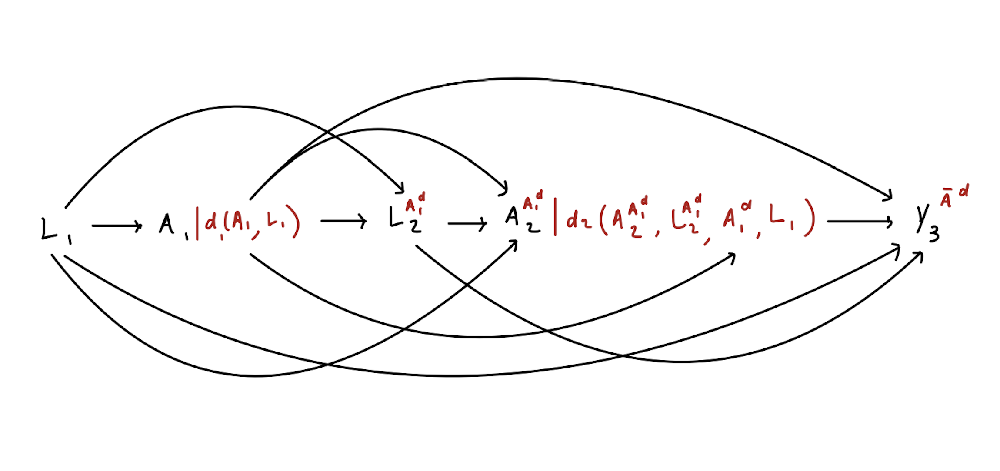

> **来源**：Nick Williams、Kara Rudolph、Iván Díaz，[*Beyond the ATE* · Defining Interventions](https://www.beyondtheate.com/02_info_d.html)
> （[GitHub 仓库](https://github.com/nt-williams/lmtp-workshop)），GPL-3.0 许可。
> 本页为中文翻译，非原文；按 GPL-3.0 保留原作者署名与许可证，并标明这是修改（翻译）后的版本。
> 公式与记号按原文逐字保留；原站的 webR 交互代码块在本站以静态代码块呈现，不重新执行。



**因果路线图**（causal roadmap）为评估因果研究问题提供了一套系统方法
[@petersen2014causal]，共包含 8 个步骤：

1. 明确研究问题
2. 定义因果模型
3. 借助反事实定义所关心的因果效应
4. 描述观测数据
5. 在清晰陈述的假设下，把因果效应识别为一个统计估计量
6. 定义统计估计问题
7. 估计该统计估计量
8. 在研究问题、因果假设和统计假设的语境下解释结果

本节聚焦第 2 步和第 5 步。前面我们把 $\dd(a_t, h_t, \epsilon_t)$ 定义为一个函数，
它把取值 $a_t$、$h_t$ 以及可能存在的随机化装置 $\epsilon_t$ 映射为一个新的处理取值。
下面来看这个函数如何用于定义处理效应。接下来我们的目标，是通过因果参数

$$
\theta = \E[Y^{\bar A^{\dd}}]\text{,}
$$

来估计由干预 $\dd$ 刻画的干预对结局 $Y$ 的因果效应。其中 $Y^{\bar A^{\dd}}$ 是
这样一个世界中的反事实结局：在那个（可能与事实相反的）世界里，
$\bar{A} = (A_1, \ldots, A_\tau)$ 的每个分量都按函数 $\dd$ 依如下方式被修改。

* 在时点 $t=1$，干预后的处理被赋值为 $A_1^\dd = \dd(A_1, H_1)$。
  这会在时点 $t=2$ 生成一个*反事实*处理，记作 $A_2^{A_1^\dd}$。
  它表示：若干预只在 $t=1$ 实施、在 $t=2$ 未实施，个体本会接受的处理。

* 在时点 $t=2$，干预后的处理被赋值为 $A_2^\dd = \dd(A_2^{A_1^\dd}, L_2^{A_1^\dd}, A_1^\dd, L_1)$。
  这会在时点 $t=3$ 生成一个反事实处理。

* 这一过程迭代重复直到研究结束。届时，反事实结局 $Y^{\bar A^{\dd}}$ 被生成出来。

{fig-align="center"}

这一定义与结局的类型无关：

-   当 $Y$ 是连续变量时，$\theta$ 是干预 $\dd$ 下 $Y$ 的总体均值。

-   当 $Y$ 是二值变量时，$\theta$ 是干预 $\dd$ 下事件 $Y$ 的总体比例。

-   当 $Y$ 是研究结束前是否发生某事件的指示变量时，$\theta$ 定义为干预 $\dd$ 下
    $Y$ 的累积发病率。

本节末尾我们会说明，在一定假设下如何从观测数据中识别这个因果参数。

---

我们在方法学因果推断文献里读到的大多数论文，都假定处理变量或暴露变量是二值的。
这么做往往是为了简化因果效应的定义，但现实中许多我们关心的暴露并不是二值的。
**与之相反，本工作坊要处理的是** $A$ **为二值、分类、多元或连续变量的情形！**

可是这个函数 $\dd$ 究竟是什么？该怎么定义它？用它来定义干预又是怎样解决问题的？
让我们从简单到复杂，逐一看看 $\dd$ 的各种例子。

## 静态干预

设 $A$ 是二值向量（例如是否服用某种药物），并定义 $\dd(a_t, h_t, \epsilon) = 1$。
这一干预刻画的假设世界是：总体中所有成员在所有时点都接受处理。

::: {.callout-note appearance="simple"}
如果函数 $\dd_t$ 无论输入为何都返回同一取值，这个干预就是**静态的**。
:::

#### 例

> 假设我们关心的是：把阿片类物质使用障碍患者随机分配到注射用纳曲酮（$A=1$）
> 与舌下含服丁丙诺啡（$A=0$）的效应。我们会对比两个假设世界中的反事实结局：
> 一个是所有单元都接受注射用纳曲酮 $\dd_1=1$，另一个是所有单元都接受丁丙诺啡
> $\dd_0=0$。这给出的就是众所周知的平均（比较）处理效应（ATE）。
> $$\E[Y^{\bar A^{\dd_1}} - Y^{\bar A^{\dd_0}}] = \E[Y^{A=1} - Y^{A=0}]$$

## 动态处理方案

设 $A_t$ 是二值向量（例如是否服药），$L_t$ 是数值向量（例如不适程度的度量）。
对给定的 $\delta$ 值，定义 $$
\dd(a_t, h_t, \epsilon) = \begin{cases}
1 &\text{ if } l_t > \delta \\
0 &\text{ otherwise.}
\end{cases}
$$

::: {.callout-note appearance="simple"}
若函数 $\dd$ 的输出**仅仅依赖于历史** $H_t$，这类干预称为**动态的**。
:::

#### 例

> @rudolph2022buprenorphine 研究了一组因阿片类物质使用障碍而服用丁丙诺啡–纳洛酮
> （BUP-NX）的患者中的给药策略。在该假设干预下，若患者在就诊前一周报告使用过
> 阿片类物质，则增加 BUP-NX 剂量；未报告前一周使用的患者维持原剂量。
> 令 $A_t$ 为第 $t$ 周相对第 $t-1$ 周是否增加 BUP-NX 剂量的二值指示变量，
> $L_t$ 为第 $t$ 周是否使用阿片类物质的指示变量。于是，
> $$
> \dd(a_t, h_t, \epsilon) = \begin{cases}
> 1 \text{ if } l_{t-1} = 1\\
> 0 \text{ otherwise}
> \end{cases}
> $$

## 修正处理策略

静态干预和动态干预受到了大量关注，但使用它们往往伴随几个关键问题。

1.  **用「对所有单元施加处理」的假设干预来定义因果效应，可能根本无法想象。**
    例如，我们也许想知道缩短手术时间是否会减少手术并发症。然而，把所有手术都
    设定为某个给定时长是无法想象的——哪怕这个时长依赖于患者的协变量。

2.  **用「对所有单元施加处理」的假设干预来定义因果效应，可能引发正性假设违背。**

解决这些问题的一个办法，是改用**修正处理策略（modified treatment policies, MTP）**
来定义因果效应。

::: {.callout-note appearance="simple"}
如果一个干预刻画的假设世界是「处理的*自然*取值被加以修正」，
那么这个干预就称为*修正处理策略*。
:::

### 加法移位与乘法移位 MTP

设 $A_t$ 是数值向量。假定 $A_t$ 在数据中的支撑满足
$P(A_t \leq u(h_t) \mid H_t = h_t) = 1$。对分析者设定的 $\delta$ 值，定义 $$
\dd(a_t, h_t, \epsilon) = \begin{cases}
a_t + \delta &\text{ if } a_t + \delta \leq u(h_t) \\
a_t &\text{ otherwise.}
\end{cases}
$$

在这一干预下，只要这样的增加是可行的，时点 $t$ 处暴露的自然取值就被增加分析者
设定的 $\delta$。这类 MTP 称为*加法移位 MTP*（additive shift MTP）。

#### 例

> @diaz2023nonparametric 估计了在急性呼吸衰竭患者（P/F 比 < 300）中，
> 把 P/F 比（$A_t$，一个低氧血症的度量）提高 50 个单位对生存的效应。
> $$
> \dd_t(a_t, l_t, \epsilon) = \begin{cases}
> a_t + 50 &\text{ if } a_t \leq 300 \\
> a_t &\text{ otherwise}
> \end{cases}
> $$

类似地，我们可以定义*乘法移位 MTP*：

$$
\dd(a_t, h_t, \epsilon) = \begin{cases}
a_t \times \delta &\text{ if } a_t \times \delta \leq u(h_t) \\
a_t &\text{ otherwise}.
\end{cases}
$$

#### 例

> @nugent2023demonstration 评估了 2022 年夏秋两季美国县级流动性指标与新增
> COVID-19 病例之间的关联。他们同时考虑了假设的加法 MTP 和乘法 MTP；
> 例如，他们定义了一个乘法 MTP，把「到访商业场所的移动设备密度」这一指标降低 25%：
> $$
> \dd(a_t, l_t, \epsilon) = a_t \times 0.75.
> $$

## 随机化干预

设 $A$ 是二值向量，$\epsilon \sim U(0, 1)$，且 $\epsilon$ 取分析者设定的 0 到 1 之间的值。
由此我们可以定义**随机化干预**。例如，设想我们关心这样一个假设世界：所有吸烟者中
有一半戒了烟。这一干预定义为

$$
\dd(a_t, \epsilon_t) = \begin{cases}
0 &\text{ if } \epsilon_t < 0.5 \text{ and } a_t = 1 \\
a_t &\text{ otherwise}
\end{cases}.
$$

## 基于风险比的增量倾向评分干预

设 $A$ 是二值变量，$\epsilon \sim U(0, 1)$，$\delta$ 是分析者设定的风险比，限制在
$0$ 与 $1$ 之间。此外定义 $P(A_t = a_t\mid H_t)= \g(a_t \mid H_t)$。

如果我们关心的是一个**降低**接受处理可能性的干预，定义

$$
\dd_t(a_t, h_t, \epsilon_t) = \begin{cases}
a_t &\text{ if } \epsilon_t < \delta \\
0 &\text{ otherwise}
\end{cases}.
$$ 此时有 $\g^\dd(a_t \mid h_t) = a_t \delta \g_t(1 \mid H_t) + (1 - a_t) (1 - \delta \g_t(1\mid H_t))$，
于是干预后与干预前倾向评分之比为 $\g_t^\dd(1 \mid H_t)/\g_t(1\mid H_t) = \delta$，
即风险比等于 $\delta$。

::: {.callout-note appearance="simple"}
若一个干预移位的是处理的条件概率，则称之为**增量倾向评分干预**
（incremental propensity score intervention, IPSI）。
:::

反过来，如果我们关心的是一个**提高**接受处理可能性的干预，定义

$$
\dd_t(a_t, h_t, \epsilon_t) = \begin{cases}
a_t &\text{ if } \epsilon_t < \delta \\
1 &\text{ otherwise.}
\end{cases}
$$

此时 $\g_t^\dd(a_t \mid H_t) = a_t (1 - \delta \g_t(0\mid H_t)) + (1 - a_t) \delta \g_t(0 \mid H_t)$，
它蕴含风险比 $\g_t^\dd(0\mid H_t)/\g(0\mid H_t) = \delta$。

::: {.callout-caution appearance="simple"}
此前也有人提出在**优势比**尺度上做移位的干预，但优势比移位的效应**不应**用
_lmtp_ 估计，后面我们会进一步讨论这一点。
:::

#### 例

> @wen2023intervention 利用电子健康档案数据，在接受性传播感染（STI）检测且未感染
> HIV 的顺性别男性中，估计了提高 PrEP 使用比例对细菌性 STI 的效应。
> 令 $A_t$ 为第 $t$ 周是否启动 PrEP 的二值指示变量，$L_t$ 为第 $t$ 周是否接受过任何
> STI 检测且未感染 HIV 的二值指示变量。他们把「中等」成功程度的 PrEP 推广干预定义为
> $$
> \dd(a_t, h_t, \epsilon) = \begin{cases}
> a_t &\text{ if } l_t = 1 \text{ and } \epsilon_t < 0.85 \\
> 1 &\text{ otherwise}.
> \end{cases}
> $$

## 因果参数的识别

回忆因果推断的根本问题：我们无法观测到用来定义因果效应的那些替代世界。
既然观测不到反事实变量，又该如何学到因果效应呢？在一组特定假设下，
我们可以从观测数据中**识别**出因果参数。这些假设称为识别假设。

### 识别假设

1.  *正性*（Positivity）。若 $(a_t, h_t) \in \text{supp}\{A_t, H_t\}$，
    则对 $t \in \{1, ..., \tau\}$ 有 $\dd(a_t, h_t) \in \text{supp}\{A_t, H_t\}$。

    > 如果存在一个单元其观测处理取值为 $a_t$、协变量为 $h_t$，那么也必须存在一个
    > 单元其处理取值为 $\dd(a_t, h_t)$、协变量为 $h_t$。

2.  *强序贯可交换性*（Strong sequential exchangeability）。对所有
    $s \in \{t+1, ..., \tau\}$，$A_t$ 与 $(L_s, A_s, Y)$ 的一切共同原因都已被测量，
    且都包含在 $H_t$ 中。

    > 对所有时点 $t$，历史 $H_t$ 含有足够的变量，可以调整 $A_t$ 与其后任何变量
    > （包括未来的处理）之间的混杂。

::: {.callout-tip appearance="minimal"}
**问题**：这些假设在什么情况下可能被违背？
:::

::: {.callout-note appearance="simple"}
在这些假设下，时点 $t$ 处处理自然取值的分布，等于在给定观测历史条件下时点 $t$ 处
处理观测取值的分布。
:::

在上述假设下，$\theta$ 可由观测数据识别如下：

令 $\m_{\tau+1} = Y$。在记号上稍作滥用，记 $A_t^\dd = \dd(A_t, H_t)$。
对 $t = \tau, ..., 1$，递归地定义

$$
\m_t: (a_t, h_t) \rightarrow \E[\m_{t + 1}(A^{\dd}_{t+1}, H_{t + 1}) \mid A_t = a_t, H_t = h_t],
$$

并定义 $\theta = E[\m_1(A^{\dd}_1, L_1)]$。

### 证明

令 $\tau = 2$，且 $\dd$ 是一个只依赖于处理当前自然取值的 MTP。
假设数据由如下 NPSEM 生成：
$$
\begin{align}
    L_1 &= f_{L,1}(U_{L,1})\\
    A_1 &= f_{A,1}(L_1, U_{A,1})\\
    L_2 &= f_{L,2}(A_1, L_1, U_{L,2})\\
    A_2 &= f_{A,2}(L_2,A_1,L_1,U_{A,2})\\
    Y &= f_Y(A_2,L_2,A_1,L_1,U_Y).
\end{align}
$$
所关心的因果量是 $\theta = \E[Y(\bar{A}^\dd)]$，其中 $Y(\bar{A}^\dd)$ 定义为
$$
\begin{aligned}
    L_1 &= f_{L,1}(U_{L,1})\\
    A_1 &= f_{A,1}(L_1, U_{A,1})\\
    A_1^\dd &= \dd(A_1)\\
    L_2(A_1^\dd) &= f_{L,2}(A_1^\dd, L_1, U_{L,2})\\
    A_2(A_1^\dd) &= f_{A,2}(L_2(A_1^\dd),A_1^\dd,L_1,U_{A,2})\\
    A_2^\dd &= \dd(A_2(A_1^\dd))\\
    Y(\bar{A}^\dd) &= f_Y(A_2^\dd,L_2(A_1^\dd),A_1^\dd,L_1,U_Y).
\end{aligned}
$$
因此，
$$
\begin{align}
    Y(\bar{A}^\dd) &= f_Y(A_2^\dd,L_2(A_1^\dd),A_1^\dd,L_1,U_Y)\\
    &= f_Y(\dd(A_2(A_1^\dd)),L_2(A_1^\dd),\dd(A_1),L_1,U_Y)\\
    &= f_Y(\dd(f_{A,2}(L_2(A_1^\dd),A_1^\dd,L_1,U_{A,2})),L_2(A_1^\dd),\dd(A_1),L_1,U_Y)\\
    &= f_Y(\dd(f_{A,2}(f_{L,2}(A_1^\dd, L_1, U_{L,2}),A_1^\dd,L_1,U_{A,2})),f_{L,2}(A_1^\dd, L_1, U_{L,2}),\dd(A_1),L_1,U_Y)\\
    &= f_Y(\dd(f_{A,2}(f_{L,2}(\dd(A_1), L_1, U_{L,2}),\dd(A_1),L_1,U_{A,2})),f_{L,2}(\dd(A_1), L_1, U_{L,2}),\dd(A_1),L_1,U_Y)
\end{align}
$$
由全期望公式：
$$\theta = \E\big[\E[Y(\bar{A}^\dd)\mid A_1,L_1]\big].
$$
把 $Y(\bar{A}^\dd)$ 展开：
$$
\E\big[\E[f_Y(\dd(f_{A,2}(f_{L,2}(\dd(A_1), L_1, U_{L,2}),\dd(A_1),L_1,U_{A,2})),f_{L,2}(\dd(A_1), L_1, U_{L,2}),\dd(A_1),L_1,U_Y)\mid A_1,L_1]\big]
$$
在强序贯可交换性下，$\{U_Y, U_{A,2}, U_{L,2}\} \perp A_1\mid L_1$，因此：
$$
\begin{align}
    &\E\big[\E[f_Y(\dd(f_{A,2}(f_{L,2}(\dd(A_1), L_1, U_{L,2}),\dd(A_1),L_1,U_{A,2})),f_{L,2}(\dd(A_1), L_1, U_{L,2}),\dd(A_1),L_1,U_Y)\mid A_1=\dd(A_1),L_1]\big]\\
    &\E\big[\E[f_Y(\dd(A_2(\dd(A_1))),L_2(\dd(A_1)),\dd(A_1),L_1,U_Y)\mid A_1=\dd(A_1),L_1]\big].
\end{align}
$$
由一致性（consistency），当我们以 $A_1=\dd(A_1)$ 为条件时，$L_2(\dd(A_1))$ 和
$A_2(\dd(A_1))$ 分别等于 $L_2$ 和 $A_2$：
$$
\E\big[\E[f_Y(\dd(A_2),L_2,\dd(A_1),L_1,U_Y)\mid A_1=\dd(A_1),L_1]\big].
$$
再由全期望公式：
$$
\E\big[\E\big[\E[f_Y(\dd(A_2),L_2,\dd(A_1),L_1,U_Y)\mid A_2,L_2,A_1=\dd(A_1),L_1]\,\big|\,A_1=\dd(A_1),L_1\big]\big].
$$
同样，假定强序贯可交换性 $U_Y \perp A_2 \mid L_2,A_1,L_1$，因此可以在最内层的条件集中
把 $A_2$ 替换为 $A_2 =\dd(A_2)$：
$$
\E\big[\E\big[\E[f_Y(\dd(A_2),L_2,\dd(A_1),L_1,U_Y)\mid A_2=\dd(A_2),L_2,A_1=\dd(A_1),L_1]\,\big|\,A_1=\dd(A_1),L_1\big]\big].
$$
最后，再用一次一致性论证：
$$
\begin{align}
    &\E\big[\E\big[\E[Y\mid A_2=\dd(A_2),L_2,A_1=\dd(A_1),L_1]\,\big|\,A_1=\dd(A_1),L_1\big]\big].
\end{align}
$$

### 示例

考虑下面这份数据（这里 $\tau = 2$）：

```r
set.seed(786543)
n <- 1000
l0 <- rnorm(n)
a1 <- rbinom(n, 1, plogis(-1 + l0*1.5))
l1 <- rnorm(n)
a2 <- rbinom(n, 1, plogis(-1 + l1*1.5 + a1*2))
y <- rnorm(n, -1 - 1.2*l0 + 2.4*a1 - 2*l1 + 1.2*a2)
foo <- data.frame(
  L1 = l0,
  A1 = a1,
  L2 = l1,
  A2 = a2,
  Y = y
)
```

原站在此处渲染出这 1000 行数据的交互式表格。下面是前 8 行（数值保留两位小数）：

| L1 | A1 | L2 | A2 | Y |
|---|---|---|---|---|
| -0.10 | 0 | -0.57 | 0 | 1.67 |
| 0.40 | 1 | 0.05 | 1 | 0.56 |
| 0.36 | 1 | -0.79 | 1 | 2.71 |
| 1.10 | 1 | -0.01 | 1 | 0.60 |
| -2.27 | 0 | 0.38 | 1 | 1.45 |
| 0.00 | 1 | -1.36 | 0 | 5.20 |
| -1.30 | 0 | 2.22 | 1 | -2.49 |
| 0.43 | 0 | -0.60 | 0 | -2.32 |

以及如下干预

$$
\dd(a_t, \epsilon_t) = \begin{cases}
0 &\text{ if } \epsilon_t < 0.5 \text{ and } a_t = 1 \\
a_t &\text{ otherwise.}
\end{cases}
$$

该干预下的真值约为 $-0.37$。首先，把这个干预翻译成一个 R 函数。

```r
d <- function(a) {
  epsilon <- runif(length(a))
  ifelse(epsilon < 0.5 & a == 1, 0, a)
}
```

随后我们可以按以下步骤计算识别公式：

1.  令 $\m_3(A_3^\dd, H_3) = Y$

    ```r
    m3_d <- foo$Y
    ```

2.  把 $\m_3(A_3^\dd, H_3)$ 对 $(A_2, H_2)$ 做回归。这给出一个预测函数，
    称之为 $\m_2(A_2,H_2)$。

    ```r
    m2 <- glm(m3_d ~ L1 + A1 + L2 + A2, data = foo)
    summary(m2)
    ```

3.  用该预测函数计算：若干预在时点 $t=2$ 被实施会发生什么，
    即计算 $\m_2(A_2^\dd,H_2)$。

    ```r
    m2_d <- predict(m2, mutate(foo, A2 = d(A2)))
    head(m2_d)
    ```

4.  把 $\m_2(A_2^\dd,H_2)$ 对 $(A_1, H_1)$ 做回归。这给出一个预测函数，
    称之为 $\m_1(A_1,H_1)$。

    ```r
    m1 <- glm(m2_d ~ L1 + A1, data = mutate(foo, m2_d = m2_d))
    summary(m1)
    ```

5.  用该预测函数计算：若干预在时点 $t=1$ 被实施会发生什么，
    即计算 $\m_1(A_1^\dd,H_1)$。

    ```r
    m1_d <- predict(m1, mutate(foo, A1 = d(A1)))
    head(m1_d)
    ```

6.  计算 $\m_1(A_1^\dd,H_1)$ 的均值。这个均值就等于 $\theta$。

    ```r
    mean(m1_d)
    ```
