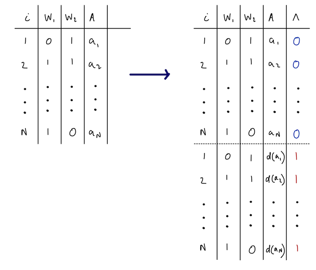

> **来源**：Nick Williams、Kara Rudolph、Iván Díaz，[*Beyond the ATE* · Estimators](https://www.beyondtheate.com/03_info_estimators.html)
> （[GitHub 仓库](https://github.com/nt-williams/lmtp-workshop)），GPL-3.0 许可。
> 本页为中文翻译，非原文；按 GPL-3.0 保留原作者署名与许可证，并标明这是修改（翻译）后的版本。
> 公式与算法步骤按原文逐字保留；原文用自定义 CSS 的「algorithm」方框在本站改用提示框呈现，
> webR 交互代码块改为静态代码块，不重新执行。



小结一下，到目前为止我们已经：

1.  定义了因果参数 $\theta$，它表示在函数 $\dd(a_t, h_t, \epsilon)$ 所蕴含的一般化
    假设干预下的结局 $Y$；

2.  给出了必要的假设，用以识别「把 $A_t$ 替换为 $\dd_t$ 的输出（依次作用于处理的
    自然取值）」这一干预下 $Y$ 的期望。

参数 $\theta$ 是一个函数：只要我们知道各变量的分布（例如结局回归），就能把它算出来。
但我们并不知道这个分布，因此需要从观测数据的样本中估计它。下面讨论如何从样本估计
参数 $\theta$。

## 序贯回归估计量

一种可行的估计量，就是对识别结果做**代入式**（plug-in）估计。这种估计量常被称为
G-computation，或**迭代条件期望**（iterative conditional expectation, ICE），
其做法就是直接估计识别结果中描述的那些回归。该算法也可以这样描述：

::: {.callout-note appearance="simple"}
**算法**

1.  初始化 $\hat \m_{\tau +1} = Y_i$。

    对 $t = \tau, ..., 1$：

    a.  用事先设定的参数模型，把 $\hat \m_{i,t+1}$ 对 $\{A_{i, t}, H_{i,t}\}$ 做回归。
        这给出一个预测模型 $\hat \m_t(a_t, h_t)$。

    b.  把 $A_{i,t}$ 换成 $A^{\dd}_{i,t}$，用该模型生成预测值。
        记这些预测值为 $\hat \m_t(A_{i, t}^\dd, H_{i,t})$。

    c.  重复（迭代）上面两步，直到在第一个时点生成预测值
        $\hat \m_1(A_{i, 1}^\dd, H_{i,1})$。

2.  取最终估计为 $\hat{\theta} = \frac{1}{n}\sum_{i=1}^n \hat \m_1(A_{i, 1}^\dd, H_{i,1})$。

3.  对步骤 1–2 做 bootstrap 计算标准误；若可用，也可用 Delta 方法。
:::

代入式估计量有其优点：它的估计值一定落在结局的有效取值范围内，而且估计过程简单。
话虽如此，它的缺点也很突出：

-   在多时点研究中，调整集会迅速膨胀。例如，考虑一项每个时点测量 3 个协变量、
    共 10 个时点的研究。虽然每个时点只有 3 个协变量，但 $Y$ 的回归中协变量个数
    已经是 33 个。
-   设想要为一个含 33 个变量的参数模型（例如 logistic、Cox）正确设定形式
    （比如纳入恰当的交互项），难度可想而知。

| 优点 ✅ | 缺点 ❌ |
|:---|:---|
| 实现简单 | 相合性要求所有回归都被正确估计 |
| 是代入式估计量 | bootstrap 的正确性要求事先设定参数模型 |

: {tbl-colwidths="\[25,29\]"}

## 密度比估计 {#sec-density-ratio-estimation}

::: {.callout-caution appearance="simple"}
接下来的三种估计量都依赖于估计密度比

$$
r_t(a_t, h_t) = \frac{\g_t^\dd(a_t \mid h_t)}{\g_t(a_t \mid h_t)}.
$$

回忆 $\g_t^\dd(a_t \mid h_t)$ 表示*干预后*处理的密度，即 $\dd(A_t, H_t)$ 的密度在
$a_t$ 处取值；$\g_t(a_t \mid h_t)$ 表示无干预时观测处理的密度。

本工作坊中我们常把这个比值称为*干预机制*（intervention mechanism）。
$r_t(a_t, h_t)$ 的估计在 _lmtp_ 中已完全自动化，对用户不可见。
**要用 _lmtp_，并不需要完全弄懂这一过程！**
:::

我们可以用一个分类技巧直接估计这个密度比。做法是构造一个含 $2n$ 个观测的**增广数据集**。
在这个新数据集中，结局是我们自己构造的新变量 $\Lambda$（定义见下），
预测变量则是 $A_t$ 和 $H_t$。于是时点 $t$ 的数据结构被重新定义为

$$
(H_{\lambda, i, t}, A_{\lambda, i, t}, \Lambda_{\lambda, i} : \lambda = 0, 1; i = 1, ..., n)
$$

-   $\Lambda_{\lambda, i} = \lambda_i$ 用于标记重复值。即：若观测 $i$ 是复制出来的值，
    则 $\Lambda_i =1$，否则 $\Lambda_i =0$。

-   对同一个 $i$ 的所有重复观测 $\lambda\in\{0,1\}$，$H_{\lambda, i, t}$ 都相同。

-   对所有原始观测（$\lambda = 0$），$A_{\lambda=0, i, t}$ 等于观测到的暴露值 $A_{i, t}$。

-   对所有复制观测（$\lambda=1$），$A_{\lambda=1, i, t}$ 等于干预 $\dd$ 下的暴露值
    $A^{\dd}_{i,t}$。

{fig-align="center"}

接着我们在这个数据集中估计以 $(A, H)$ 为条件的 $\Lambda=1$ 的条件概率，
再除以相应的 $\Lambda=0$ 的条件概率估计。具体地，记 $P^\lambda$ 为增广数据集中数据的
分布，我们有：

$$
\begin{align*}
r_t(a_t, h_t) &= \frac{\g_t^\dd(a_t \mid h_t)}{\g_t(a_t \mid h_t)}\\
&= \frac{P^\lambda(a_t, h_t \mid \Lambda = 1)}{P^\lambda(a_t, h_t \mid \Lambda = 0)}\\
    &= \frac{P^\lambda(\Lambda = 1\mid a_t,h_t)P^\lambda(a_t,h_t)}{P^\lambda(\Lambda = 1)}\times \frac{P^\lambda(\Lambda = 0)}{P^\lambda(\Lambda = 0\mid a_t,h_t)P^\lambda(a_t,h_t)} \\
    &=\frac{P^\lambda(\Lambda = 1\mid a_t,h_t)}{P^\lambda(\Lambda = 0\mid a_t, h_t)}
\end{align*}
$$

### 示例

考虑下面这个例子：我们从如下数据生成机制中模拟 1000 个观测：

\begin{align}
L_1 &\sim \text{Normal}(0, 1) \\
A_1 &\sim \text{Bernoulli}(\text{logit}^{-1}(-1 + 1.5L_1))\\
L_2 &\sim \text{Normal}(0, 1) \\
A_2 &\sim \text{Bernoulli}(\text{logit}^{-1}(-1 + 1.5L_2 + 2A_1))\\
Y &\sim \text{Normal}(-1 - 1.2L_1 + 2.4A_1 - 2L_2 + 1.2A_2)
\end{align}

数据已在后台以 `foo` 的名字载入 R。我们将用密度比分类技巧，估计如下干预下的密度比
$r_t(a_t, h_t)$：
$$
\dd(a_t, \epsilon_t) = \begin{cases}
0 &\text{ if } \epsilon_t < 0.5 \text{ and } a_t = 1 \\
a_t &\text{ otherwise.}
\end{cases}
$$
该干预下的真值约为 $-0.37$。首先构造增广数据；然后把 $\Lambda$ 对 $A_t$ 和 $H_t$
做回归，并用预测出的优势（odds）作为密度比的估计。

```r
set.seed(786543)
n <- 1000
l0 <- rnorm(n)
a1 <- rbinom(n, 1, plogis(-1 + l0*1.5))
l1 <- rnorm(n)
a2 <- rbinom(n, 1, plogis(-1 + l1*1.5 + a1*2))
y <- rnorm(n, -1 - 1.2*l0 + 2.4*a1 - 2*l1 + 1.2*a2)
foo <- data.frame(
  L1 = l0,
  A1 = a1,
  L2 = l1,
  A2 = a2,
  Y = y
)
```

```r
# 把干预定义成一个函数
d <- function(a) {
  epsilon <- runif(length(a))
  ifelse(epsilon < 0.5 & a == 1, 0, a)
}

# 建一个空矩阵存放密度比
density_ratios <- matrix(NA, nrow = n, ncol = 2)

for (t in 1:2) {
  a <- c("A1", "A2")[t]
  # 复制数据
  shifted <- foo
  # 在复制出的数据中，按 d 修改处理
  shifted[[a]] <- d(foo[[a]])

  # 在原始数据和修改后的数据中设定 lambda 的取值
  foo$lambda <- 0
  shifted$lambda <- 1

  # 把原始数据和修改后的数据摞在一起
  density_ratio_data <- rbind(foo, shifted)

  # 把 lambda_t 对 A_t、H_t 做回归
  parents <- unlist(lapply(1:t, \(x) paste0(c("L", "A"), x)))
  formula <- as.formula(paste("lambda ~", paste(parents, collapse = "+")))
  density_ratio_model <- glm(formula, data = density_ratio_data, family = binomial)

  # 计算估计出的优势
  prob_lambda_1 <- predict(density_ratio_model, foo, type = "response")
  density_ratios[, t] <- prob_lambda_1 / (1 - prob_lambda_1)
}

summary(density_ratios)
```

## 逆概率加权

我们把这个估计量称为 IPW，是因为它与二值处理的逆概率加权估计量很相似；
不过更准确的叫法其实是「重加权估计量」。它基于如下另一种识别公式：

$$
\theta = \E \bigg[ \bigg\{\prod_{t=1}^\tau r_t(a_t, h_t) \bigg\} Y \bigg]
$$

\
算法如下：

::: {.callout-note appearance="simple"}
**算法**

1.  用密度比分类技巧和事先设定的参数模型，构造 $r_{i,t}(a_t, h_t)$ 的估计。

2.  定义权重 $w_{i} = \prod_{t=1}^\tau r_{i,t}(a_t, h_t)$。

3.  取最终估计为 $\hat{\theta} = \frac{1}{n}\sum_{i=1}^n \hat{w}_{i}\times y_i$。

4.  对步骤 1–3 做 bootstrap 计算标准误。
:::

### 示例

让我们用上一例中估计出的密度比来应用 IPW 估计量。先把密度比连乘得到权重。

```r
weights <- apply(density_ratios, 1, prod)
```

估计值就是「估计权重 × 观测结局」的样本均值。

```r
mean(weights*foo$Y)
```

与序贯回归估计量类似，IPW 实现简单，但也有同样的缺陷。
\

| 优点 ✅ | 缺点 ❌ |
|:---|:---|
| 实现简单 | 相合性要求所有回归都被正确估计 |
|  | 不确定性量化要求事先设定参数模型 |

: {tbl-colwidths="\[25,25\]"}

## 双稳健估计量

G-computation 和 IPW 估计量的不确定性量化，都要求用正确设定的参数模型来估计冗余参数
（nuisance parameters）。现在我们把注意力转向两种非参数估计量，它们允许我们使用
灵活的回归工具：

1.  靶向最小损失估计量（targeted minimum-loss based estimator, TMLE），以及

2.  序贯双稳健估计量（sequentially doubly-robust estimator, SDR）。

等一下，「估计量是双稳健的」到底是什么意思？

-   在单时点这个简单情形下，只要结局模型被相合估计**或者**处理（以及删失）模型被
    相合估计，估计量就能给出目标参数的相合估计，这时称它是双稳健的。例如：

::: {.center-table style="width: 50%;   margin-left: auto;   margin-right: auto;"}
|  |  |
|---|---|
| 时点 | 1 |
| 处理 | 正确 |
| 结局 | 错误 |
:::

\

-   在时变情形下，若存在某个时点 $s$，使得所有 $t >s$ 的结局回归都被相合估计，
    且所有 $t \leq s$ 的干预机制（处理 + 删失）都被相合估计，则称该估计量是
    $\tau + 1$ 双稳健的。以 $5$ 个时点为例：

|  |  |  |  |  |  |
|---|---|---|---|---|---|
| 时点 | 1 | 2 | 3 | 4 | 5 |
| 处理 | 正确 | 正确 | 错误 | 错误 | 错误 |
| 结局 | 错误 | 错误 | 正确 | 正确 | 正确 |

\

-   **序贯双稳健**（也常称为 $2^\tau$-多重稳健）意味着：只要在每一个时点上，
    结局模型或干预机制（处理 + 删失）二者至少有一个被相合估计，估计量就是相合的。
    例如：

|  |  |  |  |  |  |
|---|---|---|---|---|---|
| 时点 | 1 | 2 | 3 | 4 | 5 |
| 处理 | 正确 | 错误 | 正确 | 错误 | 正确 |
| 结局 | 错误 | 正确 | 错误 | 正确 | 错误 |

::: {.callout-caution appearance="simple"}
注意不要把**双稳健相合性**和**速率双稳健性**（rate double robustness）混为一谈。
双稳健相合性指的是我们刚刚描述的那些性质；速率双稳健性指的是这样一种性质：
估计量的误差是两个冗余函数估计误差的**乘积**。

从实践上看，速率双稳健性也许更有意思，因为它意味着：即便两个模型都不正确，
估计量的误差仍可能很小！
:::

### 有效影响函数

构造 TMLE 和 SDR 的关键是**有效影响函数**（efficient influence function, EIF）。

::: {.callout-note appearance="simple"}
-   EIF 刻画了所有正则且有效的估计量的渐近行为。

-   EIF 刻画了路径可微估计量的代入式估计量的一阶偏倚。
:::

在引入 EIF 之前，还需要对 $A$ 和 $\dd$ 作一些额外假设。

1.  处理 $A$ 是离散的；或者

2.  若 $A$ 是连续的，则函数 $\dd$ 是分段光滑可逆的。

::: {.callout-caution appearance="simple"}
迄今我们讲过的所有干预都满足这一性质。然而有一类常被关注的因果效应
（尤其在环境流行病学中）**不**满足分段光滑可逆，那就是*阈值*干预，例如

$$
\dd(a_t, h_t, \epsilon) = \begin{cases}
a_t &\text{ if } a_t \leq u(h_t) \\
u(h_t) &\text{ otherwise.}
\end{cases}
$$
:::

3.  函数 $\dd$ 不依赖于观测分布 $\P$。

- 这正是我们不能把这些方法用于优势比 IPSI、却可以用于风险比 IPSI 的原因。

这些假设保证了干预 $\dd$ 下 $\theta$ 的有效影响函数，具有与动态方案效应的影响函数
相似的结构。这使得多重稳健估计成为可能——而对依赖于 $\P$ 的干预 $\dd$，
多重稳健估计一般是做不到的。

对一个观测 $o$，定义函数

$$
\phi_t: o \mapsto \sum_{s=t}^\tau \bigg( \prod_{k=t}^s r_k(a_k, h_k)\bigg) \big\{\m_{s+1}(a_{s+1}^\dd, h_{s+1}) - \m_s(a_s, h_s) \big\} + \m_t(a_t^\dd, h_t).
$$

在非参数模型中，估计 $\theta = \E[\m_1(A^\dd, L_1)]$ 的有效影响函数由
$\phi_1(O) - \theta$ 给出。

在单时点情形下，影响函数简化为

$$
r(a, w)\{Y - \m(a,w)\} + \m(a^{\dd},w) - \theta.
$$

## 靶向最小损失估计

TMLE 利用了「EIF 的期望等于零」这一事实。考虑我们刚刚定义的单时点情形的 EIF。

\begin{aligned}
n^{-1} \sum_i^n[\phi_1(O) - \theta] &= n^{-1} \sum_i^n[r_i(a_i, w)\{Y_i - \m_i(a,w)\} + \m_i(a^{\dd},w) - \theta]\\
&= n^{-1} \sum_i^n[r_i(a, w)\{Y_i - \m_i(a,w)\}] + \theta - \theta \\
&= n^{-1} \sum_i^n[r_i(a, w)\{Y_i - \m_i(a,w)\}] \\
n^{-1} \sum_i^n[r_i(a, w)\{Y_i - \m_i(a,w)\}] &= 0
\end{aligned}

关键的洞察在于认识到：$r(a, w)\{Y - \m(a,w)\}$ 看起来就像一个得分方程
$\sum_i r_i(a, w)\{Y_i - \m_i(a,w)\} = 0$，而它可以用一个带权重 $r_i(a, w)$、
偏移项 $m_i(a,w)$、一个截距以及典则连接函数的 GLM 来求解。于是，
通过用 GLM 求解该得分方程，TMLE 就解出了 EIF 估计方程。

算法如下：

::: {.callout-note appearance="simple"}
**算法**

1.  用密度比分类技巧和你偏好的回归方法，构造 $r_{i,t}(a_t, h_t)$ 的估计。

2.  对 $t = 1, ..., \tau$，计算权重：$w_{i,t} = \prod_{k=1}^t r_{i,k}(a_{i,k}, h_{i,k})$

3.  令 $\tilde{\m}_{i,\tau +1}(A^\dd_{i,t+1}, H_{i,t+1}) = Y_i$。

    对 $t = \tau, ..., 1$：

    1.  把 $\tilde{\m}_{i,t+1}(A^\dd_{i,t+1}, H_{i,t+1})$ 对 $\{A_{i, t}, H_{i,t}\}$ 做回归。

        -   用这个回归，分别基于 $\{A_{i, t}, H_{i,t}\}$ 和 $\{A^\dd_{i, t}, H_{i,t}\}$
            生成预测值。

        -   把这两组预测值分别记为 $\tilde{\m}_t(A_{i,t}, H_{i,t})$ 和
            $\tilde{\m}_t(A^\dd_{i,t}, H_{i,t})$。

    2.  拟合广义线性倾斜（tilting）模型：

        $\text{link }\tilde{\m}^\epsilon_t(A_{i,t}, H_{i,t}) = \epsilon + \text{link }\tilde{\m}_{i,t}(A_{i,t}, H_{i,t})$

        权重取 $w_{i,t}$。

        -   $\text{link }\tilde{\m}_{i,t}(A_{i,t}, H_{i,t})$ 是偏移变量
            （即参数值已知且等于 1 的变量）。

        -   参数 $\epsilon$ 可以这样估计：对
            $\tilde{\m}_{i,t+1}(A^\dd_{i,t+1}, H_{i,t+1})$ 跑一个只含截距项、
            偏移项等于 $\text{link }\tilde{\m}_{i,t}(A_{i,t}, H_{i,t})$、
            权重为 $w_{i,t}$ 的广义线性模型。

    3.  设 $\hat\epsilon$ 为极大似然估计，按下式更新估计：

        $\text{link }\tilde{\m}^\hat\epsilon_t(A^\dd_{i,t}, H_{i,t}) = \hat\epsilon + \text{link }\tilde{\m}_t(A^\dd_{i,t}, H_{i,t})$

        $\text{link }\tilde{\m}^\hat\epsilon_t(A_{i,t}, H_{i,t}) = \hat\epsilon + \text{link }\tilde{\m}_t(A_{i,t}, H_{i,t})$

    4.  更新 $\tilde{\m}_{i,t} = \tilde{\m}^\hat\epsilon_{i,t}$，令 $t = t-1$，继续迭代。

4.  最终估计定义为 $\hat\theta = \frac{1}{n}\sum_{i=1}^n\tilde{m}_{i, 1}(A^\dd_{i, 1}, L_{i, 1})$。
:::

### 示例

让我们用上一例中估计出的密度比来应用 TMLE。

```r
# 先把密度比做累积连乘得到权重
weights <- t(apply(density_ratios, 1, cumprod))

predictions_natural <- matrix(NA, nrow = n, ncol = 2)
predictions_shifted <- matrix(NA, nrow = n, ncol = 2)

# 令 t = 2
# 因为 t + 1 = tau + 1，把第一个伪结局设为观测结局
m3_d <- foo$Y

# 把伪结局对观测数据做回归
fit2 <- glm(m3_d ~ A2 + L2 + A1 + L1, data = foo)

# 生成 t = 2 的预测值
predictions_natural[, 2] <- predict(fit2)
predictions_shifted[, 2] <- predict(fit2, mutate(foo, A2 = d(A2)))

# 执行靶向步骤
targeting_fit2 <- glm(m3_d ~ offset(predictions_natural[, 2]), weights = weights[, 2])

# 更新预测值
predictions_natural[, 2] <- predictions_natural[, 2] + coef(targeting_fit2)
predictions_shifted[, 2] <- predictions_shifted[, 2] + coef(targeting_fit2)

# 迭代，令 t - 1 = 1
# 新的伪结局是 t + 1 = 2 时移位下的靶向结局
m2_d <- predictions_shifted[, 2]

# 把伪结局对观测数据做回归
fit1 <- glm(m2_d ~ A1 + L1, data = foo)

# 生成 t = 2 的预测值
predictions_natural[, 1] <- predict(fit1)
predictions_shifted[, 1] <- predict(fit1, mutate(foo, A1 = d(A1)))

# 执行靶向步骤
targeting_fit1 <- glm(m2_d ~ offset(predictions_natural[, 1]), weights = weights[, 1])

# 更新预测值
predictions_natural[, 1] <- predictions_natural[, 1] + coef(targeting_fit1)
predictions_shifted[, 1] <- predictions_shifted[, 1] + coef(targeting_fit1)

mean(predictions_shifted[, 1])
```

TMLE 的好处相当可观，因为它解决了 g-computation 和 IPW 的主要问题：
TMLE 既是 $\tau+1$ 双稳健的，也是速率双稳健的。

| 优点 ✅ | 缺点 ❌ |
|:---|:---|
| 是代入式估计量 | 不是序贯双稳健的 |
| $\tau+1$ 双稳健 |  |
| 可以使用机器学习 |  |

: {tbl-colwidths="\[25,25\]"}

## 序贯双稳健估计量

回忆这个变换：
$$
\phi_t: o \mapsto \sum_{s=t}^\tau \bigg( \prod_{k=t}^s r_k(a_k, h_k)\bigg) \big\{\m_{s+1}(a_{s+1}^\dd, h_{s+1}) - \m_s(a_s, h_s) \big\} + \m_t(a_t^\dd, h_t).
$$

SDR 估计量基于这样一个核心事实：

$$
E[\phi_t(O)\mid A_t=a_t, H_t=h_t] \approx \m_t(a_t, h_t)
$$

其中的逼近误差是「双稳健」的。这就给出了一条获得回归函数 $\m_t(a_t, h_t)$ 的
双稳健估计的途径。

估计算法如下：

::: {.callout-note appearance="simple"}
**算法**

1.  用密度比分类技巧和你偏好的回归方法，构造 $r_{i,t}(a_t, h_t)$ 的估计。

2.  初始化 $\phi_{\tau +1}(O_i) = Y_i$。

    对 $t = \tau, ..., 1$：

    1.  计算伪结局 $\check{Y}_{i,t+1} = \phi_{t+1}(O_i)$。

    2.  把 $\check{Y}_{i,t+1}$ 对 $\{A_{i, t}, H_{i,t}\}$ 做回归。记该回归为 $\check\m_{t}$。

    3.  继续迭代。

3.  最终估计定义为 $\hat\theta = \frac{1}{n}\sum_{i=1}^n\phi_1(O_i)$，
    其中 $\phi_1$ 用 $\hat r_t$ 和 $\check\m_{t}$ 计算。
:::

### 示例

让我们应用 SDR 估计量。同样，我们使用前面估计出的密度比。

```r
predictions_natural <- matrix(NA, nrow = n, ncol = 2)
predictions_shifted <- matrix(NA, nrow = n, ncol = 3)

# 令 t = 2
# 因为 t + 1 = tau + 1，把第一个伪结局设为观测结局
m3_d <- foo$Y
predictions_shifted[, 3] <- m3_d

# 把伪结局对观测数据做回归
fit2 <- glm(m3_d ~ A2 + L2 + A1 + L1, data = foo)

# 生成 t = 2 的预测值
predictions_natural[, 2] <- predict(fit2)
predictions_shifted[, 2] <- predict(fit2, mutate(foo, A2 = d(A2)))

# 迭代，令 t - 1 = 1
# 用有效影响函数计算伪结局
m2_d <- density_ratios[, 2]*(m3_d - predictions_natural[, 2]) + predictions_shifted[, 2]

# 把伪结局对观测数据做回归
fit1 <- glm(m2_d ~ A1 + L1, data = foo)

# 生成 t = 1 的预测值
predictions_natural[, 1] <- predict(fit1)
predictions_shifted[, 1] <- predict(fit1, mutate(foo, A1 = d(A1)))

weights <- t(apply(density_ratios, 1, cumprod))

# 把估计值算成未中心化有效影响函数的样本均值
uc_eif <- rowSums(weights * (predictions_shifted[, 2:3] - predictions_natural[, 1:2])) +
  predictions_shifted[, 1]

mean(uc_eif)
```

与 TMLE 类似，SDR 估计量也解决了 g-computation 和 IPW 的主要问题。
此外，SDR 估计量还是序贯双稳健的。不过代价是：SDR 不是代入式估计量，
这意味着它可能给出落在结局有效取值范围之外的点估计。

| 优点 ✅ | 缺点 ❌ |
|:---|:---|
| $\tau+1$ 双稳健 | 不是代入式估计量 |
| 序贯双稳健 |  |
| 可以使用机器学习 |  |

: {tbl-colwidths="\[25,25\]"}

## 如何选择估计量

-   一般而言，我们从不推荐使用 IPW 或序贯回归估计量。二者要得到有效的统计推断，
    都要求事先正确设定参数模型 🙃。

-   相比之下，TMLE 和 SDR 估计量都是双稳健或序贯双稳健的，可以配合机器学习算法使用，
    并在合理假设下仍保持 $\sqrt{n}$-相合。

|  | IPW | G-comp. | TMLE | SDR |
|---|:---:|:---:|:---:|:---:|
| 使用结局回归 |  | ⭐ | ⭐ | ⭐ |
| 使用倾向评分 | ⭐ |  | ⭐ | ⭐ |
| 配合机器学习仍有有效推断 |  |  | ⭐ | ⭐ |
| 是代入式估计量 |  | ⭐ | ⭐ |  |
| $\tau+1$ 双稳健 |  |  | ⭐ | ⭐ |
| 序贯双稳健 |  |  |  | ⭐ |

: **表 1.** 估计量性质小结。 {tbl-colwidths="\[40,15,15,15,15\]"}

::: {.callout-tip appearance="minimal"}
**问题**：为什么 G-computation 和 IPW 估计量不能配合机器学习使用？

<details>

<summary style="color: grey; font-weight: 400;">

✅  答案

</summary>

G-computation 和 IPW 估计量要求模型以 $\sqrt{n}$ 速率收敛到真值。
机器学习算法并不保证能做到这一点。

</details>
:::

尽管 SDR 估计量对模型设定错误可能更稳健，TMLE 却有「是代入式估计量」这一优势。
正因如此，TMLE 的估计值一定落在结局的有效取值范围内。综合来看，
在 TMLE 与 SDR 之间选择时，可以遵循以下建议：

::: {.callout-note appearance="simple"}
-   如果处理不随时间变化，用 TMLE。

-   如果处理随时间变化，且参数 $\theta$ 有明确的界（例如概率），
    就要当心 SDR 估计量，最好用 TMLE。
:::

## 交叉拟合

当用数据自适应算法估计冗余参数时，应当执行一个类似交叉验证的过程，称为**交叉拟合**
（cross-fitting）。交叉拟合有助于确保：

-   标准误是正确的，并且

-   能帮助减小估计量偏倚、改善置信区间的覆盖率。

交叉拟合在 _lmtp_ 中已完全自动化。想了解更多，建议参阅 @chernozhukov2018double、
@diaz2020machine 和 @zivich2021machine。
