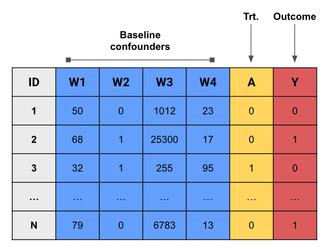
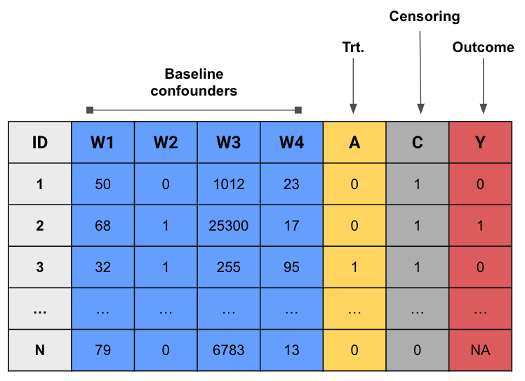
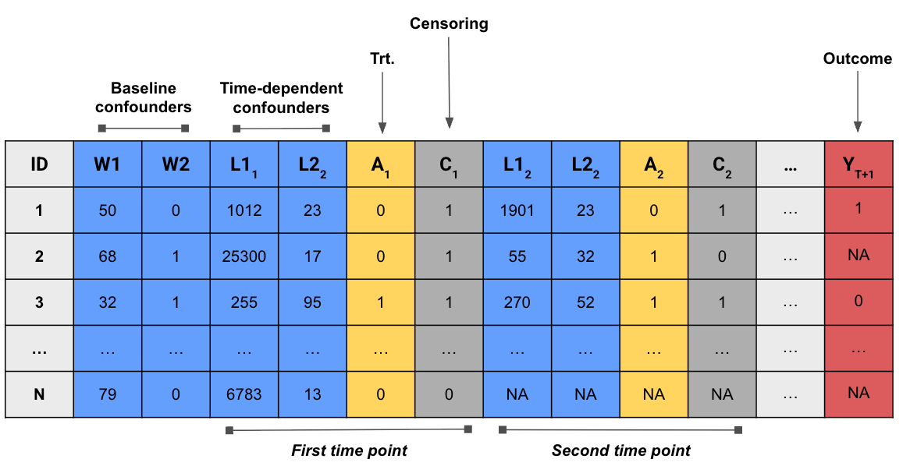
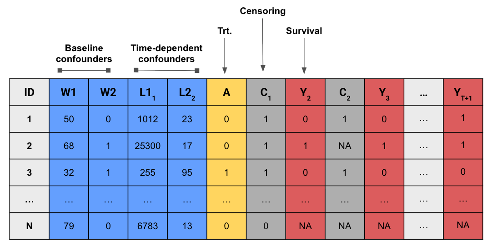
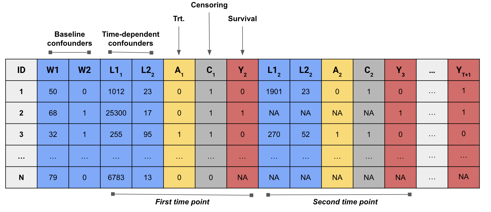

> **来源**：Nick Williams、Kara Rudolph、Iván Díaz，[*Beyond the ATE* · The lmtp package](https://www.beyondtheate.com/04_lmtp.html)
> （[GitHub 仓库](https://github.com/nt-williams/lmtp-workshop)），GPL-3.0 许可。
> 本页为中文翻译，非原文；按 GPL-3.0 保留原作者署名与许可证，并标明这是修改（翻译）后的版本。
> 代码块在本站不重新执行；插图直接引用原文件。

到目前为止，我们已经：

1.  为一般化的假设干预定义了因果估计量；

2.  从观测数据中识别了该估计量；

3.  讨论了 4 种不同的估计量。

现在该把这些新知识用到真实数据的例子上了。

### 现有软件与 _lmtp_

用于纵向研究中因果效应估计的通用软件相当有限：

-   `ipw` 和 `gfoRmula` 包分别提供了用逆概率加权（IPW）和参数化 g-formula 估计因果
    效应的例程。不过正如前面讨论过的，这些方法的有效性要求作出不切实际的参数假设。

-   `ltmle` 和 `survtmle` 包实现了从纵向数据估计因果效应的双稳健方法，
    但这些包不支持连续值暴露、多重暴露、依赖于暴露自然取值的干预，也不支持随机干预。

相比之下，_lmtp_ 包（@diaz2023nonparametric 一文的配套软件）可以对我们今天讨论的
这一整类一般化干预，在时点效应和纵向效应两种情形下做双稳健且灵活的估计。

-   _lmtp_ 可以成为你在 R 中做因果分析的默认工具包！

### 安装

在本工作坊中，_lmtp_ 已经随 `webr` 装好了。不过你也可以从 CRAN 把它装到本机：\

```r
install.packages("lmtp")
```

或者从 GitHub 下载开发版：

```r
# install.packages(devtools)
devtools::install_github("nt-williams/lmtp@devel")
```

### 预备知识

在开始使用 _lmtp_ 之前，先交代一些对所有示例都适用的通用信息：

-   数据通过 `data` 参数传给估计量。

-   数据应为**宽格式**（wide format），研究中每个时点的每个变量各占一列
    （也就是说，$O$ 中的每个变量都应有一列）。数据可以是 `data.frame` 或 `tibble`，
    但不能是 `data.table`。

-   列不必按任何特定顺序排列，数据中也可以包含估计时用不到的变量。

-   处理变量的名称用 `trt` 参数指定。

-   删失变量的名称用 `cens` 参数指定。

-   基线协变量的名称用 `baseline` 参数指定。

-   时变协变量的名称用 `time_vary` 参数指定。

-   `trt` 参数接受字符向量，或由字符向量构成的 list。

-   `cens` 和 `baseline` 参数接受字符向量。

-   `time_vary` 参数接受由字符向量构成的 list。

::: {.callout-note appearance="simple"}
向量（vector）和列表（list）是 R 中的基本数据结构。向量可以理解为一维的同类型元素
集合，例如字符向量就是一组类别为 `character` 的值。\

```r
a_character_vector <- c("this", "is", "a", "character", "vector")
```

列表与之类似，区别在于它可以容纳不同类型的元素。\

```r
a_list <- list(
  a_character_vector = c("this", "is", "a", "character", "vector"),
  a_numeric_vector = 1:10,
  a_list_whithin_a_list = list(1, 2, 3, 4)
)
```
:::

-   `trt`、`cens` 和 `time_vary` 参数必须按模型的时间顺序排列，每个位置放该时点对应
    变量的名称（可以是多个名称）。

-   结局变量用 `outcome` 参数指定。

-   `outcome_type` 参数指定结局的类型：连续结局设为 `"continuous"`，
    二分类结局设为 `"binomial"`，事件发生时间结局设为 `"survival"`。

-   删失指示变量应编码为 0 和 1，其中 1 表示该观测在下一时点仍被观测到，
    0 表示失访。一旦某观测的删失状态变为 0，就不能再变回 1。
    观测被删失之前不允许存在缺失数据。

-   `outcome_type` 参数对连续结局应设为 `"continuous"`，二分类结局设为 `"binomial"`，
    事件发生时间结局设为 `"survival"`。

### 数据结构示例

##### 时点处理

{fig-align="center" width="60%"}

##### 带删失的时点处理

{fig-align="center" width="60%"}

##### 带删失的时变处理

{fig-align="center" width="90%"}

##### 生存结局的时点处理

{fig-align="center" width="85%"}

##### 生存结局的时变处理

{fig-align="center" width="100%"}

### 机器学习集成

前面已经讨论过，多重稳健估计量有一个很吸引人的性质：它们可以在保持 $\sqrt{n}$-相合的
同时，引入灵活的机器学习算法来估计冗余参数。

-   _lmtp_ 用**超级学习器**（super learner）算法来估计这些冗余参数。

-   超级学习器算法是一种集成学习器：它基于交叉验证，把一组候选模型按加权凸组合的方式
    整合起来。渐近地看，这个被称为元学习器（meta-learner）的加权组合，
    会优于其中任何单个组成模型。

-   _lmtp_ 使用 `SuperLearner` 包提供的超级学习器实现。

-   超级学习器中使用的算法，用 `learners_trt` 和 `learners_outcome` 参数指定。

-   选择 `learners_outcome` 的候选学习器时，应以结局变量的类型为依据。

-   无论暴露是连续、二分类还是分类变量，[暴露机制都是用分类方法估计的](03-estimators.qmd#sec-density-ratio-estimation)。
    因此，`learners_trt` 只应纳入能做二分类的候选学习器。

-   若候选学习器依赖交叉验证来调超参数，且要用于 `learners_trt`，
    那它应当支持分组数据。因为处理机制的估计依赖于增广后的 $2n$ 重复数据集，
    重复出来的观测必须在样本分割时落入同一折。这一点由包自动完成。
