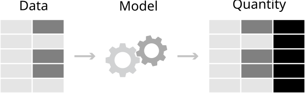
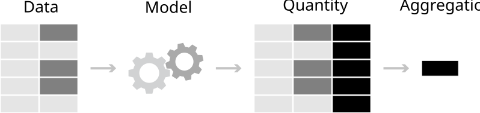
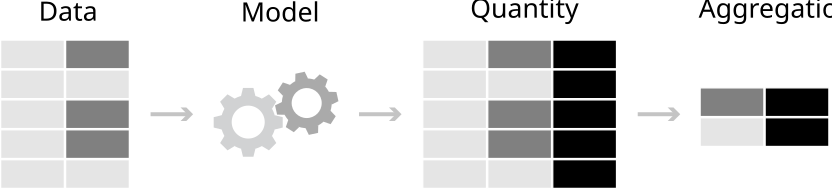
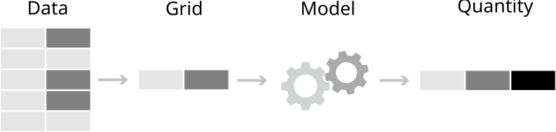
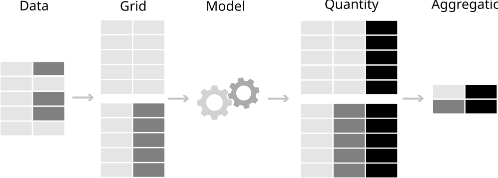

> **来源**：Vincent Arel-Bundock，*从模型到意义：如何在 R 和 Python 中解释统计模型* —— [第 3 章 概念框架](https://marginaleffects.com/chapters/framework.html)。
> **来源说明**：截至 2026-09-19，公开仓库在修订版 870f15a0 中不包含本章完整的 .qmd 源文件。本页面根据同日下载的公开 HTML 快照翻译而成。因此，R/Python 代码和图形均以静态形式展示；上游代码未在本站重新执行。
> 网站文本 (C) 2025 Vincent Arel-Bundock，版权所有；marginaleffects 软件代码根据 GPL-3 许可。
> 本页面为中文翻译，并非原文；根据本 Notes 站点所采用的授权声明翻译并发布。

本章介绍一个概念框架，用于帮助解释各种统计模型和机器学习模型。这个框架基于一个简单的论点：与其关注拟合模型的参数，不如将这些参数转换为对读者和利益相关者而言更直观的量。通过应用*事后*变换，研究者可以轻松地从模型走向意义。


所提出的工作流程既与模型无关，又保持一致。每一项分析都从同一个地方开始：定义感兴趣的数量。为此，我们提出三个关键问题：


1.  *数量*：我们希望估计某个变量的水平、两个（或更多）变量之间的关联，还是某个原因的效应？

2.  *预测变量*：我们对哪些预测变量取值感兴趣？

3.  *聚合*：我们关心单位层级的估计值，还是聚合后的估计值？


在清楚描述目标估计量之后，我们再提出两个问题：


4.  *不确定性*：我们如何量化估计值的不确定性？

5.  *检验*：哪些假设检验或等效性检验是相关的？


这五个问题为思考重要的数量和检验提供了一个结构化方式。它们引导我们清晰地定义这些数量，并消除术语上的歧义。更重要的是，这些问题的答案还会指向运行适当计算所需执行的具体软件命令。本章其余部分将逐一考察这五个问题。


<div id="quantity" class="section level2" number="3.1">


## 3.1 数量


统计模型的参数通常难以解释，而且并不总能直接揭示我们感兴趣的研究问题。在许多情境下，将参数估计值转换为具有更自然、更符合领域含义的数量会有所帮助。


例如，拟合逻辑回归模型的分析者会得到以对数优势比表示的系数估计值。对大多数人来说，这个尺度非常难以理解。与其费力处理复杂的概率组合，不如将估计值转换为更直观的数量，例如预测概率或风险差异。


<a href="#sec-framework_quantity_theoretical_background" class="quarto-xref">第 3.1.1 节</a>介绍*事后*变换的理论基础：代入原则和最大似然不变性。对统计理论不太感兴趣的经验导向读者可以跳过这部分内容。


<a href="#sec-framework_three_quantities" class="quarto-xref">第 3.1.2 节</a>概述本书所关注的三类核心数量：预测、反事实比较和斜率。本节只对这些数量作简要介绍，而第二部分将分别用整章篇幅进行讨论。


<div id="sec-framework_quantity_theoretical_background" class="section level3" number="3.1.1">


### 3.1.1 理论背景


事后估计变换有两个主要的理论依据：代入原则和最大似然估计方法（MLE）的不变性。


代入原则背后的直觉很简单。为了推断总体的某个特征，我们可以在样本中研究同一特征，并用样本估计值代替总体值（<a href="https://marginaleffects.com/chapters/bibliography.html#ref-AroMil2019" role="doc-biblioref">Aronow and Miller 2019</a>）。


为了稍微形式化这一想法，考虑从分布 \\F\\ 中抽取的样本 \\Y_1, \ldots, Y_n\\。例如，\\F\\ 可以表示某个总体中的年龄分布，而 \\Y_1\\ 可以表示某个个体的观测年龄。假设我们关心这个分布的某个统计泛函[^1] \\\psi\\，即 \\\theta=\psi(F)\\。在此情境下，\\\theta\\ 可以表示总体平均年龄、分布方差，或用于刻画 \\F\\ 数据生成过程的回归模型系数。由于我们不知道总体中每个人的年龄，因此无法追踪完整分布 \\F\\，也无法直接计算真实的 \\\psi(F)\\。


代入原则指出，我们不需要知道确切的分布 \\F\\，也可以了解有关 \\\psi(F)\\ 的某些信息。相反，我们可以研究随机抽取的 \\n\\ 个个体的样本的经验分布[^2] \\\hat{F}\_n\\，从而估计感兴趣的数量。更具体地说，代入原则表明，如果 \\\theta = \psi(F)\\ 是概率分布 \\F\\ 的统计泛函，并且满足某些温和的正则条件[^3]，那么我们可以使用样本类比量 \\\hat{\theta} = \psi(\hat{F}\_n)\\ 来估计 \\\theta\\。


正如 Aronow 和 Miller（<a href="https://marginaleffects.com/chapters/bibliography.html#ref-AroMil2019" role="doc-biblioref">2019</a>）所指出的，这对统计实践有着深远影响。当观测数量增加时，经验分布函数将趋于逼近总体分布函数。当观测数量增加时，我们的估计值 \\\hat{\theta}\\ 将趋于接近 \\\theta\\。


这些思想使我们能够以各种感兴趣的数量为目标。\\\theta\\ 可以简单到只是分布均值；\\\theta\\ 可以是回归系数；\\\theta\\ 也可以是更有意思的数量，即定义为回归系数的函数。更具体地说，我们可以通过计算样本中个体年龄的平均值来估计总体平均年龄，也可以通过在样本内计算同一个回归参数来推测总体中的回归参数值。


因此，代入原则为本书提出的工作流程提供了依据。首先，我们拟合一个回归模型，获得刻画数据经验分布的系数估计值。然后，我们对系数估计值应用一个函数，将其转换为更容易解释的数量。最后，我们将这些数量解释为总体特征的样本类比量。


另一种为*事后*变换提供动机的方式，是利用 MLE 的不变性。这是统计理论中的一个基本概念，凸显了 MLE 的效率和灵活性。不变性可以表述如下：如果 \\\hat{\theta}\\ 是 \\\theta\\ 的 MLE 估计值，那么对于任意函数 \\\psi(\theta)\\，\\\psi(\hat{\theta})\\ 就是 \\\psi(\theta)\\ 的 MLE（<a href="https://marginaleffects.com/chapters/bibliography.html#ref-CasBer2024" role="doc-biblioref">Berger and Casella 2024, 259</a>）。换言之，MLE 的理想性质——一致性、效率和渐近正态性——在变换下仍得以保留。


这一性质对实践很有用，因为它简化了参数函数的估计。例如，假设我们指定一个回归模型，用于刻画营养对儿童身高的影响。我们通过最大似然估计该模型的系数 \\\theta\\，并得到估计值 \\\hat{\theta}\\。\ <a href="predictions.html" class="quarto-xref">第 5 章</a>展示了如何对系数 \\\hat{\theta}\\ 应用函数 \\\psi\\，以便针对解释变量（营养）的给定取值，计算结果变量（身高）的预测值（或期望值）。不变性表明，如果系数估计值 \\\hat{\theta}\\ 具有最大似然估计值的理想性质，那么预测值 \\\psi(\hat{\theta})\\ 也会继承这些性质。


总之，对拟合统计模型所得到的参数估计值应用估计后变换，通常有助于获得更有意义、更易解释的数量。这类*事后*变换通过代入原则和 MLE 不变性，在统计理论上具有坚实基础。


</div>


<div id="sec-framework_three_quantities" class="section level3" number="3.1.2">


### 3.1.2 预测、反事实比较和斜率


在本书中，我们将关注三大类目标估计量：预测、反事实比较和斜率。第二部分为每一类数量各安排一章，其中包含许多基于真实数据集的具体示例。本节通过简要介绍每种数量，为后续深入分析作铺垫。


<div id="predictions" class="section level4 unnumbered">


#### 预测


需要考虑的第一类变换是预测。


> *预测是针对给定预测变量取值组合，由拟合模型给出的预期结果变量。*


考虑这样一个一般情境：我们通过最小化某个损失函数 \\\mathcal{L}\\ 来拟合统计模型。对于标准线性回归模型，\\\mathcal{L}\\ 可以表示误差平方和；对于通过最大似然估计的模型，\\\mathcal{L}\\ 可以表示负对数似然。使损失最小化的系数估计值可以写为


\\ \hat{\beta} = argmin\_{\beta} \\ \mathcal{L}(Y, X, \mathbf{Z}; \beta), \tag{3.1}\\


其中，\\\beta\\ 是参数向量；\\Y\\ 是结果变量；\\X\\ 是具有特定科学研究意义的重点预测变量；\\\mathbf{Z}\\ 是控制变量向量。在<a href="#eq-loss-function" class="quarto-xref">公式 3.1</a>中，\\argmin\\ 运算符的含义很简单：估计方法旨在找到使 \\\mathcal{L}\\ 最小的 \\\beta\\ 值。


一旦获得 \\\beta\\ 参数的估计值，就可以使用它们针对预测变量 \\X\\ 和 \\\mathbf{Z}\\ 的特定取值计算预测值。为此，我们将预测变量和估计值代入适当的函数 \\\Phi\\。


\\ \hat{Y} = \Phi(X=x, \mathbf{Z}=\mathbf{z}; \hat{\beta}), \tag{3.2}\\


当然，\\\Phi\\ 的选择取决于模型设定。当使用普通最小二乘法拟合模型时，\\\Phi\\ 可以是系数和预测变量的简单线性组合。当 \\Y\\ 是一个取值范围为 0 到 1 的概率时，\\\Phi\\ 可以是逻辑分布函数或正态分布函数。[^4]


为了使问题更具体，假设我们希望将儿童身高（\\Y\\）描述为年龄（\\X\\）和热量摄入（\\Z\\）的函数。因变量是数值型且连续的，因此我们指定一个带截距和两个系数的线性回归模型。拟合模型后，我们得到以下估计值：截距估计值为 \\\hat{\beta}\_0=60\\，年龄系数为 \\\hat{\beta}\_1=6.5\\，热量摄入系数为 \\\hat{\beta}\_2=0.01\\。


现在，让我们将这些估计值转换为一个预测值。更具体地说，使用拟合模型计算每天摄入 1800 卡路里的 11 岁儿童的预期身高。为此，我们将 \\\Phi\\ 定义为系数和预测变量的线性组合，并将该儿童的个人特征和参数估计值代入<a href="#eq-predictions-equation-abstract" class="quarto-xref">公式 3.2</a>。


\\\begin{align\*} \hat{Y} &= \Phi(\text{Age}=11, \text{Calories}=1800; \hat{\beta}\_0=60, \hat{\beta}\_1=6.5, \hat{\beta}\_2=0.01) \\ &= \hat{\beta}\_0 + \hat{\beta}\_1 \cdot \text{Age} + \hat{\beta}\_2 \cdot \text{Calories} \\ &= 60 + 6.5 \cdot 11 + 0.01 \cdot 1800 \\ &= 149.5\text{ cm} \end{align\*}\\


对于这一特定的预测变量取值组合，在给定系数估计值的情况下，我们的模型预测身高为 149.5 cm。这个例子展示了将看似抽象的参数转换为具体、有意义且可解释数量是多么容易：即每天摄入 1800 卡路里的 11 岁儿童的预期身高。


全书中，我们会反复执行这些操作，将其应用于更复杂的模型和各种 \\\Phi\\ 函数。有时，我们会生成多个预测值并将其聚合，以获得一个平均估计值。在其他情况下，我们会比较反事实预测，以估计处理效应。


</div>


<div id="counterfactual-comparisons" class="section level4 unnumbered">


#### 反事实比较


如果说参数是通往预测的落脚石，那么预测就是通往比较和因果推断的跳板。因此，需要考虑的第二类变换就是反事实比较。


> *反事实比较是使用不同预测变量取值所作的两个预测值的函数。*


假设我们希望评估在其他条件相同的情况下，将重点预测变量 \\X\\ 从 0（对照组）变为 1（处理组）对预测结果变量 \\\hat{Y}\\ 的影响。为此，我们计算两个预测值：一个使用 \\X=0\\，另一个使用 \\X=1\\，同时将所有控制变量保持在固定值 \\\mathbf{Z}=\mathbf{z}\\。


\\\begin{align\*} \hat{Y}\_{X=1,\mathbf{Z}=\mathbf{z}} = \Phi(X=1, \mathbf{Z}=\mathbf{z}; \hat{\beta}) && \mbox{Treatment}\\ \hat{Y}\_{X=0,\mathbf{Z}=\mathbf{z}} = \Phi(X=0, \mathbf{Z}=\mathbf{z}; \hat{\beta}) && \mbox{Control} \end{align\*}\\


这两个 \\\hat{Y}\\ 预测值被称为“反事实”，因为它们表示这样一些假设情景下的预期结果变量：重点预测变量 \\X\\ 取值不同于数据中实际观察到的取值。在这里，核心思想是利用统计模型进行外推，预测如果 \\X\\ 取不同的值，\\Y\\ *将会*发生什么变化。


分析的下一步是选择一个函数，比较两个反事实预测值的相对大小。一个自然的选择是直接用一个预测值减去另一个预测值。这就给出了处理组和对照组之间的预测结果变量差异，对于背景特征相同的个体 \\\mathbf{z}\\ 而言，


\\\begin{align\*} \hat{Y}\_{X=1,\mathbf{Z}=\mathbf{z}} - \hat{Y}\_{X=0,\mathbf{Z}=\mathbf{z}} \end{align\*}\\


如果 \\\hat{Y}\_{X=1,\mathbf{Z}=\mathbf{z}} \> \hat{Y}\_{X=0,\mathbf{Z}=\mathbf{z}}\\，我们的模型告诉我们，对于背景特征为 \\\mathbf{Z}=\mathbf{z}\\ 的个体，属于处理组与 \\Y\\ 取值更高相关。


<a href="comparisons.html" class="quarto-xref">第 6 章</a>展示了这只是一个多用途策略的例子，该策略至少可以沿三个方向扩展。第一，根据模型类型的不同，预测结果变量 \\\hat{Y}\\ 可以用多种尺度表示。在线性回归中，\\\hat{Y}\\ 是一个实数。使用逻辑回归时，可以预测并比较预测概率。使用 Poisson 模型时，可以比较以计数表示的预期结果变量。[^5]


第二，分析者可以选择重点预测变量 \\X\\ 的不同反事实取值。在上面的例子中，\\X\\ 被固定为 0 或 1。在<a href="comparisons.html" class="quarto-xref">第 6 章</a>中，我们将使用不同的反事实取值，估计预测值 \\\hat{Y}\\ 如何响应 \\X\\ 发生 1 个或更多单位的变化（例如一个标准差），或从一个类别变为另一个类别。


第三，反事实比较可以表示为两个预测值的任意函数。它可以是差值 \\Y\_{X=1,\mathbf{Z}=\mathbf{z}}-Y\_{X=0,\mathbf{Z}=\mathbf{z}}\\，比值 \\\frac{Y\_{X=1,\mathbf{Z}=\mathbf{z}}}{Y\_{X=0,\mathbf{Z}=\mathbf{z}}}\\，提升量 \\\frac{Y\_{X=1,\mathbf{Z}=\mathbf{z}}-Y\_{X=0,\mathbf{Z}=\mathbf{z}}}{Y\_{X=0,\mathbf{Z}=\mathbf{z}}}\\，或者甚至是更复杂（且难以解释）的函数，如优势比。


反事实比较是因果推断的基本构件。实际上，当满足因果识别条件时，它们通常会被解释为 \\X\\ 对 \\Y\\ 的效应度量。[^6]


不过，需要强调的是，反事实比较不一定具有因果解释。在某些情境下，将其纯粹解释为关联性的度量是完全合理的，即在保持其他变量不变的情况下，作为两个变量 \\X\\ 和 \\Y\\ 之间统计关系的度量。


总之，反事实比较是一大类目标估计量，旨在度量两个变量之间的关联，或一个变量对另一个变量的效应：对比、差异、风险比、提升量等。


</div>


<div id="slopes" class="section level4 unnumbered">


#### 斜率


需要考虑的第三类变换是斜率。


> *斜率是回归方程相对于重点预测变量的偏导数。*


斜率表示：在保持其他预测变量不变的情况下，当我们将重点预测变量改变一个小量时，模型预测值的变化速率。斜率与反事实比较属于同一工具箱；它们帮助我们度量两个变量之间的关联强度，或一个变量对另一个变量的效应，同时保持其他条件不变。


在经济学和政治学等某些学科中，斜率被称为“边际效应”，其中“边际”一词表示我们考察的是预测变量之一发生极小变化时的效应。[^7] <a href="slopes.html" class="quarto-xref">第 7 章</a>将进一步直观介绍斜率或偏导数的性质，并通过多个具体示例进行讲解。


</div>


</div>


</div>


<div id="sec-framework_grid" class="section level2" number="3.2">


## 3.2 预测变量


预测、反事实比较和斜率都是*条件*数量，这意味着它们的取值通常取决于模型中的所有预测变量。分析者报告这些统计量中的任何一个时，都必须明确说明它是在预测变量空间的什么位置计算的。他们必须回答如下问题：


> *这个预测值、比较值或斜率，是针对处理组中一名 20 岁的学生计算的，还是针对对照组中一名 50 岁的文学评论家计算的？*


这类问题的答案可以通过特征概况和网格来表达。


特征概况是重点预测变量 \\X\\ 和控制变量向量 \\\mathbf{Z}\\ 的特定取值组合。它是一个观测到的或假设的个体的预测变量取值集合。特征概况可以是观测的、合成的或部分合成的。*观测特征概况*是样本中实际出现的预测变量取值组合，表示数据集中某个观测个体或单位的特征。*合成特征概况*表示一个完全假设的个体，其特征具有代表性或特别值得关注，例如样本均值或众数。*部分合成特征概况*则结合了这两种方法：我们从数据集中取一个实际观测，并修改重点预测变量，使其取某个有意义的值。


例如，假设我们从数据集中抽取一个具有如下特征的观测：{*Age*=25，*City*=Montreal，*Group*=Control}。我们可以使用这些信息和一个拟合模型，为这个观测个体计算预测值。或者，我们可以将 *Group* 的取值从 *Control* 修改为 *Treatment*，并为修改后的部分合成特征概况计算预测值。这样就可以回答一个反事实的“如果……会怎样”问题：如果一名 25 岁的蒙特利尔居民属于处理组而不是对照组，结果会怎样？


网格是一个或多个特征概况的集合。例如，它可以包含预测变量的经验分布，即为我们实际观测到的每个个体设置一行的网格。使用这个网格，我们可以为数据集的每一行计算一个预测值（拟合值）。或者，我们可以构造一个由合成特征概况组成的网格，即包含一些我们实际上可能未观测到、但具有科学研究意义的预测变量组合。使用这种网格，我们可以针对某类特定个体（例如 13 岁男孩），在不同处理方案（例如安慰剂或处理）下进行预测。


定义预测变量网格是解释模型的关键步骤。除非指定一个网格，否则我们无法清晰定义能够阐明研究问题的感兴趣数量——或目标估计量——<a href="challenge.html#sec-goals_estimand" class="quarto-xref">第 2.2 节</a>。通过定义网格，分析者明确回答了这个问题：估计值适用于哪些类型的人或单位？


在本节其余部分，我们使用 `marginaleffects` 包中的 [`datagrid()`](https://rdrr.io/pkg/marginaleffects/man/datagrid.html) 函数，构造并讨论各种网格。我们将以一个模拟数据集为参照建立这些网格，该数据集包含 10 个观测和三个变量：数值型、二元型和分类变量。


- <a href="" id="tabset-1-1-tab" class="nav-link active" aria-controls="tabset-1-1" aria-selected="true" data-bs-target="#tabset-1-1" data-bs-toggle="tab" role="tab">R</a>

- <a href="" id="tabset-1-2-tab" class="nav-link" aria-controls="tabset-1-2" aria-selected="false" data-bs-target="#tabset-1-2" data-bs-toggle="tab" role="tab">Python</a>


``` downlit

library(marginaleffects)

library(tinytable)


set.seed(48103)

N = 10

dat = data.frame(

  Num = rnorm(N),

  Bin = rbinom(N, size = 1, prob = 0.5),

  Cat = sample(c("A", "B", "C"), size = N, replace = TRUE)

)

```


``` python

import numpy as np

import polars as pl

from marginaleffects import *


rng = np.random.default_rng(seed=48103)

N = 10

dat = pl.DataFrame({

  "Num": rng.normal(loc = 0, scale = 1, size = N),

  "Bin": rng.binomial(n = 1, p = 0.5, size = N),

  "Cat": rng.choice(["A","B","C"], size = N)

})

```


下面的代码示例依赖管道运算符 `|>`，将 [`datagrid()`](https://rdrr.io/pkg/marginaleffects/man/datagrid.html) 的输出传递给 `tinytable` 包中的 [`tt()`](https://vincentarelbundock.github.io/tinytable/man/tt.html) 函数。这样可以为每个网格显示格式美观的表格。


<div id="sec-framework_grid_empirical" class="section level3" number="3.2.1">


### 3.2.1 经验网格


需要考虑的第一类网格最为直观。经验分布就是观测到的数据集。它由样本中所有实际观测到的特征概况组成。


- <a href="" id="tabset-2-1-tab" class="nav-link active" aria-controls="tabset-2-1" aria-selected="true" data-bs-target="#tabset-2-1" data-bs-toggle="tab" role="tab">R</a>

- <a href="" id="tabset-2-2-tab" class="nav-link" aria-controls="tabset-2-2" aria-selected="false" data-bs-target="#tabset-2-2" data-bs-toggle="tab" role="tab">Python</a>


``` downlit

dat |> tt()

```


| Num      | Bin | Cat |

|----------|-----|-----|

| -0.65471 | 0   | A   |

| -0.49825 | 1   | A   |

| 0.33231  | 0   | B   |

| 1.12147  | 0   | C   |

| -0.06395 | 1   | C   |

| 1.5376   | 1   | B   |

| -0.11144 | 1   | B   |

| 0.24231  | 1   | C   |

| -0.16921 | 1   | B   |

| 0.57632  | 0   | C   |


``` python

dat

```


<span class="small">shape: (10, 3)</span>


| Num       | Bin | Cat |

|-----------|-----|-----|

| f64       | i64 | str |

| 0.689273  | 0   | "C" |

| 0.542308  | 0   | "A" |

| 0.176669  | 1   | "B" |

| -0.260732 | 0   | "B" |

| -2.0586   | 0   | "C" |

| -1.220433 | 0   | "A" |

| -0.483258 | 1   | "A" |

| -0.756905 | 1   | "A" |

| 0.298359  | 0   | "B" |

| 0.579213  | 1   | "C" |


在经验分布上计算预测值是数据分析中的常见做法，因为它会为样本中的每个观测生成一个拟合值。在估计反事实比较或斜率时，分析者通常会从经验网格开始，调整一个重点预测变量，然后观察预测结果变量如何受到影响。


当观测样本能够代表分析者希望推断的总体时，研究经验网格最有意义。如果使用的是与总体特征差异很大的便利样本，那么使用下面介绍的某种网格，或应用<a href="mrp.html" class="quarto-xref">第 12 章</a>所述的权重，可能更合理。


</div>


<div id="sec-framework_grid_interesting" class="section level3" number="3.2.2">


### 3.2.2 感兴趣的网格


如果分析者关注具有特定特征概况的单位，可以使用 [`datagrid()`](https://rdrr.io/pkg/marginaleffects/man/datagrid.html) 函数创建由“感兴趣”的预测变量取值组成的自定义网格。当希望为具有给定特征的个体（例如来自比利时的 50 岁工程师）计算预测值或斜率时，这种方法很有用。


默认情况下，除非分析者明确指定， [`datagrid()`](https://rdrr.io/pkg/marginaleffects/man/datagrid.html) 会将所有变量固定为其均值或众数。


- <a href="" id="tabset-3-1-tab" class="nav-link active" aria-controls="tabset-3-1" aria-selected="true" data-bs-target="#tabset-3-1" data-bs-toggle="tab" role="tab">R</a>

- <a href="" id="tabset-3-2-tab" class="nav-link" aria-controls="tabset-3-2" aria-selected="false" data-bs-target="#tabset-3-2" data-bs-toggle="tab" role="tab">Python</a>


``` downlit

datagrid(Bin = c(0, 1), newdata = dat) |> tt()

```


| rowid | Num    | Cat | Bin |

|-------|--------|-----|-----|

| 1     | 0.2312 | B   | 0   |

| 2     | 0.2312 | B   | 1   |


``` python

datagrid(Bin=[0,1], newdata = dat)

```


<span class="small">shape: (2, 3)</span>


| Num       | Cat | Bin |

|-----------|-----|-----|

| f64       | str | i64 |

| -0.249411 | "A" | 0   |

| -0.249411 | "A" | 1   |


请注意，由于用户没有明确指定，`Num` 变量被固定为其均值，`Cat` 变量被固定为其众数。


[`datagrid()`](https://rdrr.io/pkg/marginaleffects/man/datagrid.html) 还接受应用于原始数据集中变量的函数。在 `R` 中，`range` 函数返回一个包含两个值的向量：变量的最小值和最大值；`mean` 函数返回一个值；`unique` 返回变量中的所有唯一值。使用下面的函数调用，我们得到一个包含 \\2\times 1 \times 3=6\\ 行的网格。


- <a href="" id="tabset-4-1-tab" class="nav-link active" aria-controls="tabset-4-1" aria-selected="true" data-bs-target="#tabset-4-1" data-bs-toggle="tab" role="tab">R</a>

- <a href="" id="tabset-4-2-tab" class="nav-link" aria-controls="tabset-4-2" aria-selected="false" data-bs-target="#tabset-4-2" data-bs-toggle="tab" role="tab">Python</a>


``` downlit

datagrid(Num = range, Bin = mean, Cat = unique, newdata = dat) |> tt()

```


| rowid | Num     | Bin | Cat |

|-------|---------|-----|-----|

| 1     | -0.6547 | 0.6 | A   |

| 2     | -0.6547 | 0.6 | B   |

| 3     | -0.6547 | 0.6 | C   |

| 4     | 1.5376  | 0.6 | A   |

| 5     | 1.5376  | 0.6 | B   |

| 6     | 1.5376  | 0.6 | C   |


``` python

datagrid(

  Num=[dat["Num"].max(), dat["Num"].min()], 

  Bin=dat["Bin"].mean(),

  Cat=dat["Cat"].unique(),

  newdata = dat)

```


<span class="small">shape: (6, 3)</span>


| Num      | Bin | Cat |

|----------|-----|-----|

| f64      | f64 | str |

| 0.689273 | 0.4 | "C" |

| 0.689273 | 0.4 | "A" |

| 0.689273 | 0.4 | "B" |

| -2.0586  | 0.4 | "C" |

| -2.0586  | 0.4 | "A" |

| -2.0586  | 0.4 | "B" |


</div>


<div id="sec-framework_grid_representative" class="section level3" number="3.2.3">


### 3.2.3 代表性网格


代表性网格是将预测变量固定为代表性取值（如均值、中位数或众数）的网格。当分析者希望为典型或平均个体计算预测值、比较值或斜率时，这类网格很有用。


- <a href="" id="tabset-5-1-tab" class="nav-link active" aria-controls="tabset-5-1" aria-selected="true" data-bs-target="#tabset-5-1" data-bs-toggle="tab" role="tab">R</a>

- <a href="" id="tabset-5-2-tab" class="nav-link" aria-controls="tabset-5-2" aria-selected="false" data-bs-target="#tabset-5-2" data-bs-toggle="tab" role="tab">Python</a>


``` downlit

datagrid(grid_type = "mean_or_mode", newdata = dat) |> tt()

```


| rowid | Num    | Bin | Cat |

|-------|--------|-----|-----|

| 1     | 0.2312 | 1   | B   |


``` python

datagrid(grid_type = "mean_or_mode", newdata = dat)

```


<span class="small">shape: (1, 3)</span>


| Num       | Bin | Cat |

|-----------|-----|-----|

| f64       | i64 | str |

| -0.249411 | 0   | "A" |


在本书第二部分中，我们将看到代表性网格如何帮助计算“中位数处的拟合值”或“均值处的边际效应”等有用数量。在这两种情况下，感兴趣的数量都在预测变量空间的中心点处计算。


当寻找集中趋势的度量时，研究代表性网格可能很有用。出于计算方面的原因，它也可能有益，因为对单个特征概况计算一个统计量，比对大型数据集的每一行计算一个统计量更便宜。另一方面，需要注意的是，在某些情况下，总体中没有任何人能在所有维度上都恰好处于平均水平。在这种情境下，根据代表性网格计算的数量，其解释会有些含糊。


</div>


<div id="sec-framework_grid_balanced" class="section level3" number="3.2.4">


### 3.2.4 平衡网格


平衡网格由分类变量的所有唯一组合构成，并将所有数值变量固定为其均值。


要创建平衡网格，我们将数值变量固定为其均值，并为分类变量的每种取值组合创建一行（即笛卡尔积）。在下一张表中，`Num` 固定为其均值，各行展示唯一的 `Bin` 和 `Cat` 值的所有组合。


- <a href="" id="tabset-6-1-tab" class="nav-link active" aria-controls="tabset-6-1" aria-selected="true" data-bs-target="#tabset-6-1" data-bs-toggle="tab" role="tab">R</a>

- <a href="" id="tabset-6-2-tab" class="nav-link" aria-controls="tabset-6-2" aria-selected="false" data-bs-target="#tabset-6-2" data-bs-toggle="tab" role="tab">Python</a>


``` downlit

datagrid(grid_type = "balanced", newdata = dat) |> tt()

```


| rowid | Num    | Bin | Cat |

|-------|--------|-----|-----|

| 1     | 0.2312 | 0   | A   |

| 2     | 0.2312 | 0   | B   |

| 3     | 0.2312 | 0   | C   |

| 4     | 0.2312 | 1   | A   |

| 5     | 0.2312 | 1   | B   |

| 6     | 0.2312 | 1   | C   |


``` python

datagrid(grid_type = "balanced", newdata = dat)

```


<span class="small">shape: (6, 3)</span>


| Num       | Bin | Cat |

|-----------|-----|-----|

| f64       | i64 | str |

| -0.249411 | 0   | "A" |

| -0.249411 | 0   | "B" |

| -0.249411 | 0   | "C" |

| -0.249411 | 1   | "A" |

| -0.249411 | 1   | "B" |

| -0.249411 | 1   | "C" |


平衡网格常用于便利样本中的析因实验结果分析，因为预测变量取值的经验分布并不代表目标总体。在这种情境下，分析者可能希望报告每种处理组合的估计值，即平衡网格中每个单元格的估计值。在<a href="predictions.html#sec-predictions_aggregation" class="quarto-xref">第 5.3 节</a>计算边际均值时，我们将看到平衡网格的实际应用。[^8]


</div>


<div id="sec-framework_grid_counterfactual" class="section level3" number="3.2.5">


### 3.2.5 反事实网格


需要考虑的最后一种网格是反事实网格。在这里，我们复制整个数据集，为分析者提供的每种取值组合创建一个副本。


在下面的例子中，我们指定 `Bin` 必须取 0 或 1。然后，我们创建完整数据集的两个副本。在第一个副本中，`Bin` 固定为 0；在第二个副本中，它被设为 1。所有其他变量都保持其观测值不变。由于原始数据有 10 行，反事实数据集有 20 行。


- <a href="" id="tabset-7-1-tab" class="nav-link active" aria-controls="tabset-7-1" aria-selected="true" data-bs-target="#tabset-7-1" data-bs-toggle="tab" role="tab">R</a>

- <a href="" id="tabset-7-2-tab" class="nav-link" aria-controls="tabset-7-2" aria-selected="false" data-bs-target="#tabset-7-2" data-bs-toggle="tab" role="tab">Python</a>


``` downlit

g = datagrid(

  Bin = c(0, 1),

  grid_type = "counterfactual",

  newdata = dat

)

nrow(g)

```


    [1] 20


``` python

g = datagrid(

  Bin=[0,1],

  grid_type = "counterfactual",

  newdata = dat

)

g.shape

```


    (20, 4)


我们可以通过筛选 `rowidcf` 列来查看每个反事实版本数据的前三行，该列保存行索引。请注意，原始行各有一个完全相同的副本，唯一差异在于反事实 `Bin` 变量。


- <a href="" id="tabset-8-1-tab" class="nav-link active" aria-controls="tabset-8-1" aria-selected="true" data-bs-target="#tabset-8-1" data-bs-toggle="tab" role="tab">R</a>

- <a href="" id="tabset-8-2-tab" class="nav-link" aria-controls="tabset-8-2" aria-selected="false" data-bs-target="#tabset-8-2" data-bs-toggle="tab" role="tab">Python</a>


``` downlit

subset(g, rowidcf %in% 1:3) |> tt()

```


| rowid | rowidcf | Num     | Cat | Bin |

|-------|---------|---------|-----|-----|

| 1     | 1       | -0.6547 | A   | 0   |

| 2     | 2       | -0.4982 | A   | 0   |

| 3     | 3       | 0.3323  | B   | 0   |

| 11    | 1       | -0.6547 | A   | 1   |

| 12    | 2       | -0.4982 | A   | 1   |

| 13    | 3       | 0.3323  | B   | 1   |


``` python

g.filter(pl.col("rowidcf")<3)

```


<span class="small">shape: (6, 4)</span>


| Num      | Cat | rowidcf | Bin |

|----------|-----|---------|-----|

| f64      | str | i64     | i64 |

| 0.689273 | "C" | 0       | 0   |

| 0.689273 | "C" | 0       | 1   |

| 0.542308 | "A" | 1       | 0   |

| 0.542308 | "A" | 1       | 1   |

| 0.176669 | "B" | 2       | 0   |

| 0.176669 | "B" | 2       | 1   |


这种复制在<a href="comparisons.html" class="quarto-xref">第 6 章</a>和<a href="gcomputation.html" class="quarto-xref">第 8 章</a>中将至关重要，因为我们会在其中探讨反事实分析和因果推断。


</div>


</div>


<div id="sec-framework_aggregation" class="section level2" number="3.3">


## 3.3 聚合


如上所述，预测、反事实比较和斜率是条件数量，因为它们通常取决于模型中所有预测变量的取值。当我们在预测变量取值网格上计算这些数量时，会得到一组不同的点估计值：网格的每一行对应一个估计值。


如果网格有很多行，我们生成的大量估计值可能难以处理，使得从模型中提取清晰而有意义的洞见变得更加困难。为简化结果呈现，分析者可能希望将单位层级估计值聚合为更高层级的摘要。我们可以考虑几种聚合策略。


- 不聚合：单位层级估计值。

- 总体平均：单位层级估计值的平均值。

- 亚组平均：数据各亚组中单位层级估计值的平均值。

- 加权平均：单位层级估计值的加权平均值，其中权重可以是抽样权重或处理分配的逆概率。


聚合估计值在所有研究领域都很常见。在<a href="predictions.html" class="quarto-xref">第 5 章</a>中，我们将计算平均预测值或边际均值。在<a href="comparisons.html" class="quarto-xref">第 6 章</a>中，我们将计算平均反事实比较。在<a href="gcomputation.html" class="quarto-xref">第 8 章</a>中，我们将看到，在不同网格上聚合比较值，可以计算平均处理效应（ATE）、对已处理者的平均处理效应（ATT）或对未处理者的平均处理效应（ATU）等数量。在<a href="slopes.html" class="quarto-xref">第 7 章</a>中，我们将计算平均斜率（即平均边际效应）。


聚合估计值通常更容易解释，而且与单位层级数量相比，它们往往可以更高的精度进行估计。然而，它们也有一个重要缺点，因为它们可能掩盖样本中的有趣变异。例如，假设某种处理对一些个体具有强烈的负效应，但对另一些个体具有强烈的正效应。在这种情况下，平均处理效应的估计值可能接近 0，因为正、负估计值相互抵消。这个聚合数量无法充分反映数据生成过程的性质，并可能导致误导性的结论。


</div>


<div id="uncertainty" class="section level2" number="3.4">


## 3.4 不确定性


每当我们报告从统计模型中得到的感兴趣数量时，都必须提供不确定性的估计值。没有标准误或置信区间，读者就无法有把握地判断报告的数值或关系是真实的，还是可能仅仅是偶然产生的。


`marginaleffects` 包提供四种主要的不确定性量化方法：delta 方法（默认）、自助法、基于模拟的推断和保形预测。<a href="uncertainty.html" class="quarto-xref">第 14 章</a>完全专门讨论不确定性量化，针对上述四种方法分别提供直觉说明、技术细节和实践演示。这里我们只作简要概述。


delta 方法是计算本书所讨论各类数量标准误的默认且最常用方法。它是一种用于近似随机变量函数方差的统计技术。由于本书所述的所有感兴趣数量都可以看作模型参数的变换，因此 delta 方法可用于计算预测、反事实比较和斜率的标准误。delta 方法有许多优点：速度快、灵活，并且可以与稳健方差估计结合，以处理异方差、自相关或聚类。delta 方法的主要缺点是依赖粗略的线性近似，假设模型参数渐近正态，并且要求参数函数连续可微。


不确定性量化的第二种策略是自助法，这是一种基于重抽样的技术，通过反复从观测数据中抽样，为估计数量生成经验分布。当 delta 方法的假设不满足时，自助法这种极其灵活的方法可能很有用。


第三种方法是基于模拟的推断：从假定的分布中抽取模拟系数，然后反复使用这些模拟值计算感兴趣的数量。当处理复杂模型或估计多个参数的函数时，这种策略尤其有效。它还通过预测分布提供了一种直观地呈现不确定性的方式。


第四种方法是保形预测。这是一个灵活的不确定性量化框架，在最少假设下提供有效的*预测*区间，而不是*置信*区间。与严重依赖模型特定假设或渐近近似的传统方法不同，保形预测使用拆分样本策略构造区间，并保证覆盖一定比例的样本外数据点。这种方法的简单性以及对复杂模型的适应性尤其令人关注。


<a href="predictions.html" class="quarto-xref">第 5 章</a>、<a href="comparisons.html" class="quarto-xref">第 6 章</a>和<a href="slopes.html" class="quarto-xref">第 7 章</a>展示了如何应用这些策略，为预测、比较和斜率构造标准误和置信区间。


</div>


<div id="sec-framework_test" class="section level2" number="3.5">


## 3.5 检验


一旦计算出感兴趣的数量及其标准误，我们最终就可以进行检验，判断假设或猜想是否正确。本书介绍两种重要的检验程序：原假设检验和等效性检验。这些程序广泛用于数据分析，为基于模型输出作出知情决策提供了有力工具。


原假设检验帮助我们判断是否有足够证据拒绝关于感兴趣数量的某个假定陈述。例如，分析者可以检查是否有足够证据*拒绝*如下陈述：


- *参数估计值*：第一个和第二个回归系数之差等于 1。

- *预测值*：一场比赛中预测的进球数为 2。

- *反事实比较*：一种新药对血压的效应为零。

- *斜率*：教育程度与收入之间的关联为零。


另一方面，等效性检验用于提供证据，表明估计值与某个参考集合之间的差异“可忽略”或“不重要”。例如，我们可以使用等效性检验来*支持*如下陈述：


- *参数估计值*：第一个回归系数与第二个回归系数在实质上等效。

- *预测值*：预测的进球概率与 2 没有有意义的差异。

- *反事实比较*：一种新药对血压的效应与现有处理的效应基本相同。

- *斜率*：教育程度与收入之间的关联接近于零。


总之，原假设检验使我们能够确定差异，而等效性检验使我们能够确定相似性或实质等效。


`marginaleffects` 包允许我们针对原始参数估计值、这些参数的（非）线性组合，以及该包估计的所有数量——预测、反事实比较和斜率——计算原假设检验和等效性检验。<a href="hypothesis.html" class="quarto-xref">第 4 章</a>完全专门讨论假设检验和等效性检验，而第二部分的其余章节展示了如何将这些检验应用于其他感兴趣的数量。


</div>


<div id="summary" class="section level2" number="3.6">


## 3.6 总结


本章旨在解决两个问题：


1.  统计模型的参数通常难以解释。

2.  分析者经常未能严格定义能够阐明其研究问题的统计数量（目标估计量）和检验。


我们可以将参数估计值转换为具有直接解释和明确联系研究目标的数量，从而解决这些问题。在实践中，这要求我们回答五个问题：


1.  *数量*：我们希望估计某个变量的水平、两个（或更多）变量之间的关联，还是某个原因的效应？

2.  *预测变量*：我们对哪些预测变量取值感兴趣？

3.  *聚合*：我们关心单位层级的估计值，还是聚合后的估计值？

4.  *不确定性*：我们如何量化估计值的不确定性？

5.  *检验*：哪些假设检验或等效性检验是相关的？


由这五个问题隐含的分析工作流程极其灵活；它允许我们定义并计算各种各样的数量和检验。为了说明这一点，我们可以参考改编自 Heiss（<a href="https://marginaleffects.com/chapters/bibliography.html#ref-Hei2022" role="doc-biblioref">2022</a>）的视觉辅助材料。


<a href="#fig-dmq" class="quarto-xref">图 3.1</a>中的*数据*表示一个包含五行和两个变量的数据集：一个数值变量和一个分类变量。第一列中的每个浅灰色单元格对应数值变量的一个取值。*数据*的第二列表示一个分类变量，其中灰色和浅灰色单元格显示不同的类别。


<figure class="quarto-float quarto-float-fig figure">



<figcaption>图 3.1：单位层级估计值。</figcaption>

</figure>


使用这两个变量，我们拟合一个统计模型。然后，我们转换该统计模型的参数，计算感兴趣的数量。这些数量可以是预测值或拟合值。[^9]它们也可以是反事实比较，例如风险差异。[^10]或者，它们可以是斜率。[^11]


所有这些数量都是条件数量：它们的取值通常取决于模型中的所有预测变量。因此，原始数据集的每一行都对应于感兴趣数量的一个不同估计值。我们在<a href="#fig-dmq" class="quarto-xref">图 3.1</a>右侧用黑色单元格表示感兴趣数量的单位层级估计值。


分析者通常不希望为原始数据集的每一行都计算或报告一个估计值。相反，他们更愿意在整个数据集上聚合估计值。例如，他们可以先计算数据集每一行的个体拟合值，然后将其边际化，以获得平均预测结果变量，而不是为数据集的每一行报告一个预测值。


<a href="#fig-dmqa" class="quarto-xref">图 3.2</a>展示了这一扩展工作流程。我们遵循上述相同过程，但在末尾增加一个聚合步骤，将单位层级估计值转换为一个单值摘要。


<figure class="quarto-float quarto-float-fig figure">



<figcaption>图 3.2：平均估计值。</figcaption>

</figure>


请回想，我们的*数据*包含一个分类变量，其不同取值以灰色和浅灰色单元格表示。与<a href="#fig-dmqa" class="quarto-xref">图 3.2</a>中跨整个数据集聚合单位层级估计值不同，我们可以计算由分类变量定义的亚组中的平均估计值。在<a href="#fig-dmqa2" class="quarto-xref">图 3.3</a>右侧，第一个黑色单元格表示灰色亚组中的平均估计值，第二个黑色单元格表示浅灰色亚组中的平均估计值。


<figure class="quarto-float quarto-float-fig figure">



<figcaption>图 3.3：组平均估计值。</figcaption>

</figure>


到目前为止，我们已经对经验网格上计算的单位层级估计值进行了聚合，也就是说，我们对 10 个观测单位组成的集合取了平均值。另一种方法是构建一个更小的预测变量网格，并直接在这个更小的网格上计算估计值。该网格中的值可以代表具有特别有趣特征的单位。例如，医学研究者可能对某个特定患者特征概况的估计值感兴趣，该患者年龄在 18 至 35 岁之间且具有某个特定生物标志物。[^12]或者，分析者可能希望为一个典型个体计算估计值，该个体在所有维度上的特征都恰好是平均值或众数。[^13]


<a href="#fig-dgmq" class="quarto-xref">图 3.4</a>展示了这种方法。基于原始数据，我们创建一个单行网格，其中包含一个“典型”或“代表性”个体的特征。然后，我们使用模型为这个合成个体计算一个估计值——预测、比较或斜率。


<figure class="quarto-float quarto-float-fig figure">



<figcaption>图 3.4：代表性取值处的估计值。</figcaption>

</figure>


我们考虑的最后一种方法由<a href="#fig-dmqa-counter" class="quarto-xref">图 3.5</a>展示，它结合了网格创建和聚合步骤。首先，我们复制整个数据集，并在每个数据集中将某个变量固定为不同的取值。在<a href="#sec-framework_grid_counterfactual" class="quarto-xref">第 3.2.5 节</a>中，我们将这一过程描述为创建反事实网格。


<figure class="quarto-float quarto-float-fig figure">



<figcaption>图 3.5：反事实平均估计值（G-计算）。</figcaption>

</figure>


在复制网格的上半部分，分类变量被设为一个反事实取值：浅灰色。在复制网格的下半部分，分类变量被设为另一个反事实取值：灰色。使用这个网格和拟合模型，我们为每一行计算估计值。最后，我们跨由分类（反事实）变量定义的亚组边际化估计值。在<a href="gcomputation.html" class="quarto-xref">第 8 章</a>中，我们将看到<a href="#fig-dmqa-counter" class="quarto-xref">图 3.5</a>是 G-计算算法的可视化表示。


总之，可以通过关注目标估计量和检验的构成要素来定义它们：感兴趣的数量、预测变量网格、聚合层级、不确定性量化和假设检验策略。综合起来，这些要素构成了一个灵活的数据分析框架，可以适用于许多情境。通过 `marginaleffects` 包针对 `R` 和 `Python` 提供的一致用户界面，这一概念框架也很容易付诸实践。


Aronow, Peter M., and Benjamin T. Miller. 2019. *Foundations of Agnostic Statistics*. Cambridge University Press. <https://doi.org/10.1017/9781316831762>. Berger, Roger, and George Casella. 2024. *Statistical Inference*. 2nd ed. CRC Press. Heiss, Andrew. 2022. *Marginalia: A Guide to Figuring Out What the Heck Marginal Effects, Marginal Slopes, Average Marginal Effects, Marginal Effects at the Mean, and All These Other Marginal Things Are*. <https://doi.org/10.59350/40xaj-4e562>. Lenth, Russell V. 2024. *`emmeans`: Estimated Marginal Means, Aka Least-Squares Means*. <https://cran.r-project.org/package=emmeans>. Wasserman, Larry. 2006. *All of Nonparametric Statistics*. Springer Texts in Statistics. Springer.


</div>


[^1]: 统计泛函是一个从分布 \\F\\ 到实数或向量的映射。


[^2]: \\\hat{F}\_n(x) = \frac{1}{n} \sum\_{i=1}^n I(X_i \leq x), \quad \forall x \in \mathbb{R}.\\


[^3]: 关于这些条件的非正式讨论，参见 Aronow 和 Miller（<a href="https://marginaleffects.com/chapters/bibliography.html#ref-AroMil2019" role="doc-biblioref">2019，第 3.3.1 节</a>）；更多细节参见 Wasserman（<a href="https://marginaleffects.com/chapters/bibliography.html#ref-Was2006" role="doc-biblioref">2006</a>）。


[^4]: 前者对应 logit 回归，后者对应 probit 回归。


[^5]: 在广义线性模型中，我们也可以在链接尺度而不是响应尺度上进行预测。`marginaleffects` 包允许使用两种尺度，但通常最好使用响应尺度，因为其解释更直观。


[^6]: <a href="challenge.html#sec-challenge_causality" class="quarto-xref">第 2.1.3 节</a>和<a href="gcomputation.html" class="quarto-xref">第 8 章</a>


[^7]: <a href="challenge.html#sec-goals_estimand" class="quarto-xref">第 2.2 节</a>


[^8]: `emmeans` 估计后软件默认使用平衡网格（<a href="https://marginaleffects.com/chapters/bibliography.html#ref-emmeans" role="doc-biblioref">Lenth 2024</a>）。


[^9]: <a href="predictions.html" class="quarto-xref">第 5 章</a>


[^10]: <a href="comparisons.html" class="quarto-xref">第 6 章</a>


[^11]: <a href="slopes.html" class="quarto-xref">第 7 章</a>


[^12]: <a href="#sec-framework_grid_interesting" class="quarto-xref">第 3.2.2 节</a>


[^13]: <a href="#sec-framework_grid_representative" class="quarto-xref">第 3.2.3 节</a>
