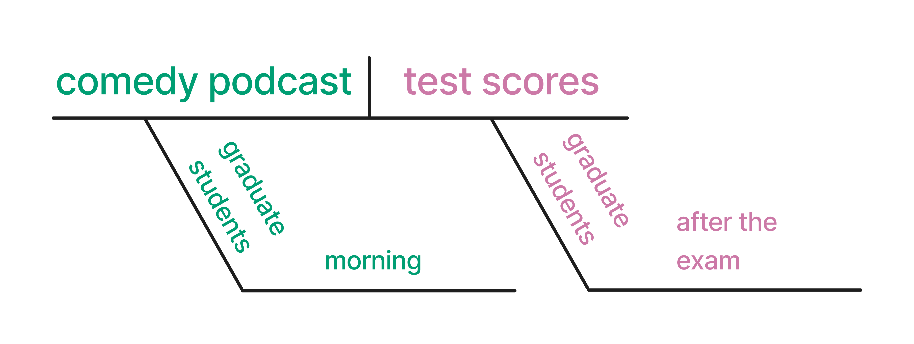

> **来源**：Malcolm Barrett、Lucy D’Agostino McGowan、Travis Gerke，[*Causal Inference in R* · Expressing causal questions as DAGs](https://www.r-causal.org/)。
> 本页为中文翻译；原书代码块、公式、图表交叉引用和引用键均按原文保留。统计图在网页渲染时由 R 代码生成，静态插图直接引用原文件。
> 原书仓库采用 CC BY-NC-SA 4.0；代码采用 MIT 许可。请遵守原许可证并注明作者。

# 用 DAG 表达因果问题 {#sec-dags}



```{r}
#| echo: false

# TODO: remove when first edition complete
status("complete")
```

## 可视化因果假设

> 当我们试图单独挑出任何事物时，会发现它被成千上万条无法打破的无形纽带牢牢束缚着，与宇宙中的一切相连。
> -- John Muir

**因果图**是一种工具，用来可视化你对待回答问题的因果结构所作的假设。
在随机试验中，因果结构相当简单。
尽管结局可能有许多原因，但暴露的唯一原因就是随机化过程本身（希望如此！）。
然而，在许多非随机场景中，你的问题结构可能是一张复杂的因果网络。
因果图有助于传达我们认为这种结构的样子。
除了坦诚说明我们认为因果结构是什么样，因果图还具有非凡的数学性质，使我们即使使用观察性数据，也能找到估计无偏因果效应的方法。
换句话说，如果因果图设定正确，它们能帮助我们实现可交换性。

因果图也日益普遍。
在对应用健康研究论文中的因果图进行综述时收集的数据表明，随着时间推移，因果图的使用大幅增加 [@Tennant2021]。

```{r}
#| label: fig-dag-usage
#| echo: false
#| warning: false
#| fig-cap: "Percentage of health research papers using causal diagrams over time."

dag_data <- readxl::read_xlsx(here::here("data", "dag_data.xlsx"))

dag_data <- dag_data |>
  separate(
    dag_number,
    into = c("dag_number", "dag_location"),
    convert = TRUE,
    extra = "merge"
  ) |>
  separate(
    consistent_direction,
    into = c("consistent_direction", "dag_ordering"),
    extra = "merge"
  ) |>
  separate(
    report_adjset,
    into = c("report_adjset", "report_adjset_loc"),
    extra = "merge"
  ) |>
  mutate(
    year = str_extract(citation, "\\d{4}") |> as.integer(),
    used_dag = !is.na(nodes),
    reported_estimand = !str_detect(report_estimand, "Not reported")
  )

dag_data |>
  count(year, used_dag) |>
  mutate(pct = n / sum(n)) |>
  filter(used_dag, year < max(year)) |>
  ggplot(aes(year, pct)) +
  geom_line(color = "#0072B2", linewidth = 0.9) +
  scale_y_continuous(
    name = "percent of papers",
    labels = scales::label_percent()
  )
```

我们使用的因果图也称为**有向无环图（directed acyclic graphs，DAGs）**[^04-dags-1]。
这些图之所以是有向的，是因为其中的箭头沿特定方向延伸。
它们之所以无环，是因为不会形成循环；例如，一个变量不能导致自身。
DAG 可用于处理各种问题，但我们关注的是**因果 DAG**。
这一类 DAG 有时也称为**结构因果模型（Structural Causal Models，SCMs）**，因为它们是问题因果结构的模型 [@hernan2021; @Pearl_Glymour_Jewell_2021]。

[^04-dags-1]: DAG 有一个重要但很少有人注意的细节：dag 还是澳大利亚人带有亲昵意味的侮辱性称呼 [affectionate Australian insult](https://en.wikipedia.org/wiki/Dag_(slang))，指羊毛上沾满粪便的毛团，也就是 *daglock*。

DAG 描述变量之间的因果关系。
从视觉上看，它们用**边**和**节点**来表示变量。
边是从一个变量指向另一个变量的箭头，有时称为弧，或直接称为箭头。
节点就是变量本身，有时称为顶点、点，或直接称为变量。
在 @fig-dag-basic 中，有两个节点 `x` 和 `y`，以及一条从 `x` 指向 `y` 的边。
这里我们表示 `x` 导致 `y`。
`y` 会“听从”`x` [@Pearl_Glymour_Jewell_2021]。

```{r}
#| code-fold: true
#| message: false
#| label: fig-dag-basic
#| fig-width: 3
#| fig-height: 2
#| fig-cap: "A causal directed acyclic graph (DAG). DAGs depict causal relationships. In this DAG, the assumption is that `x` causes `y`."

library(ggdag)
dagify(y ~ x, coords = time_ordered_coords()) |>
  ggdag() +
  theme_dag() +
  expand_plot(expand_x = expansion(c(0.2, 0.2)))
```

如果我们对 `x` 对 `y` 的因果效应感兴趣，我们就是在尝试估计这条箭头的数值表示。
不过，在具体问题的因果结构中，通常还有许多其他变量和箭头。
一系列箭头称为一条**路径**。
在 DAG 中你会看到三类路径：**分叉**、**链**和**碰撞点**（有时也称为**逆分叉**）。

```{r}
#| code-fold: true
#| label: fig-dag-path-types
#| fig-cap: "Three types of causal relationships: forks, chains, and colliders. The direction of the arrows and the relationships of interest dictate which type of path a series of variables is. Forks represent a mutual cause, chains represent direct causes, and colliders represent a mutual descendant."

coords <- list(x = c(x = 0, y = 2, q = 1), y = c(x = 0, y = 0, q = 1))

fork <- dagify(
  x ~ q,
  y ~ q,
  exposure = "x",
  outcome = "y",
  coords = coords
)

chain <- dagify(
  q ~ x,
  y ~ q,
  exposure = "x",
  outcome = "y",
  coords = coords
)

collider <- dagify(
  q ~ x + y,
  exposure = "x",
  outcome = "y",
  coords = coords
)

dag_flows <- map(
  list(fork = fork, chain = chain, collider = collider),
  tidy_dagitty
) |>
  map("data") |>
  list_rbind(names_to = "dag") |>
  mutate(dag = factor(dag, levels = c("fork", "chain", "collider")))

dag_flows |>
  ggplot(aes(x = x, y = y, xend = xend, yend = yend)) +
  geom_dag_edges(edge_width = 1) +
  geom_dag_point() +
  geom_dag_text() +
  facet_wrap(~dag) +
  expand_plot(
    expand_x = expansion(c(0.2, 0.2)),
    expand_y = expansion(c(0.2, 0.2))
  ) +
  theme_dag()
```

分叉表示两个变量的共同原因。
这里我们说 `q` 同时导致 `x` 和 `y`，这是**混杂因子**的传统定义。
它们被称为分叉，是因为沿着从 `x` 到 `y` 的路径，箭头朝向不同。
而链表示同一方向上的一系列箭头。
这里，`q` 被称为**中介变量**：它位于从 `x` 到 `y` 的因果路径上。
在这张图中，从 `x` 到 `y` 的唯一路径经过 `q`。
最后，碰撞点是两支箭头的箭头端在某个变量处相遇的路径。
由于因果关系总是沿时间向前发展，这自然意味着碰撞点变量由另外两个变量导致。
这里我们说 `x` 和 `y` 都导致 `q`。
`q` 本身也常被称为**碰撞点**。

::: callout-tip
## DAG 是 SEM 吗？

如果你熟悉**结构方程模型（structural equation models，SEMs）**——一种在心理学和其他社会科学领域常用的建模技术——你可能会注意到 SEM 与 DAG 之间有些相似之处。
DAG 是一种*非参数* SEM。
SEM 使用参数假设估计完整图。
另一方面，因果 DAG 不会估计任何东西；从一个变量指向另一个变量的箭头并不说明这种关系的强度或函数形式，只表示我们认为这种关系存在。
:::

DAG 的重要优势之一，是它们能帮助我们识别偏倚来源，而且通常能提示如何处理这些偏倚。
然而，只有在心中有一个具体的因果问题时，讨论无偏效应估计才有意义。
由于每条箭头都代表一个原因，因果关系贯穿始终；没有哪一条单独的箭头本身就有问题。
这里，我们关注 `x` 对 `y` 的效应。
这个问题决定了我们关心哪些路径，以及不关心哪些路径。

这三类路径对于 `x` 与 `y` 之间的统计关系有不同含义。
如果我们只根据以下假设考察两个变量之间的相关性：

1. 在分叉中，尽管没有从 `x` 到 `y` 的箭头，`x` 和 `y` 仍会相关。
2. 在链中，`x` 和 `y` 仅通过 `q` 发生关联。
3. 在碰撞点中，`x` 和 `y` *不会*相关。

传递关联的路径称为**开放路径**。
不传递关联的路径称为**闭合路径**。
分叉和链是开放的，而碰撞点是闭合的。

那么，我们是否应该对 `q` 进行调整？
这取决于路径的性质。
分叉是混杂路径。
因为 `q` 同时导致 `x` 和 `y`，所以 `x` 和 `y` 会出现虚假关联。
二者都包含来自共同原因 `q` 的信息。
这种共同的因果关系使 `x` 和 `y` 在统计上相关。
对 `q` 进行调整将**阻断**混杂造成的偏倚，并给出 `x` 与 `y` 之间的真实关系。

::: callout-tip
## 调整

我们可以使用各种技术来处理某个变量。
我们用“调整”或“控制”来指代任何能够去除我们不感兴趣的变量效应的技术。
:::

@fig-confounder-scatter 以图形方式展示了这种效应。
这里，`x` 和 `y` 是连续变量，根据 DAG 的定义，它们彼此无关。
然而，`q` 同时导致二者。
未调整的效应存在偏倚，因为它包含了从 `x` 到 `y`、经由 `q` 的开放路径信息。
不过，在 `q` 的各个水平内，`x` 和 `y` 彼此无关。

```{r}
#| code-fold: true
#| label: fig-confounder-scatter
#| message: false
#| fig-cap: "Two scatterplots of the relationship between `x` and `y`. With forks, the relationship is biased by `q`. When accounting for `q`, we see the true null relationship."

set.seed(123)
library(patchwork)
n <- 1000

### q
q <- rbinom(n, size = 1, prob = 0.35)
###

### x
x <- 2 * q + rnorm(n)
###

### y
y <- -3 * q + rnorm(n)
###

confounder_data <- tibble(x, y, q = as.factor(q))

p1 <- confounder_data |>
  ggplot(aes(x, y)) +
  geom_point(alpha = 0.2) +
  geom_smooth(method = "lm", se = FALSE, color = "black") +
  facet_wrap(~"not adjusting for `q`\n(biased)")

p2 <- confounder_data |>
  ggplot(aes(x, y, color = q)) +
  geom_point(alpha = 0.2) +
  geom_smooth(method = "lm", se = FALSE) +
  facet_wrap(~"adjusting for `q`\n(unbiased)")

p1 + p2
```

对于链，是否对中介变量进行调整取决于研究问题。
在这里，对 `q` 进行调整会得到 `x` 对 `y` 的效应为零的估计值。
因为 `x` 对 `y` 的唯一效应是通过 `q` 传递的，所以不再有其他效应。
`x` 对 `y` 的经 `q` 中介的效应称为**间接效应**，而 `x` 直接对 `y` 产生的效应称为**直接效应**。
如果我们只对直接效应感兴趣，控制 `q` 可能正是我们想要的。
如果我们想了解两种效应，就不应尝试对 `q` 进行调整。
我们将在 @sec-mediation 中进一步学习如何估计这些效应以及其他中介效应。

@fig-mediator-scatter 以图形方式展示了这种效应。
未调整的 `x` 对 `y` 的效应代表总效应。
由于总效应完全来自经由 `q` 中介的路径，对 `q` 进行调整后，关系便不复存在。
这一零效应就是直接效应。
这两种效应都不是由偏倚造成的，但分别回答了不同的研究问题。

```{r}
#| code-fold: true
#| label: fig-mediator-scatter
#| message: false
#| fig-cap: "Two scatterplots of the relationship between `x` and `y`. With chains, whether and how we should account for `q` depends on the research question. Without doing so, we see the impact of the total effect of `x` and `y`, including the indirect effect via `q`. When accounting for `q`, we see the direct (null) effect of `x` on `y`."

### x
x <- rnorm(n)
###

### q
linear_pred <- 2 * x + rnorm(n)
prob <- 1 / (1 + exp(-linear_pred))
q <- rbinom(n, size = 1, prob = prob)
###

### y
y <- 2 * q + rnorm(n)
###

mediator_data <- tibble(x, y, q = as.factor(q))

p1 <- mediator_data |>
  ggplot(aes(x, y)) +
  geom_point(alpha = 0.2) +
  geom_smooth(method = "lm", se = FALSE, color = "black") +
  facet_wrap(~"not adjusting for `q`\n(total effect)")

p2 <- mediator_data |>
  ggplot(aes(x, y, color = q)) +
  geom_point(alpha = 0.2) +
  geom_smooth(method = "lm", se = FALSE) +
  facet_wrap(~"adjusting for `q`\n(direct effect)")

p1 + p2
```

碰撞点则不同。
在 @fig-dag-path-types 的碰撞点 DAG 中，`x` 和 `y` *没有*关联，但二者都导致 `q`。
对 `q` 进行调整所产生的效果与混杂相反：它会*打开*一条造成偏倚的路径。
有时，人们会画出因对碰撞点进行条件化而打开、连接 `x` 与 `y` 的路径。

当 `x` 和 `y` 是连续变量而 `q` 是二元变量时，我们可以从视觉上看到这一点。
在 @fig-collider-scatter 中，不纳入 `q` 时，我们发现 `x` 和 `y` 之间没有关系。
这是正确结果。
然而，纳入 `q` 后，我们可以获取 `x` 和 `y` 两者的信息，于是它们看起来相关：在 `x` 的各个水平上，`q = 0` 的个体具有较低的 `y` 水平。
关联似乎沿时间逆向流动。
当然，从因果角度看这是不可能的，因此控制 `q` 是错误的做法。
最终，我们得到 `x` 对 `y` 的有偏效应。

```{r}
#| code-fold: true
#| label: fig-collider-scatter
#| message: false
#| fig-cap: "Two scatterplots of the relationship between `x` and `y`. The unadjusted relationship between the two is unbiased. When accounting for `q`, we open a colliding backdoor path and bias the relationship between `x` and `y`."

### x
x <- rnorm(n)
###

### y
y <- rnorm(n)
###

### q
linear_pred <- 2 * x + 3 * y + rnorm(n)
prob <- 1 / (1 + exp(-linear_pred))
q <- rbinom(n, size = 1, prob = prob)
###

collider_data <- tibble(x, y, q = as.factor(q))

p1 <- collider_data |>
  ggplot(aes(x, y)) +
  geom_point(alpha = 0.2) +
  geom_smooth(method = "lm", se = FALSE, color = "black") +
  facet_wrap(~"not adjusting for `q`\n(unbiased)")

p2 <- collider_data |>
  ggplot(aes(x, y, color = q)) +
  geom_point(alpha = 0.2) +
  geom_smooth(method = "lm", se = FALSE) +
  facet_wrap(~"adjusting for `q`\n(biased)")

p1 + p2
```

怎么会这样？
因为 `x` 和 `y` 发生在 `q` 之前，`q` 不可能影响它们。
让我们把 DAG 横过来，看看 @fig-collider-time。
如果把两个时间点拆开来看，在时间点 1，`q` 尚未发生，`x` 和 `y` 互不相关。
在时间点 2，`q` 因 `x` 和 `y` 而发生。
*但因果关系只能沿时间向前发展*。
之后发生的 `q` 不可能改变 `x` 和 `y` 过去曾独立发生这一事实。

```{r}
#| code-fold: true
#| label: fig-collider-time
#| fig-cap: "A collider relationship over two points in time. At time point one, there is no relationship between `x` and `y`. Both cause `q` by time point two, but this does not change what already happened at time point one."

coords <- list(x = c(x = 0, y = 2, q = 1), y = c(x = 0, y = 0, q = -1))
collider <- dagify(
  q ~ x + y,
  exposure = "x",
  outcome = "y",
  coords = time_ordered_coords()
)

collider_t <- collider |>
  tidy_dagitty() |>
  mutate(time = "time point 1", direction = NA, to = NA) |>
  filter(name != "q")

t2 <- collider |>
  tidy_dagitty() |>
  mutate(time = "time point 2") |>
  pull_dag_data()

collider_t$data <- bind_rows(collider_t$data, t2)

collider_t |>
  mutate(deemphasize = (name %in% c("x", "y") & time == "time point 2")) |>
  ggplot(aes(x = x, y = y, xend = xend, yend = yend)) +
  geom_dag_edges(edge_width = 1, edge_color = "grey85") +
  geom_dag_point(aes(color = deemphasize), show.legend = FALSE) +
  geom_dag_text() +
  facet_wrap(~time) +
  theme_dag() +
  scale_color_manual(values = c("TRUE" = "grey85", "FALSE" = "black"))
```

因果关系只能向前发展。
但是，关联不受时间影响。
它只是关于变量之间数值关系的观察。
当我们控制未来时，就有引入偏倚的风险。
形成这种直觉需要时间。
设想 `x` 和 `y` 是 `q` 的仅有原因，且三个变量都是二元变量。
当 *任意一个* `x` 或 `y` 等于 1 时，`q` 就会发生。
若我们知道 `q = 1` 且 `x = 0`，那么从逻辑上讲，`y = 1` 必然成立。
因此，了解 `q` 后，我们就能获得关于 `y` 的信息，而这种信息来自 `x`。
这个例子很极端，但它展示了这种偏倚是如何发生的；这种偏倚有时称为**碰撞点分层偏倚**或**选择偏倚**：对 `q` 进行条件化会提供关于 `x` 和 `y` 的统计信息，并扭曲二者的关系 [@Banack2023]。

::: callout-tip
## 再谈可交换性

我们通常把可交换性称为无混杂的假设。
其实，这并不完全正确。
要使潜在结局具有可交换性，我们需要不存在*开放的非因果路径* [@hernan2021]。
很多时候，这些路径是混杂路径。
然而，对碰撞点进行条件化也会打开路径。
尽管这些变量不是混杂因子，这样做仍会造成两组之间的不可交换性：两组在某个会影响暴露和结局的方面存在差异。

开放的非因果路径也称为**后门路径**。
我们会经常使用这个术语，因为它很好地表达了这个概念：任何使我们感兴趣的效应估计产生偏倚的开放路径，都属于后门路径。
:::

正确识别暴露与结局之间的因果结构，可以帮助我们 1) 传达我们对变量之间关系所作的假设；2) 识别偏倚来源。
尤其是，在完成第 2 点时，我们通常还能根据第 1 点中的假设，找出防止偏倚的方法。
在 @fig-dag-path-types 的三个 DAG 这一简单案例中，我们可以根据因果结构的性质，判断是否应控制 `q`。
我们需要调整的变量集合（或多个集合）称为**调整集**。
即使在复杂情境中，DAG 也能帮助我们识别调整集 [@vanderzander2019]。

::: callout-tip
## 交互作用呢？

DAG 不会对交互作用或效应修饰作出说明，尽管它们是因果推断的重要组成部分。
从技术上说，交互作用属于 DAG 中关系函数形式的问题。
正如我们不需要在 DAG 中指定如何对变量建模（例如使用样条），也不需要确定变量在统计上如何交互。
这属于建模阶段的工作。

我们在因果推断中使用交互项有几种方式。
在一个极端情况下，它们仅仅是函数形式的问题：交互项被纳入模型，但经过边际化以得到总体因果效应。
相反，我们也会关注**联合因果效应**，即发生交互的两个变量都具有因果作用。
在两者之间，我们可以使用交互项来识别**异质性因果效应**，这类效应会随另一个被假定没有因果作用的变量而变化。
与因果推断中的许多工具一样，我们用同一种统计技术来回答不同的问题。
我们将在[第 -@sec-interaction 章]中详细回顾这一主题。

许多人尝试用不同类型的弧、节点和其他标注在 DAG 中表达交互作用，但没有任何一种方法成为公认的首选方式 [@weinberg2007; @Nilsson2021]。
:::

让我们看看 R 中的一个例子。
我们将学习如何构建 DAG、可视化 DAG，并识别调整集等重要信息。

## R 中的 DAG

首先考虑一个研究问题：在考试前的早晨听喜剧播客，能提高研究生的考试成绩吗？
我们可以使用 @sec-diag 中介绍的方法，用图示表示这一问题（@fig-diagram-podcast）。

```{r}
#| echo: false
#| fig-cap: "A sentence diagram for the question: Does listening to a comedy podcast the morning before an exam improve graduate student test scores? The population is graduate students. The start time is morning, and the outcome time is after the exam."
#| fig-height: 2
#| label: fig-diagram-podcast


```

我们将用于制作 DAG 的工具是 ggdag。
ggdag 是一个软件包，它将 R 中最强大的可视化工具 ggplot2 与 dagitty 连接起来；dagitty 是一个用于查询 DAG 的 R 软件包，包含复杂的算法。

要创建 DAG 对象，我们将使用 `dagify()` 函数。`dagify()` 返回一个 `dagitty` 对象，可同时与 dagitty 和 ggdag 软件包配合使用。
`dagify()` 函数接受用逗号分隔的公式，用于指定原因和效应；公式左侧元素定义效应，右侧则列出导致它的所有因素。
这与我们在 R 中为大多数回归模型指定的公式类型相同。

```{r}
#| eval: false

dagify(
  effect1 ~ cause1 + cause2 + cause3,
  effect2 ~ cause1 + cause4,
  ...
)
```

哪些因素会导致研究生在考试前的早晨听播客？
哪些因素可能导致研究生考得好？
我们先在这里提出一些假设。

```{r}
library(ggdag)
dagify(
  podcast ~ mood + humor + prepared,
  exam ~ mood + prepared
)
```

在上面的代码中，我们假设：

- 研究生的心情、幽默感，以及他们觉得自己为考试准备得多充分，可能会影响他们是否在考试当天早晨听播客
- 他们的心情和准备程度也会影响考试成绩

注意，在考试方程中我们*没有*看到 podcast；这意味着我们假设 podcast 与考试成绩之间*不存在*因果关系。

还有一些其他有用的参数，你经常会发现自己需要将它们提供给 `dagify()`：

- `exposure` 和 `outcome`：告诉 ggdag 哪些变量是研究问题中的暴露和结局，是我们对 DAG 进行许多最有价值查询的必要条件。
- `latent`：此参数让我们告诉 ggdag，DAG 中有些变量没有被测量。
  `latent` 有助于根据我们实际拥有的数据识别有效调整集。
- `coords`：变量的坐标。
  你可以在算法布局和手动布局之间选择，下面会讨论。
  这里我们会使用 `time_ordered_coords()`。
- `labels`：变量标签的字符向量。

让我们创建一个具有其中一些属性的 DAG 对象 `podcast_dag`，然后用 `ggdag()` 对 DAG 进行可视化。
`ggdag()` 返回一个 ggplot 对象，因此我们可以像添加主题一样，向图中添加其他图层。

```{r}
#| label: fig-dag-podcast
#| fig-cap: "Proposed DAG to answer the question: Does listening to a comedy podcast the morning before an exam improve graduate students' test scores?"
#| fig-width: 4
#| fig-height: 4
#| warning: false

podcast_dag <- dagify(
  podcast ~ mood + humor + prepared,
  exam ~ mood + prepared,
  coords = time_ordered_coords(
    list(
      # time point 1
      c("prepared", "humor", "mood"),
      # time point 2
      "podcast",
      # time point 3
      "exam"
    )
  ),
  exposure = "podcast",
  outcome = "exam",
  labels = c(
    podcast = "podcast",
    exam = "exam score",
    mood = "mood",
    humor = "humor",
    prepared = "prepared"
  )
)
ggdag(podcast_dag, use_labels = TRUE, use_text = FALSE) +
  theme_dag()
```

::: callout-note
在本章余下部分，我们将使用 `theme_dag()`，这是 ggdag 为 DAG 设计的 ggplot 主题。

```{r}
theme_set(
  theme_dag() %+replace%
    # also add some additional styling
    theme(
      legend.position = "bottom",
      strip.text.x = element_text(margin = margin(2, 0, 2, 0, "mm"))
    )
)
```
:::

::: callout-tip
## DAG 坐标

你不必为 ggdag 指定坐标。
如果不指定，它会使用为自动布局设计的算法。
此类算法很多，各自关注布局的不同方面，例如形状、节点之间的间距、尽量减少交叉边的数量等。
这些布局算法通常带有随机性成分，因此，如果你想每次得到相同的结果，最好设置随机种子。

```{r}
#| fig-width: 4
#| fig-height: 4
#| fig-align: center

# no coordinates specified
set.seed(123)
pod_dag <- dagify(
  podcast ~ mood + humor + prepared,
  exam ~ mood + prepared
)

# automatically determine layouts
pod_dag |>
  ggdag(text_size = 2.8)
```

我们也可以要求使用特定布局，例如 DAG 常用的 Sugiyama 算法 [@sugiyama1981]。

```{r}
#| fig-width: 4
#| fig-height: 4
#| fig-align: center

pod_dag |>
  ggdag(layout = "sugiyama", text_size = 2.8)
```

对于因果 DAG，按时间排序的布局算法通常最好，我们可以用 `time_ordered_coords()` 或 `layout = "time_ordered"` 指定它。
下面我们会更详细地讨论时间顺序。
前面我们明确告诉 ggdag 哪些变量属于哪些时间点，但其实不必这样做。
不过请注意，由于一个变量不会导致另一个变量（因而不会先于它发生），时间排序算法会把 `podcast` 和 `exam` 放在同一个时间点。
我们知道实际情况并非如此：听播客发生在参加考试之前。

<!-- TODO: if implementing a better way to use this algorithm while specifying one or more time points, then update this -->

```{r}
#| fig-width: 4
#| fig-height: 4
#| fig-align: center

pod_dag |>
  ggdag(layout = "time_ordered", text_size = 2.8)
```

你也可以使用列表或数据框手动指定坐标，并将其提供给 `coords` 参数；这个参数属于 `dagify()`。
此外，由于 ggdag 基于 dagitty，你可以使用 [dagitty 网页应用](https://dagitty.net/) 通过图形界面创建和组织 DAG，然后将结果导出为 dagitty 代码，供 ggdag 使用。

算法布局适合快速可视化 DAG 或特别复杂的图。
到了需要分享 DAG 的时候，通常最好更有意识地设计布局，例如手动指定坐标。
`time_ordered_coords()` 往往兼顾两者的优点，本书中大多数 DAG 都会使用它。
:::

我们已经为这个问题指定了 DAG，并告诉 ggdag 哪些是感兴趣的暴露和结局。
根据 DAG，听播客与考试成绩之间没有直接因果关系。
还有其他开放路径吗？
`ggdag_paths()` 接受一个 DAG，并将开放路径可视化。
在 @fig-paths-podcast 中，我们看到两条开放路径：`podcast <- mood -> exam"` 和 `podcast <- prepared -> exam`。
这两条都是分叉——*混杂路径*。
由于听播客与考试成绩之间没有因果关系，唯一的开放路径就是*后门*路径，也就是这两条混杂路径。

```{r}
#| label: fig-paths-podcast
#| fig-cap: "`ggdag_paths()` visualizes open paths in a DAG. There are two open paths in `podcast_dag`: the fork from `mood` and the fork from `prepared`."

podcast_dag |>
  # show the whole dag as a light gray "shadow"
  # rather than just the paths
  ggdag_paths(shadow = TRUE, use_text = FALSE, use_labels = TRUE)
```

::: callout-tip
`dagify()` 返回一个 `dagitty()` 对象，但在底层，ggdag 会把 `dagitty` 对象转换为 tidy DAG，这是一种同时包含 `dagitty` 对象和关于 DAG 的 `dataframe` 的结构。
这在你想以编程方式操作 DAG 时很方便。

```{r}
podcast_dag_tidy <- podcast_dag |>
  tidy_dagitty()

podcast_dag_tidy
```

大多数快速绘图函数都会在 `dagitty` 对象尚未是 tidy DAG 时先将其转换，然后以某种方式处理其中的数据。
例如，`dag_paths()` 是 `ggdag_paths()` 的底层函数；它返回一个包含路径数据的 tidy DAG。
你可以直接对这些对象使用多个 dplyr 函数。

```{r}
podcast_dag_tidy |>
  dag_paths() |>
  filter(set == 2, path == "open path")
```

tidy DAG 不是纯数据框，但你可以提取其中的 `dataframe` 或 `dagitty` 对象，再使用 `pull_dag_data()` 或 `pull_dag()` 直接对它们进行操作。
当你想使用 dagitty 函数时，`pull_dag()` 会很有用：

```{r}
library(dagitty)
podcast_dag_tidy |>
  pull_dag() |>
  paths()
```
:::

后门路径会污染 `podcast` 与 `exam` 之间的统计关联，因此我们必须对其进行处理。
`ggdag_adjustment_set()` 会可视化 DAG 所隐含的任何有效调整集。
@fig-podcast-adustment-set 将调整后的变量显示为方形。
调整变量发出的所有箭头都会从 DAG 中移除，因为路径在该变量处不再开放。

```{r}
#| label: fig-podcast-adustment-set
#| fig-width: 8
#| fig-height: 4
#| fig-align: center
#| fig-cap: "A visualization of the minimal adjustment set for the podcast-exam DAG. If this DAG is correct, two variables are required to block the backdoor paths: `mood` and `prepared`."

ggdag_adjustment_set(
  podcast_dag,
  use_text = FALSE,
  use_labels = TRUE
)
```

@fig-podcast-adustment-set 展示了**最小调整集**。
默认情况下，ggdag 会返回能够以尽可能少的变量关闭所有后门路径的集合（可能有多个）。
在这个 DAG 中，只有一个集合：`mood` 和 `prepared`。
这很合理，因为这里有两条后门路径，除了暴露和结局之外，路径上的其他变量正好就是这两个变量。
因此，至少我们必须对二者都加以处理，才能获得有效的估计值。

::: callout-tip
`ggdag()` 及其相关函数通常使用 `tidy_dagitty()` 和 `dag_*()` 或 `node_*()` 函数来修改底层数据框。
同样，快速绘图函数使用 ggdag 的几何对象来可视化生成的 DAG。
换句话说，你可以直接在 ggdag 中使用日常所用的相同数据处理和可视化策略。

下面是 `ggdag_adjustment_set()` 所做工作的精简版：

```{r}
#| fig-width: 4.5
#| fig-height: 4.5
#| fig-align: center

podcast_dag_tidy |>
  # add adjustment sets to data
  dag_adjustment_sets() |>
  ggplot(aes(
    x = x,
    y = y,
    xend = xend,
    yend = yend,
    color = adjusted,
    shape = adjusted
  )) +
  # ggdag's custom geoms: add nodes, edges, and labels
  geom_dag_point() +
  # remove adjusted paths
  geom_dag_edges_link(data = \(.df) filter(.df, adjusted != "adjusted")) +
  geom_dag_label_repel() +
  # you can use any ggplot function, too
  facet_wrap(~set) +
  scale_shape_manual(values = c(adjusted = 15, unadjusted = 19))
```
:::

最小调整集只是有效调整集的一种类型 [@vanderzander2019]。
有时，变量的其他组合也能让我们得到无偏的效应估计。
ggdag 还提供了另外两种选择：**完整调整集**和**规范调整集**。
完整调整集是所有能够产生有效集合的变量组合。

```{r}
#| label: fig-adustment-set-all
#| fig-width: 6.5
#| fig-height: 5
#| fig-align: center
#| fig-cap: "All valid adjustment sets for `podcast_dag`."

ggdag_adjustment_set(
  podcast_dag,
  use_text = FALSE,
  use_labels = TRUE,
  # get full adjustment sets
  type = "all"
)
```

事实证明，我们还可以控制 `humor`。

规范调整集稍微复杂一些：它们是暴露和结局的所有可能祖先，再排除任何可能的后代。
在完全饱和的 DAG 中（也就是每个节点都会导致时间上位于其后的任何节点的 DAG），规范调整集就是最小调整集。

::: callout-tip
ggdag 中的大多数函数都在底层使用 dagitty。
直接调用 dagitty 函数通常很有帮助。

```{r}
adjustmentSets(podcast_dag, type = "canonical")
```
:::

让我们使用提出的 DAG 模拟一些数据，看看在实践中如何处理最小调整集。

```{r}
set.seed(10)
sim_data <- podcast_dag |>
  simulate_data()

sim_data
```

@fig-dag-sim 展示了基于我们的 DAG、使用模拟数据得到的估计值森林图。
一个估计值未经调整，另一个根据 `mood` 和 `prepared` 进行了调整。
请注意，未调整的估计值产生了一个虚假效应（估计值为 -0.1，而我们知道真实值是 0）。
相比之下，按照 `ggdag_adjustment_set()` 的建议对两个变量进行调整后得到的估计值并非虚假效应（更接近 0）。

```{r}
#| label: fig-dag-sim
#| fig-cap: "Forest plot of simulated data based on the DAG described in @fig-dag-podcast."
#| code-fold: true

## Model that does not close backdoor paths
library(broom)
unadjusted_model <- lm(exam ~ podcast, sim_data) |>
  tidy(conf.int = TRUE) |>
  filter(term == "podcast") |>
  mutate(formula = "unadjusted")

## Model that closes backdoor paths
adjusted_model <- lm(exam ~ podcast + mood + prepared, sim_data) |>
  tidy(conf.int = TRUE) |>
  filter(term == "podcast") |>
  mutate(formula = "mood + prepared")

bind_rows(
  unadjusted_model,
  adjusted_model
) |>
  ggplot(aes(x = estimate, y = formula, xmin = conf.low, xmax = conf.high)) +
  geom_vline(xintercept = 0, linewidth = 1, color = "grey80") +
  geom_pointrange(fatten = 3, size = 1) +
  theme_minimal(18) +
  labs(
    y = NULL,
    caption = "correct effect size: 0"
  )
```

当然，我们知道这里使用的是真实 DAG。
假设我们不知道真实 DAG（@fig-dag-podcast），而是绘制了 @fig-dag-podcast-wrong。

```{r}
#| label: fig-dag-podcast-wrong
#| fig-cap: "Proposed DAG to answer the question: Does listening to a comedy podcast the morning before an exam improve graduate students' test scores? This time, we proposed the wrong DAG."
#| fig-width: 4
#| fig-height: 4
#| warning: false
#| code-fold: true

podcast_dag_wrong <- dagify(
  podcast ~ humor + prepared,
  exam ~ prepared,
  coords = time_ordered_coords(
    list(
      # time point 1
      c("prepared", "humor"),
      # time point 2
      "podcast",
      # time point 3
      "exam"
    )
  ),
  exposure = "podcast",
  outcome = "exam",
  labels = c(
    podcast = "podcast",
    exam = "exam score",
    humor = "humor",
    prepared = "prepared"
  )
)
ggdag(podcast_dag_wrong, use_labels = TRUE, use_text = FALSE) +
  theme_dag()
```

由于 DAG 错误，它无法帮助我们得到正确答案。
它表示我们只需对 `prepared` 进行调整，但我们遗漏了一条造成该关系混杂的因果路径。
现在，两个估计值都不正确。

```{r}
#| label: fig-dag-sim-wrong
#| fig-cap: "Forest plot of simulated data based on the DAG described in @fig-dag-podcast. However, we've analyzed it using the adjustment set from @fig-dag-podcast-wrong, giving us the wrong answer."
#| code-fold: true

## Model that does not close backdoor paths
library(broom)
unadjusted_model <- lm(exam ~ podcast, sim_data) |>
  tidy(conf.int = TRUE) |>
  filter(term == "podcast") |>
  mutate(formula = "unadjusted")

## Model that closes backdoor paths
adjusted_model <- lm(exam ~ podcast + prepared, sim_data) |>
  tidy(conf.int = TRUE) |>
  filter(term == "podcast") |>
  mutate(formula = "prepared")

bind_rows(
  unadjusted_model,
  adjusted_model
) |>
  ggplot(aes(x = estimate, y = formula, xmin = conf.low, xmax = conf.high)) +
  geom_vline(xintercept = 0, linewidth = 1, color = "grey80") +
  geom_pointrange(fatten = 3, size = 1) +
  theme_minimal(18) +
  labs(
    y = NULL,
    caption = "correct effect size: 0"
  )
```

## 因果结构

### 高级混杂

在 `podcast_dag` 中，`mood` 和 `prepared` 是*直接*混杂因子：有一条箭头直接从它们指向 `podcast` 和 `exam`。
后门路径往往更复杂。
让我们通过添加两个新变量来考虑这种情况：`alertness` 和 `skills_course`。
`alertness` 表示良好心情带来的警觉感，因此箭头从 `mood` 指向 `alertness`。
`skills_course` 表示学生是否参加了 College Skills Course 并学习了时间管理技巧。
现在，`skills_course` 让学生腾出时间收听播客，同时也为考试做好准备。
`mood` 和 `prepared` 不再是直接混杂因子：它们是更复杂后门路径上的两个变量。
此外，我们还添加了一条从 `humor` 指向 `mood` 的箭头。
让我们看看 @fig-podcast_dag2。

```{r}
#| label: fig-podcast_dag2
#| fig-width: 5
#| fig-height: 4
#| fig-cap: "An expanded version of `podcast_dag` that includes two additional variables: `skills_course`, representing a College Skills Course, and `alertness`."

podcast_dag2 <- dagify(
  podcast ~ mood + humor + skills_course,
  alertness ~ mood,
  mood ~ humor,
  prepared ~ skills_course,
  exam ~ alertness + prepared,
  coords = time_ordered_coords(),
  exposure = "podcast",
  outcome = "exam",
  labels = c(
    podcast = "podcast",
    exam = "exam score",
    mood = "mood",
    alertness = "alertness",
    skills_course = "college\nskills course",
    humor = "humor",
    prepared = "prepared"
  )
)

ggdag(podcast_dag2, use_labels = TRUE, use_text = FALSE)
```

```{r}
#| echo: false

paths <- paths(podcast_dag2)
open_paths <- glue::glue_collapse(
  glue::glue("`{paths$paths[paths$open]}`"),
  sep = ", ",
  last = ", and"
)
adj_sets <- unclass(adjustmentSets(podcast_dag2)) |>
  map_chr(\(.x) glue::glue('{unlist(glue::glue_collapse(.x, sep = " + "))}'))
adj_sets <- glue::glue("`{adj_sets}`")
```

目前需要关闭*三条*后门路径：`r open_paths`。

```{r}
#| label: fig-podcast_dag2-paths
#| fig-width: 11
#| fig-height: 4.5
#| fig-cap: "Three open paths in `podcast_dag2`. Since there is no effect of `podcast` on `exam`, all three are backdoor paths that must be closed to get the correct effect."

ggdag_paths(podcast_dag2, use_labels = TRUE, use_text = FALSE, shadow = TRUE)
```

共有四个最小调整集可以关闭这三条路径（完整调整集则有十八个！）。
这些最小调整集是 `r adj_sets`。
现在，我们可以通过几种方式阻断开放路径。
`mood` 和 `prepared` 仍然可用，但现在还有其他选择。
值得注意的是，`prepared` 和 `alertness` 可能同时发生，甚至可能在 `podcast` 之后发生。
`skills_course` 和 `mood` 仍然发生在 `podcast` 和 `exam` 之前，因此基本思路不变：混杂路径在暴露和结局之前就开始了。

```{r}
#| label: fig-podcast_dag2-set
#| fig-width: 7
#| fig-height: 8
#| fig-cap: "Valid minimal adjustment sets that will close the backdoor paths in @fig-podcast_dag2-paths."

ggdag_adjustment_set(podcast_dag2, use_labels = TRUE, use_text = FALSE)
```

在这些调整集之间做选择需要判断：如果所有数据都被完美测量、DAG 是正确的，并且我们对它们进行了正确建模，那么使用哪一个并不重要。
每个调整集都会得到一个无偏估计值。
这三个假设通常都在一定程度上不成立。
让我们考虑经过 `skills_course` 和 `prepared` 的路径。
与评估某人对考试的准备程度相比，我们可能更能准确判断他是否参加了 College Skills Course。
在这种情况下，包含 `skills_course` 的调整集是更好的选择。
但也许我们更了解准备程度与考试成绩之间的关系。
如果我们对它进行了测量，控制它可能更好。
我们可以同时纳入两个变量，从而兼得两者的优势：`skills_course` 测量得更好，`prepared` 建模得更好，这可能让我们更有机会减少这条路径产生的混杂。

### 选择偏倚与中介

选择偏倚是通过对碰撞点进行调整而诱发的偏倚的另一种称呼 [@lu2022]。
之所以称为“选择偏倚”，是因为碰撞点诱发偏倚的一种常见形式，是研究设计所固有的、按某个变量进行的分层——即选择*进入*研究。
让我们考虑一个基于原始 `podcast_dag` 的案例，只增加一个变量：学生是否参加了考试。
现在，`podcast` 对 `exam` 存在间接效应：收听播客会影响学生是否参加考试。
没有参加考试的人缺失 `exam` 的真实结果；通过研究那些*确实*参加考试的人，我们实际上是在这个变量上进行分层。

```{r}
#| label: fig-podcast_dag3
#| fig-width: 4.5
#| fig-height: 3.5
#| fig-cap: "Another variant of `podcast_dag`, this time including the inherent stratification on those who appear for the exam. There is still no direct effect of `podcast` on `exam`, but there is an indirect effect via `showed_up`."

podcast_dag3 <- dagify(
  podcast ~ mood + humor + prepared,
  exam ~ mood + prepared + showed_up,
  showed_up ~ podcast + mood + prepared,
  coords = time_ordered_coords(
    list(
      # time point 1
      c("prepared", "humor", "mood"),
      # time point 2
      "podcast",
      "showed_up",
      # time point 3
      "exam"
    )
  ),
  exposure = "podcast",
  outcome = "exam",
  labels = c(
    podcast = "podcast",
    exam = "exam score",
    mood = "mood",
    humor = "humor",
    prepared = "prepared",
    showed_up = "showed up"
  )
)
ggdag(podcast_dag3, use_labels = TRUE, use_text = FALSE)
```

问题在于，`showed_up` 同时是碰撞点和中介变量：在它上面进行分层会使 DAG 中许多变量之间产生关系，但会阻断 `podcast` 对 `exam` 的间接效应。
幸运的是，调整集可以处理第一个问题；由于 `showed_up` 发生在 `exam` 之前，我们面临暴露与结局之间碰撞点偏倚的风险较低。
遗憾的是，我们无法计算 `podcast` 对 `exam` 的总效应，因为部分效应缺失了：间接效应在 `showed_up` 处被阻断。

```{r}
#| label: fig-podcast_dag3-as
#| fig-width: 4.5
#| fig-height: 4
#| warning: false
#| fig-cap: "The adjustment set for `podcast_dag3` given that the data are inherently conditioned on showing up to the exam. In this case, there is no way to recover an unbiased estimate of the total effect of `podcast` on `exam`."

podcast_dag3 |>
  adjust_for("showed_up") |>
  ggdag_adjustment_set(use_text = FALSE, use_labels = TRUE)
```

有时，在这种情况下，我们仍然可以通过改变希望估计的估计目标来估计效应。
我们无法计算总效应，因为间接效应缺失，但仍然可以计算 `podcast` 对 `exam` 的直接效应。

```{r}
#| label: fig-podcast_dag3-direct
#| fig-width: 4.5
#| fig-height: 4
#| warning: false
#| fig-cap: "The adjustment set for `podcast_dag3` when targeting a different effect. There is one minimal adjustment set that we can use to estimate the direct effect of `podcast` on `exam`."

podcast_dag3 |>
  adjust_for("showed_up") |>
  ggdag_adjustment_set(effect = "direct", use_text = FALSE, use_labels = TRUE)
```

#### M-偏倚与蝴蝶偏倚 {#sec-m-bias}

选择偏倚的一个特殊案例是人们经常谈论的 **M-偏倚**。
之所以称为 M-偏倚，是因为从上到下排列时，它看起来像字母 M。

```{r}
#| label: fig-m-bias
#| fig-width: 4
#| fig-height: 4
#| fig-cap: "A DAG representing M-Bias, a situation where a collider predates the exposure and outcome."

m_bias() |>
  ggdag()
```

::: callout-tip
ggdag 有几个用于演示基本因果结构的快速 DAG 函数，包括 `confounder_triangle()`、`collider_triangle()`、`m_bias()` 和 `butterfly_bias()`。
:::

M-偏倚在理论上有趣之处在于，`m` 是一个碰撞点，但发生在 `x` 和 `y` 之前。
请记住，关联在碰撞点处被阻断，因此 `x` 和 `y` 之间不存在开放路径。

```{r}
paths(m_bias())
```

让我们聚焦于 podcast-exam DAG 中经过 `mood` 的路径。
如果我们对 mood 的判断是错的，而实际关系呈 M 形，会怎样？
假设我们原先认为的情形并不成立：导致 `podcast` 和 `exam` 的并非同一原因；相反，`mood` 本身由 `podcast` 和 `exam` 的两个共同原因 `u1` 和 `u2` 导致，如 @fig-podcast_dag4 所示。
我们不知道 `u1` 和 `u2` 是什么，也没有对它们进行测量。
如上所述，在 DAG 的这个子集中不存在开放路径。

```{r}
#| label: fig-podcast_dag4
#| fig-width: 5.5
#| fig-height: 4
#| fig-cap: "A reconfiguration of @fig-dag-podcast where `mood` is a collider on an M-shaped path."

podcast_dag4 <- dagify(
  podcast ~ u1,
  exam ~ u2,
  mood ~ u1 + u2,
  coords = time_ordered_coords(list(
    c("u1", "u2"),
    "mood",
    "podcast",
    "exam"
  )),
  exposure = "podcast",
  outcome = "exam",
  labels = c(
    podcast = "podcast",
    exam = "exam score",
    mood = "mood",
    u1 = "unmeasured",
    u2 = "unmeasured"
  ),
  # we don't have them measured
  latent = c("u1", "u2")
)

ggdag(podcast_dag4, use_labels = TRUE, use_text = FALSE)
```

问题出在我们认为原始 DAG 是正确的 DAG：`mood` 位于调整集中，因此我们对其进行控制。
但这会引入偏倚！
它打开了 `u1` 和 `u2` 之间的路径，从而在 `podcast` 与 `exam` 之间创建一条路径。
如果我们测量了 `u1` 或 `u2` 中的任意一个，就可以对其进行调整以关闭这条路径，但我们并没有。
没有办法关闭这条开放路径。

```{r}
#| label: fig-podcast_dag4-as
#| warning: false
#| fig-width: 5.5
#| fig-height: 4.5
#| fig-cap: "The adjustment set where `mood` is a collider. If we control for `mood` and don't know about or have the unmeasured causes of `mood`, we have no means of closing the backdoor path opened by adjusting for a collider."

podcast_dag4 |>
  adjust_for("mood") |>
  ggdag_adjustment_set(use_labels = TRUE, use_text = FALSE)
```

当然，这里最好的做法是完全不对 `mood` 进行控制。
不过，有时这并不可行。
设想一下，如果不是 `mood`，而是 `showed_up` 的真实结构变成这种结构：由于我们必然会对 `showed_up` 进行控制，又没有测量到这些未测量变量，我们的研究结果将始终存在偏倚。
必须弄清楚我们是否处于这种情形，这样才能通过敏感性分析评估效应究竟会有多大偏倚。

让我们考虑 M-偏倚的一种变体：`mood` 导致 `podcast` 和 `exam`，而 `u1` 和 `u2` 是 `mood` 以及暴露和结局的共同原因。
这种安排有时称为蝴蝶偏倚或领结偏倚，同样是因为它的形状。

```{r}
#| label: fig-butterfly_bias
#| fig-width: 5
#| fig-height: 4
#| fig-cap: "In butterfly bias, `mood` is both a collider and a confounder. Controlling for the bias induced by `mood` opens a new pathway because we've also conditioned on a collider. We can't properly close all backdoor paths without either `u1` or `u2`."

butterfly_bias(x = "podcast", y = "exam", m = "mood", a = "u1", b = "u2") |>
  ggdag(use_text = FALSE, use_labels = TRUE)
```

现在我们处境很棘手：由于 `mood` 是混杂因子，我们需要对其进行控制，但控制 `mood` 会打开从 `u1` 到 `u2` 的路径。
由于我们没有测量这两个变量中的任何一个，因此无法再关闭因控制 `mood` 而打开的路径。
我们该怎么办？
事实证明，犹豫不决时，控制 `mood` 是两种选择中更好的一个：混杂偏倚往往比碰撞点偏倚更严重，而碰撞点的 M 形结构对轻微偏离很敏感（例如，如果实际结构并不完全相同，偏倚通常不会那么严重）[@DingMiratrix2015]。

选择偏倚的另一种常见形式来自**失访**：人们以一种与暴露和结局相关的方式退出研究。
我们会在[第 -@sec-longitudinal 章]回到这个主题。

### 暴露的原因、结局的原因

让我们考虑另一种重要的因果结构：导致暴露但不导致结局的原因，以及相反的、导致结局但不导致暴露的原因。
让我们在原始 DAG 中添加一个变量 `grader_mood`。

```{r}
#| label: fig-podcast_dag5
#| fig-width: 5
#| fig-height: 4
#| fig-cap: "A DAG containing a cause of the exposure that is not the cause of the outcome (`humor`) and a cause of the outcome that is not a cause of the exposure (`grader_mood`)."

podcast_dag5 <- dagify(
  podcast ~ mood + humor + prepared,
  exam ~ mood + prepared + grader_mood,
  coords = time_ordered_coords(
    list(
      # time point 1
      c("prepared", "humor", "mood"),
      # time point 2
      c("podcast", "grader_mood"),
      # time point 3
      "exam"
    )
  ),
  exposure = "podcast",
  outcome = "exam",
  labels = c(
    podcast = "podcast",
    exam = "exam score",
    mood = "student\nmood",
    humor = "humor",
    prepared = "prepared",
    grader_mood = "grader\nmood"
  )
)
ggdag(podcast_dag5, use_labels = TRUE, use_text = FALSE)
```

现在有两个变量并不同时与*暴露*和*结局*相关：`humor` 会导致 `podcast` 但不导致 `exam`，而 `grader_mood` 会导致 `exam` 但不导致 `podcast`。
我们先从 `humor` 开始。

导致暴露而不导致结局的变量也称为**工具变量（IVs）**。
IVs 是一种特殊情况：在某些条件下，对它们进行控制可能会加重其他类型的偏倚。
其独特之处在于，IVs 还可以用于采用完全不同的方法，估计暴露对结局的无偏效应。
在计量经济学中，IVs 常以这种方式使用，在其他领域也越来越受欢迎。
简言之，IV 分析让我们能够在不同于迄今讨论方法的另一组假设下估计因果效应。
有时，使用倾向评分方法难以解决的问题，可以用 IVs 加以处理，反之亦然。
我们将在 @sec-iv-friends 中进一步讨论 IVs。

因此，如果你*不*使用 IV 方法，是否应该在旨在处理混杂的模型中纳入 IV？
如果你不确定某个变量是否为 IV，最好将其加入模型：它更可能是混杂因子而非 IV，而且事实证明，在实践中加入 IV 所产生的偏倚通常很小。
因此，与对潜在 M 结构变量进行调整一样，由混杂造成的偏倚风险更大 [@Myers2011]。

现在，让我们讨论 IV 的相反情况：导致结局但不导致暴露的原因。
这些变量有时称为**竞争暴露**（因为它们也导致结局）或**精度变量**（因为正如我们将看到的，它们提高因果估计值的精度）。
我们称其为精度变量，是因为我们关注它们与当前研究问题的关系，而不是另一个将它们视为暴露的研究问题 [@Brookhart2006]。

与 IV 一样，精度变量不位于从暴露到结局的路径上。
因此，纳入它们并非必要。
与 IV 不同，纳入精度变量是有益的。
纳入结局的其他原因有助于统计模型捕捉结局的一部分变异。
这不会影响效应的点估计值，但会降低方差，从而得到更小的标准误和更窄的置信区间。
因此，只要可能，我们就建议纳入它们。

所以，尽管我们不需要控制 `grader_mood`，但如果数据集中有这个变量，就应该这样做。
同样，除非我们认为 `humor` 确实可能是混杂因子，否则把它加入模型并不好；如果它是一个有效工具变量，我们可以考虑改用 IV 方法来估计效应。

### 测量误差与缺失

DAG 还可以帮助我们理解数据中因测量不准确而产生的偏倚，包括最严重的测量不准确：完全不进行测量。
我们将在[第 -@sec-missingness 章]讨论这些主题，但基本思路是，将实际值与观测值分开后，我们可以更好地理解这类偏倚可能如何表现 [@Hernán2009]。
这里有一个称为*回忆偏倚*的基本例子。
当结局影响参与者对暴露的记忆时，就会产生回忆偏倚，因此它是回顾性研究中的一个特殊问题：较早发生的暴露直到结局发生后才被记录。
癌症病例对照研究就是可能出现这种情况的例子。
与没有癌症的人相比，*患有*癌症的人可能更有动力反复回想过去的暴露。
因此，他们对某项暴露的记忆可能比没有癌症的人更清晰。

```{r}
#| label: fig-error_dag
#| fig-width: 5.5
#| fig-height: 4
#| fig-cap: "A DAG representing measurement error in observing the exposure and outcome. In this case, the outcome impacts the participant's memory of the exposure, also known as recall bias."

error_dag <- dagify(
  exposure_observed ~ exposure_real + exposure_error,
  outcome_observed ~ outcome_real + outcome_error,
  outcome_real ~ exposure_real,
  exposure_error ~ outcome_real,
  labels = c(
    exposure_real = "Exposure\n(truth)",
    exposure_error = "Measurement Error\n(exposure)",
    exposure_observed = "Exposure\n(observed)",
    outcome_real = "Outcome\n(truth)",
    outcome_error = "Measurement Error\n(outcome)",
    outcome_observed = "Outcome\n(observed)"
  ),
  exposure = "exposure_real",
  outcome = "outcome_real",
  coords = time_ordered_coords()
)

error_dag |>
  ggdag(use_text = FALSE, use_labels = TRUE)
```

## 构建 DAG 的建议

原则上，使用 DAG 很简单：指定你认为存在的因果关系，然后查询 DAG，以获取有效调整集等信息。
实际上，构建 DAG 需要相当多的时间和思考。
除了定义研究问题本身，构建 DAG 是进行因果推断最具挑战性的步骤之一。
关于构建 DAG 的最佳实践，目前几乎没有指导。
@Tennant2021 收集了应用健康研究中 DAG 的数据，以更好地了解研究人员如何使用它们。
@tbl-dag-properties 展示了他们收集的一些信息：DAG 中节点和弧的中位数、二者的比值、DAG 的饱和百分比，以及完全饱和的 DAG 数量。
DAG 饱和是指沿时间向前添加所有可能的箭头；例如，在完全饱和的 DAG 中，时间点 1 的任意给定变量都有指向未来各时间点所有变量的箭头，依此类推。
大多数 DAG 的饱和程度只有约一半，完全饱和的 DAG 则极少。

使用 DAG 的论文中，只有大约一半报告了所采用的调整集。
换句话说，研究人员说明了他们对研究问题的假设，却没有说明这些假设对建模阶段应如何处理有何影响，也没有说明他们是否使用了有效的调整集。
同样，大多数研究没有报告所关注的估计目标。

::: callout-note
估计目标是就我们试图估计的内容而言所关注的目标，正如[第 -@sec-whole-game 章]中简要讨论的那样。
我们将在[第 -@sec-estimands 章]详细讨论估计目标。
:::

```{r}
#| label: tbl-dag-properties
#| echo: false
#| message: false
#| tbl-cap: "A table of DAG properties in applied health research. Number of nodes and arcs are the median number of variables and arrows in the analyzed DAGs, while the Node to Arc ratio is their ratio. Saturation proportion is the proportion of all possible arrows going forward in time to other included variables. Fully saturated DAGs are those that include all such arrows. The researchers also analyzed whether studies reported their estimands and adjustment sets."

library(gtsummary)
library(gt)
dag_data_used <- dag_data |>
  filter(used_dag)

as_yes_no <- function(x) {
  factor(x, c(TRUE, FALSE), labels = c("Yes", "No"))
}

dag_data_used |>
  mutate(
    saturated = near(saturation, 1),
    report_adjset = report_adjset == "Yes",
    across(c(saturated, reported_estimand, report_adjset), as_yes_no)
  ) |>
  select(
    nodes,
    arcs,
    ratio,
    saturation,
    saturated,
    reported_estimand,
    report_adjset
  ) |>
  tbl_summary(
    label = list(
      nodes ~ "Number of Nodes",
      arcs ~ "Number of Arcs",
      ratio ~ "Node to Arc Ratio",
      saturation ~ "Saturation Proportion",
      saturated ~ "Fully Saturated",
      reported_estimand ~ "Reported Estimand",
      report_adjset ~ "Reported Adjustment Set"
    ),
    digits = list(everything() ~ 0, c(ratio, saturation) ~ 2),
    type = list(where(is.factor) ~ "categorical")
  ) |>
  as_gt() |>
  tab_row_group(
    label = md("**DAG properties**"),
    rows = 1:7,
    id = "dag_prop"
  ) |>
  tab_row_group(
    label = md("**Reporting**"),
    rows = 8:13,
    id = "reporting"
  ) |>
  row_group_order(c("dag_prop", "reporting"))
```

本节将根据 @Tennant2021 以及我们构建 DAG 的经验，提出一些建议。

### 尽早并频繁迭代 {#sec-dags-iterate}

为了提高结果质量，你能做的最重要的事情之一，是在开展研究之前绘制 DAG，最好在收集数据之前就完成。
如果你已经在处理数据，至少也要在开展数据分析之前构建 DAG。
这条建议与预注册分析计划的理念相近：提前声明假设有助于明确你需要做什么，降低过拟合风险（例如根据数据错误地确定混杂因子），并给你时间获得他人对 DAG 的反馈。

上一个好处很重要：理想情况下，你应该让更多人参与 DAG 的构建。
尽早且频繁地与熟悉数据、领域和模型的专家分享它。
构建 DAG、向同事展示它，然后意识到自己遗漏了某些重要内容，这是很自然的。
有时，你们只能在结构的某些细节上达成一致。
这是一件好事：现在你知道 DAG 中哪些地方存在不确定性。
随后，你可以检视多个合理 DAG 的结果，或通过敏感性分析处理这种不确定性。

如果你有不止一个候选 DAG，请检查它们的调整集。
如果两个 DAG 有任何调整集彼此相同，就重点关注这些调整集；这样，你就可以在符合你认为合理的假设的方式下继续推进。

### 考虑你的问题

正如我们在 @fig-podcast_dag3 中看到的，对于某些数据，有些问题很难回答，而另一些问题则更容易回答。
你应该准确考虑自己想要估计的内容。
定义目标估计值是一个重要主题，也是[第 -@sec-estimands 章]的主题。

DAG 如何关联你的问题，另一个重要细节是人群和时间。
许多因果结构会随时间和空间变化，并非静态不变。
以肺癌为例：在吸烟传播之前，肺癌病因的分布与之后大不相同。
在美洲烟草传入数百年之前的中世纪日本，肺癌的因果结构与今天日本的实际情况几乎完全不同，这不仅体现在烟草使用上，也体现在其他因素上（如人群年龄等）。

混杂因子也是如此。
即使某个因素*可能*导致暴露和结局，如果该因素在你分析的人群中的流行率为零，它就与这个因果问题无关。
在某些人群中，它也可能不会影响二者之一。
反过来也一样：某个因素可能是目标人群特有的。
几个世纪前，北美使用烟草在人类总体中是独有的，尽管礼仪性烟草使用与现代娱乐性使用大不相同。
许多变化不会像跨越数百年那样剧烈，但有时确实会发生，例如某国的监管有效消除了该人群对某种因素的暴露。

### 按时间排列节点

如前文所述，我们建议按时间排列变量，可以从左到右，也可以从上到下。
这样做有两个原因。
首先，时间顺序是你所作假设的组成部分。
毕竟，一件事发生在另一件事之前，是它能够成为原因的必要条件。
认真思考这一点将使你的 DAG 以及需要处理的变量更加清晰。

其次，当复杂程度达到一定水平后，按时间排列 DAG 更易阅读，因为你不必过多考虑这个维度；它已经内置于布局中。
ggdag 中的时间排序算法会为你自动完成其中大部分工作，不过正如前文所见，有时向算法提供更多关于顺序的信息会有所帮助。

另一个相关主题是反馈回路 [@murray2022]。
我们常把两个相互导致对方变化的事物想象成一个循环，例如全球变暖和空调使用（空调使用增加全球变暖，天气变热，进而空调使用增加，如此反复）。
把这种关系可视化成下面这样很有吸引力：

```{r}
#| label: fig-feedback-loop
#| fig-width: 4.5
#| fig-height: 3.5
#| fig-cap: "A conceptual diagram representing the reciprocal relationship between A/C use and global temperature because of global warming. Feedback loops are useful mental shorthands to describe variables that impact each other over time compactly, but they are not true causal diagrams."

dagify(
  ac_use ~ global_temp,
  global_temp ~ ac_use,
  labels = c(ac_use = "A/C use", global_temp = "Global\ntemperature")
) |>
  ggdag(
    layout = "circle",
    edge_type = "arc",
    use_text = FALSE,
    use_labels = TRUE
  )
```

从 DAG 的角度看，这是个问题，因为这是 *DAG* 中 *A*（无环）部分所禁止的循环！
不过，重要的是，从因果角度看，这种表示也不正确。
反馈回路只是对真实过程的简写：两个变量实际上会随时间相互影响。
因果关系只能沿时间向前发展，因此像 @fig-feedback-loop 那样来回往返没有意义。

真实的 DAG 大致如下：

```{r}
#| label: fig-feedforward
#| fig-width: 5
#| fig-height: 3.5
#| fig-cap: "A DAG showing the relationship between A/C use and global temperature over time. The true causal relationship in a feedback loop goes *forward*."

dagify(
  global_temp_2000 ~ ac_use_1990 + global_temp_1990,
  ac_use_2000 ~ ac_use_1990 + global_temp_1990,
  global_temp_2010 ~ ac_use_2000 + global_temp_2000,
  ac_use_2010 ~ ac_use_2000 + global_temp_2000,
  global_temp_2020 ~ ac_use_2010 + global_temp_2010,
  ac_use_2020 ~ ac_use_2010 + global_temp_2010,
  coords = time_ordered_coords(),
  labels = c(
    ac_use_1990 = "A/C use\n(1990)",
    global_temp_1990 = "Global\ntemperature\n(1990)",
    ac_use_2000 = "A/C use\n(2000)",
    global_temp_2000 = "Global\ntemperature\n(2000)",
    ac_use_2010 = "A/C use\n(2010)",
    global_temp_2010 = "Global\ntemperature\n(2010)",
    ac_use_2020 = "A/C use\n(2020)",
    global_temp_2020 = "Global\ntemperature\n(2020)"
  )
) |>
  ggdag(use_text = FALSE, use_labels = TRUE)
```

这两个变量并不是处于*反馈*循环中，而是处于*前馈*循环中：它们会随时间共同演化。
这里我们只展示了四个离散的时间点（1990 年至 2020 年的四个十年节点），当然，根据问题和数据，我们还可以划分得细得多。

与任何 DAG 一样，合适的分析方法取决于问题。
2000 年空调使用对 2020 年全球气温的效应，与 2000 年全球气温对 2020 年空调使用的效应，会产生不同的调整集。
同样，我们是否还要对这种随时间的变化建模，还是只建模那两个时间点，也取决于问题。
通常，这些前馈关系要求你处理**随时间变化的混杂**，我们将在[第 -@sec-longitudinal 章]讨论这一点。

### 考虑整个数据收集过程

正如 @fig-podcast_dag3 所示，考虑我们收集数据的*方式*与考虑问题的因果结构同样重要。
如果使用的是“找到的”数据---并非为回答研究问题而有意收集的数据集---考虑整个数据收集过程尤其重要。
我们总是在某种程度上对手头拥有的数据进行条件化，而不是对没有的数据进行条件化。
如果因果结构中的其他变量影响了数据收集过程，就需要考虑其影响。
是否需要控制其他变量？
是否需要改变你试图估计的效应？
你是否根本无法回答这个问题？

<!-- TODO: revisit this after I've thought it through a bit more -->

<!-- Let's consider an example: workers at a factory are potentially exposed to something (e.g., a carcinogenic) that may increase their risk of dying. Some workers are exposed, and some are not. The problem is that exposure *prior* to the study resulted in only those healthy enough to work being present at the start of the study. If there is another factor, say some important aspect of the worker's health, that also contributes to whether or not they are at work, we have selection bias. We are inherently stratifying on whether or not someone is at work. -->

<!-- ```{r} -->

<!-- dagify( -->

<!--     death ~ health, -->

<!--     exposed ~ exposed_prior + at_work, -->

<!--     at_work ~ exposed_prior + health, -->

<!--     exposure = "exposed", -->

<!--     outcome = "death", -->

<!--     latent = c("health", "exposed_prior"), -->

<!--     coords = time_ordered_coords(list( -->

<!--         c("health", "exposed_prior"), -->

<!--         "at_work", -->

<!-- "exposed", -->

<!--         "death" -->

<!--     )), -->

<!--     labels = c( -->

<!--         exposed_prior = "Exposed\n(prior)", -->

<!--         exposed = "Exposed\n(start)", -->

<!--         at_work = "Working", -->

<!--         health = "Health\nStatus", -->

<!--         death = "Death" -->

<!--     ) -->

<!-- ) |>  -->

<!--   ggdag(use_text = FALSE, use_labels = TRUE) -->

<!-- ``` -->

<!-- `at_work` is a collider: both health status and prior exposure have arrows going into it. Controlling for it induces a ... -->

<!-- -   race/shooting (show the `effect` argument of `adjustmentSets` to get direct effect) -->

<!-- -   healthy worker bias -->

::: callout-tip
## 病例-对照研究呢？

流行病学中的一种标准研究设计是病例-对照研究。
当所研究的结局罕见，或需要很长时间才会发生（如许多类型的癌症）时，病例-对照研究很有价值。
研究对象根据其结局被选入研究：一个人发生事件后，就作为病例进入研究，并与一名尚未发生该事件的对照匹配。
通常，他们还会在其他因素上进行匹配。

匹配的病例-对照研究在设计上就存在选择偏倚 [@mansournia2013]。
在 @fig-case-control 中，当我们对进入研究的选择进行条件化时，即使控制了 `confounder`，也会失去关闭所有后门路径的能力。
从 DAG 来看，整个设计似乎都是无效的！

```{r}
#| label: fig-case-control
#| fig-width: 4.5
#| fig-height: 3.2
#| fig-cap: "A DAG representing a matched case-control study. In such a study, selection is determined by outcome status and any matched confounders. Selection into the study is thus a collider. Since it is inherently stratified on who is actually in the study, such data are limited in the types of causal effects they can estimate."

dagify(
  outcome ~ confounder + exposure,
  selection ~ outcome + confounder,
  exposure ~ confounder,
  exposure = "exposure",
  outcome = "outcome",
  coords = time_ordered_coords()
) |>
  ggdag(edge_type = "arc", text_size = 2.2)
```

幸运的是，事实并非完全如此。
病例-对照研究能够估计的因果效应类型受到限制（因果优势比，在某些情况下可近似因果风险比）。
通过谨慎的研究设计和抽样，数学推导表明这些估计值仍然有效。
病例-对照研究究竟如何以及为什么有效，超出了本书的范围，但它是一种极其巧妙的设计。
:::

### 纳入你没有测量的变量

必须纳入对因果结构重要的*所有*变量，而不只是数据中已经测量的变量。
ggdag 可以将变量标记为未测量（“潜在”）；随后它只会返回可用的调整集，例如不包含未测量变量的调整集。
当然，最好的做法是首先使用 DAG 帮助你理解应该测量什么，但数据可能不同有许多原因。
即使是为研究问题而有意收集的数据，也可能没有纳入数据收集后才发现的混杂因子。

例如，如果我们有一个 DAG，其中 `exposure` 和 `outcome` 之间存在由 `confounder1` 和 `confounder2` 构成的混杂路径，我们可以控制其中任意一个，从而成功消除估计值中的偏倚：

```{r}
dagify(
  outcome ~ exposure + confounder1,
  exposure ~ confounder2,
  confounder2 ~ confounder1,
  exposure = "exposure",
  outcome = "outcome"
) |>
  adjustmentSets()
```

因此，只缺失其中一个（`latent`）时，我们仍然没问题：

```{r}
dagify(
  outcome ~ exposure + confounder1,
  exposure ~ confounder2,
  confounder2 ~ confounder1,
  exposure = "exposure",
  outcome = "outcome",
  latent = "confounder1"
) |>
  adjustmentSets()
```

但如果两个都缺失，就不存在有效的调整集。

当某个变量没有被测量时，你仍有一些选择。
如上所述，你或许可以确定其他调整集。
如果缺失变量是完全关闭所有后门路径所必需的，就可以且应该开展敏感性分析，以了解缺少该变量的影响。
这正是[第 -@sec-sensitivity 章]的主题。

在某些幸运的情况下，你也可以使用*代理*混杂因子 [@miao2018]。
代理混杂因子是与混杂因子密切相关的变量，因此对其进行控制可以控制缺失变量带来的一部分影响。
考虑基本混杂关系的扩展，其中 `q` 有一个原因 `p`，如 @fig-proxy-confounder 所示。
从技术上说，如果没有 `q`，就无法关闭后门路径，效应会产生偏倚。
但在实践中，如果 `p` 与 `q` 高度相关，它可以作为一种减轻 `q` 所造成混杂的方法。
你可以把 `p` 看作 `q` 的测量不准确版本；它很少能完全控制经由 `q` 产生的偏倚，但有助于将其降到最低。

```{r}
#| label: fig-proxy-confounder
#| fig-width: 4.5
#| fig-height: 3.2
#| fig-cap: "A DAG with a confounder, `q`, and a proxy confounder, `p`. The true adjustment set is `q`. Since `p` causes `q`, it contains information about `q` and can reduce the bias if we don't have `q` measured."

dagify(
  y ~ x + q,
  x ~ q,
  q ~ p,
  coords = time_ordered_coords()
) |>
  ggdag(edge_type = "arc")
```

### 先使 DAG 饱和，再进行删减

在讨论 @tbl-dag-properties 时，我们提到过*饱和* DAG。
这类 DAG 根据时间顺序纳入了所有可能的箭头，例如，每个变量都会导致时间上位于其后的变量。

*不*纳入一条箭头，比纳入一条箭头需要作出更大的假设。
换言之，你的默认做法应当是从一个变量向未来变量画一条箭头。
这个默认做法对许多人来说违反直觉。
既然我们在评估因果效应时需要如此谨慎，在 DAG 中应用因果假设时却可以如此宽松，怎么会这样？
答案在于原因的强度和普遍性。
从技术上说，存在一条箭头意味着，对于*至少一个观测对象*，前一个节点会导致后一个节点。
箭头同样没有说明这种关系的强度。
因此，对单个个体而言极其微小的因果效应，也足以支持存在一条箭头。
在实践中，这种情况可能并不重要。
实际上等同于没有箭头。

::: {.callout-note}
换一种说法，这一假设是指，研究中的至少一个个体具有个体因果效应。
如果有一个变量 `X` 通过箭头指向 `Y`，我们就是说，至少有一个人，其潜在结局 `Y(X = x)` 会随着所研究的 `X` 取值而改变。
就 @tbl-po 而言，对每个个体来说，`y_chocolate - y_vanilla` 都会等于 0。

当研究中的每个个体都没有个体因果效应时，我们称之为**尖锐零假设**。
:::

不过，更重要的一点是，你应该放心添加箭头。
支持添加箭头所需的依据门槛比你想象的低得多。
相反，以下做法很有帮助：1）确定时间顺序，2）使 DAG 饱和，3）删去不可信的箭头。

让我们通过构建 podcast-exam DAG 的饱和版本来做个尝试。

首先是时间顺序。
想必，学生的幽默感早在考试当天之前就已形成。
早晨的情绪也早于收听播客或获得考试分数，准备程度也是如此。
在这一顺序下得到的饱和 DAG 如下：

```{r}
#| label: fig-podcast_dag_sat
#| fig-width: 5.5
#| fig-height: 4
#| code-fold: true
#| fig-cap: "A saturated version of `podcast_dag`: variables have all possible arrows going forward to other variables over time."

podcast_dag_sat <- dagify(
  podcast ~ mood + humor + prepared,
  exam ~ mood + prepared + humor,
  prepared ~ humor,
  mood ~ humor,
  coords = time_ordered_coords(
    list(
      "humor",
      c("prepared", "mood"),
      "podcast",
      "exam"
    )
  ),
  exposure = "podcast",
  outcome = "exam",
  labels = c(
    podcast = "podcast",
    exam = "exam score",
    mood = "mood",
    humor = "humor",
    prepared = "prepared"
  )
)

curvatures <- rep(0, 8)
curvatures[1] <- 0.25

podcast_dag_sat |>
  tidy_dagitty() |>
  ggplot(aes(x, y, xend = xend, yend = yend)) +
  geom_dag_point() +
  geom_dag_edges_arc(curvature = curvatures) +
  geom_dag_label_repel()
```

这里出现了几条新箭头。
现在，幽默感会导致另外两个混杂因子以及考试分数。
其中一些关系是说得通的。
对某些人来说，幽默感可能会影响情绪。
准备程度呢？
这种关系似乎不太可信。
同样，我们知道在这个案例中，幽默感不会影响考试分数，因为评分过程采用盲法。
让我们删去这两条箭头。

```{r}
#| label: fig-podcast_dag_pruned
#| code-fold: true
#| fig-width: 5.5
#| fig-height: 4
#| fig-cap: "A pruned version of @fig-podcast_dag_sat: we've removed implausible arrows from the fully saturated DAGs."

podcast_dag_pruned <- dagify(
  podcast ~ mood + humor + prepared,
  exam ~ mood + prepared,
  mood ~ humor,
  coords = time_ordered_coords(
    list(
      "humor",
      c("prepared", "mood"),
      "podcast",
      "exam"
    )
  ),
  exposure = "podcast",
  outcome = "exam",
  labels = c(
    podcast = "podcast",
    exam = "exam score",
    mood = "mood",
    humor = "humor",
    prepared = "prepared"
  )
)

ggdag(podcast_dag_pruned, use_text = FALSE, use_labels = TRUE)
```

这个 DAG 似乎更合理。
那么，我们原来的 DAG 错了吗？
这取决于几个因素。
值得注意的是，两个 DAG 产生了相同的调整集：如果其中任一个 DAG 正确，控制 `mood` 和 `prepared` 就能得到无偏效应。
即使新的 DAG 会产生不同的调整集，结果是否有实质差异，也取决于混杂的强度。

### 纳入工具变量和精度变量

从技术上说，你不需要在 DAG 中纳入工具变量和精度变量。
无论是否纳入它们，调整集都相同。
不过，添加它们有两个好处。
首先，它们展示了你对这些变量与研究变量之间关系的假设。
如上所述，*不*纳入一条箭头比纳入一条箭头需要作出更大的假设，因此，纳入它们能够提供关于你如何看待因果结构运行方式的宝贵信息。
其次，这会影响你的建模决策。
为了降低估计值的变异性，你应始终将精度变量纳入模型，从而帮助你识别这些变量。
看到工具变量也很有帮助，因为它们可能会引导替代性或互补性的建模策略，正如我们将在 @sec-evidence 中讨论的那样。

### 先关注因果结构，再考虑测量偏倚

正如上文所见，缺失和测量误差可能是偏倚的来源。
正如我们将在[第 -@sec-missingness 章]看到的，我们有多种策略来应对这种情况。
然而，我们测量的几乎所有内容在某种程度上都不准确。
针对手头数据的真实 DAG，必然会以变量的测量版本为条件。
从这个意义上说，你的数据总是带有细微错误，有点像一个不可靠的叙述者。
什么时候应该把这些信息纳入 DAG？
我们建议首先假设每个变量都得到了完美测量，专注于 DAG 的因果结构 [@hernan2021]。
然后，再考虑错误测量和缺失可能如何影响实际得到的数据，尤其是与暴露、结局和关键混杂因子相关的情况。
你可以把这表示为另一个 DAG，用于考虑处理这些来源所造成偏倚的策略，例如插补或敏感性分析。
毕竟，@fig-error_dag 中的 DAG 会让你觉得问题无法回答，因为我们没有办法关闭所有后门路径。
与所有开放路径一样，这取决于偏倚的严重程度以及我们能否应对它。

<!-- TODO: I don't quite remember what I wanted to cover here, so revisit later to add or delete -->

<!-- ### Be accurate, but focus on clarity -->

### 选择最有可能成功的调整集

测量误差是选择调整集时需要重点考虑的一个方面。
理论上，如果 DAG 正确，任何调整集都能产生无偏结果。
在实践中，变量的质量各不相同。
应选择最有可能成功的调整集，因为其中包含测量准确的变量。
同样，也值得考虑非最小调整集，因为沿后门路径存在测量误差的多个变量共同作用时，可能足以将该路径造成的实际偏倚降至最低。

如果某些关键变量没有被测量，因而不存在有效的调整集，该怎么办？
在这种情况下，你应选择最有可能将其他后门路径造成的偏倚降至最低的调整集。
即使没有测量到每一个混杂因子，也并非毫无希望：先获得质量最高的估计值，然后针对未测量变量开展敏感性分析，以了解其影响。

### 使用稳健性检查

最后，我们建议检查 DAG 的稳健性。
在大多数情况下，你永远无法验证 DAG 是否正确，但可以利用 DAG 的含义为其提供支持。
根据具体情况，三类稳健性检查可能会有所帮助。

1. **阴性对照** [@Lipsitch2010]。
   这包括两种形式：阴性暴露对照和阴性结局对照。
   思路是找到与其中一个相关、但与另一个不相关的事物，例如与结局相关但与暴露不相关的事物，因此不应有任何效应。
   由于理论上不应有任何效应，你就获得了一种衡量标准，用于评估你控制*其他*效应的程度（例如，与零效应的差异）。
   理想情况下，阴性对照的混杂因子应与研究问题中的混杂因子相似。
2. **DAG-数据一致性** [@Textor2016]。
   阴性对照是 DAG 的一个推论。
   这一思想还可以进一步扩展，因为这样的推论*很多*。
   由于阻断一条路径会移除由该路径产生的统计依赖关系，因此你可以在 DAG 的多个位置检查这些假设。
3. **替代调整集**。
   各个调整集应该给出大致相同的答案，因为除去随机误差和测量误差之外，它们都是能够阻断后门路径的集合。
   如果有多个调整集看起来都合理，就可以通过检查多个模型，将其作为敏感性分析：

我们将在[第 -@sec-sensitivity 章]详细讨论这些内容。
需要注意的是，这些检查应当作为初始 DAG 的补充，而不能用来*替代*它。
事实上，如果你在分析中使用了多个调整集，就应该报告所有调整集的结果，以避免让结果过度拟合你的数据。
