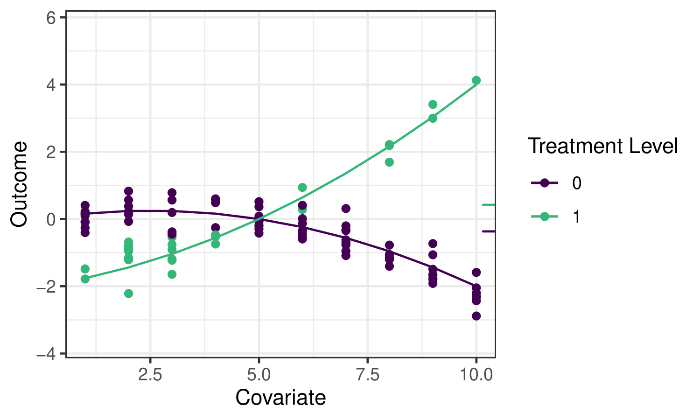

> **来源**：[*Targeted Learning in R: Causal Data Science with the `tlverse` Software Ecosystem*](https://tlverse.org/tlverse-handbook/)，作者 Mark van der Laan、Jeremy Coyle、Nima Hejazi、Ivana Malenica、Rachael Phillips、Alan Hubbard，采用 **[CC BY 4.0](https://creativecommons.org/licenses/by/4.0/)** 许可。
> 本页为中文翻译，**非原文**；依 CC BY 4.0 保留原作者署名与许可证声明，并标明本页是经过修改（翻译）的版本。
> 原作品按「现状」提供，原作者不附任何明示或默示的担保（见 CC BY 4.0 第 5 节免责声明）；译文中的任何疏漏由译者负责，不代表原作者观点。
> 译自源码仓库 [tlverse/tlverse-handbook](https://github.com/tlverse/tlverse-handbook) 修订 `2931693`（2024-09-21）的 `07-tmle3.Rmd`。本章作者为 *Jeremy Coyle*。
> 页内 R 代码块按原文逐字保留，并由本站以 R 4.4.3 重新执行；示意图为原书静态图片，按原样引用。

```{=html}
<span class="math inline">
\(\DeclareMathOperator{\expit}{expit}\)
\(\DeclareMathOperator{\logit}{logit}\)
\(\DeclareMathOperator*{\argmin}{\arg\!\min}\)
\(\newcommand{\indep}{\perp\!\!\!\perp}\)
\(\newcommand{\R}{\mathbb{R}}\)
\(\newcommand{\E}{\mathbb{E}}\)
\(\newcommand{\M}{\mathcal{M}}\)
\(\newcommand{\I}{\mathbb{I}}\)
</span>
```

# TMLE 框架 {#tmle3}

*Jeremy Coyle*

基于 [`tmle3` `R` 包](https://github.com/tlverse/tmle3)。

## 学习目标 {#learn-tmle}

读完本章之后，你将能够：

1. 理解我们为什么用 TMLE 做效应估计。
2. 用 `tmle3` 估计平均处理效应（ATE）。
3. 理解如何使用 `tmle3` 的 "Spec" 对象。
4. 针对一组自定义的目标参数拟合 `tmle3`。
5. 用 delta 方法估计目标参数的变换。

## 引言 {#tmle-intro}

在上一章关于 `sl3` 的内容中，我们学会了如何从数据估计诸如 $\mathbb{E}[Y \mid X]$ 这样的回归函数。这是从数据中学习的重要第一步，但我们怎样才能用这个预测模型去估计统计效应与因果效应呢？

回到[靶向学习的路线图](04-roadmap.qmd#roadmap)，假设我们想估计处理变量 $A$ 对结局 $Y$ 的效应。如前所述，刻画该效应的一个可能参数是平均处理效应（ATE），定义为 $\psi_0 = \mathbb{E}_W[\mathbb{E}[Y \mid A=1,W] - \mathbb{E}[Y \mid A=0,W]]$，可解释为在协变量 $W$ 的分布上取平均后，处理 $A=1$ 与 $A=0$ 之下结局均值之差。我们将用下面这份示例数据，演示这一参数的几种可能估计量，并由此引出使用 TMLE（靶向最大似然估计；靶向最小损失估计）框架的动机：

```{r tmle_fig1, results="asis", echo = FALSE}

```

右侧的小刻度分别标出了 $A=1$ 与 $A=0$ 之下（对 $W$ 取平均后的）结局均值，二者之差正是我们想估计的量。

尽管我们希望在本章中讲清应用 TMLE 的动机，但有兴趣深究的读者请参阅两本靶向学习专著及相关著作，以获取完整的技术细节。

## 代入型估计量 {#substitution-est}

我们可以用 `sl3` 拟合一个超级学习器或其他回归模型，来估计结局回归函数 $\mathbb{E}_0[Y \mid A,W]$——我们常把它记作 $\overline{Q}_0(A,W)$，其估计记作 $\overline{Q}_n(A,W)$。要构造 ATE 的估计 $\psi_n$，我们只需把在两种干预对照下求值的 $\overline{Q}_n(A,W)$ 估计"代入"相应的 ATE "代入"公式：$\psi_n = \frac{1}{n}\sum(\overline{Q}_n(1,W)-\overline{Q}_n(0,W))$。这类估计量被称为**代入型**（plug-in／substitution）估计量，因为只要把相关回归函数 $\overline{Q}_0(A,W)$ 本身换成它们的估计 $\overline{Q}_n(A,W)$，就可以得到参数 $\psi_0$ 的准确估计 $\psi_n$。

把 `sl3` 用于估计我们例子中的结局回归，可以看到集成机器学习的预测对数据拟合得相当好：

```{r tmle_fig2, results="asis", echo = FALSE}
knitr::include_graphics("img/png/schematic_2b_sllik.png")
```

实线表示 `sl3` 对回归函数的估计，虚线则表示 `tmle3` 的更新（[见下文](#tmle-updates)）。

代入型估计量虽然直观，但若不加思索地把超级学习器对 $\overline{Q}_0(A,W)$ 的估计用于这一做法，会有若干局限。首先，超级学习器选择学习器权重时，是为了最小化整条回归函数上的风险，而不是"靶向"我们想估计的那个 ATE 参数，这会导致估计有偏。也就是说，`sl3` 力求在左侧那整条回归曲线上做得好，而不是聚焦于右侧那两个小刻度。不仅如此，这一做法的抽样分布不是渐近线性的，因而无法作推断。

在为示例数据生成的估计中，可以看到这些局限：

```{r tmle_fig3, results="asis", echo = FALSE}
knitr::include_graphics("img/png/schematic_3_effects.png")
```

可以看到，超级学习器对真实参数值（由竖虚线标出）的估计比 GLM 更准确。然而它仍不如 TMLE 准确，而且无法作有效推断。相比之下，TMLE 既得到偏倚更小的估计量，又能作有效推断。

## 靶向最大似然估计 {#tmle}

TMLE 以初始估计 $\overline{Q}_n(A,W)$ 以及倾向性评分的估计 $g_n(A \mid W) = \mathbb{P}(A = 1 \mid W)$ 为输入，产生一个针对所关心参数作了"靶向"的更新估计 $\overline{Q}^{\star}_n(A,W)$。TMLE 保留了代入型估计量的好处（它本身就是一个代入型估计量），同时对原本可能不稳定的估计作了增补以**校正偏倚**，并由此得到一个**渐近线性**（因而服从正态分布）的估计量，从而支持通过渐近相合的 Wald 型置信区间作推断。

### TMLE 更新 {#tmle-updates}

TMLE 有不同类型（有时同一组目标参数还有多种 TMLE）——下面给出针对 ATE 的 TML 估计算法示例。$\overline{Q}^{\star}_n(A,W)$ 是 TMLE 增补后的估计：$f(\overline{Q}^{\star}_n(A,W)) = f(\overline{Q}_n(A,W)) + \epsilon \cdot H_n(A,W)$，其中 $f(\cdot)$ 是合适的连接函数（例如 $\text{logit}(x) = \log(x / (1 - x))$），而"聪明协变量"（clever covariate）$H_n(A,W)$ 的系数 $\epsilon$ 会被估计为 $\epsilon_n$。协变量 $H_n(A,W)$ 的形式因目标参数而异；在 ATE 这一情形下，它是 $H_n(A,W) = \frac{A}{g_n(A \mid W)} - \frac{1-A}{1-g_n(A, W)}$，其中 $g_n(A,W) = \mathbb{P}(A=1 \mid W)$ 是估计的倾向性评分。因此该估计量既依赖于（由 `sl3` 给出的）结局回归的初始拟合 $\overline{Q}_n$，也依赖于倾向性评分的初始拟合 $g_n$。

`tlverse` 中采用了若干稳健性增补，包括引入额外一层交叉验证以避免过拟合偏倚（即 CV-TMLE），以及更一致地同时估计多个参数的做法（例如生存曲线上的各个点）。

### 统计推断 {#tmle-infer}

由于 TMLE 给出的是**渐近线性**估计量，作统计推断非常方便。每个 TML 估计量都有一个对应的**（有效）影响函数**（常简称 "EIF"），它刻画了该估计量的渐近分布。利用估计出的 EIF，只需把初始估计 $\overline{Q}_n$ 与 $g_n$ 代入 EIF 的表达式，再计算样本标准误，就能构造 Wald 型推断（渐近正确的置信区间）。

下面几节介绍在 `tlverse` 中设定与估计 TMLE 的简易做法与更细致的做法。在设计 `tmle3` 时，我们力求尽可能贴近地复刻 TMLE 这一非常通用的估计框架，因此与 TMLE 相关的每个理论对象，都由一个相应的软件对象／方法来编码。首先我们展示 `tmle3` 在 WASH Benefits 例子上的简易应用，然后再更详细地描述底层的各个对象。

## 开箱即用示例：用 `tmle3` 估计 ATE

我们用前面介绍过的 WASH Benefits 数据，演示 TMLE 最基本的用法——估计一个平均处理效应。

### 载入数据

我们使用与前几章相同的 WASH Benefits 数据：

```{r tmle3-load-data}
library(data.table)
library(dplyr)
library(tmle3)
library(sl3)
washb_data <- fread(
  paste0(
    "https://raw.githubusercontent.com/tlverse/tlverse-data/master/",
    "wash-benefits/washb_data.csv"
  ),
  stringsAsFactors = TRUE
)
```

### 定义变量角色

我们采用常见的 $W$（协变量）、$A$（处理／干预）、$Y$（结局）数据结构。`tmle3` 需要知道数据集中哪些变量对应这些角色，我们用一个字符向量的列表来告诉它。我们把它称作"节点列表"（Node List），因为它对应有向无环图（DAG）中的节点——DAG 是一种展示变量间因果关系的方式。

```{r tmle3-node-list}
node_list <- list(
  W = c(
    "month", "aged", "sex", "momage", "momedu",
    "momheight", "hfiacat", "Nlt18", "Ncomp", "watmin",
    "elec", "floor", "walls", "roof", "asset_wardrobe",
    "asset_table", "asset_chair", "asset_khat",
    "asset_chouki", "asset_tv", "asset_refrig",
    "asset_bike", "asset_moto", "asset_sewmach",
    "asset_mobile"
  ),
  A = "tr",
  Y = "whz"
)
```

### 处理缺失

目前 `tmle3` 对缺失的处理相当简单：

* 缺失的协变量按中位数（连续）或众数（离散）插补，并生成额外的协变量来指示是否作过插补，做法与 [`sl3` 一章](06-sl3.qmd#sl3)中所述相同。
* 缺失的处理变量会被剔除——这类观测被丢弃。
* 缺失的结局通过自动计算**删失概率倒数权重**（IPCW）并把它纳入估计量来高效处理；这也被称为 IPCW-TMLE，可以看作一种消除缺失的联合干预，与经典逆概率加权估计量所用的做法类似。

这些步骤由 `tmle3` 的 `process_missing` 函数实现：

```{r tmle3-process_missing}
processed <- process_missing(washb_data, node_list)
washb_data <- processed$data
node_list <- processed$node_list
```

### 创建 "Spec" 对象

`tmle3` 很通用，允许以模块化方式设定 TMLE 流程中的大多数组件。不过多数用户并不想手工设定所有这些组件。因此，`tmle3` 实现了 `tmle3_Spec` 对象，把一组组件打包成一份**规格说明**（"Spec"），只需再补充极少量细节就能跑起来拟合一个 TMLE。

我们先从使用其中一个 spec 开始，再一步步深入 `tmle3` 的内部。

```{r tmle3-ate-spec}
ate_spec <- tmle_ATE(
  treatment_level = "Nutrition + WSH",
  control_level = "Control"
)
```

### 定义学习器

目前，用户还必须定义的另一样东西，就是用来估计似然中相关因子（Q 与 g）的 `sl3` 学习器。

它的形式是一个 `sl3` 学习器列表，每个要用 `sl3` 估计的似然因子对应一个：

```{r tmle3-learner-list}
# choose base learners
lrnr_mean <- make_learner(Lrnr_mean)
lrnr_rf <- make_learner(Lrnr_ranger)

# define metalearners appropriate to data types
ls_metalearner <- make_learner(Lrnr_nnls)
mn_metalearner <- make_learner(
  Lrnr_solnp, metalearner_linear_multinomial,
  loss_loglik_multinomial
)
sl_Y <- Lrnr_sl$new(
  learners = list(lrnr_mean, lrnr_rf),
  metalearner = ls_metalearner
)
sl_A <- Lrnr_sl$new(
  learners = list(lrnr_mean, lrnr_rf),
  metalearner = mn_metalearner
)
learner_list <- list(A = sl_A, Y = sl_Y)
```

这里我们用的是上一章定义的超级学习器。将来我们打算提供合理的默认学习器。

### 拟合 TMLE

现在我们已具备用 `tmle3` 拟合 TMLE 所需的一切：

```{r tmle3-spec-fit}
tmle_fit <- tmle3(ate_spec, washb_data, node_list, learner_list)
print(tmle_fit)
```

### 评估估计结果

打印拟合对象就能看到汇总结果。此外，我们也可以通过索引从摘要中提取结果：

```{r tmle3-spec-summary}
estimates <- tmle_fit$summary$psi_transformed
print(estimates)
```

## `tmle3` 的组件

既然我们已经成功用一个 spec 得到了 TML 估计，那就来看看引擎盖下的各个组件。spec 有若干函数，用来生成定义和拟合一个 TMLE 所必需的对象。

### `tmle3_task`

首先是 `tmle3_Task`，它类似于 `sl3_Task`，包含我们要拟合 TMLE 的数据，以及由上面定义的 `node_list` 生成的 NPSEM——后者描述各变量及其相互关系。

```{r tmle3-spec-task}
tmle_task <- ate_spec$make_tmle_task(washb_data, node_list)
```

```{r tmle3-spec-task-npsem}
tmle_task$npsem
```

### 初始似然

接下来是一个表示似然的对象，它按上面描述的 NPSEM 作了因子分解：

```{r tmle3-spec-initial-likelihood}
initial_likelihood <- ate_spec$make_initial_likelihood(
  tmle_task,
  learner_list
)
print(initial_likelihood)
```

似然的这些组成部分标明了各因子是如何估计的：$W$ 的边际分布用 NP-MLE 估计，$A$ 与 $Y$ 的条件分布用（由上面 `learner_list` 定义的）`sl3` 拟合来估计。

我们可以把它与 `tmle_task` 对象配合，取得每个观测的似然估计：

```{r tmle3-spec-initial-likelihood-estimates}
initial_likelihood$get_likelihoods(tmle_task)
```

### 靶向似然（更新器）

我们还需要定义一个"靶向似然"（Targeted Likelihood）对象。这是一类特殊的似然，可以用 `tmle3_Update` 对象来更新。该对象定义了更新策略（例如子模型、损失函数、是否用 CV-TMLE）。

```{r tmle3-spec-targeted-likelihood}
targeted_likelihood <- Targeted_Likelihood$new(initial_likelihood)
```

构造靶向似然时，可以指定不同的更新选项。各选项的细节见 `tmle3_Update` 的文档。例如，可以像下面这样关闭 CV-TMLE（它是 `tmle3` 的默认设置）：

```{r tmle3-spec-targeted-likelihood-no-cv}
targeted_likelihood_no_cv <-
  Targeted_Likelihood$new(initial_likelihood,
    updater = list(cvtmle = FALSE)
  )
```

### 参数映射

最后，我们需要定义所关心的参数。这里 spec 定义了单个参数，即 ATE。下一节我们会看到如何添加更多参数。

```{r tmle3-spec-params}
tmle_params <- ate_spec$make_params(tmle_task, targeted_likelihood)
print(tmle_params)
```

### 把它们拼到一起

用 spec 手工生成了这些组件之后，我们现在可以手工拟合一个 `tmle3`：

```{r tmle3-manual-fit}
tmle_fit_manual <- fit_tmle3(
  tmle_task, targeted_likelihood, tmle_params,
  targeted_likelihood$updater
)
print(tmle_fit_manual)
```

结果与上面用 `tmle3` 函数拟合是等价的。

## 拟合带多个参数的 `tmle3`

上面我们拟合了只有一个参数的 `tmle3`。`tmle3` 也支持同时拟合多个参数。为演示这一点，我们使用 `tmle_TSM_all` 这个 spec：

```{r tmle3-tsm-all}
tsm_spec <- tmle_TSM_all()
targeted_likelihood <- Targeted_Likelihood$new(initial_likelihood)
all_tsm_params <- tsm_spec$make_params(tmle_task, targeted_likelihood)
print(all_tsm_params)
```

这个 spec 为暴露变量的每个水平生成一个处理特异均值（Treatment Specific Mean, TSM）。注意，我们必须先生成一个新的靶向似然，因为旧的那个已经针对 ATE 作过靶向。不过，我们可以复用上面拟合好的初始似然，从而省去一次超级学习器步骤。

### Delta 方法

我们还可以基于其他参数的 Delta 方法变换来定义参数。例如，我们可以用 delta 方法和上面两个 TSM 参数来估计 ATE：

```{r tmle3-delta-method-param}
ate_param <- define_param(
  Param_delta, targeted_likelihood,
  delta_param_ATE,
  list(all_tsm_params[[1]], all_tsm_params[[4]])
)
print(ate_param)
```

同样的做法可用于估计相对危险度、人群归因危险度等其他派生参数。

### 拟合

现在我们可以同时为所有 TSM 参数以及上面定义的 ATE 参数拟合 TMLE：

```{r tmle3-tsm-plus-delta}
all_params <- c(all_tsm_params, ate_param)

tmle_fit_multiparam <- fit_tmle3(
  tmle_task, targeted_likelihood, all_params,
  targeted_likelihood$updater
)

print(tmle_fit_multiparam)
```

## 习题

### 用 `tmle3` 估计 ATE {#tmle3-ex1}

按下面的步骤，用来自协作围产期项目（Collaborative Perinatal Project, CPP）的数据估计一个平均处理效应；该数据可从 `sl3` 包中取得。为简化这个例子，我们定义一个二值干预变量 `parity01`——表示在当前这个孩子之前是否已有一个或多个孩子；以及一个二值结局 `haz01`——表示身高别年龄是否高于平均水平。

```{r tmle-exercise-data}
# load the data set
data(cpp)
cpp <- cpp %>%
  as_tibble() %>%
  dplyr::filter(!is.na(haz)) %>%
  mutate(
    parity01 = as.numeric(parity > 0),
    haz01 = as.numeric(haz > 0)
  )
```

1. 通过创建一个节点列表来定义变量角色 $(W,A,Y)$。在 $W$ 中纳入以下基线协变量：`apgar1`、`apgar5`、`gagebrth`、`mage`、`meducyrs`、`sexn`。$A$ 与 $Y$ 已在上面给出。数据中的缺失（具体是节点列表中所指定那些列的缺失）需要处理；可以像上面 `washb_data` 的例子那样，用 `process_missing` 函数来完成。
2. 为 ATE 定义一个 `tmle3_Spec` 对象，即 `tmle_ATE()`。
3. 使用上面定义的同一批基学习库，为估计 $\overline{Q}_0 = \mathbb{E}_0(Y \mid A, W)$ 与 $g_0 = \mathbb{P}(A = 1 \mid W)$ 指定 `sl3` 基学习器。
4. 像下面这样定义元学习器。

```{r, metalrnr-exercise}
metalearner <- make_learner(
  Lrnr_solnp,
  loss_function = loss_loglik_binomial,
  learner_function = metalearner_logistic_binomial
)
```

5. 分别定义一个用于估计 $\overline{Q}_0$ 的超级学习器和一个用于估计 $g_0$ 的超级学习器。两者都使用上面的元学习器。
6. 把上一步定义的两个超级学习器放进一个列表，命名为 `learner_list`。列表的名字应当是 `A`（定义估计 $g_0$ 的超级学习器）和 `Y`（定义估计 $\overline{Q}_0$ 的超级学习器）。
7. 用 `tmle3` 函数拟合 TMLE，需要指定：(1) 第 2 步定义的 `tmle3_Spec`；(2) 数据；(3) 第 1 步指定的节点列表；以及 (4) 第 6 步定义的、用于估计 $g_0$ 与 $\overline{Q}_0$ 的超级学习器列表。*注意*：和之前一样，你需要显式地复制一份数据（以规避 `data.table` 的优化），例如 `cpp2 <- data.table::copy(cpp)`，之后都使用 `cpp2` 这份数据。

## 小结

`tmle3` 是一个用于生成 TML 估计的通用框架。使用它最简单的方式，是用一个预定义的 spec，这样你只需填上数据、变量角色和 `sl3` 学习器这几个空。不过，深入引擎盖之下，用户可以设定范围广泛的各种 TMLE。在接下来的几节中，我们会看到这一框架如何被用来估计最优处理、随机移位干预等进阶参数。
