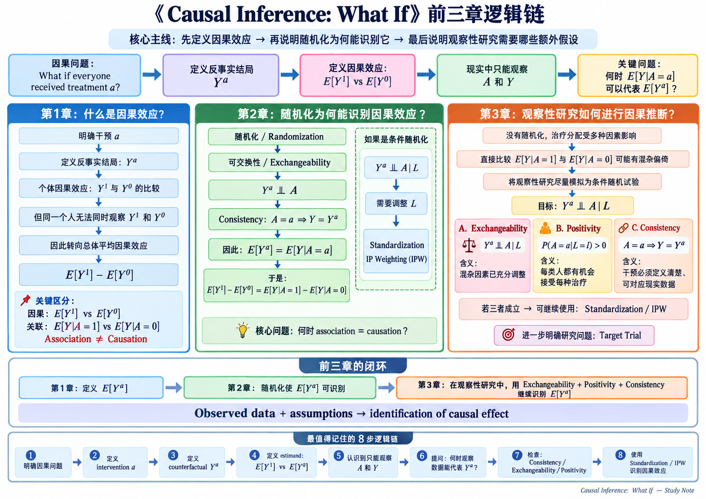

> **原书**：Hernán &amp; Robins, *Causal Inference: What If*（2025-01-02 版），
> 第 1–3 章，书页 3–41。本页只放一张总览图，**原书没有这张图**，
> 它是笔记作者对前三章论证链的整理，读法与出处见页末。

前三章很容易各读各的：第 1 章像在定义记号，第 2 章像在讲随机试验，第 3 章像在讲混杂。
但它们其实是**同一句话的三段**——第 1 章给出想要的那个量，
第 2 章说明随机化下它为什么等于一个能从数据算出来的量，
第 3 章说明一枚硬币也没抛时还要额外假设什么，才能接着这么算。

图按这条主线排：最上面一行是主干，中间三栏是三章各自的内部链条，
底下两块是闭环与 8 步速记。

::: {.column-page}

```{=html}
<div class="fig-frame">
<a href="w01-logic-chain.png" target="_blank" rel="noopener"
   title="点击查看原尺寸（1491 × 1055）">

</a>
</div>
```

<p class="fig-cap">
<b>前三章逻辑链。</b>上面一行是贯穿三章的主干，三栏是各章内部的链条，
底部「前三章的闭环」与「8 步逻辑链」是归纳，不是原书结构。
图较密，<b>点图可打开原尺寸</b>（1491 × 1055）。
</p>
:::

## 三栏各对应哪一章[：图看完了，细节回到对应的笔记]{.hook}

| 图中的栏 | 它回答什么 | 对应笔记 |
|---|---|---|
| 蓝栏 · 第 1 章 | 因果效应是什么，为什么只能退到人群层面 | [第 1 章 · Zeus 的心脏移植](w01-potential-outcomes.qmd) |
| 绿栏 · 第 2 章 | 随机化为什么让 $E[Y^a]$ 等于 $E[Y \mid A=a]$ | [第 2 章 · 一枚硬币，还是两枚](w01-randomized-experiments.qmd) |
| 橙栏 · 第 3 章 | 一枚硬币也没抛时，要补哪三条假设 | [第 3 章 · 一枚硬币也没抛](w01-observational-studies.qmd) |

橙栏里的三张卡（Exchangeability / Positivity / Consistency）各只给了一句含义；
它们分别在什么条件下站不住、失效后果是什么，见[三条识别条件](identifiability.qmd)。
式子本身的写法与它在识别链上属于哪一段，见[公式卡](formulas.qmd)；
字母为什么这么写、在第几页被定义，见[记号与约定](notation.qmd)。

::: {.pitfall}
[图里最容易读漏的一处]{.pitfall-label}

绿栏写的是 $Y^a \perp\!\!\!\perp A$——**反事实**结局与处理独立，即组间可比；
不是 $Y \perp\!\!\!\perp A$——观测结局与处理独立，那说的是处理没有效应。
两个式子只差一个上标，含义完全不同，随机化保证的是前者。
展开见[三条识别条件](identifiability.qmd)。
:::

::: {.provenance}
### 关于这份笔记

来源
:   Hernán MA, Robins JM. *Causal Inference: What If*. 2025-01-02 版，
    第 1–3 章（书页 3–41）。本页是读书笔记的总览图，非原书译文。

### 哪些是我的改动，不是原书

- **整张图由笔记作者制作**，原书第 1–3 章没有任何一张对应插图。分栏、配色、
  各框的措辞，以及「前三章的闭环」「最值得记住的 8 步逻辑链」两块归纳，均为笔记作者所加。
- 图中式子沿用本站记号（见[记号与约定](notation.qmd)），与原书一致；
  含义与适用条件以各章笔记和原书为准。

### 哪些内容是缺的

- 图只留主干。第 2 章的条件随机化画到「需要调整 $L$ → 标准化 / IP 加权」为止，
  两者为何在正性下相等、又在估计阶段分家，见[公式卡](formulas.qmd)。
- 第 3 章 §3.6 的 target trial 在图里只是一个方框，正文见
  [第 22 章 · 目标试验模拟](w11-target-trial-emulation.qmd)。
- 本页是位图，不像站内手绘 SVG 那样跟随明暗主题换色，放大也会失真；
  需要更大的字请点开原图。
:::
